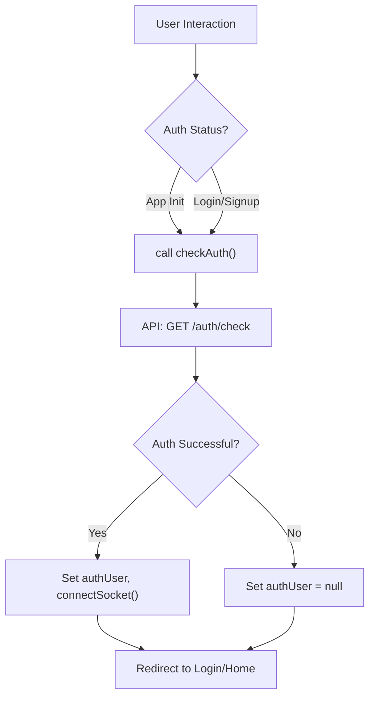
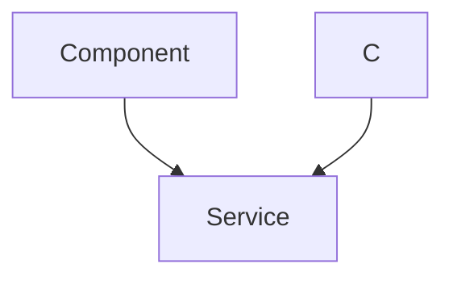

# State Management and Utilities

<TOC />

This section details the client-side state management patterns and utility functions implemented in the frontend of the application. It covers how global state is managed using `Zustand` for authentication and chat-related data, as well as common utilities for API interactions and data formatting.

## API Client Configuration (`axios.js`)

The `axios.js` file configures a custom Axios instance used for all API requests. This ensures consistent base URL handling, credential management, and environment-specific API endpoints.

```javascript filename="frontend/src/lib/axios.js"
import axios from "axios";

export const axiosInstance = axios.create({
    baseURL: import.meta.env.MODE == "development" ? "http://localhost:5001/api": "/api",
    withCredentials: true,
});
```

The `axiosInstance` automatically adjusts its `baseURL` based on the `MODE` environment variable, pointing to `http://localhost:5001/api` during development and `/api` in production. The `withCredentials: true` option is crucial for sending and receiving HTTP cookies, which are used for session management and authentication.

This centralized configuration point simplifies API calls throughout the application, abstracting away environment-specific concerns.

[View on GitHub](https://github.com/shinymack/Chat-App-MERN/blob/main/frontend/src/lib/axios.js)

## Utility Functions (`utils.js`)

The `utils.js` file houses general-purpose utility functions that enhance the user experience by formatting data consistently.

```javascript filename="frontend/src/lib/utils.js"
export function formatMessageTime(date) {
    return new Date(date).toLocaleTimeString("en-US", {
        year: "numeric",
        month: "short",
        day:"2-digit",
        hour: "2-digit",
        minute: "2-digit",
        hour12: true,
    });
}
```

The `formatMessageTime` function takes a date string or `Date` object and returns a human-readable formatted string, including the date, time, and AM/PM indicator. This ensures all timestamps displayed in the UI (e.g., message times) are consistently presented.

[View on GitHub](https://github.com/shinymack/Chat-App-MERN/blob/main/frontend/src/lib/utils.js)

## Authentication State Management (`useAuthStore.js`)

The `useAuthStore` is a Zustand store responsible for managing all authentication-related state, user profile information, and WebSocket connections. It provides actions for user authentication, profile updates, and real-time online user tracking.

### Core State and Actions

The store maintains the `authUser` object, various loading states (`isSigningUp`, `isLoggingIn`), the list of `onlineUsers`, and the `socket` instance for WebSocket communication.

```javascript filename="frontend/src/store/useAuthStore.js" {10-18}
import { create } from "zustand";
import { axiosInstance } from "../lib/axios";
import toast from "react-hot-toast";
import { io } from "socket.io-client";

const BASE_URL = import.meta.env.MODE == "development" ? "http://localhost:5001": "/";

export const useAuthStore = create((set, get) => ({
    authUser: null,
    isSigningUp: false,
    isLoggingIn: false,
    isUpdatingProfile: false,
    isCheckingAuth: true,
    onlineUsers: [],
    socket: null,
    // ... actions
}));
```

### Authentication Flow

The `useAuthStore` provides actions for `checkAuth`, `signup`, `login`, `logout`, and `updateProfile`. These actions interact with the backend API via `axiosInstance` and update the `authUser` state accordingly.

```javascript filename="frontend/src/store/useAuthStore.js" {20-64}
    checkAuth: async () => {
        try {
            const res = await axiosInstance.get("/auth/check");
            set({ authUser: res.data });
            get().connectSocket(); // Connect socket on successful auth
        } catch (error) {
            set({ authUser: null });
            console.log("Error in checkAuth: ", error);
        } finally {
            set({ isCheckingAuth: false });
        }
    },

    signup: async (data) => {
        set({ isSigningUp: true });
        try {
            const res = await axiosInstance.post("/auth/signup", data);
            set({ authUser: res.data });
            toast.success("Account created successfully");
            get().connectSocket();
        } catch (error) {
            toast.error(error.response.data.message);
        } finally {
            set({ isSigningUp: false });
        }
    },
    // ... login, logout, updateProfile actions
```

Upon successful authentication (signup, login, or checkAuth), the `connectSocket` action is invoked to establish a WebSocket connection.

[View on GitHub](https://github.com/shinymack/Chat-App-MERN/blob/main/frontend/src/store/useAuthStore.js)

### WebSocket Integration

The store handles the lifecycle of the WebSocket connection using `connectSocket` and `disconnectSocket`. The socket is initialized with the `authUser._id` as a query parameter, allowing the server to identify the connected user. It also subscribes to the `"getOnlineUsers"` event to update the `onlineUsers` state.

```javascript filename="frontend/src/store/useAuthStore.js" {80-97}
    connectSocket: () => {
        const { authUser } = get();
        if(!authUser || get().socket?.connected) return;

        const socket = io(BASE_URL, {
            query: {
                userId : authUser._id,
            },
        });
        socket.connect();
        set({socket: socket});

        socket.on("getOnlineUsers", (userIds) => {
            set({onlineUsers: userIds})
        }); 
    },

    disconnectSocket : () => {
        if(get().socket?.connected) get().socket.disconnect();
    }
```

This ensures that the client's `onlineUsers` list is always up-to-date, reflecting which users are currently active.

[View on GitHub](https://github.com/shinymack/Chat-App-MERN/blob/main/frontend/src/store/useAuthStore.js)

### Authentication Flow Diagram





## Chat State Management (`useChatStore.js`)

The `useChatStore` is another Zustand store dedicated to managing all chat-related data, including messages, user lists, friend requests, and selected chat partners. It provides comprehensive actions for managing friend relationships and message exchanges.

### Core State and Actions

The store holds `messages`, `users` (friends), `pendingRequests`, `sentRequests`, `selectedUser`, and various loading states. It also includes a `toggleFriendsBox` action for UI control.

```javascript filename="frontend/src/store/useChatStore.js" {8-17}
import toast from "react-hot-toast";
import { create } from "zustand";
import { axiosInstance } from "../lib/axios";
import { useAuthStore } from "./useAuthStore";


export const useChatStore = create((set, get) => ({
    messages:[],
    users: [],
    pendingRequests: [],
    sentRequests: [],
    selectedUser: null,
    isUsersLoading: false,
    isMessagesLoading: false,
    isFriendBoxOpen: false,

    toggleFriendsBox: () => set(state => ({ isFriendsBoxOpen: !state.isFriendsBoxOpen })),
    // ... actions
}));
```

### Friend Management

The `useChatStore` provides a suite of actions for managing friendships: `getFriends`, `getPendingRequests`, `getSentRequests`, `sendFriendRequest`, `acceptFriendRequest`, `rejectFriendRequest`, and `removeFriend`. These actions interact with the `/friends` API endpoints.

```javascript filename="frontend/src/store/useChatStore.js" {23-86}
    getFriends: async () => {
        set({isUsersLoading: true});
        try {
            const res = await axiosInstance.get("/friends/list");
            set({ users: res.data});
        } catch (error) {
            toast.error(error.response?.data?.message || "Failed to fetch friends");
        } finally {
            set({ isUsersLoading: false});
        }
    },
    // ... other friend request actions

    acceptFriendRequest: async (senderId) => {
        try {
            const res = await axiosInstance.post(`/friends/request/accept/${senderId}`);
            toast.success(res.data.message);
            get().getFriends(); // Refresh friends list
            get().getPendingRequests(); // Refresh pending requests
        } catch (error) {
            toast.error(error.response?.data?.message || "Failed to accept request");
        }
    },
    // ... rejectFriendRequest, removeFriend actions
```

Actions like `acceptFriendRequest` not only call the API but also trigger refreshes of related lists (`getFriends`, `getPendingRequests`) to ensure the UI is immediately updated.

[View on GitHub](https://github.com/shinymack/Chat-App-MERN/blob/main/frontend/src/store/useChatStore.js)

### Message Management

Actions for messages include `getMessages` (fetching conversation history for a `selectedUser`) and `sendMessage`.

```javascript filename="frontend/src/store/useChatStore.js" {88-106}
    getMessages: async (userId) => {
        set({isMessagesLoading: true});
        try {
            const res = await axiosInstance.get(`/messages/${userId}`);
            set({messages: res.data});
        } catch (error) {
            toast.error(error.response.data.message);
        } finally {
            set({isMessagesLoading: false});
        }
    },
    sendMessage: async (messageData) => {
        const {selectedUser, messages} = get();
        try {
            const res = await axiosInstance.post(`/messages/send/${selectedUser._id}`, messageData);
            set({messages : [...messages, res.data]});
        } catch (error){
            toast.error(error.response.data.message);
        }
    },
```

When a message is sent, it's immediately appended to the local `messages` state, providing an optimistic UI update.

[View on GitHub](https://github.com/shinymack/Chat-App-MERN/blob/main/frontend/src/store/useChatStore.js)

### Real-time Message Subscription

The `subscribeToMessages` and `unsubscribeFromMessages` actions manage WebSocket event listeners for incoming messages. These actions directly access the `socket` instance from `useAuthStore` to listen for `"newMessage"` events.

```javascript filename="frontend/src/store/useChatStore.js" {109-126}
    subscribeToMessages: () => {
        const { selectedUser } = get();
        if(!selectedUser) return;
        
        const socket = useAuthStore.getState().socket; // Access socket from auth store
        socket.on("newMessage", (newMessage) => {
            if(newMessage.senderId !== selectedUser._id) return // Only add if from selected user
            set({
                messages: [...get().messages, newMessage]
            })
        })
    },

    unsubscribeFromMessages: () => {
        const socket = useAuthStore.getState().socket;
        socket.off("newMessage");
    },
```

This pattern demonstrates cross-store communication in Zustand, where `useChatStore` depends on state (the `socket` object) managed by `useAuthStore`. This allows real-time message updates to be seamlessly integrated into the chat interface.

[View on GitHub](https://github.com/shinymack/Chat-App-MERN/blob/main/frontend/src/store/useChatStore.js)

### Real-time Message Flow Diagram





## Key Integration Points

*   **Zustand for Global State**: Both `useAuthStore` and `useChatStore` leverage Zustand's lightweight and performant state management capabilities. This allows components to subscribe to only the parts of the state they need, minimizing re-renders.
*   **Centralized Axios Instance**: `axiosInstance` ensures all API requests adhere to a consistent structure, handling base URLs and credentials automatically. This promotes maintainability and reduces boilerplate.
*   **Cross-Store Communication**: The `useChatStore` accesses the `socket` instance from `useAuthStore` using `useAuthStore.getState().socket`. This is a clean way to share singletons or derived state across different Zustand stores without creating tight coupling.
*   **Real-time Updates**: The integration of WebSocket with both stores (`onlineUsers` in `useAuthStore` and `newMessage` in `useChatStore`) provides a dynamic and interactive user experience, reflecting changes instantly without requiring page refreshes.
*   **Toast Notifications**: `react-hot-toast` is used consistently across both stores to provide user feedback for success, error, and informational messages, enhancing usability.

Next: [Deployment and Operations](./4_deployment-and-operations.mdx)