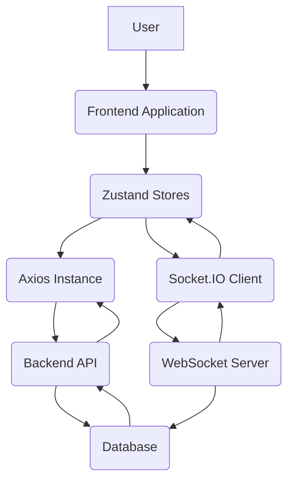

---
title: "State Management and API Communication"
description: "Explanation of Zustand-based state management and how the frontend interacts with the backend API."
sidebar_position: 33
---

# State Management and API Communication
<TOC />

This section details the frontend's approach to managing application state and its interaction with the backend API. We utilize [Zustand](https://zustand.pm/) for efficient and scalable state management, coupled with [Axios](https://axios-http.com/) for HTTP requests, ensuring seamless communication and data flow.

## System Purpose

The state management and API communication layers are crucial for several core functionalities:

-   **User Authentication**: Handling user registration, login, logout, and session management, including persistent authentication and profile updates.
-   **Real-time Communication**: Managing WebSocket connections for instant updates, such as displaying online users and receiving new messages.
-   **Chat Functionality**: Orchestrating message sending, retrieval, and real-time message updates.
-   **Friend Management**: Facilitating sending, accepting, rejecting, and removing friend requests, and displaying the current list of friends.
-   **Loading States & Error Handling**: Providing clear feedback to users during API calls and handling errors gracefully using `react-hot-toast`.

## Architecture

The frontend state management follows a centralized, reactive pattern enabled by Zustand. Each store (`useAuthStore`, `useChatStore`) encapsulates related state and actions, promoting modularity. API interactions are standardized through `axiosInstance`, ensuring consistent request handling, authentication, and error propagation.

Backend communication is primarily RESTful, with a dedicated `/api` endpoint. Real-time features leverage WebSockets through [Socket.IO](https://socket.io/), integrating seamlessly with the authentication store to manage connections based on the authenticated user.





## Technology Stack

| Layer/Aspect           | Technology                  | Purpose                                                                                                                                              |
| :--------------------- | :-------------------------- | :--------------------------------------------------------------------------------------------------------------------------------------------------- |
| **State Management**   | [Zustand](https://zustand.pm/)             | Lightweight, fast, and scalable state management for the React application.                                                                          |
| **HTTP Client**        | [Axios](https://axios-http.com/)           | Promise-based HTTP client for making API requests to the backend, including interceptors for credentials.                                            |
| **Real-time Comms**    | [Socket.IO Client](https://socket.io/)     | Establishes and manages WebSocket connections for real-time features like online user status and instant message delivery.                       |
| **Notifications**      | [react-hot-toast](https://react-hot-toast.com/) | Provides elegant and responsive toast notifications for user feedback (success, error messages).                                                     |
| **Environment Config** | `import.meta.env`           | Manages environment-specific variables, such as API base URLs, ensuring flexible deployment across development and production.                     |

## Features

### API Configuration with Axios

The `axiosInstance` is configured for consistent API communication, setting the base URL based on the environment and enabling `withCredentials` for cookie-based authentication.

```javascript
// frontend/src/lib/axios.js
import axios from "axios";

export const axiosInstance = axios.create({
    baseURL: import.meta.env.MODE == "development" ? "http://localhost:5001/api": "/api",
    withCredentials: true,
});
```
[View on GitHub](https://github.com/shinymack/Chat-App-MERN/blob/main/frontend/src/lib/axios.js#L1-L6)

This setup ensures that all requests automatically include necessary authentication cookies and target the correct backend endpoint, simplifying API calls throughout the application.

### Authentication State Management

The `useAuthStore` manages all user-related authentication states and actions, including signup, login, logout, profile updates, and authentication status checks. It also integrates with Socket.IO for real-time online user tracking.

```javascript
// frontend/src/store/useAuthStore.js
import { create } from "zustand";
import { axiosInstance } from "../lib/axios";
import toast from "react-hot-toast";
import { io } from "socket.io-client";

const BASE_URL = import.meta.env.MODE == "development" ? "http://localhost:5001": "/";

export const useAuthStore = create((set, get) => ({
    authUser: null,
    isSigningUp: false,
    isLoggingIn: false,
    isUpdatingProfile: false,
    isCheckingAuth: true,
    onlineUsers: [],
    socket: null,

    checkAuth: async () => { /* ... */ },
    signup: async (data) => { /* ... */ },
    logout: async () => { /* ... */ },
    login: async (data) => { /* ... */ },
    updateProfile: async (data) => { /* ... */ },
    connectSocket: () => { /* ... */ },
    disconnectSocket : () => { /* ... */ }
}));
```
[View on GitHub](https://github.com/shinymack/Chat-App-MERN/blob/main/frontend/src/store/useAuthStore.js#L1-L29)

Each action updates relevant loading states (`isSigningUp`, `isLoggingIn`) and provides user feedback via `toast` notifications. The `checkAuth` method is crucial for verifying user sessions on application load, fetching the authenticated user, and connecting to the WebSocket server if a session exists.

### Real-time Socket.IO Integration

The `useAuthStore` handles the connection and disconnection of the Socket.IO client, linking it directly to the authenticated user's ID. This allows the backend to track online users and facilitate real-time features.

```javascript
// frontend/src/store/useAuthStore.js
    // ... (other actions)
    connectSocket: () => {
        const { authUser } = get();
        if(!authUser || get().socket?.connected) return;

        const socket = io(BASE_URL, {
            query: {
                userId : authUser._id,
            },
        });
        socket.connect();
        set({socket: socket});

        socket.on("getOnlineUsers", (userIds) => {
            set({onlineUsers: userIds})
        }); 
    },

    disconnectSocket : () => {
        if(get().socket?.connected) get().socket.disconnect();
    }
```
[View on GitHub](https://github.com/shinymack/Chat-App-MERN/blob/main/frontend/src/store/useAuthStore.js#L93-L109)

The `connectSocket` function is invoked upon successful authentication (login, signup, or `checkAuth`), and `disconnectSocket` is called on logout. The `getOnlineUsers` event listener updates the `onlineUsers` state, making real-time presence visible across the application.

### Chat and Friend Management

The `useChatStore` manages states related to chat messages, user lists, friend requests (pending/sent), and the currently selected chat partner. It provides actions for fetching these data points and performing friend-related operations.

```javascript
// frontend/src/store/useChatStore.js
import toast from "react-hot-toast";
import { create } from "zustand";
import { axiosInstance } from "../lib/axios";
import { useAuthStore } from "./useAuthStore";

export const useChatStore = create((set, get) => ({
    messages:[],
    users: [],
    pendingRequests: [],
    sentRequests: [],
    selectedUser: null,
    isUsersLoading: false,
    isMessagesLoading: false,
    isFriendBoxOpen: false,

    toggleFriendsBox: () => set(state => ({ isFriendsBoxOpen: !state.isFriendBoxOpen })),
    getFriends: async () => { /* ... */ },
    getPendingRequests: async () => { /* ... */ },
    getSentRequests: async () => { /* ... */ },
    sendFriendRequest: async (identifier) => { /* ... */ },
    acceptFriendRequest: async (senderId) => { /* ... */ },
    rejectFriendRequest: async (senderId) => { /* ... */ },
    removeFriend: async (friendId) => { /* ... */ },
    getMessages: async (userId) => { /* ... */ },
    sendMessage: async (messageData) => { /* ... */ },
    subscribeToMessages: () => { /* ... */ },
    unsubscribeFromMessages: () => { /* ... */ },
    setSelectedUser: (selectedUser) => set({selectedUser})
}));
```
[View on GitHub](https://github.com/shinymack/Chat-App-MERN/blob/main/frontend/src/store/useChatStore.js#L1-L30)

Actions like `sendFriendRequest`, `acceptFriendRequest`, and `removeFriend` not only interact with the API but also trigger subsequent state updates by calling other `get()` actions to refresh relevant lists. This ensures data consistency across the UI.

### Real-time Message Subscription

The `useChatStore` includes methods for subscribing to and unsubscribing from real-time message events via the Socket.IO instance managed by `useAuthStore`.

```javascript
// frontend/src/store/useChatStore.js
    // ... (other actions)
    subscribeToMessages: () => {
        const { selectedUser } = get();
        if(!selectedUser) return;
        
        const socket = useAuthStore.getState().socket;
        socket.on("newMessage", (newMessage) => {
            if(newMessage.senderId !== selectedUser._id) return
            set({
                messages: [...get().messages, newMessage]
            })
        })
    },

    unsubscribeFromMessages: () => {
        const socket = useAuthStore.getState().socket;
        socket.off("newMessage");
    },
    
    setSelectedUser: (selectedUser) => set({selectedUser})
```
[View on GitHub](https://github.com/shinymack/Chat-App-MERN/blob/main/frontend/src/store/useChatStore.js#L125-L140)

This pattern ensures that new messages are immediately added to the `messages` array for the currently `selectedUser`, providing a seamless real-time chat experience without requiring page refreshes or manual polling. The `unsubscribeFromMessages` function prevents memory leaks and stale event listeners.

## Key Integration Points

### State Management Flow


```mermaid
flowchart LR
    A[Component Renders] --> B{Action Dispatched (e.g., login)}
    B --> C[Zustand Store Action Called (e.g., useAuthStore.login)]
    C --> D[API Call Initiated (axiosInstance.post)]
    D -- Success --> E[Zustand State Updated (set({authUser: data}))]
    E --> F[Socket.IO Connection Established (connectSocket)]
    F --> G[Components Re-render with New State]
    D -- Failure --> H[Toast Error Notification (toast.error)]
    H --> G
```


### API Communication Strategy

The frontend interacts with the backend predominantly through RESTful API endpoints for most data operations (authentication, user profiles, friend management, message history). Real-time updates, such as immediate message delivery and online user status, are handled by WebSocket (Socket.IO) connections. This hybrid approach ensures efficient handling of both static and dynamic data. All API calls are secured by `withCredentials` in `axiosInstance`, relying on HTTP-only cookies for session management.

### Authentication and Authorization

Authentication is cookie-based. Upon successful login or signup, the backend sends an HTTP-only cookie. `axiosInstance` is configured to send this cookie with all subsequent requests (`withCredentials: true`), allowing the backend to authenticate the user for protected routes. The `checkAuth` action in `useAuthStore` verifies the existing session on application load, enhancing user experience by maintaining their logged-in state.

### Scalability Considerations

-   **Modular Stores**: Zustand's design allows for creating multiple, independent stores. As the application grows, new features can introduce new stores without impacting existing ones, promoting better separation of concerns and maintainability.
-   **Optimistic UI Updates**: For actions like sending messages, an optimistic UI update could be implemented where the message is immediately added to the UI, then confirmed by the server response. This enhances perceived performance, though it introduces complexity around error handling for failed requests.
-   **Socket.IO for Real-time**: Using Socket.IO offloads real-time updates from the REST API, reducing latency for critical chat features and online presence. This separation of concerns improves the scalability of both components.
-   **Lazy Loading**: Components that consume specific Zustand stores can be lazy-loaded, ensuring that only necessary state and logic are loaded when needed, improving initial load times.

Next: [Development and Styling](./4_development-styling.mdx)
```