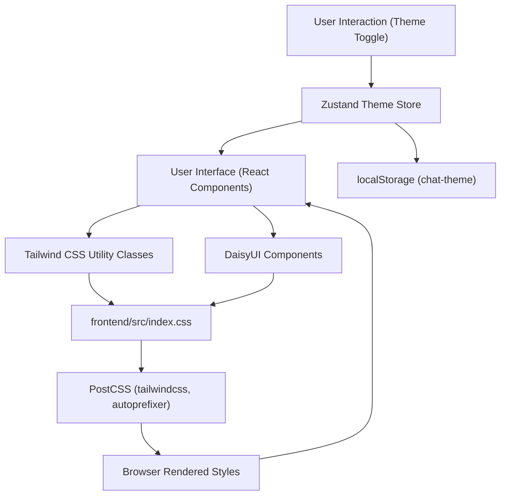
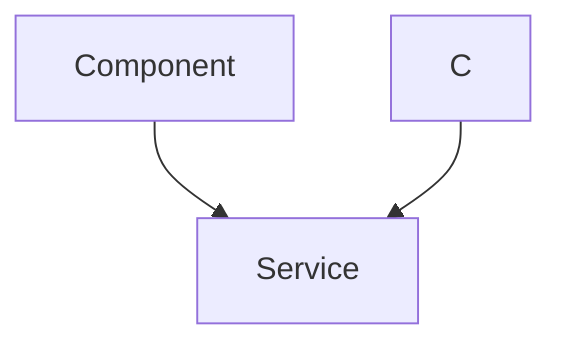

---
title: "Styling and Theming"
description: "Overview of the styling approach using Tailwind CSS and theme management."
sidebar_position: 33
---

# Styling and Theming

<TOC />

This section details the styling and theming approach implemented in the frontend of the application, focusing on the integration of Tailwind CSS with DaisyUI for rapid UI development and Zustand for efficient client-side theme management. The chosen stack provides a robust and maintainable system for styling components and offering dynamic theme switching capabilities to users.

## System Purpose and Design Principles

The styling system is designed to provide a highly customizable, responsive, and maintainable user interface. It leverages modern CSS tooling and utility-first frameworks to accelerate development while ensuring consistency and flexibility.

### Key Design Principles:

*   **Utility-First CSS:** Utilizing Tailwind CSS for atomic classes directly within markup, promoting reusability and minimizing custom CSS.
*   **Component-Driven Theming:** Integrating DaisyUI to provide pre-built, themeable components that seamlessly integrate with Tailwind CSS.
*   **Client-Side Theme Persistence:** Employing Zustand to manage and persist user-selected themes across sessions using `localStorage`.
*   **Modularity and Extensibility:** Structuring configuration files to allow for easy extension of themes, fonts, and PostCSS plugins.
*   **Developer Experience:** Streamlining the styling workflow with features like JIT compilation and PostCSS auto-prefixing.

## Architecture

The styling and theming architecture is centered around Tailwind CSS as the core utility framework, enhanced by DaisyUI for pre-styled components, and PostCSS for build-time transformations. Theme state is managed client-side using Zustand.





_Figure 1: High-level Styling and Theming Architecture Flow_

The above diagram illustrates how UI components consume Tailwind utilities and DaisyUI components, which are then processed by PostCSS to generate final CSS. User interactions drive theme changes via the Zustand store, which updates both `localStorage` and the application's React components, triggering a re-render with the new theme.

## Technology Stack

The styling and theming solution relies on a specific set of frontend technologies to achieve its goals.

| Layer       | Technology    | Purpose                                                                                                 |
| :---------- | :------------ | :------------------------------------------------------------------------------------------------------ |
| **Core CSS**| Tailwind CSS  | Utility-first CSS framework for rapid UI development and highly customizable designs.                   |
| **UI Library**| DaisyUI       | Tailwind CSS component library providing ready-made, themeable UI components.                           |
| **CSS Pre/Post-processing**| PostCSS     | Transforms CSS with JavaScript plugins, specifically `tailwindcss` and `autoprefixer`. |
| **State Management**| Zustand       | Lightweight, fast, and scalable state management for client-side theme persistence.                    |
| **Font Management**| Google Fonts  | Integration of custom fonts (Chivo) for consistent typography.                                          |

### Configuration Details

#### Tailwind CSS Configuration

The core styling configuration resides in [frontend/tailwind.config.js](https://github.com/shinymack/Chat-App-MERN/blob/main/frontend/tailwind.config.js). This file extends Tailwind's default configuration, integrates DaisyUI, and defines custom fonts and themes.

```javascript
// frontend/tailwind.config.js
import daisyui from "daisyui"

/** @type {import('tailwindcss').Config} */
export default {
  content: [
    "./index.html",
    "./src/**/*.{js,ts,jsx,tsx}",
  ],
  theme: {
    extend: {
      fontFamily : {
        chivo : ['Chivo', 'sans-serif'],
      }
    },
  },
  plugins: [daisyui],
  daisyui : {
    themes: [
      "light", "dark", "cupcake", "bumblebee", "emerald", "corporate", "synthwave", "retro",
      "cyberpunk", "valentine", "halloween", "garden", "forest", "aqua", "lofi", "pastel",
      "fantasy", "wireframe", "black", "luxury", "dracula", "cmyk", "autumn", "business",
      "acid", "lemonade", "night", "coffee", "winter", "dim", "nord", "sunset",
    ],
  }
}
```
[View on GitHub](https://github.com/shinymack/Chat-App-MERN/blob/main/frontend/tailwind.config.js)

This configuration does the following:
*   **`content`**: Specifies the files Tailwind should scan for utility classes to ensure only used styles are bundled, optimizing final CSS size.
*   **`theme.extend.fontFamily.chivo`**: Customizes the `fontFamily` utility to include 'Chivo' from Google Fonts, ensuring consistent typography throughout the application.
*   **`plugins: [daisyui]`**: Integrates the DaisyUI plugin, which generates a large set of styled components and theme variations based on Tailwind CSS.
*   **`daisyui.themes`**: Defines an extensive list of themes available from DaisyUI. These themes can be dynamically switched by adding a `data-theme` attribute to the `html` or `body` tag, or any parent element.

#### PostCSS Configuration

PostCSS acts as a processor for CSS, enabling the use of plugins to transform CSS code. The configuration is found in [frontend/postcss.config.js](https://github.com/shinymack/Chat-App-MERN/blob/main/frontend/postcss.config.js).

```javascript
// frontend/postcss.config.js
export default {
  plugins: {
    tailwindcss: {},
    autoprefixer: {},
  },
}
```
[View on GitHub](https://github.com/shinymack/Chat-App-MERN/blob/main/frontend/postcss.config.js)

This simple configuration includes two essential plugins:
*   **`tailwindcss`**: This plugin processes the `@tailwind` directives in `index.css` and generates all the necessary utility classes based on `tailwind.config.js`.
*   **`autoprefixer`**: Automatically adds vendor prefixes to CSS rules, ensuring cross-browser compatibility without manual effort.

#### Base CSS and Font Imports

The global styles and Tailwind directives are managed in [frontend/src/index.css](https://github.com/shinymack/Chat-App-MERN/blob/main/frontend/src/index.css).

```css
/* frontend/src/index.css */
@import url('https://fonts.googleapis.com/css2?family=Chivo:ital,wght@0,100..900;1,100..900&display=swap');
@tailwind base;
@tailwind components;
@tailwind utilities;


@layer base {
    body {
        @apply font-chivo;
    }
}
```
[View on GitHub](https://github.com/shinymack/Chat-App-MERN/blob/main/frontend/src/index.css)

This file performs three crucial tasks:
*   **`@import url(...)`**: Imports the 'Chivo' font from Google Fonts, making it available for use in the application.
*   **`@tailwind base; @tailwind components; @tailwind utilities;`**: These directives inject Tailwind's base styles, component-specific styles (including those from DaisyUI), and all utility classes into the CSS bundle.
*   **`@layer base { body { @apply font-chivo; } }`**: Applies the 'Chivo' font globally to the `body` element using a Tailwind utility class within a custom base layer, ensuring all text defaults to this font.

## Theme Management

Theme management is handled client-side using Zustand, a lightweight state management library. The `useThemeStore` hook provides the current theme and a function to update it, persisting the selection in `localStorage`.

### Theme Store Implementation

The theme store is defined in [frontend/src/store/useThemeStore.js](https://github.com/shinymack/Chat-App-MERN/blob/main/frontend/src/store/useThemeStore.js).

```javascript
// frontend/src/store/useThemeStore.js
import { create } from "zustand";

export const useThemeStore = create((set) => ({
    theme: localStorage.getItem("chat-theme") || "dark",
    setTheme: (theme) => {
        localStorage.setItem("chat-theme", theme);
        set({theme});
    }
}))
```
[View on GitHub](https://github.com/shinymack/Chat-App-MERN/blob/main/frontend/src/store/useThemeStore.js)

This Zustand store:
*   **Initial State**: Initializes the `theme` state by attempting to retrieve "chat-theme" from `localStorage`. If no theme is found, it defaults to "dark".
*   **`setTheme` Action**: Provides a function to update the `theme`. When called, it persists the new theme value to `localStorage` and then updates the store's state, triggering re-renders in subscribed components.

### Theme Application Flow

When a user selects a new theme, the following sequence of events occurs to apply the change:





_Figure 2: Theme Application Sequence Diagram_

This diagram illustrates the reactive nature of the theme system. User interaction triggers the Zustand store, which then updates `localStorage` for persistence and the component's state. The component then dynamically modifies the `data-theme` attribute on a root HTML element, which DaisyUI interprets to apply the corresponding theme styles defined in `tailwind.config.js`.

## Key Integration Points

The styling and theming system is tightly integrated with several aspects of the frontend application:

*   **Zustand State Management**: The `useThemeStore` hook is central to managing and propagating theme changes across the application. Components needing theme access or modification simply import and use this hook.
*   **`localStorage` for Persistence**: User theme preferences are robustly stored in `localStorage`, ensuring that the chosen theme persists even after the user closes and reopens the application. This enhances user experience by maintaining their aesthetic choices.
*   **Dynamic `data-theme` Attribute**: DaisyUI's mechanism for theme switching relies on the `data-theme` attribute on the `html` or `body` element. The application must programmatically update this attribute based on the `theme` value from `useThemeStore`. This is typically done in a root component like `App.jsx` or `main.jsx` using `useEffect` to react to theme changes.
*   **Build Process (Vite/Webpack)**: PostCSS, Tailwind CSS, and Autoprefixer are integrated into the frontend's build pipeline (e.g., via Vite's configuration for React applications). This ensures that `@tailwind` directives are expanded, utility classes are generated, and vendor prefixes are added during development and production builds.

### Best Practices and Scalability

*   **Customization**: For further customization beyond DaisyUI's themes, `tailwind.config.js` can be extended with custom colors, spacing, breakpoints, and more, allowing the design system to grow with the application's needs.
*   **Theme Provider**: While `data-theme` directly on `html` works for global themes, for more granular, component-specific theming or advanced contexts, a React Context API-based theme provider could be implemented to manage and pass theme data down the component tree.
*   **Performance**: Tailwind's JIT mode (default in recent versions) ensures that only the CSS utilities actually used in the project are generated, resulting in highly optimized and small CSS bundle sizes, which is crucial for application performance.
*   **Accessibility**: When selecting themes, consider contrast ratios and color blindness to ensure the application remains accessible to all users. DaisyUI themes generally account for this, but custom themes require careful validation.
*   **Future-proofing**: The modular nature of PostCSS and Tailwind allows for easy integration of new CSS features or plugins as they emerge, keeping the styling stack modern and adaptable.

Next: [Development and Deployment](./4_development-and-deployment.mdx)
```