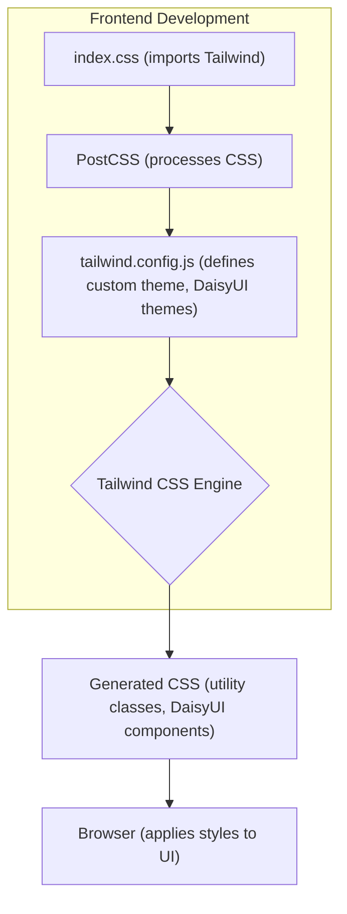
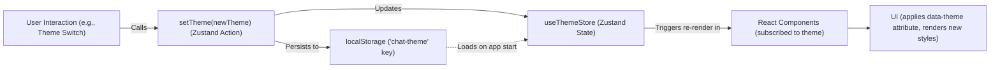

# Styling and Theming
<TOC />

This section delves into the application's styling architecture, which leverages a modern approach combining utility-first CSS with component libraries and state management for dynamic theming. The core of our styling is built upon **Tailwind CSS**, enhanced by **DaisyUI** for pre-built components and themes, and managed with **Zustand** for seamless theme switching.

The primary goal is to provide a highly customizable, responsive, and maintainable styling system. Tailwind CSS allows for rapid UI development by composing utility classes, while DaisyUI extends this with a rich set of styled components and a comprehensive theme system. Theme preferences are persisted and managed using a Zustand store, ensuring a consistent user experience.

## Core Styling Stack

The application employs a robust styling stack designed for flexibility and efficiency.

*   **Tailwind CSS**: A utility-first CSS framework that provides low-level utility classes to build custom designs directly in your markup.
*   **PostCSS**: A tool for transforming CSS with JavaScript plugins, used here to integrate Tailwind CSS and Autoprefixer.
*   **DaisyUI**: A Tailwind CSS component library that adds pre-built components and a theme system on top of Tailwind, making it easier to create beautiful UIs.
*   **Zustand**: A small, fast, and scalable bear-necessities state-management solution used for managing the application's theme state.

### Tailwind CSS and PostCSS Configuration

The styling pipeline begins with PostCSS, which processes CSS files. This setup ensures Tailwind CSS utilities are correctly generated and browser compatibility issues are handled by Autoprefixer.

**`frontend/postcss.config.js`**:
This configuration tells PostCSS to use `tailwindcss` to process your CSS files and `autoprefixer` to automatically add vendor prefixes to CSS rules, ensuring broad browser compatibility.

```javascript filename="frontend/postcss.config.js"
export default {
  plugins: {
    tailwindcss: {},
    autoprefixer: {},
  },
}
```
[View on GitHub](https://github.com/shinymack/Chat-App-MERN/blob/main/frontend/postcss.config.js)

**`frontend/tailwind.config.js`**:
This is the central configuration file for Tailwind CSS. It defines which files Tailwind should scan for classes (`content`), extends the default theme with custom fonts, and registers `daisyui` as a plugin. Crucially, it lists all available DaisyUI themes, allowing for a wide range of aesthetic choices.

```javascript filename="frontend/tailwind.config.js"
import daisyui from "daisyui"


/** @type {import('tailwindcss').Config} */
export default {
  content: [
    "./index.html",
    "./src/**/*.{js,ts,jsx,tsx}",
  ],
  theme: {
    extend: {
      fontFamily : {
        chivo : ['Chivo', 'sans-serif'],
      }
    },
  },
  plugins: [daisyui],
  daisyui : {
 themes: [
      "light",
      "dark",
      "cupcake",
      "bumblebee",
      "emerald",
      "corporate",
      "synthwave",
      "retro",
      "cyberpunk",
      "valentine",
      "halloween",
      "garden",
      "forest",
      "aqua",
      "lofi",
      "pastel",
      "fantasy",
      "wireframe",
      "black",
      "luxury",
      "dracula",
      "cmyk",
      "autumn",
      "business",
      "acid",
      "lemonade",
      "night",
      "coffee",
      "winter",
      "dim",
      "nord",
      "sunset",
    ],
  }
}
```
[View on GitHub](https://github.com/shinymack/Chat-App-MERN/blob/main/frontend/tailwind.config.js)

**`frontend/src/index.css`**:
This is the main CSS file where Tailwind's base, components, and utilities are imported. It also imports the 'Chivo' font from Google Fonts and applies it as the default font family for the entire `body` using Tailwind's `@apply` directive within a `@layer base` block.

```css filename="frontend/src/index.css"
@import url('https://fonts.googleapis.com/css2?family=Chivo:ital,wght@0,100..900;1,100..900&display=swap');
@tailwind base;
@tailwind components;
@tailwind utilities;


@layer base {
    body {
        @apply font-chivo;
    }
}
```
[View on GitHub](https://github.com/shinymack/Chat-App-MERN/blob/main/frontend/src/index.css)

### Styling Pipeline Overview

The following diagram illustrates how the various styling components interact to generate the final application styles.





## Theme Management with Zustand

The application provides dynamic theme switching capabilities, allowing users to personalize their interface. This functionality is managed through a Zustand store, which persists the user's theme preference in local storage.

**`frontend/src/store/useThemeStore.js`**:
This Zustand store (`useThemeStore`) manages the application's current theme. It initializes the theme from `localStorage` (defaulting to "dark" if no preference is found) and provides a `setTheme` action to update both the store's state and `localStorage`.

```javascript filename="frontend/src/store/useThemeStore.js"
import { create } from "zustand";

export const useThemeStore = create((set) => ({
    theme: localStorage.getItem("chat-theme") || "dark",
    setTheme: (theme) => {
        localStorage.setItem("chat-theme", theme);
        set({theme});
    }
}))
```
[View on GitHub](https://github.com/shinymack/Chat-App-MERN/blob/main/frontend/src/store/useThemeStore.js)

When a user selects a new theme, the `setTheme` function is called. This updates the Zustand store, which triggers a re-render of components subscribed to the theme state, and simultaneously updates `localStorage` to remember the preference across sessions. DaisyUI handles the actual application of the theme by adding the `data-theme` attribute to the `html` tag.

### Theme Management Flow

This diagram illustrates the flow of theme management within the application.





## Key Integration Points

*   **Unified Styling**: Tailwind CSS, PostCSS, and DaisyUI work in concert to provide a powerful and flexible styling foundation. Tailwind's utility-first approach paired with DaisyUI's components accelerates UI development, while PostCSS ensures efficient processing.
*   **Dynamic Theming**: The integration of Zustand for state management and `localStorage` for persistence enables robust and dynamic theme switching. The `data-theme` attribute, a core feature of DaisyUI, is seamlessly updated based on the Zustand store's state, instantly transforming the application's appearance.
*   **Maintainability**: By centralizing Tailwind configuration and theme definitions, the system remains highly maintainable. Developers can easily extend the theme, add custom utilities, or integrate new DaisyUI components with minimal effort.
*   **Performance**: Tailwind CSS's JIT (Just-In-Time) mode (implicitly used by `postcss-tailwindcss`) ensures that only the CSS utilities actually used in the project are bundled, leading to highly optimized and small CSS file sizes.

This comprehensive styling and theming approach ensures that the application is not only visually appealing but also highly customizable, performant, and easy to maintain.

Next: [Development and Configuration](./4_development-and-configuration.mdx)