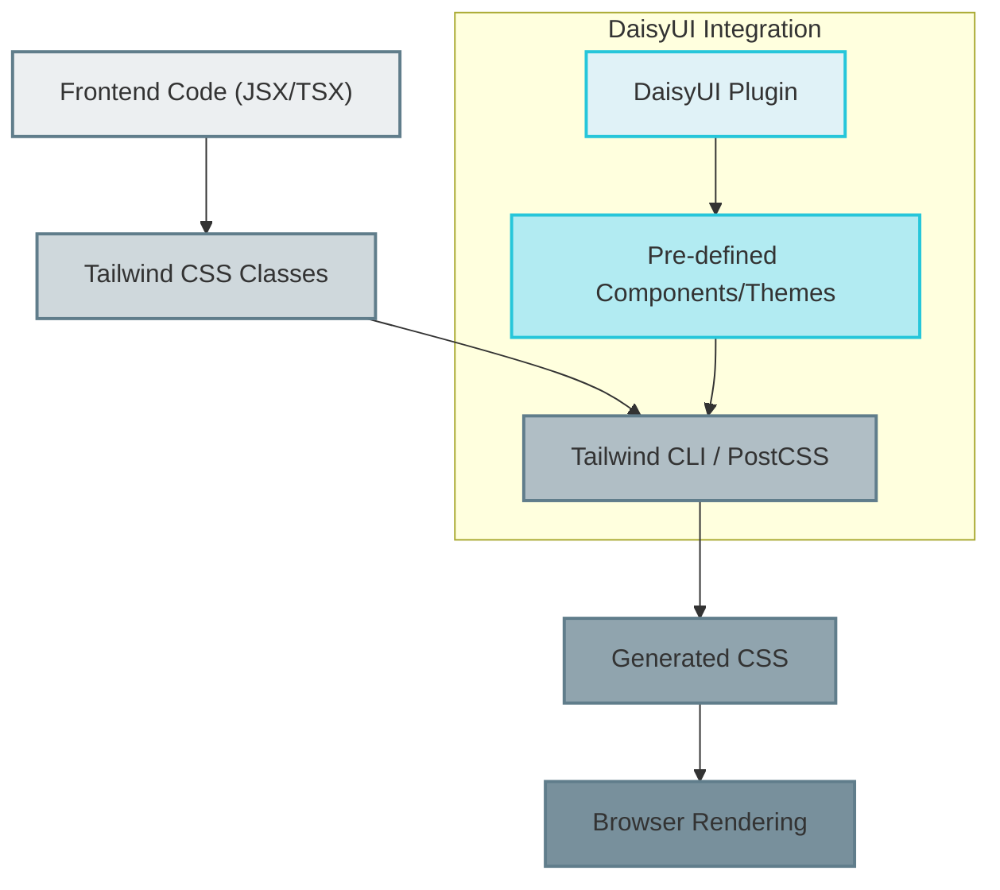
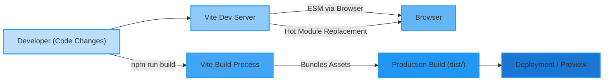

# Styling, Build, and Configuration

<TOC />

This section details the frontend configuration for styling, build processes, and overall project setup. It covers how Tailwind CSS is integrated for styling, Vite handles the build and development server, and the `package.json` orchestrates dependencies and scripts.

## Frontend Project Overview

The `package.json` file serves as the central manifest for the frontend application, defining its name, version, scripts, and dependencies. It outlines the core tools and libraries used for development, building, and running the application.

```json title="frontend/package.json"
{
  "name": "frontend",
  "private": true,
  "version": "0.0.0",
  "type": "module",
  "scripts": {
    "dev": "vite",
    "build": "vite build",
    "lint": "eslint .",
    "preview": "vite preview",
    "mobile": "vite --host"
  },
  "dependencies": {
    "axios": "^1.7.9",
    "cors": "^2.8.5",
    "lucide-react": "^0.471.1",
    "react": "^18.3.1",
    "react-dom": "^18.3.1",
    "react-hot-toast": "^2.5.1",
    "react-icons": "^5.5.0",
    "react-router-dom": "^7.1.1",
    "socket.io-client": "^4.8.1",
    "zustand": "^5.0.3"
  },
  "devDependencies": {
    "@eslint/js": "^9.17.0",
    "@types/react": "^18.3.18",
    "@types/react-dom": "^18.3.5",
    "@vitejs/plugin-react": "^4.3.4",
    "autoprefixer": "^10.4.20",
    "daisyui": "^4.12.23",
    "eslint": "^9.17.0",
    "eslint-plugin-react": "^7.37.2",
    "eslint-plugin-react-hooks": "^5.0.0",
    "eslint-plugin-react-refresh": "^0.4.16",
    "globals": "^15.14.0",
    "postcss": "^8.5.0",
    "tailwindcss": "^3.4.17",
    "vite": "^6.3.5"
  }
}
```

[View on GitHub](https://github.com/shinymack/Chat-App-MERN/blob/main/frontend/package.json)

### Key Scripts

The `scripts` section defines various commands for developing and building the application:

*   **`dev`**: Starts the development server using Vite.
*   **`build`**: Compiles the application for production using Vite.
*   **`lint`**: Runs ESLint to check for code quality and style issues.
*   **`preview`**: Serves the production build locally for testing.
*   **`mobile`**: Starts the development server with host exposure, allowing access from other devices on the same network.

### Dependencies

The `dependencies` list includes runtime libraries essential for the application's functionality:

*   **`axios`**: Promise-based HTTP client for making API requests.
*   **`cors`**: For handling Cross-Origin Resource Sharing (primarily for development if running frontend/backend separately without specific proxy setup).
*   **`lucide-react`**, **`react-icons`**: Icon libraries for UI elements.
*   **`react`**, **`react-dom`**: Core React libraries for building user interfaces.
*   **`react-hot-toast`**: A lightweight and customizable notification library.
*   **`react-router-dom`**: Declarative routing for React applications.
*   **`socket.io-client`**: Client-side library for real-time, bidirectional event-based communication.
*   **`zustand`**: A small, fast, and scalable state-management solution.

### Development Dependencies

`devDependencies` are packages required only during development and build processes:

*   **`@vitejs/plugin-react`**: Vite plugin for React refresh and fast HMR.
*   **`autoprefixer`**, **`postcss`**, **`tailwindcss`**: Tools for styling (PostCSS plugin, Tailwind CSS framework).
*   **`daisyui`**: A Tailwind CSS component library.
*   **`eslint`**, **`@eslint/js`**, **`eslint-plugin-react`**, **`eslint-plugin-react-hooks`**, **`eslint-plugin-react-refresh`**, **`globals`**: Linting tools and plugins for code quality.
*   **`vite`**: Next-generation frontend tooling.

## Styling with Tailwind CSS and DaisyUI

The frontend utilizes Tailwind CSS for utility-first styling, enhanced by DaisyUI for pre-built, customizable components. This combination allows for rapid UI development while maintaining a consistent design system.

### PostCSS Configuration

`postcss.config.js` sets up PostCSS plugins. Here, it enables `tailwindcss` and `autoprefixer`, ensuring that Tailwind's utility classes are processed correctly and CSS is automatically prefixed for broader browser compatibility.

```javascript title="frontend/postcss.config.js"
export default {
  plugins: {
    tailwindcss: {},
    autoprefixer: {},
  },
}
```

[View on GitHub](https://github.com/shinymack/Chat-App-MERN/blob/main/frontend/postcss.config.js)

### Tailwind CSS Configuration

`tailwind.config.js` is where Tailwind CSS is customized. It specifies which files to scan for Tailwind classes (`content`), extends the default theme (e.g., custom fonts), and integrates plugins like DaisyUI.

```javascript title="frontend/tailwind.config.js"
import daisyui from "daisyui"


/** @type {import('tailwindcss').Config} */
export default {
  content: [
    "./index.html",
    "./src/**/*.{js,ts,jsx,tsx}",
  ],
  theme: {
    extend: {
      fontFamily : {
        chivo : ['Chivo', 'sans-serif'],
      }
    },
  },
  plugins: [daisyui],
  daisyui : {
 themes: [
      "light",
      "dark",
      "cupcake",
      "bumblebee",
      "emerald",
      "corporate",
      "synthwave",
      "retro",
      "cyberpunk",
      "valentine",
      "halloween",
      "garden",
      "forest",
      "aqua",
      "lofi",
      "pastel",
      "fantasy",
      "wireframe",
      "black",
      "luxury",
      "dracula",
      "cmyk",
      "autumn",
      "business",
      "acid",
      "lemonade",
      "night",
      "coffee",
      "winter",
      "dim",
      "nord",
      "sunset",
    ],
  }
}
```

[View on GitHub](https://github.com/shinymack/Chat-App-MERN/blob/main/frontend/tailwind.config.js)

#### Key Configuration Points:

*   **`content`**: Defines the files that Tailwind CSS should scan for class names to generate the smallest possible CSS bundle.
*   **`theme.extend`**: Allows adding custom theme properties without overwriting Tailwind's defaults. Here, a custom `chivo` font family is added.
*   **`plugins`**: Registers Tailwind CSS plugins, including `daisyui`.
*   **`daisyui.themes`**: Specifies the enabled DaisyUI themes, providing a wide range of aesthetic options for the application.

### Styling and Theme Flow





## Build Process with Vite

Vite is used as the build tool and development server, chosen for its speed and modern approach to frontend development. It leverages native ES modules in the browser during development, allowing for instant hot module replacement (HMR).

### Vite Configuration

`vite.config.js` is a minimal configuration file that tells Vite to use the `@vitejs/plugin-react` plugin. This plugin provides React-specific features like Fast Refresh.

```javascript title="frontend/vite.config.js"
import { defineConfig } from 'vite'
import react from '@vitejs/plugin-react'

// https://vitejs.dev/config/
export default defineConfig({
  plugins: [react()],
})
```

[View on GitHub](https://github.com/shinymack/Chat-App-MERN/blob/main/frontend/vite.config.js)

This simple configuration is sufficient for most React projects, as Vite handles many common setups out-of-the-box.

### Frontend Development and Build Flow





## Key Integration Points

*   **Vite and React**: Vite provides an incredibly fast development experience for React applications, minimizing build times and maximizing developer productivity through features like Fast Refresh. The `vite.config.js` ensures proper integration.
*   **Tailwind CSS with PostCSS**: PostCSS acts as a critical pipeline for processing CSS, allowing Tailwind to efficiently generate styles and Autoprefixer to ensure cross-browser compatibility. This setup is defined in `postcss.config.js`.
*   **DaisyUI and Tailwind CSS**: DaisyUI extends Tailwind CSS, providing a rich set of pre-designed components and themes. This modular approach allows for rapid UI assembly and easy theme switching, configured within `tailwind.config.js`.
*   **`package.json` as Orchestrator**: This file ties everything together, defining the scripts that invoke Vite for development and build, listing all necessary dependencies for both runtime and development, and thus providing a complete overview of the frontend's technical stack and operational commands.