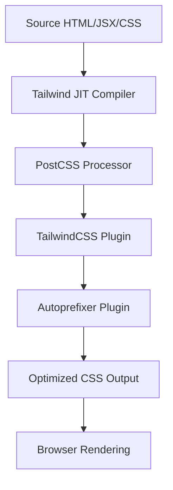

# Styling & Theming

<TOC />

This section delves into the frontend's styling and theming architecture, highlighting the synergistic use of Tailwind CSS, DaisyUI, PostCSS, and Zustand for a robust, maintainable, and highly customizable user interface. We'll explore how these technologies are integrated to provide a modern, utility-first styling approach combined with dynamic, persistent theme management.

## The Styling Foundation: Tailwind CSS & PostCSS

The frontend application leverages Tailwind CSS as its primary styling framework, enhanced by PostCSS for efficient processing and browser compatibility. This combination ensures a streamlined development workflow and optimized production builds.

### What is Tailwind CSS?

Tailwind CSS is a utility-first CSS framework that provides a comprehensive set of low-level utility classes to build designs directly in your markup. Instead of writing custom CSS for every component, you compose complex designs by applying these utility classes.

**WHY** choose a utility-first approach like Tailwind CSS?
*   **Rapid Development:** Eliminates the need to switch between HTML and CSS files frequently, leading to faster prototyping and development.
*   **Consistency:** Encourages consistent designs by constraining choices, making it harder to introduce inconsistent styles.
*   **Maintainability:** Localizes styles directly to components, making changes safer and easier to track without affecting other parts of the application.
*   **Performance:** With JIT (Just-In-Time) compilation, Tailwind generates only the CSS you actually use, resulting in smaller file sizes and faster load times.

### PostCSS Configuration

PostCSS acts as a vital pre-processor in the build pipeline, transforming CSS with JavaScript plugins. In this setup, it's configured to process Tailwind CSS directives and automatically add vendor prefixes.

**WHAT** `postcss.config.js` does:
This configuration file specifies the PostCSS plugins that will be applied to the CSS. It primarily enables Tailwind CSS processing and `autoprefixer` for enhanced browser compatibility.

**WHY** `postcss.config.js` is designed this way:
*   The `tailwindcss` plugin interprets and expands Tailwind's utility classes and directives (like `@tailwind base;`, `@apply`, etc.) into actual CSS.
*   The `autoprefixer` plugin automatically adds vendor prefixes (e.g., `-webkit-`, `-moz-`) to CSS rules, ensuring that styles work correctly across different browsers without manual intervention.

**HOW** `postcss.config.js` integrates into the build:
During the build process, CSS files are piped through PostCSS, which first processes Tailwind's syntax and then adds necessary vendor prefixes, resulting in a robust, cross-browser compatible stylesheet.

```javascript
// frontend/postcss.config.js
export default {
  plugins: {
    tailwindcss: {}, // Enables Tailwind CSS processing
    autoprefixer: {}, // Adds vendor prefixes for browser compatibility
  },
}
```
[[frontend/postcss.config.js](https://github.com/shinymack/Chat-App-MERN/blob/main/frontend/postcss.config.js)]

### Core Styles & Typography

The application's fundamental styles and typography are established in `index.css`, which serves as the global entry point for all stylesheets.

**WHAT** `index.css` contains:
This file imports external fonts, integrates Tailwind's core styles, and defines global base styles, such as the default font family for the entire application.

**WHY** `index.css` is structured this way:
*   **Centralization:** Acts as a single point of entry for all global styles, making it easy to manage.
*   **Font Integration:** Imports the 'Chivo' font from Google Fonts, ensuring a consistent and appealing typography across the application.
*   **Tailwind Directives:** Includes `@tailwind base;`, `@tailwind components;`, and `@tailwind utilities;` to inject Tailwind's essential styles, component-specific styles, and utility classes, respectively.
*   **Base Layer:** Uses `@layer base` to safely define global styles that extend or override Tailwind's defaults, such as applying the 'Chivo' font to the `body` element without conflicting with Tailwind's internal structure.

**HOW** `index.css` applies global styles:
The `@import url(...)` directive fetches the specified Google Font. The `@tailwind` directives pull in Tailwind's generated CSS. The `@layer base` block then leverages Tailwind's `@apply` directive to set the `font-chivo` class on the `body`, ensuring the custom font is used throughout the application.

```css
/* frontend/src/index.css */
@import url('https://fonts.googleapis.com/css2?family=Chivo:ital,wght@0,100..900;1,100..900&display=swap');
@tailwind base;
@tailwind components;
@tailwind utilities;


@layer base {
    body {
        @apply font-chivo; /* Applies the custom Chivo font globally */
    }
}
```
[[frontend/src/index.css#L1-L11](https://github.com/shinymack/Chat-App-MERN/blob/main/frontend/src/index.css#L1-L11)]

## Dynamic Theming with DaisyUI & Zustand

Beyond basic styling, the application incorporates dynamic theming capabilities, allowing users to switch between a wide array of visual themes. This is achieved through the powerful combination of DaisyUI and Zustand.

### Tailwind Configuration for Theming

The `tailwind.config.js` file is the central point for configuring Tailwind CSS, including its plugins and custom extensions. This is where DaisyUI, a component library that integrates seamlessly with Tailwind, is introduced and configured for dynamic theming.

**WHAT** `tailwind.config.js` does for theming:
*   Integrates the `daisyui` plugin, which provides a collection of pre-built, themeable UI components and a robust theme management system.
*   Extends Tailwind's `fontFamily` to include `chivo`, mapping it to the imported 'Chivo' font.
*   Crucially, it defines an extensive list of 33 distinct themes provided by DaisyUI, making them available to the application.

**WHY** this design choice for theming:
*   **DaisyUI's Theming System:** DaisyUI's strength lies in its ability to manage themes using CSS variables and the `data-theme` attribute on the HTML `body` or any parent element. This allows for effortless theme switching with minimal boilerplate.
*   **Pre-built Themes:** The large selection of predefined themes (light, dark, cyberpunk, luxury, etc.) offers rich aesthetic diversity out-of-the-box, significantly reducing development time for UI styling.
*   **Scalability:** By integrating themes directly into the Tailwind configuration, any component utilizing DaisyUI's styles automatically adapts to the selected theme.

**HOW** DaisyUI themes are used:
When a theme is selected (e.g., "dark"), DaisyUI applies a `data-theme="dark"` attribute to the root HTML element. This attribute then triggers a set of CSS variables defined by DaisyUI for that specific theme, dynamically changing the colors, typography, and other visual properties of components across the application.

```javascript
// frontend/tailwind.config.js
import daisyui from "daisyui"

/** @type {import('tailwindcss').Config} */
export default {
  content: [
    "./index.html",
    "./src/**/*.{js,ts,jsx,tsx}",
  ],
  theme: {
    extend: {
      fontFamily : {
        chivo : ['Chivo', 'sans-serif'], // Defines custom font family
      }
    },
  },
  plugins: [daisyui], // Integrates DaisyUI plugin
  daisyui : {
    themes: [ // Lists all available DaisyUI themes
      "light", "dark", "cupcake", "bumblebee", "emerald", "corporate",
      "synthwave", "retro", "cyberpunk", "valentine", "halloween", "garden",
      "forest", "aqua", "lofi", "pastel", "fantasy", "wireframe", "black",
      "luxury", "dracula", "cmyk", "autumn", "business", "acid", "lemonade",
      "night", "coffee", "winter", "dim", "nord", "sunset",
    ],
  }
}
```
[[frontend/tailwind.config.js#L1-L38](https://github.com/shinymack/Chat-App-MERN/blob/main/frontend/tailwind.config.js#L1-L38)]

#### Styling Pipeline
The following diagram illustrates how CSS files are processed from development to the final rendered output in the browser, highlighting the roles of PostCSS, Tailwind CSS, and Autoprefixer.





### State Management for Themes

To manage the current theme dynamically and persist user preferences, the application utilizes Zustand for state management, coupled with `localStorage` for persistence.

**WHAT** `useThemeStore.js` does:
This Zustand store provides a reactive state for the `theme` and a function `setTheme` to update it. It also initializes the theme by checking `localStorage` for a previously saved preference, defaulting to "dark" if none is found.

**WHY** Zustand and `localStorage` for theme management:
*   **Zustand for Simplicity:** Zustand is a lightweight, fast, and unopinionated state management library that integrates well with React, making it easy to define and consume global state.
*   **Theme Persistence:** Using `localStorage.getItem("chat-theme")` and `localStorage.setItem("chat-theme", theme)` ensures that the user's selected theme persists across browser sessions, providing a consistent experience.
*   **Decoupled Logic:** Centralizing theme logic in a Zustand store decouples theme management from individual UI components, promoting a cleaner architecture and easier maintenance.

**HOW** components interact with the theme store:
Any React component can import `useThemeStore` to access the current `theme` state and call `setTheme` to change it. For example, a theme switcher component would call `setTheme("light")` or `setTheme("dark")` when a user interacts with theme options. The component that wraps the main application UI (often the root `App` component) would likely read the `theme` from the store and apply it to a `data-theme` attribute on the `<html>` or `<body>` element, allowing DaisyUI to automatically switch the visual styles.

```javascript
// frontend/src/store/useThemeStore.js
import { create } from "zustand";

export const useThemeStore = create((set) => ({
    // Initialize theme from localStorage, default to "dark"
    theme: localStorage.getItem("chat-theme") || "dark",
    // Function to update theme and persist it in localStorage
    setTheme: (theme) => {
        localStorage.setItem("chat-theme", theme); // Persist
        set({theme}); // Update Zustand state
    }
}))
```
[[frontend/src/store/useThemeStore.js#L1-L9](https://github.com/shinymack/Chat-App-MERN/blob/main/frontend/src/store/useThemeStore.js#L1-L9)]

#### Theme Management Flow
This diagram illustrates the data flow for dynamic theme management, from user interaction to state updates and UI rendering.


```mermaid
flowchart LR;
    User[User Interaction] --> SelectTheme[Select Theme Option];
    SelectTheme --> CallSetTheme[call useThemeStore.setTheme(newTheme)];
    CallSetTheme --> LocalStorage[Update localStorage("chat-theme")];
    CallSetTheme --> ZustandState[Update Zustand State (theme)];
    ZustandState -- Triggers Re-render --> RootComponent[Root React Component];
    RootComponent -- Applies data-theme --> HTMLBody[HTML Body Element];
    HTMLBody -- CSS Variables Change --> UIComponents[UI Components];
    UIComponents --> RenderStyledUI[Render Dynamically Styled UI];
    LocalStorage -- Initial Load --> ZustandState;
```


## Key Insights & Best Practices

*   **Utility-First with Components:** The combination of Tailwind's utility-first approach and DaisyUI's component library offers the best of both worlds: granular control over styling and readily available, accessible components. This promotes rapid development without sacrificing design flexibility.
*   **Modular Theme Management:** Separating theme state logic using Zustand from the actual styling (Tailwind/DaisyUI) ensures a clean separation of concerns. This makes the theme system highly modular and easy to extend or modify.
*   **Persistence for User Experience:** Utilizing `localStorage` for theme persistence is a crucial best practice. It remembers user preferences, providing a seamless and personalized experience across sessions, which is vital for any modern web application.
*   **Optimized Build Process:** The PostCSS configuration, specifically with `autoprefixer` and Tailwind's JIT compilation, ensures that the generated CSS is optimized for size and browser compatibility, contributing to faster load times and a consistent look.
*   **Scalable Theming:** By defining all DaisyUI themes in `tailwind.config.js`, the application is inherently scalable for theming. Adding new themes or modifying existing ones is centralized and straightforward, reducing the complexity of managing a diverse set of UI aesthetics.

This robust styling and theming architecture enables the application to deliver a highly customizable and aesthetically pleasing user experience, backed by efficient development and optimized performance.