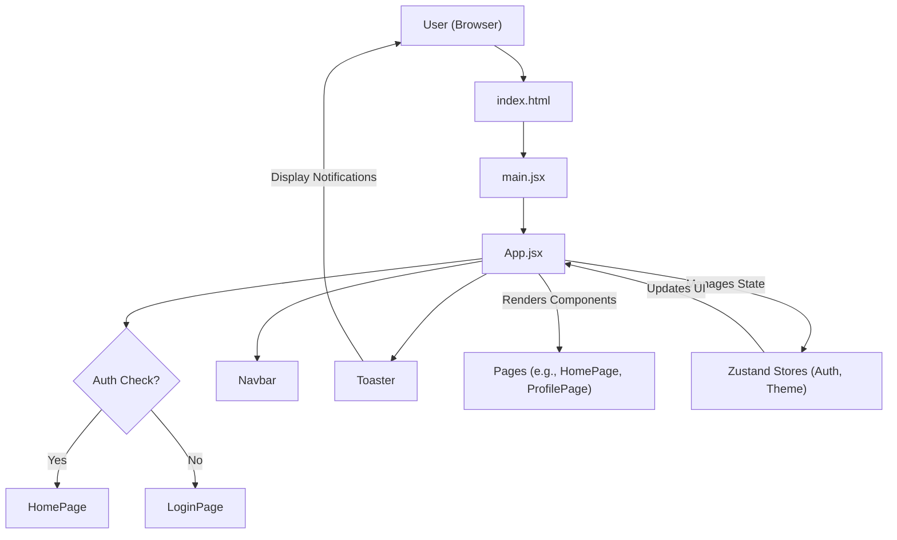
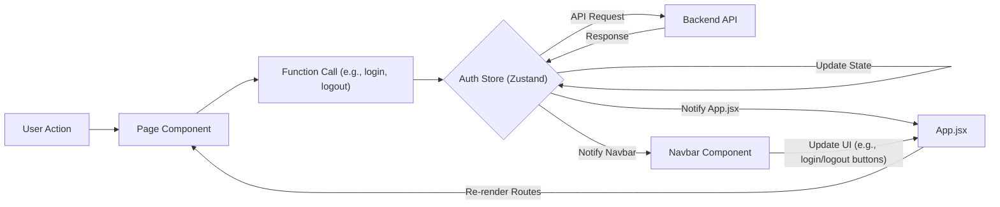

# Frontend Application Structure
<TOC />

The frontend of this application is built with React, leveraging modern JavaScript features and a component-based architecture. It provides a dynamic and responsive user interface for interaction with the backend services. This section details the core files and architectural decisions that define the application's structure.

## Core Setup and Entry Point

The application's entry point and initial setup are managed by `main.jsx` and `App.jsx`, which collectively configure the React environment, routing, and global state management.

### `main.jsx`: Application Root

The `main.jsx` file is the primary entry point for the React application. It initializes the React root, wraps the main `App` component within `BrowserRouter` for client-side routing, and ensures strict mode for better development practices. It also imports `index.css` for global styles.

```jsx title="frontend/src/main.jsx"
import { StrictMode } from 'react'
import { createRoot } from 'react-dom/client'
import './index.css' // Global styles
import App from './App.jsx' // Main application component
import { BrowserRouter } from 'react-router-dom' // Client-side routing

createRoot(document.getElementById('root')).render(
  <StrictMode>
    <BrowserRouter>
      <App />
    </BrowserRouter>
  </StrictMode>,
)
```
[View on GitHub](https://github.com/shinymack/Chat-App-MERN/blob/main/frontend/src/main.jsx)

This setup ensures that all components within `<App />` have access to the routing context provided by `react-router-dom`.

### `App.jsx`: Main Application Component

`App.jsx` serves as the root component where global state, routing logic, and layout are managed. It dynamically renders different pages based on the URL and user authentication status, ensuring a seamless user experience.

```jsx title="frontend/src/App.jsx"
import Navbar from './components/Navbar' // Navigation bar
import { Routes, Route, Navigate } from 'react-router-dom' // Routing components
import { useEffect } from 'react' // React hook for side effects
import HomePage from './pages/HomePage'
import SignUpPage from './pages/SignUpPage'
import LoginPage from './pages/LoginPage'
import SettingsPage from './pages/SettingsPage'
import ProfilePage from './pages/ProfilePage'

import { useThemeStore } from './store/useThemeStore' // Theme management state
import { useAuthStore } from './store/useAuthStore'; // Authentication state
import { Loader } from 'lucide-react' // UI loader component
import { Toaster } from 'react-hot-toast' // Notifications

const App = () => {
  const { authUser, checkAuth, isCheckingAuth, onlineUsers } = useAuthStore();
  const { theme } = useThemeStore();

  useEffect(() => {
    // Check authentication status on component mount
    checkAuth();
  }, [checkAuth]);

  // Display a loader while checking authentication
  if(isCheckingAuth && !authUser) return (
      <div className='flex items-center justify-center h-screen'>
        <Loader className='size-10 animate-spin' />
      </div>
  )

  return (
    <div className='' data-theme={theme}> {/* Apply current theme */}
      <Navbar /> {/* Global navigation */}
      <Toaster /> {/* Global toast notifications */}
      <Routes> {/* Define application routes */}
        <Route path='/' element={authUser ? <HomePage />: <Navigate to='/login' />} />
        <Route path='/signup' element={ !authUser ? <SignUpPage />: <Navigate to='/' />} />
        <Route path='/login' element={!authUser ? <LoginPage />: <Navigate to='/' />} />
        <Route path='/settings' element={<SettingsPage />} />
        <Route path='/profile' element={authUser ? <ProfilePage />: <Navigate to='/login' />} />
      </Routes>
    </div>
  )
}

export default App
```
[View on GitHub](https://github.com/shinymack/Chat-App-MERN/blob/main/frontend/src/App.jsx)

Key aspects of `App.jsx`:
*   **Authentication Check**: On initial load, `useEffect` calls `checkAuth()` from `useAuthStore` to verify the user's login status. A `Loader` is displayed during this check.
*   **Theme Management**: The `data-theme` attribute on the root `div` is dynamically set based on the `theme` state from `useThemeStore`, enabling global theme switching.
*   **Global Components**: `Navbar` and `Toaster` are rendered globally, providing persistent navigation and notification services across all pages.
*   **Protected Routes**: Many routes (`/`, `/profile`) are protected, redirecting unauthenticated users to `/login`. Similarly, authenticated users attempting to access `/signup` or `/login` are redirected to `/`.

## Styling and Configuration

The frontend employs modern styling techniques and is configured for efficient development using Vite.

### `index.css`: Global Stylesheets

`index.css` is responsible for importing global stylesheets, including a custom font (`Chivo`) from Google Fonts and the utility-first CSS framework, Tailwind CSS. This ensures a consistent look and feel across the application.

```css title="frontend/src/index.css"
@import url('https://fonts.googleapis.com/css2?family=Chivo:ital,wght@0,100..900;1,100..900&display=swap');
@tailwind base; /* Tailwind's base styles */
@tailwind components; /* Tailwind's component styles */
@tailwind utilities; /* Tailwind's utility classes */


@layer base {
    body {
        @apply font-chivo; /* Apply Chivo font globally */
    }
}
```
[View on GitHub](https://github.com/shinymack/Chat-App-MERN/blob/main/frontend/src/index.css)

The `@layer base` directive ensures that the `font-chivo` class is applied directly to the `body` element, making `Chivo` the default font for the entire application.

### `vite.config.js`: Build Configuration

Vite is used as the build tool for its speed and efficiency. `vite.config.js` configures the React plugin, enabling fast refresh and optimized builds.

```javascript title="frontend/src/vite.config.js"
import { defineConfig } from 'vite'
import react from '@vitejs/plugin-react'

// https://vitejs.dev/config/
export default defineConfig({
  plugins: [react()], // Enable React plugin
})
```
[View on GitHub](https://github.com/shinymack/Chat-App-MERN/blob/main/frontend/vite.config.js)

This minimal configuration leverages Vite's defaults, which are highly optimized for React applications.

## Frontend Application Flow

The following diagram illustrates the high-level flow of the frontend application from initialization to routing and state management.





## State Management and Component Interactions

The frontend uses Zustand for global state management, which provides a simple yet powerful way to manage application-wide data such as authentication status, user details, and theme settings. This centralized state is then consumed by various components to render dynamic content and update the UI.





This diagram illustrates how user actions trigger state updates, which then cascade through the application, updating relevant components. For example, a user logging in updates the `Auth Store`, which in turn causes `App.jsx` to re-render, navigating to the `HomePage`, and updating the `Navbar` to reflect the authenticated user's status.

## Key Integration Points

The frontend primarily integrates with:
*   **Backend API**: All dynamic data (user authentication, profile information, messages) is fetched from and sent to the backend API. `fetch` or a similar HTTP client library (not explicitly shown in provided snippets but implied by `checkAuth` and other operations) would be used for these interactions.
*   **`react-router-dom`**: For client-side routing, enabling navigation between different application views without full page reloads. The `App.jsx` component centralizes route definitions and protection logic.
*   **Zustand Stores (`useAuthStore`, `useThemeStore`)**: These provide global state management for critical application data like authentication status, user information, and current theme. Components subscribe to these stores to reactively update their UI.
*   **Tailwind CSS**: Integrated via `index.css`, Tailwind provides a utility-first approach to styling, allowing rapid UI development and ensuring responsiveness.

The modular structure, combined with efficient state management and modern build tooling, contributes to a robust and maintainable frontend application.

Next: [User Interface Components](./3.1_user-interface-components.mdx)