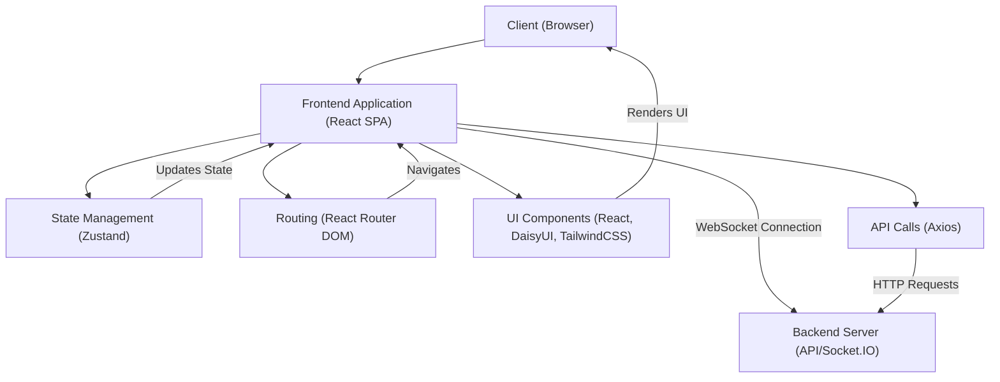
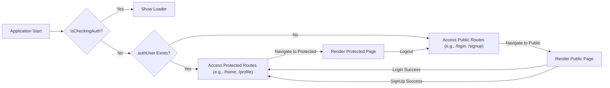

---
title: "Frontend Application"
description: "Overview of the client-side application, its structure, and core technologies."
sidebar_position: 3
---

# Frontend Application

<TOC />

This section provides a comprehensive overview of the frontend application, detailing its purpose, architecture, core technologies, and key integration points. The frontend serves as the user interface, enabling interaction with the application's features, authentication, and real-time communication.

## System Purpose

The primary purpose of the frontend application is to provide an intuitive and responsive user experience for interacting with the backend services. It handles all client-side logic, data presentation, and user input.

Key functionalities include:

*   **User Authentication**: Secure sign-up and login processes, session management, and protected routes based on user authentication status.
*   **Real-time Communication**: Displaying real-time updates for chat messages, online user status, and notifications, typically powered by WebSockets.
*   **State Management**: Centralized management of application state, including user data, theme preferences, and authentication status.
*   **Navigation and Routing**: Seamless navigation between different application pages (e.g., Home, Profile, Settings) using client-side routing.
*   **Theming**: Dynamic theme switching to personalize the user interface (e.g., light/dark mode).
*   **User Profiles**: Displaying and potentially managing user profile information.
*   **Notifications**: Presenting transient notifications (e.g., success/error messages) to the user.

## Architecture

The frontend application is structured as a Single-Page Application (SPA) built with React, leveraging client-side routing for dynamic content loading without full page reloads. It communicates with the backend API to fetch and submit data. The architecture emphasizes modularity, with components, pages, and state management logic clearly separated.

The application’s architecture can be visualized as follows:





### Explanation of Components:
*   **Client (Browser)**: The end-user's web browser, where the React SPA is executed.
*   **Frontend Application (React SPA)**: The core React application, handling rendering, user interactions, and orchestrating other modules.
*   **State Management (Zustand)**: A lightweight state management library used to store global application state, such as user authentication details, theme preferences, and online users.
*   **Routing (React Router DOM)**: Manages client-side navigation, mapping URLs to specific React components (pages).
*   **UI Components (React, DaisyUI, TailwindCSS)**: Reusable UI elements built with React, styled using Tailwind CSS and leveraging DaisyUI for pre-built component styles.
*   **API Calls (Axios)**: A Promise-based HTTP client for making requests to the backend API.
*   **Backend Server (API/Socket.IO)**: The server-side application that provides RESTful APIs and real-time communication via Socket.IO.

## Technology Stack

The frontend application is built upon a modern JavaScript ecosystem, leveraging a combination of React for UI, Vite for tooling, and various libraries for specific functionalities.

| Category             | Technology               | Purpose                                                                                                                                                                                                                                                                                                  |
| :------------------- | :----------------------- | :------------------------------------------------------------------------------------------------------------------------------------------------------------------------------------------------------------------------------------------------------------------------------------------------------- |
| **Core Framework**   | React.js                 | A declarative, component-based JavaScript library for building user interfaces. Utilized for its efficient DOM updates and robust ecosystem.                                                                                                                                                                  |
| **Build Tooling**    | Vite                     | A fast development server and build tool that offers instant server start, hot module replacement (HMR), and optimized production builds.                                                                                                                                                                    |
| **Language**         | JavaScript               | Primary programming language.                                                                                                                                                                                                                                                                            |
| **Package Manager**  | npm                      | Manages project dependencies and scripts.                                                                                                                                                                                                                                                                |
| **Routing**          | `react-router-dom`       | Handles client-side routing, enabling navigation between different pages without full page reloads. Version 6.x is used, leveraging hooks like `useRoutes` and `Navigate`.                                                                                                                                  |
| **State Management** | `zustand`                | A fast, scalable, and tiny state management solution for React. It simplifies global state management, particularly for user authentication (`useAuthStore`) and theming (`useThemeStore`).                                                                                                              |
| **HTTP Client**      | `axios`                  | A popular promise-based HTTP client for making API requests to the backend server.                                                                                                                                                                                                                       |
| **Real-time Comms**  | `socket.io-client`       | Client-side library for establishing and managing WebSocket connections with the backend, facilitating real-time features like chat and online user status.                                                                                                                                                 |
| **Styling**          | Tailwind CSS             | A utility-first CSS framework for rapidly building custom designs directly in HTML.                                                                                                                                                                                                                      |
| **UI Components**    | DaisyUI                  | A Tailwind CSS component library that provides pre-built, responsive UI components (e.g., Navbar, buttons, inputs), enhancing development speed and consistency.                                                                                                                                         |
| **Icons**            | `lucide-react`, `react-icons` | Collections of SVG icons, providing a wide range of visual elements for the user interface. `lucide-react` is used for specific icons like `Loader`, while `react-icons` offers a broader selection.                                                                                                   |
| **Notifications**    | `react-hot-toast`        | A lightweight and highly customizable toast notification library for displaying transient messages (success, error, info) to users.                                                                                                                                                                       |
| **Linting**          | `eslint`                 | Static code analysis tool used to identify and report problematic patterns found in JavaScript code, ensuring code quality and consistency.                                                                                                                                                              |
| **Transpiler**       | `@vitejs/plugin-react`   | Vite plugin for React projects, enabling JSX transformation and React-specific optimizations.                                                                                                                                                                                                            |
| **Autoprefixer**     | `autoprefixer`, `postcss` | PostCSS plugin to parse CSS and add vendor prefixes to CSS rules, ensuring cross-browser compatibility.                                                                                                                                                                                                |

## Project Structure

The frontend application leverages a standard React project structure, facilitating maintainability and scalability.

The key entry point for the application is `frontend/src/main.jsx`, which renders the root `App` component into the DOM.

```jsx
// frontend/src/main.jsx
import { StrictMode } from 'react'
import { createRoot } from 'react-dom/client'
import './index.css'
import App from './App.jsx'
import { BrowserRouter } from 'react-router-dom'

// Renders the React application into the root DOM element.
// StrictMode enables highlighting potential problems in an application.
// BrowserRouter provides the routing context for the entire application.
createRoot(document.getElementById('root')).render(
  <StrictMode>
    <BrowserRouter>
      <App />
    </BrowserRouter>
  </StrictMode>,
)
```
[View on GitHub](https://github.com/shinymack/Chat-App-MERN/blob/main/frontend/src/main.jsx)

The `App.jsx` component defines the main application layout, global state initialization, and client-side routing.

```jsx
// frontend/src/App.jsx
// import React from 'react'
import Navbar from './components/Navbar'
import { Routes, Route, Navigate } from 'react-router-dom'
import { useEffect } from 'react'
import HomePage from './pages/HomePage'
import SignUpPage from './pages/SignUpPage'
import LoginPage from './pages/LoginPage'
import SettingsPage from './pages/SettingsPage'
import ProfilePage from './pages/ProfilePage'


import { useThemeStore } from './store/useThemeStore'
import { useAuthStore } from './store/useAuthStore';
import { Loader } from 'lucide-react'
import { Toaster } from 'react-hot-toast'

const App = () => {
  const { authUser, checkAuth, isCheckingAuth, onlineUsers } = useAuthStore(); // Access auth state and actions
  const { theme } = useThemeStore(); // Access theme state

  useEffect(() => {
    // On mount, check if the user is authenticated.
    checkAuth();
  }, [checkAuth]); // Dependency array ensures it runs only when checkAuth changes (on initial mount)

  // console.log("authUser: ", {authUser}); // For debugging purposes

  // console.log({onlineUsers}) // For debugging purposes

  // Display a loader while checking authentication status
  if(isCheckingAuth && !authUser) return (
      <div className='flex items-center justify-center h-screen'>
        <Loader className='size-10 animate-spin' />
      </div>
  )

  return (
    // Apply the current theme to the root div
    <div className='' data-theme={theme}>

      <Navbar /> {/* Global Navbar component */}

      <Toaster /> {/* React Hot Toast for notifications */}
      <Routes>
        {/* Public routes and protected routes */}
        <Route path='/' element={authUser ? <HomePage />: <Navigate to='/login' />} />
        <Route path='/signup' element={ !authUser ? <SignUpPage />: <Navigate to='/' />} />
        <Route path='/login' element={!authUser ? <LoginPage />: <Navigate to='/' />} />
        {/* Settings and Profile pages are accessible, but Profile requires authentication */}
        <Route path='/settings' element={<SettingsPage />} />
        <Route path='/profile' element={authUser ? <ProfilePage />: <Navigate to='/login' />} />

      </Routes>

    </div>
  )
}

export default App
```
[View on GitHub](https://github.com/shinymack/Chat-App-MERN/blob/main/frontend/src/App.jsx)

### Vite Configuration
The `vite.config.js` file is minimal, primarily enabling React support through a plugin. This setup prioritizes fast development and build performance inherent to Vite.

```javascript
// frontend/vite.config.js
import { defineConfig } from 'vite'
import react from '@vitejs/plugin-react'

// https://vitejs.dev/config/
export default defineConfig({
  plugins: [react()], // Enables the React plugin for Vite
})
```
[View on GitHub](https://github.com/shinymack/Chat-App-MERN/blob/main/frontend/vite.config.js)

### npm Scripts
The `package.json` file defines various scripts for development, building, and linting the application.

```json
// frontend/package.json
{
  "name": "frontend",
  "private": true,
  "version": "0.0.0",
  "type": "module",
  "scripts": {
    "dev": "vite",
    "build": "vite build",
    "lint": "eslint .",
    "preview": "vite preview",
    "mobile": "vite --host"
  },
  "dependencies": {
    "axios": "^1.7.9",
    "cors": "^2.8.5",
    "lucide-react": "^0.471.1",
    "react": "^18.3.1",
    "react-dom": "^18.3.1",
    "react-hot-toast": "^2.5.1",
    "react-icons": "^5.5.0",
    "react-router-dom": "^7.1.1",
    "socket.io-client": "^4.8.1",
    "zustand": "^5.0.3"
  },
  "devDependencies": {
    "@eslint/js": "^9.17.0",
    "@types/react": "^18.3.18",
    "@types/react-dom": "^18.3.5",
    "@vitejs/plugin-react": "^4.3.4",
    "autoprefixer": "^10.4.20",
    "daisyui": "^4.12.23",
    "eslint": "^9.17.0",
    "eslint-plugin-react": "^7.37.2",
    "eslint-plugin-react-hooks": "^5.0.0",
    "eslint-plugin-react-refresh": "^0.4.16",
    "globals": "^15.14.0",
    "postcss": "^8.5.0",
    "tailwindcss": "^3.4.17",
    "vite": "^6.3.5"
  }
}
```
[View on GitHub](https://github.com/shinymack/Chat-App-MERN/blob/main/frontend/package.json)

*   `dev`: Starts the development server using Vite.
*   `build`: Compiles the application for production deployment.
*   `lint`: Runs ESLint to check for code quality and style issues.
*   `preview`: Serves the production build locally for testing.
*   `mobile`: Starts the Vite development server with `--host`, making it accessible on the local network, useful for mobile device testing.

## Key Integration Points

The frontend application heavily relies on integration with backend services and various client-side libraries to deliver its full functionality.

### 1. State Management (Zustand)

Zustand is critical for managing global application state, ensuring consistency across components. The `useAuthStore` and `useThemeStore` are prime examples.

*   **Authentication State (`useAuthStore`)**:
    *   Manages the `authUser` object, `isCheckingAuth` status, and `onlineUsers`.
    *   The `checkAuth` action is called on application start (in `App.jsx`) to verify the user's session with the backend.
    *   `onlineUsers` state is updated via `socket.io-client` to reflect real-time user presence.

    ```jsx
    // frontend/src/App.jsx (excerpt)
    const App = () => {
      const { authUser, checkAuth, isCheckingAuth, onlineUsers } = useAuthStore();
      const { theme } = useThemeStore();
      useEffect(() => {
        // Calls the checkAuth function from the auth store on component mount.
        // This is crucial for verifying the user's session with the backend.
        checkAuth();
      }, [checkAuth]);

      // Renders a loading spinner if authentication is being checked and no user is logged in.
      if(isCheckingAuth && !authUser) return (
          <div className='flex items-center justify-center h-screen'>
            <Loader className='size-10 animate-spin' />
          </div>
      )
      // ... rest of the component
    }
    ```
    [View on GitHub](https://github.com/shinymack/Chat-App-MERN/blob/main/frontend/src/App.jsx#L25-L38)

*   **Theme State (`useThemeStore`)**:
    *   Manages the current `theme` (e.g., "light", "dark").
    *   The `data-theme` attribute on the root `div` in `App.jsx` dynamically applies styles provided by DaisyUI/Tailwind CSS.

### 2. API Communication (Axios)

All interactions requiring data persistence or complex server-side logic are handled via HTTP requests using `axios`. This includes user registration, login, fetching user profiles, and sending messages. `axios` is typically configured with base URLs and interceptors for token handling or error management, although not explicitly shown in the provided files.

### 3. Real-time Communication (Socket.IO Client)

The `socket.io-client` library establishes a persistent WebSocket connection to the backend. This enables:

*   **Online User Status**: The frontend receives updates about which users are currently online, displayed in the `onlineUsers` state.
*   **Live Messaging**: (Implied by `socket.io-client` and chat app context) Instant message delivery and reception.

### 4. Authentication Flow and Routing

The `App.jsx` component defines the core routing logic and handles authentication-based redirects.





*   **Protected Routes**: Routes like `/` (HomePage) and `/profile` are only accessible if `authUser` is present. Otherwise, the user is redirected to `/login`.
*   **Public Routes**: Routes like `/signup` and `/login` are only accessible if `authUser` is *not* present. If a user is already authenticated, they are redirected to `/`.
*   **Initial Auth Check**: `useEffect` in `App.jsx` triggers `checkAuth()` to determine the initial authentication status, displaying a loader (`Loader` component from `lucide-react`) during this check. This ensures a consistent user experience by preventing flashing of unauthenticated content.

This robust frontend architecture, coupled with modern development practices and a strong component-based approach, ensures a scalable, maintainable, and highly interactive user application.

Next: [User Interface Components](./3.1_user-interface-components.mdx)
```