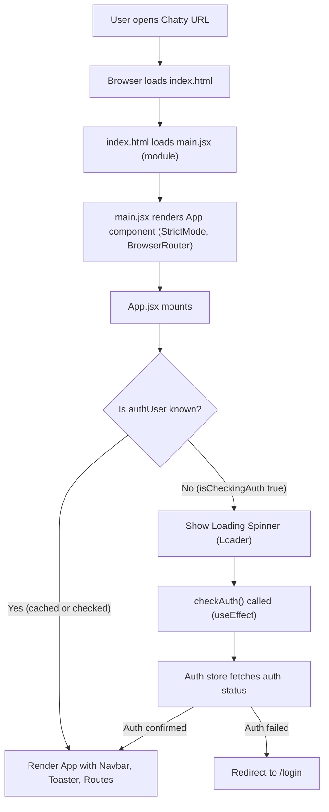
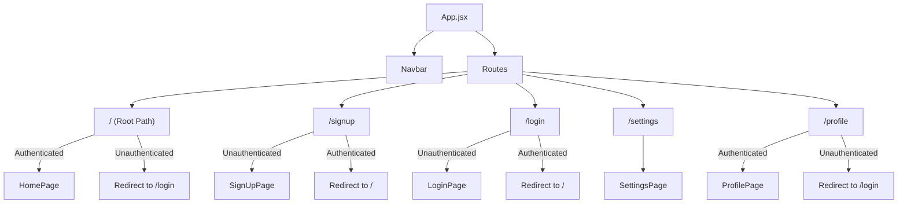

# Frontend Development and UI

This section provides a comprehensive guide to the frontend application structure, component hierarchy, and user interface design of the Chatty application. It details how the core React application is bootstrapped, how routing is managed, and the foundational elements that define the user experience.

<TOC />

## Core Application Structure

The Chatty frontend is built using React, Vite for rapid development, and integrates `react-router-dom` for client-side routing. Tailwind CSS is used for styling, providing a utility-first approach to UI development.

The entry point for the application is `index.html`, which loads the main React application defined in `main.jsx`. The `App.jsx` component then orchestrates the entire application, handling routing, authentication checks, and global state management.

### File Overview

Below is a summary of the key files involved in setting up the frontend application:

| File                                | Description                                                 |
| :---------------------------------- | :---------------------------------------------------------- |
| `frontend/index.html`               | The main HTML file that serves as the entry point.          |
| `frontend/src/main.jsx`             | Renders the React application into the DOM.                 |
| `frontend/src/App.jsx`              | The root component; handles routing, auth, and global state. |
| `frontend/src/index.css`            | Global styles, Tailwind CSS imports, and custom fonts.      |

### `index.html` - Application Entry Point

The `index.html` file is the foundational HTML document that all web browsers load when accessing the application. It's minimalist, providing a root `div` (`#root`) where the React application will be mounted and includes the necessary script to load `main.jsx` as a module.

```html
<!doctype html>
<html lang="en">
  <head>
    <meta charset="UTF-8" />
    <link rel="icon" type="image/svg+xml+png" href="/icon.png" />
    <meta name="viewport" content="width=device-width, initial-scale=1.0" />
    <title>Chatty</title>
  </head>
  <body>
    <div id="root"></div>
    <script type="module" src="/src/main.jsx"></script>
  </body>
</html>
```

The `<div id="root"></div>` element is crucial as it's the target where React will render the entire application. The `<script type="module" src="/src/main.jsx"></script>` tag indicates that `main.jsx` is an ECMAScript module and should be loaded by the browser, initiating the React application.

[View on GitHub](https://github.com/shinymack/Chat-App-MERN/blob/main/frontend/index.html)

### `main.jsx` - React Application Bootstrap

The `main.jsx` file is responsible for bootstrapping the React application. It uses `ReactDOM.createRoot` to render the `App` component within the `<div id="root">` element defined in `index.html`. It also wraps the `App` component with `React.StrictMode` for development-time checks and `BrowserRouter` from `react-router-dom` to enable client-side routing.

```jsx
import { StrictMode } from 'react'
import { createRoot } from 'react-dom/client'
import './index.css'
import App from './App.jsx'
import { BrowserRouter } from 'react-router-dom'

createRoot(document.getElementById('root')).render(
  <StrictMode>
    <BrowserRouter>
      <App />
    </BrowserRouter>
  </StrictMode>,
)
```

This snippet demonstrates the standard React 18+ way of rendering an application. `BrowserRouter` is essential as it provides the routing context for all components within `App` that use `react-router-dom` hooks or components (like `Routes` and `Route`).

[View on GitHub](https://github.com/shinymack/Chat-App-MERN/blob/main/frontend/src/main.jsx)

### `index.css` - Global Styles and Tailwind Configuration

The `index.css` file defines the global styling for the application. It imports a custom font (`Chivo`), integrates Tailwind CSS, and applies base styles. This setup ensures that Tailwind's utility classes are available throughout the application and that a consistent typography is maintained.

```css
@import url('https://fonts.googleapis.com/css2?family=Chivo:ital,wght@0,100..900;1,100..900&display=swap');
@tailwind base;
@tailwind components;
@tailwind utilities;


@layer base {
    body {
        @apply font-chivo;
    }
}
```

The `@tailwind` directives inject Tailwind's pre-generated styles for `base` styles, custom `components` (if any are defined in `tailwind.config.js`), and `utilities`. The `@layer base` block specifically sets the default font for the entire `body` to `Chivo`, ensuring consistent application-wide typography.

[View on GitHub](https://github.com/shinymack/Chat-App-MERN/blob/main/frontend/src/index.css)

## `App.jsx` - The Application Root

The `App.jsx` component is the central hub of the frontend application. It contains the primary routing logic, integrates global state management (authentication and theme), and renders key UI elements like the `Navbar` and a global `Toaster` for notifications.

```jsx
// ... imports ...

const App = () => {
  const { authUser, checkAuth, isCheckingAuth, onlineUsers } = useAuthStore();
  const { theme } = useThemeStore();
  
  useEffect(() => {
    checkAuth();
  }, [checkAuth]);

  // ... console logs ...

  if(isCheckingAuth && !authUser) return (
      <div className='flex items-center justify-center h-screen'>
        <Loader className='size-10 animate-spin' />
      </div>
  )

  return (
    <div className='' data-theme={theme}>
      <Navbar />
      <Toaster />
      <Routes>
        <Route path='/' element={authUser ? <HomePage />: <Navigate to='/login' />} />
        <Route path='/signup' element={ !authUser ? <SignUpPage />: <Navigate to='/' />} />
        <Route path='/login' element={!authUser ? <LoginPage />: <Navigate to='/' />} />
        <Route path='/settings' element={<SettingsPage />} />
        <Route path='/profile' element={authUser ? <ProfilePage />: <Navigate to='/login' />} />
      </Routes>
    </div> 
  )
}

export default App
```

Key features of `App.jsx`:

*   **Authentication Check**: On mount, `useEffect` calls `checkAuth()` from `useAuthStore` to verify the user's authentication status.
*   **Loading State**: Displays a `Loader` animation while `isCheckingAuth` is true, preventing UI flicker or unauthorized access to routes before auth status is known.
*   **Theme Management**: Uses `useThemeStore` to apply the current theme to the root `div` via the `data-theme` attribute, enabling dynamic theme switching.
*   **Navigation**: Renders the `Navbar` component, which is present across all authenticated routes.
*   **Notifications**: Integrates `Toaster` from `react-hot-toast` for displaying user notifications.
*   **Routing**: Defines all application routes using `Routes` and `Route` components. Conditional rendering with `authUser` and `Navigate` ensures that users are redirected based on their authentication status (e.g., authenticated users redirected from `/login` to `/`).

[View on GitHub](https://github.com/shinymack/Chat-App-MERN/blob/main/frontend/src/App.jsx#L14-L50)

### Application Initialization Flow

The following diagram illustrates the initial flow when the Chatty application loads:





## Component Hierarchy and Routing

The `App.jsx` component defines the top-level routing structure, directing users to different pages based on the URL path and their authentication status. The `Navbar` component is a persistent element, while individual pages are rendered dynamically within the `Routes` component.

### Frontend Routing Structure

This diagram outlines the primary routes and their corresponding pages within the Chatty application:





## Key Integration Points

### Global State Management

The frontend heavily relies on Zustand for global state management, specifically for authentication (`useAuthStore`) and theme settings (`useThemeStore`).

*   **`useAuthStore`**: Manages the `authUser` object, `isCheckingAuth` status, and the `checkAuth` function, which makes an API call to verify the user's session. This store is critical for conditional rendering and route protection.
*   **`useThemeStore`**: Manages the application's `theme` (e.g., 'light', 'dark'). The `theme` is applied directly to the root `div` in `App.jsx` using `data-theme`, which Tailwind CSS can then leverage for styling.

### UI Toolkit Integration

*   **Tailwind CSS**: Provides a highly customizable utility-first CSS framework. Global styles are defined in `index.css`, but most styling is done inline using Tailwind classes within components.
*   **`react-hot-toast`**: Integrated via the `Toaster` component in `App.jsx` for displaying simple, non-blocking toast notifications to the user for actions like login success, error messages, etc.
*   **`lucide-react`**: Used for lightweight and customizable SVG icons, such as the `Loader` icon displayed during authentication checks.

### Best Practices

*   **Authentication Flow**: The `App.jsx` component correctly handles the initial authentication check and redirects unauthenticated users to the login page or authenticated users away from login/signup routes, providing a seamless and secure user experience.
*   **Modular Design**: The separation of concerns into `App.jsx`, `main.jsx`, and individual page components promotes a modular and maintainable codebase.
*   **Global Styling**: Centralizing global styles and Tailwind imports in `index.css` ensures consistency and ease of management.

Next: [Frontend Components and Pages](./3.1_frontend-components-and-pages.mdx)