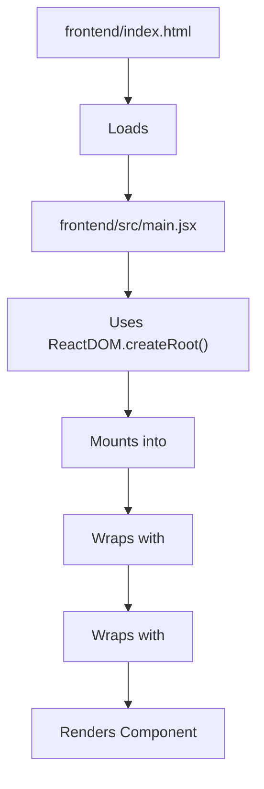
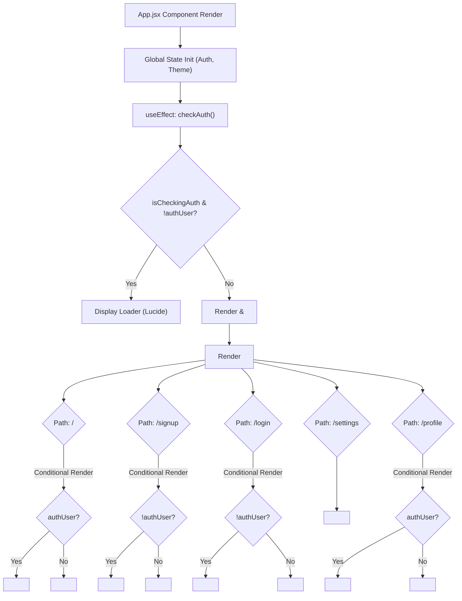

# Frontend Development and UI

<TOC />

The frontend of the Chatty application is built using **React**, leveraging a modern development setup with **Vite**. It's designed for a responsive, dynamic user experience, with styling managed by **Tailwind CSS**. This section provides a comprehensive overview of the core structure, entry points, and primary components that orchestrate the client-side functionality.

## Core Frontend Stack

The application's user interface is crafted with a robust and contemporary stack, ensuring both developer efficiency and user experience.

*   **React.js**: A declarative, component-based JavaScript library for building user interfaces. It underpins the entire UI structure and interactivity.
*   **Vite**: A next-generation frontend tooling that provides an extremely fast development experience with features like hot module replacement (HMR) and optimized build processes.
*   **Tailwind CSS**: A utility-first CSS framework that enables rapid UI development by composing classes directly in markup, leading to highly customizable designs.
*   **React Router DOM**: Essential for navigation, managing different application views, and creating a seamless single-page application (SPA) experience.
*   **Zustand**: A lightweight, fast, and scalable state-management solution used for global state (authentication, theme, online users), offering a simpler alternative to Redux for many use cases.

## Application Entry Points

The journey of the frontend application begins with `index.html` and is bootstrapped by `main.jsx`. These files define how the React application is mounted into the browser's DOM.

### `frontend/index.html`

This is the standard HTML entry point for any web application. It serves as the single page that the browser loads. Crucially, it contains a `div` with the ID `root`, which is where our React application will be mounted, and a script tag that loads our main JavaScript bundle.

```html
<!doctype html>
<html lang="en">
  <head>
    <meta charset="UTF-8" />
    <link rel="icon" type="image/svg+xml+png" href="/icon.png" />
    <meta name="viewport" content="width=device-width, initial-scale=1.0" />
    <title>Chatty</title>
  </head>
  <body>
    <div id="root"></div>
    <script type="module" src="/src/main.jsx"></script>
  </body>
</html>
```

The `<div id="root"></div>` is the designated mount point for the React application, ensuring that all UI rendering happens within this element. The `<script type="module" src="/src/main.jsx"></script>` imports our main JavaScript file as an ES module, allowing modern browser features and efficient module loading.

[View on GitHub](https://github.com/shinymack/Chat-App-MERN/blob/main/frontend/index.html)

### `frontend/src/main.jsx`

This JavaScript file is the true entry point of the React application. It's responsible for importing the root `App` component and rendering it into the `root` DOM element defined in `index.html`. It also wraps the `App` component with `BrowserRouter` for client-side routing.

```jsx title="frontend/src/main.jsx"
import { StrictMode } from 'react'
import { createRoot } from 'react-dom/client'
import './index.css'
import App from './App.jsx'
import { BrowserRouter } from 'react-router-dom'

createRoot(document.getElementById('root')).render(
  <StrictMode>
    <BrowserRouter>
      <App />
    </BrowserRouter>
  </StrictMode>,
)
```

The `createRoot` function from `react-dom/client` is the modern way to hydrate a React application. `StrictMode` is a development-only tool that helps catch potential problems in an application. The `BrowserRouter` component provides the necessary context for `react-router-dom` to manage the application's URL and navigation state.

[View on GitHub](https://github.com/shinymack/Chat-App-MERN/blob/main/frontend/src/main.jsx)

### Frontend Bootstrapping Flow

The following diagram illustrates the sequence of operations from the initial HTML load to the React application being rendered.





## Main Application Component (`App.jsx`)

The `App.jsx` component is the central orchestrator of the entire frontend. It sets up global configurations, handles routing, manages initial authentication checks, and integrates global state management for themes and user authentication.

```jsx title="frontend/src/App.jsx"
// ... (imports)
import { useThemeStore } from './store/useThemeStore'
import { useAuthStore } from './store/useAuthStore';
import { Loader } from 'lucide-react'
import { Toaster } from 'react-hot-toast'

const App = () => {
  const { authUser, checkAuth, isCheckingAuth, onlineUsers } = useAuthStore();
  const { theme } = useThemeStore();

  useEffect(() => {
    checkAuth(); // Checks user's authentication status on component mount
  }, [checkAuth]);

  if(isCheckingAuth && !authUser) return (
      <div className='flex items-center justify-center h-screen'>
        <Loader className='size-10 animate-spin' />
      </div>
  )

  return (
    <div className='' data-theme={theme}>
      <Navbar />
      <Toaster />
      <Routes>
        <Route path='/' element={authUser ? <HomePage />: <Navigate to='/login' />} />
        <Route path='/signup' element={ !authUser ? <SignUpPage />: <Navigate to='/' />} />
        <Route path='/login' element={!authUser ? <LoginPage />: <Navigate to='/' />} />
        <Route path='/settings' element={<SettingsPage />} />
        <Route path='/profile' element={authUser ? <ProfilePage />: <Navigate to='/login' />} />
      </Routes>
    </div>
  )
}

export default App
```

[View on GitHub](https://github.com/shinymack/Chat-App-MERN/blob/main/frontend/src/App.jsx)

### Initial Authentication Check

Upon the `App` component mounting, a `useEffect` hook triggers an authentication check via `useAuthStore`. This ensures that the application's state reflects whether a user is logged in.

```jsx title="frontend/src/App.jsx" {2-4, 7-9}
// ... (imports)
const App = () => {
  const { authUser, checkAuth, isCheckingAuth, onlineUsers } = useAuthStore();
  const { theme } = useThemeStore();
  useEffect(() => {
    checkAuth(); // Initiates authentication status check
  }, [checkAuth]);

  if(isCheckingAuth && !authUser) return (
      <div className='flex items-center justify-center h-screen'>
        <Loader className='size-10 animate-spin' />
      </div>
  )
  // ... (rest of component)
}
```

While the authentication status is being checked (`isCheckingAuth` is true), a loading spinner is displayed, providing a smooth user experience before the main content is rendered. This prevents flashes of unauthenticated content.

### Routing and Conditional Rendering

The `App` component uses `react-router-dom`'s `Routes` and `Route` components to define the application's navigation paths. Many routes implement conditional rendering or navigation (`<Navigate />`) based on the `authUser` state from `useAuthStore`, ensuring that users only access pages appropriate for their authentication status.

```jsx title="frontend/src/App.jsx" {2-6, 8-9, 11-12}
// ... (imports)
// ... (authentication check and loading spinner)
  return (
    <div className='' data-theme={theme}>
      <Navbar />
      <Toaster />
      <Routes>
        <Route path='/' element={authUser ? <HomePage />: <Navigate to='/login' />} />
        <Route path='/signup' element={ !authUser ? <SignUpPage />: <Navigate to='/' />} />
        <Route path='/login' element={!authUser ? <LoginPage />: <Navigate to='/' />} />
        <Route path='/settings' element={<SettingsPage />} />
        <Route path='/profile' element={authUser ? <ProfilePage />: <Navigate to='/login' />} />
      </Routes>
    </div>
  )
}
```

This setup ensures that:
*   `/` (Home) and `/profile` are only accessible to authenticated users. Unauthenticated users are redirected to `/login`.
*   `/signup` and `/login` are only accessible to unauthenticated users. Authenticated users are redirected to `/`.
*   `/settings` is accessible to all, reflecting its public or less-sensitive nature (though internal logic might still require authentication).

### Theme Integration

The `App` component also integrates theme management using `useThemeStore`. The `data-theme` attribute on the main `div` dynamically applies the current theme, which is then picked up by Tailwind CSS and DaisyUI (if used).

```jsx title="frontend/src/App.jsx" {2, 10}
// ... (imports)
import { useThemeStore } from './store/useThemeStore'
// ...
const App = () => {
  const { authUser, checkAuth, isCheckingAuth, onlineUsers } = useAuthStore();
  const { theme } = useThemeStore(); // Retrieves current theme
  // ...
  return (
    <div className='' data-theme={theme}> {/* Applies the active theme */}
      <Navbar />
      <Toaster />
      <Routes>
        {/* ... */}
      </Routes>
    </div>
  )
}
```

This allows for easy global theme switching by simply updating the `theme` state in `useThemeStore`.

### `App.jsx` Routing and Authentication Flow





## Global Styling (`index.css`)

The `index.css` file is crucial for setting up global styles, importing external fonts, and configuring Tailwind CSS. It serves as the main stylesheet that is loaded by `main.jsx`.

```css title="frontend/src/index.css"
@import url('https://fonts.googleapis.com/css2?family=Chivo:ital,wght@0,100..900;1,100..900&display=swap');
@tailwind base;
@tailwind components;
@tailwind utilities;


@layer base {
    body {
        @apply font-chivo;
    }
}
```

[View on GitHub](https://github.com/shinymack/Chat-App-MERN/blob/main/frontend/src/index.css)

*   **Google Fonts**: Imports the `Chivo` font family, setting a modern and clean typeface for the application.
*   **Tailwind CSS Directives**: `@tailwind base;`, `@tailwind components;`, and `@tailwind utilities;` inject Tailwind's pre-flight styles, component-specific styles, and utility classes, respectively.
*   **Custom Base Styles**: The `@layer base` directive is used to add custom CSS to Tailwind's `base` layer. Here, `body { @apply font-chivo; }` sets `Chivo` as the default font for the entire application body, integrating it seamlessly with Tailwind's class system.

## Key Integration Points

*   **Global State Management**: `useAuthStore` and `useThemeStore` (using Zustand) are integral to `App.jsx`. They provide global access to authentication status, user data, online users, and the current theme. This centralized state management simplifies data flow across disparate components.
*   **Frontend-Backend Communication**: While not explicitly shown in `App.jsx`, the `checkAuth()` function from `useAuthStore` likely makes an API call to the backend (e.g., `/api/auth/check`) to validate the user's session. This demonstrates a key integration point between the frontend's UI logic and the backend's API.
*   **UI/UX Enhancements**:
    *   **Loading State**: The `isCheckingAuth` state with a `Loader` component ensures that the UI provides feedback during initial data fetching, preventing content jumps.
    *   **Notifications**: The `Toaster` component from `react-hot-toast` is globally available, allowing any component to trigger user-friendly notifications (e.g., success messages, error alerts) without complex prop drilling.
*   **Routing Security**: The conditional rendering with `Navigate` in `App.jsx` enforces basic routing security, directing users to appropriate pages based on their authentication status, thereby preventing unauthorized access to certain parts of the application.

This robust foundation ensures that the Chatty application is performant, maintainable, and provides a good user experience from the moment it loads.

Next: [UI Components and Layouts](./3.1_ui-components-and-layouts.mdx)