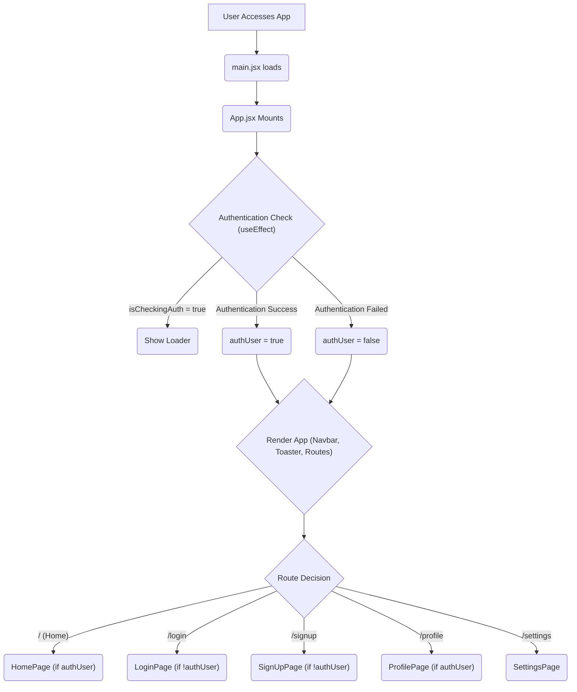

---
title: "Frontend Development and UI"
description: "Explores the client-side architecture, component structure, state management, and user interface design."
sidebar_position: 3
---

# Frontend Development and UI

<TOC />

This section delves into the client-side architecture of the application, focusing on how the user interface is built, how state is managed, and how navigation is handled. The frontend is powered by React, bundled with Vite, and styled using Tailwind CSS, providing a modern and responsive user experience.

## Application Entry Point and Setup

The application's lifecycle begins with `main.jsx`, which serves as the primary entry point for the React application. It initializes the React DOM, wraps the main `App` component within a `BrowserRouter` for client-side routing, and applies global styling.

### `main.jsx` – The Application's Bootstrap

The `main.jsx` file is concise, responsible for rendering the root React component. It ensures that the entire application has access to browser-based routing capabilities provided by `react-router-dom`. The use of `StrictMode` helps in identifying potential problems in the application during development by enabling additional checks and warnings.

```jsx title="frontend/src/main.jsx"
import { StrictMode } from 'react'
import { createRoot } from 'react-dom/client'
import './index.css' // Global styles
import App from './App.jsx' // Main application component
import { BrowserRouter } from 'react-router-dom' // For routing

createRoot(document.getElementById('root')).render(
  <StrictMode>
    <BrowserRouter>
      <App /> {/* The root of our application */}
    </BrowserRouter>
  </StrictMode>,
)
```
This snippet demonstrates the fundamental setup, linking the React application to the DOM and enabling routing.
[View on GitHub](https://github.com/shinymack/Chat-App-MERN/blob/main/frontend/src/main.jsx)

### Vite Configuration

Vite is a next-generation frontend tooling that provides an extremely fast development experience. The `vite.config.js` file configures Vite to use the React plugin, allowing for optimized React development features like Fast Refresh.

```javascript title="frontend/vite.config.js"
import { defineConfig } from 'vite'
import react from '@vitejs/plugin-react'

// https://vitejs.dev/config/
export default defineConfig({
  plugins: [react()], // Enables React-specific features and optimizations
})
```
This minimal configuration highlights Vite's efficiency, requiring only a plugin to support React.
[View on GitHub](https://github.com/shinymack/Chat-App-MERN/blob/main/frontend/vite.config.js)

### Global Styling with Tailwind CSS

The `index.css` file is crucial for setting up the global styles and incorporating Tailwind CSS. It imports Tailwind's base, components, and utilities layers, and also includes a custom font from Google Fonts.

```css title="frontend/src/index.css"
@import url('https://fonts.googleapis.com/css2?family=Chivo:ital,wght@0,100..900;1,100..900&display=swap');
@tailwind base;
@tailwind components;
@tailwind utilities;


@layer base {
    body {
        @apply font-chivo; /* Applies the Chivo font globally */
    }
}
```
This CSS file is the backbone of the application's visual consistency, leveraging Tailwind's utility-first approach.
[View on GitHub](https://github.com/shinymack/Chat-App-MERN/blob/main/frontend/src/index.css)

## Core Application Logic: `App.jsx`

`App.jsx` acts as the central orchestrator for the entire frontend application. It manages global states such as user authentication and theme settings, handles routing to different pages, and sets up essential UI components like the navigation bar and toast notifications.

### Authentication and Theme Management

The `App` component utilizes Zustand for state management, specifically `useAuthStore` to manage user authentication status and `useThemeStore` for the current theme. An `useEffect` hook is used to check the user's authentication status upon component mount, ensuring a consistent user experience.

```jsx title="frontend/src/App.jsx - State Management"
// ... (imports)
import { useThemeStore } from './store/useThemeStore'
import { useAuthStore } from './store/useAuthStore';
// ... (other imports)

const App = () => {
  const { authUser, checkAuth, isCheckingAuth, onlineUsers } = useAuthStore();
  const { theme } = useThemeStore();

  useEffect(() => {
    checkAuth(); // Checks authentication status on app load
  }, [checkAuth]);

  // Conditional rendering for authentication check
  if(isCheckingAuth && !authUser) return (
      <div className='flex items-center justify-center h-screen'>
        <Loader className='size-10 animate-spin' /> {/* Loading spinner */}
      </div>
  )

  return (
    <div className='' data-theme={theme}> {/* Applies the current theme */}
      {/* ... (Navbar, Toaster, Routes) */}
    </div>
  )
}
```
This snippet demonstrates the integration of global state management for authentication and theme, providing a dynamic user experience.
[View on GitHub](https://github.com/shinymack/Chat-App-MERN/blob/main/frontend/src/App.jsx#L18-L38)

### Routing and Protected Routes

`react-router-dom` is employed within `App.jsx` to define the application's navigation paths. The `Routes` component contains `Route` definitions, many of which implement protected routes. This means certain pages (like `HomePage` or `ProfilePage`) are only accessible to authenticated users, while others (like `SignUpPage` or `LoginPage`) redirect authenticated users away.

```jsx title="frontend/src/App.jsx - Routing"
// ... (imports)
import { Routes, Route, Navigate } from 'react-router-dom'
import HomePage from './pages/HomePage'
import SignUpPage from './pages/SignUpPage'
import LoginPage from './pages/LoginPage'
import SettingsPage from './pages/SettingsPage'
import ProfilePage from './pages/ProfilePage'
// ... (other code)

  return (
    <div className='' data-theme={theme}>
      <Navbar /> {/* Global navigation bar */}
      <Toaster /> {/* Global toast notifications */}
      <Routes>
        {/* Protected route: only authenticated users can access HomePage */}
        <Route path='/' element={authUser ? <HomePage />: <Navigate to='/login' />} />
        {/* Redirects authenticated users from signup/login pages */}
        <Route path='/signup' element={ !authUser ? <SignUpPage />: <Navigate to='/' />} />
        <Route path='/login' element={!authUser ? <LoginPage />: <Navigate to='/' />} />
        <Route path='/settings' element={<SettingsPage />} />
        {/* Protected route: only authenticated users can access ProfilePage */}
        <Route path='/profile' element={authUser ? <ProfilePage />: <Navigate to='/login' />} />
      </Routes>
    </div>
  )
}

export default App
```
This routing configuration is central to defining the user flow and access control within the application.
[View on GitHub](https://github.com/shinymack/Chat-App-MERN/blob/main/frontend/src/App.jsx#L41-L55)

### Frontend Application Flow

The diagram below illustrates the high-level flow of the frontend application, from initial load to user interaction and routing.





## State Management with Zustand

Zustand is a small, fast, and scalable bear-necessities state-management solution using simplified flux principles. It's used here for global state management, such as `useAuthStore` and `useThemeStore`, providing a lean and efficient way to share state across components without prop drilling.

### `useAuthStore`

This store manages the current user's authentication status, details, and an array of online users. It includes actions for checking authentication status and potentially for logging in/out.

```jsx title="frontend/src/store/useAuthStore.js"
import { create } from 'zustand';
import toast from 'react-hot-toast';

const useAuthStore = create((set) => ({
    authUser: null,
    onlineUsers: [],
    isCheckingAuth: true, // Indicates if auth check is in progress

    checkAuth: async () => {
        set({ isCheckingAuth: true });
        try {
            const res = await fetch("/api/auth/check", {credentials: "include"});
            const data = await res.json();
            if(!res.ok) {
                throw new Error(data.error);
            }
            set({ authUser: data }); // Set authenticated user
        } catch (error) {
            set({ authUser: null }); // Clear user on error
            console.error(error.message);
        } finally {
            set({ isCheckingAuth: false });
        }
    },
    setAuthUser: (user) => set({ authUser: user }),
    setOnlineUsers: (users) => set({ onlineUsers: users }),
}));

export default useAuthStore;
```
This store centralizes authentication logic and state, making it accessible throughout the application.
[View on GitHub](https://github.com/shinymack/Chat-App-MERN/blob/main/frontend/src/store/useAuthStore.js)

### `useThemeStore`

This store manages the application's visual theme, allowing users to switch between different predefined themes, likely integrated with Tailwind CSS or a similar styling system.

```jsx title="frontend/src/store/useThemeStore.js"
import { create } from 'zustand';

const useThemeStore = create((set) => ({
    theme: localStorage.getItem('theme') || 'dark', // Default theme from localStorage
    setTheme: (theme) => {
        set({ theme });
        localStorage.setItem('theme', theme); // Persist theme selection
    },
}));

export default useThemeStore;
```
This snippet shows how simple Zustand makes managing a global theme preference, including persistence across sessions.
[View on GitHub](https://github.com/shinymack/Chat-App-MERN/blob/main/frontend/src/store/useThemeStore.js)

## Key Integration Points

The frontend architecture emphasizes a clear separation of concerns, with `App.jsx` serving as the integration hub for routing, global state, and core UI components.

-   **Client-Side Routing**: `react-router-dom` effectively manages navigation and protected routes, enhancing the single-page application experience.
-   **Global State Management**: Zustand stores (`useAuthStore`, `useThemeStore`) provide efficient, reactive global state for user authentication, online status, and theme preferences, minimizing prop drilling and centralizing logic.
-   **Styling**: Tailwind CSS, integrated via `index.css`, allows for rapid UI development with utility-first classes, ensuring a consistent and responsive design. The `data-theme` attribute on the root `div` in `App.jsx` dynamically applies theme classes.
-   **Component Structure**: The application follows a hierarchical component structure, with `App.jsx` rendering major page components, which in turn compose smaller, reusable UI components.
-   **API Integration**: Authentication checks and data fetching (e.g., in `useAuthStore`) directly interact with the backend API, abstracting away the network layer from individual UI components.

This structured approach ensures maintainability, scalability, and a robust user experience, while leveraging modern React ecosystem tools for efficient development.

Next: [User Interface Components](./3.1_user-interface-components.mdx)
```