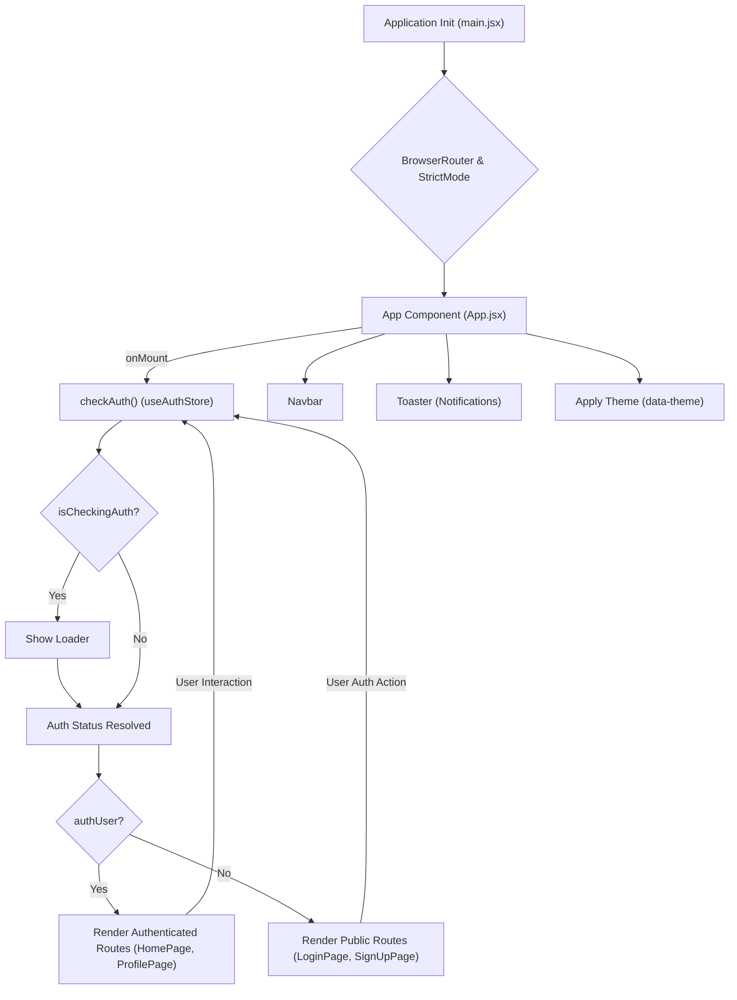
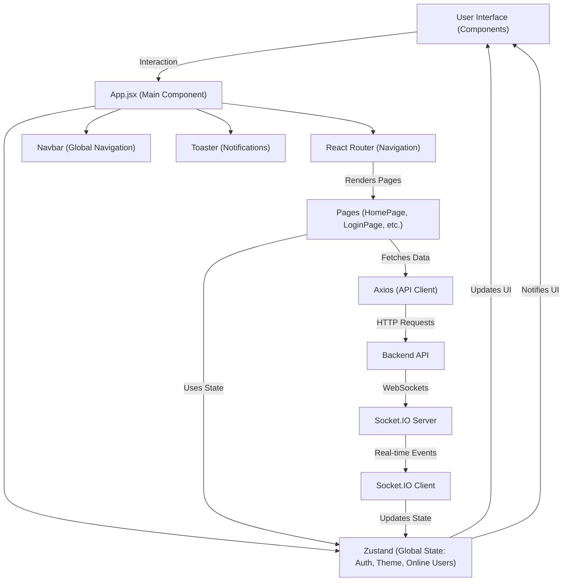

---
title: "Frontend Development"
description: "Overview of the client-side application's structure and development practices."
sidebar_position: 3
---

# Frontend Development

<TOC />

This section provides a detailed overview of the client-side application, built using React and Vite. It covers the core structure, development practices, and key integrations that define the user experience. The frontend is designed for responsiveness, performance, and maintainability, leveraging modern JavaScript features and a robust component-based architecture.

## Core Technologies and Dependencies

The frontend relies on a modern JavaScript ecosystem, primarily centered around **React** for UI development and **Vite** for a fast development experience. The `package.json` file outlines all the dependencies and development tools.

### `package.json` Overview

The `package.json` defines the project's metadata, scripts, and dependencies. It's crucial for managing the development environment and ensuring all necessary libraries are installed.

#### Key Scripts

The `scripts` section provides convenient commands for development, building, and linting.

```json title="frontend/package.json" {7-11}
{
  "name": "frontend",
  "private": true,
  "version": "0.0.0",
  "type": "module",
  "scripts": {
    "dev": "vite",
    "build": "vite build",
    "lint": "eslint .",
    "preview": "vite preview",
    "mobile": "vite --host"
  },
  // ...
}
```

-   `dev`: Starts the Vite development server.
-   `build`: Compiles the application for production.
-   `mobile`: Runs the Vite server exposed to the network, useful for mobile testing.

#### Essential Dependencies

The `dependencies` section lists the libraries required for the application to run in production.

```json title="frontend/package.json" {14-25}
{
  // ...
  "dependencies": {
    "axios": "^1.7.9",
    "cors": "^2.8.5",
    "lucide-react": "^0.471.1",
    "react": "^18.3.1",
    "react-dom": "^18.3.1",
    "react-hot-toast": "^2.5.1",
    "react-icons": "^5.5.0",
    "react-router-dom": "^7.1.1",
    "socket.io-client": "^4.8.1",
    "zustand": "^5.0.3"
  },
  // ...
}
```

-   **`axios`**: Promise-based HTTP client for making API requests.
-   **`lucide-react`**: A library of beautiful and consistent open-source icons.
-   **`react`**, **`react-dom`**: The core React libraries for building user interfaces.
-   **`react-hot-toast`**: A highly customizable and beautiful toast notification library.
-   **`react-router-dom`**: For declarative routing in React applications.
-   **`socket.io-client`**: Client-side library for real-time bidirectional event-based communication.
-   **`zustand`**: A small, fast, and scalable bear-necessities state-management solution.

#### Development Dependencies

`devDependencies` are used during development and build processes but not included in the final production bundle.

```json title="frontend/package.json" {28-40}
{
  // ...
  "devDependencies": {
    "@eslint/js": "^9.17.0",
    "@types/react": "^18.3.18",
    "@types/react-dom": "^18.3.5",
    "@vitejs/plugin-react": "^4.3.4",
    "autoprefixer": "^10.4.20",
    "daisyui": "^4.12.23",
    "eslint": "^9.17.0",
    "eslint-plugin-react": "^7.37.2",
    "eslint-plugin-react-hooks": "^5.0.0",
    "eslint-plugin-react-refresh": "^0.4.16",
    "globals": "^15.14.0",
    "postcss": "^8.5.0",
    "tailwindcss": "^3.4.17",
    "vite": "^6.3.5"
  }
}
```

-   **`@vitejs/plugin-react`**: A plugin that provides React Fast Refresh support for Vite.
-   **`tailwindcss`**, **`autoprefixer`**, **`postcss`**: For utility-first CSS styling and processing.
-   **`daisyui`**: A Tailwind CSS component library.
-   **`eslint`**: For static code analysis and linting.

## Application Entry Point (`main.jsx`)

The `frontend/src/main.jsx` file is the entry point of the React application. It sets up the root component, integrates React Router, and enables React's `StrictMode` for development.

```jsx title="frontend/src/main.jsx"
import { StrictMode } from 'react'
import { createRoot } from 'react-dom/client'
import './index.css'
import App from './App.jsx'
import { BrowserRouter } from 'react-router-dom'

createRoot(document.getElementById('root')).render(
  <StrictMode>
    <BrowserRouter>
      <App />
    </BrowserRouter>
  </StrictMode>,
)
```

-   **`createRoot(document.getElementById('root'))`**: Initializes the React application by mounting the root component into the HTML element with the ID `root`.
-   **`BrowserRouter`**: Wraps the `App` component, enabling client-side routing. This ensures that URL changes are handled by React Router without full page reloads.
-   **`StrictMode`**: A development-only feature that helps identify potential problems in an application by activating additional checks and warnings.

## Main Application Component (`App.jsx`)

The `frontend/src/App.jsx` file serves as the main application component, orchestrating global state, routing, and overall layout. It handles authentication checks, theme management, and renders the appropriate pages based on the current URL.

```jsx title="frontend/src/App.jsx" {7-13,20-22,28-36}
// import React from 'react' // Not needed since React 17 for JSX transformation
import Navbar from './components/Navbar'
import { Routes, Route, Navigate } from 'react-router-dom'
import { useEffect } from 'react'
import HomePage from './pages/HomePage'
import SignUpPage from './pages/SignUpPage'
import LoginPage from './pages/LoginPage'
import SettingsPage from './pages/SettingsPage'
import ProfilePage from './pages/ProfilePage'


import { useThemeStore } from './store/useThemeStore'
import { useAuthStore } from './store/useAuthStore';
import { Loader } from 'lucide-react'
import { Toaster } from 'react-hot-toast'

const App = () => {
  const { authUser, checkAuth, isCheckingAuth, onlineUsers } = useAuthStore();
  const { theme } = useThemeStore();
  useEffect(() => {
    checkAuth();
  }, [checkAuth]);

  console.log("authUser: ", {authUser});

  console.log({onlineUsers})

  if(isCheckingAuth && !authUser) return (
      <div className='flex items-center justify-center h-screen'>
        <Loader className='size-10 animate-spin' />
      </div>
  )

  return (
    <div className='' data-theme={theme}>

      <Navbar />

      <Toaster />
      <Routes>
        <Route path='/' element={authUser ? <HomePage />: <Navigate to='/login' />} />
        <Route path='/signup' element={ !authUser ? <SignUpPage />: <Navigate to='/' />} />
        <Route path='/login' element={!authUser ? <LoginPage />: <Navigate to='/' />} />
        <Route path='/settings' element={<SettingsPage />} />
        <Route path='/profile' element={authUser ? <ProfilePage />: <Navigate to='/login' />} />

      </Routes>

    </div>
  )
}

export default App
```

-   **Global State Management**: `useAuthStore` and `useThemeStore` (powered by Zustand) are used for managing authentication status, online users, and the application's theme across components.
-   **Authentication Check**: An `useEffect` hook calls `checkAuth()` on component mount to verify the user's authentication status. While `isCheckingAuth` is true, a loading spinner is displayed.
-   **Conditional Rendering**: The `Routes` component from `react-router-dom` defines the application's routes. Many routes are conditionally rendered or redirected based on the `authUser` status, ensuring that unauthenticated users are directed to login/signup pages and authenticated users to protected routes.
-   **`Navbar` and `Toaster`**: The `Navbar` component is rendered on all pages for navigation, and `Toaster` from `react-hot-toast` is included for displaying global notifications.
-   **Theme Application**: The `data-theme` attribute on the root `div` dynamically applies the selected theme from `useThemeStore`, which is used by DaisyUI and Tailwind CSS for styling.

### Frontend Application Flow

This diagram illustrates the primary flow of the frontend application, from initial load to authenticated user interaction.





## Vite Configuration (`vite.config.js`)

The `frontend/vite.config.js` file provides the configuration for Vite, the build tool used for the frontend. It's concise, leveraging Vite's sensible defaults.

```javascript title="frontend/vite.config.js"
import { defineConfig } from 'vite'
import react from '@vitejs/plugin-react'

// https://vitejs.dev/config/
export default defineConfig({
  plugins: [react()],
})
```

-   **`defineConfig`**: A helper function from Vite that provides type completion for configuration options.
-   **`plugins: [react()]`**: Includes the `@vitejs/plugin-react` which provides React Fast Refresh, an essential feature for a smooth development experience.

## Key Integration Points

### State Management with Zustand

Zustand is employed for efficient and scalable state management. It's particularly useful for global states like user authentication, online users, and application theme.

```jsx highlight={1-2,4}
// Example: frontend/src/store/useAuthStore.js (Conceptual snippet)
import { create } from 'zustand';

export const useAuthStore = create((set) => ({
  authUser: null,
  isCheckingAuth: true,
  onlineUsers: [],
  checkAuth: async () => { /* ... API call and set authUser ... */ },
  login: async (credentials) => { /* ... API call and set authUser ... */ },
  logout: async () => { /* ... API call and clear authUser ... */ },
  setOnlineUsers: (users) => set({ onlineUsers: users }),
}));
```

-   **Simplicity**: Zustand provides a minimalistic API, making it easy to define and consume stores.
-   **Performance**: It re-renders components only when the slices of state they subscribe to actually change.

### API Communication with Axios

`axios` is used for all HTTP requests to the backend API. It simplifies making AJAX calls and handles request/response interception, error handling, and more.

```javascript highlight={1,4-7}
// Example: frontend/src/utils/axiosInstance.js (Conceptual snippet)
import axios from 'axios';

const axiosInstance = axios.create({
  baseURL: import.meta.env.VITE_API_BASE_URL, // Dynamically load API URL
  withCredentials: true, // Send cookies with requests
});

// axiosInstance.interceptors.request.use(...); // Request interceptor for auth tokens
// axiosInstance.interceptors.response.use(...); // Response interceptor for error handling

export default axiosInstance;
```

-   **Base URL**: Configured to point to the backend API, allowing for easy environment-specific API endpoints.
-   **`withCredentials`**: Ensures that cookies (e.g., session cookies for authentication) are sent with cross-origin requests.

### Real-time Communication with Socket.IO

`socket.io-client` enables real-time features like chat messaging, online user status, and notifications.

```javascript highlight={1,4-6,9-12}
// Example: frontend/src/hooks/useSocket.js (Conceptual snippet)
import { useEffect, useRef } from 'react';
import io from 'socket.io-client';
import { useAuthStore } from '../store/useAuthStore'; // Access auth state

export const useSocket = () => {
  const { authUser, setOnlineUsers } = useAuthStore();
  const socketRef = useRef(null);

  useEffect(() => {
    if (authUser && !socketRef.current) {
      socketRef.current = io(import.meta.env.VITE_API_BASE_URL, {
        query: { userId: authUser._id },
      });

      socketRef.current.on('getOnlineUsers', (users) => {
        setOnlineUsers(users);
      });

      // ... other event listeners
    }

    return () => {
      if (socketRef.current) {
        socketRef.current.disconnect();
        socketRef.current = null;
      }
    };
  }, [authUser, setOnlineUsers]);

  return socketRef.current;
};
```

-   **Conditional Connection**: The Socket.IO client connects only when a user is authenticated, passing the `userId` for identification.
-   **Event Handling**: It listens for events like `getOnlineUsers` to update the global state via `useAuthStore`.
-   **Cleanup**: The socket connection is properly disconnected when the component unmounts or the `authUser` changes, preventing memory leaks.

### Routing with React Router DOM

`react-router-dom` provides declarative routing within the `App.jsx` component, allowing for dynamic navigation and protected routes.

```jsx highlight={1,4-6,8-12}
// Example: frontend/src/App.jsx (Routing snippet)
import { Routes, Route, Navigate } from 'react-router-dom'
// ... page imports

const App = () => {
  const { authUser } = useAuthStore();

  return (
    <Routes>
      <Route path='/' element={authUser ? <HomePage />: <Navigate to='/login' />} />
      <Route path='/signup' element={ !authUser ? <SignUpPage />: <Navigate to='/' />} />
      <Route path='/login' element={!authUser ? <LoginPage />: <Navigate to='/' />} />
      <Route path='/profile' element={authUser ? <ProfilePage />: <Navigate to='/login' />} />
      <Route path='/settings' element={<SettingsPage />} />
    </Routes>
  )
}
```

-   **Protected Routes**: The `element` prop for `Route` uses a ternary operator to check `authUser`. If the user is not authenticated, they are redirected using `Navigate`.
-   **Clean Navigation**: Provides a seamless single-page application experience without full page reloads.

### Frontend Architecture and Interactions





## Next Steps

The frontend structure is designed to be modular and extensible. Individual pages and components are responsible for their specific logic and presentation, while global concerns like authentication, routing, and theme are handled at the `App.jsx` level.

Next, we will delve into the specific user interface components that build the visual elements of the application.

Next: [User Interface Components](./3.1_user-interface-components.mdx)
```