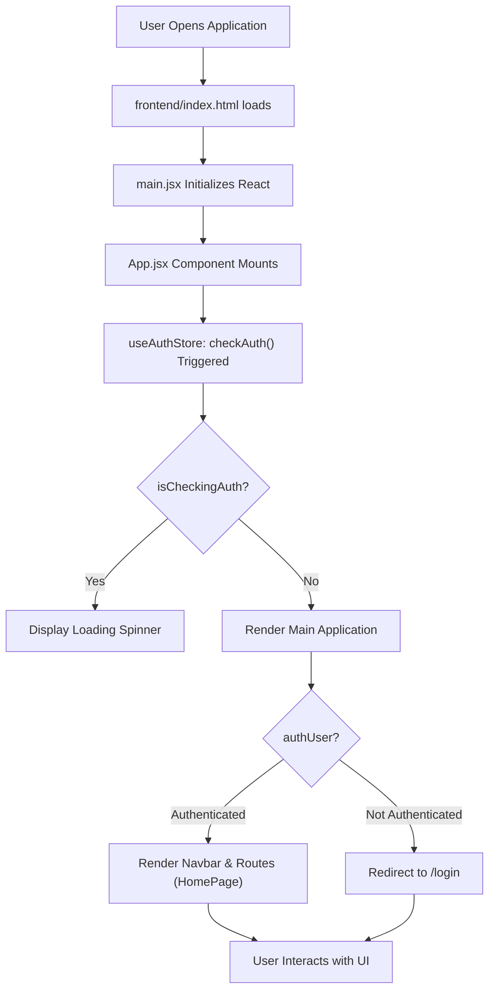
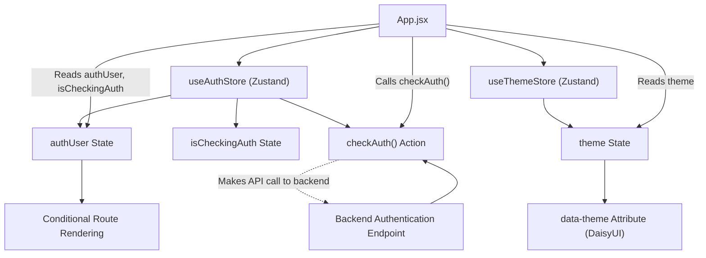

# Frontend Implementation and UI

<TOC />

This section details the frontend architecture of the application, focusing on its structure, key technologies, state management, and routing. The client-side application is built with React, leveraging Vite for a fast development experience, and uses modern tools for state management, routing, and UI styling.

## Core Technologies and Dependencies

The frontend application is a modern React setup, orchestrated by Vite. It utilizes a robust set of libraries for various functionalities, as defined in its `package.json`.

```json title="frontend/package.json (Dependencies)"
{
  "name": "frontend",
  "private": true,
  "version": "0.0.0",
  "type": "module",
  "scripts": {
    "dev": "vite",
    "build": "vite build",
    "lint": "eslint .",
    "preview": "vite preview",
    "mobile": "vite --host"
  },
  "dependencies": {
    "axios": "^1.7.9",
    "cors": "^2.8.5",
    "lucide-react": "^0.471.1",
    "react": "^18.3.1",
    "react-dom": "^18.3.1",
    "react-hot-toast": "^2.5.1",
    "react-icons": "^5.5.0",
    "react-router-dom": "^7.1.1",
    "socket.io-client": "^4.8.1",
    "zustand": "^5.0.3"
  },
  "devDependencies": {
    "@eslint/js": "^9.17.0",
    "@types/react": "^18.3.18",
    "@types/react-dom": "^18.3.5",
    "@vitejs/plugin-react": "^4.3.4",
    "autoprefixer": "^10.4.20",
    "daisyui": "^4.12.23",
    "eslint": "^9.17.0",
    "eslint-plugin-react": "^7.37.2",
    "eslint-plugin-react-hooks": "^5.0.0",
    "eslint-plugin-react-refresh": "^0.4.16",
    "globals": "^15.14.0",
    "postcss": "^8.5.0",
    "tailwindcss": "^3.4.17",
    "vite": "^6.3.5"
  }
}
```

[View `package.json` on GitHub](https://github.com/shinymack/Chat-App-MERN/blob/main/frontend/package.json)

Key dependencies include:

*   **React:** The core UI library.
*   **Vite:** The build tool, providing a fast development server and optimized builds.
*   **`react-router-dom`:** For declarative routing within the single-page application.
*   **`zustand`:** A minimalistic state management solution, used for global state like authentication and theme.
*   **`axios`:** A promise-based HTTP client for making API requests to the backend.
*   **`socket.io-client`:** For real-time, bidirectional communication with the backend.
*   **`daisyui` & `tailwindcss`:** For styling and UI component generation, built on top of Tailwind CSS.
*   **`react-hot-toast`:** For displaying modern, customizable notifications.
*   **`lucide-react` / `react-icons`:** Icon libraries for a rich UI experience.

## Application Entry Point (`index.html` and `main.jsx`)

The frontend application starts with `index.html`, which serves as the main entry point for the browser. It includes basic metadata and a `div` with `id="root"`, where the React application will be mounted.

```html title="frontend/index.html"
<!doctype html>
<html lang="en">
  <head>
    <meta charset="UTF-8" />
    <link rel="icon" type="image/svg+xml+png" href="/icon.png" />
    <meta name="viewport" content="width=device-width, initial-scale=1.0" />
    <title>Chatty</title>
  </head>
  <body>
    <div id="root"></div>
    <script type="module" src="/src/main.jsx"></script>
  </body>
</html>
```

[View `index.html` on GitHub](https://github.com/shinymack/Chat-App-MERN/blob/main/frontend/index.html)

The actual React application is initialized and rendered by `frontend/src/main.jsx`. This file sets up strict mode for development error checking and wraps the main `App` component within `BrowserRouter` from `react-router-dom`, enabling client-side routing.

```jsx title="frontend/src/main.jsx"
import { StrictMode } from 'react'
import { createRoot } from 'react-dom/client'
import './index.css'
import App from './App.jsx'
import { BrowserRouter } from 'react-router-dom'

createRoot(document.getElementById('root')).render(
  <StrictMode>
    <BrowserRouter>
      <App />
    </BrowserRouter>
  </StrictMode>,
)
```

[View `main.jsx` on GitHub](https://github.com/shinymack/Chat-App-MERN/blob/main/frontend/src/main.jsx)

## Main Application Component (`App.jsx`)

The `App.jsx` component is the central hub of the frontend, orchestrating global state management, routing, and conditional rendering based on authentication status and theme.

```jsx title="frontend/src/App.jsx"
// import React from 'react'
import Navbar from './components/Navbar'
import { Routes, Route, Navigate } from 'react-router-dom'
import { useEffect } from 'react'
import HomePage from './pages/HomePage'
import SignUpPage from './pages/SignUpPage' 
import LoginPage from './pages/LoginPage' 
import SettingsPage from './pages/SettingsPage' 
import ProfilePage from './pages/ProfilePage'


import { useThemeStore } from './store/useThemeStore'
import { useAuthStore } from './store/useAuthStore'; 
import { Loader } from 'lucide-react'
import { Toaster } from 'react-hot-toast'

const App = () => {
  const { authUser, checkAuth, isCheckingAuth, onlineUsers } = useAuthStore();
  const { theme } = useThemeStore();
  useEffect(() => {
    checkAuth();
  }, [checkAuth]);

  console.log("authUser: ", {authUser});

  console.log({onlineUsers})

  if(isCheckingAuth && !authUser) return (
      <div className='flex items-center justify-center h-screen'>
        <Loader className='size-10 animate-spin' />
      </div>
  )

  return (
    <div className='' data-theme={theme}>

      <Navbar />

      <Toaster />
      <Routes>
        <Route path='/' element={authUser ? <HomePage />: <Navigate to='/login' />} />
        <Route path='/signup' element={ !authUser ? <SignUpPage />: <Navigate to='/' />} />
        <Route path='/login' element={!authUser ? <LoginPage />: <Navigate to='/' />} />
        <Route path='/settings' element={<SettingsPage />} />
        <Route path='/profile' element={authUser ? <ProfilePage />: <Navigate to='/login' />} />

      </Routes>

    </div> 
  )
}

export default App
```

[View `App.jsx` on GitHub](https://github.com/shinymack/Chat-App-MERN/blob/main/frontend/src/App.jsx)

### Key Features and Flows within `App.jsx`

1.  **Authentication Check:**
    *   The `useEffect` hook triggers `checkAuth()` from `useAuthStore` on component mount. This function verifies the user's authentication status with the backend.
    *   While `isCheckingAuth` is true and `authUser` is not yet determined, a loading spinner is displayed, providing a smooth user experience during initial load.
2.  **Global State Management (Zustand):**
    *   `useAuthStore` manages the `authUser` object (current logged-in user), `isCheckingAuth` status, and `onlineUsers`.
    *   `useThemeStore` manages the `theme` preference, which is applied directly to the root `div` via `data-theme` for DaisyUI theme toggling.
3.  **Client-Side Routing (`react-router-dom`):**
    *   The `Routes` component defines the application's navigatable paths.
    *   **Protected Routes:** `HomePage` and `ProfilePage` are protected, redirecting unauthenticated users to `/login`.
    *   **Authentication Gates:** `SignUpPage` and `LoginPage` redirect authenticated users to `/` (HomePage).
    *   `SettingsPage` is accessible to all, reflecting its nature as a general settings area.
4.  **Global UI Elements:**
    *   `Navbar`: Rendered at the top of the application, likely containing navigation links and user-related information.
    *   `Toaster`: From `react-hot-toast`, positioned globally to display notifications across the application.

## Application Flow Diagram

This diagram illustrates the initial loading and authentication flow within the React frontend, particularly how `App.jsx` orchestrates state and routing.





## State Management Interaction

The frontend extensively uses Zustand for global state management. `useAuthStore` and `useThemeStore` are central to managing user authentication and UI themes, respectively.





## Key Integration Points

*   **Authentication & Authorization:** The `useAuthStore` is a critical integration point, ensuring that user sessions are maintained and verified. This impacts route protection and the overall user experience by displaying relevant content (e.g., chat list for authenticated users) or redirecting to login/signup pages when necessary. The `useEffect` in `App.jsx` for `checkAuth` ensures a seamless initial authentication experience.
*   **Real-time Communication:** Although not explicitly shown in `App.jsx` itself, `socket.io-client` in `package.json` indicates that the frontend will integrate with a Socket.IO server for real-time features like chat messaging or online user status updates, likely managed within specific page components or another Zustand store.
*   **Theming:** The `data-theme` attribute on the root `div` in `App.jsx`, driven by `useThemeStore`, demonstrates a direct and effective integration with `daisyui` for dynamic theme switching. This provides a flexible and accessible UI customization option for users.

Next: [User Interface Components](./3.1_user-interface-components.mdx)