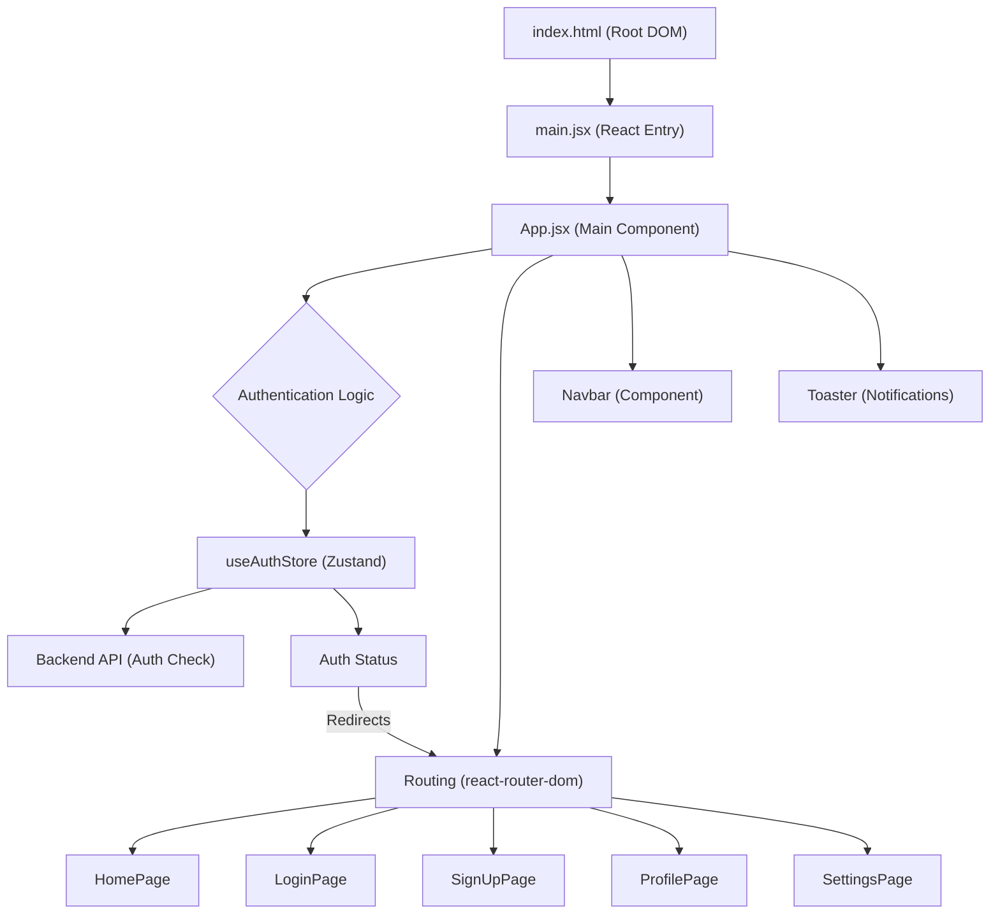
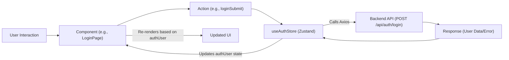

# Frontend Implementation and UI

<TOC />

This section provides a comprehensive overview of the client-side application, detailing its core setup, dependencies, routing, and overall architecture. Built with React and Vite, the frontend application `Chatty` serves as the user interface, interacting with the backend API to provide a seamless chat experience.

## Project Setup and Core Dependencies

The frontend application is bootstrapped with Vite, a fast build tool that offers an excellent developer experience. Its `package.json` defines all necessary scripts and dependencies, while `index.html` serves as the entry point for the single-page application.

### `index.html` - Application Entry Point

The `index.html` file is the foundational document for the application. It's a minimal HTML structure where the React application will be mounted.

```html
<!doctype html>
<html lang="en">
  <head>
    <meta charset="UTF-8" />
    <link rel="icon" type="image/svg+xml+png" href="/icon.png" />
    <meta name="viewport" content="width=device-width, initial-scale=1.0" />
    <title>Chatty</title>
  </head>
  <body>
    <div id="root"></div>
    <script type="module" src="/src/main.jsx"></script>
  </body>
</html>
```
_The `div` with `id="root"` is where the entire React application is injected._

[View on GitHub](https://github.com/shinymack/Chat-App-MERN/blob/main/frontend/index.html)

### `package.json` - Dependencies and Scripts

The `package.json` file lists all the development and production dependencies, along with scripts for running, building, and linting the application.

```json
{
  "name": "frontend",
  "private": true,
  "version": "0.0.0",
  "type": "module",
  "scripts": {
    "dev": "vite",
    "build": "vite build",
    "lint": "eslint .",
    "preview": "vite preview",
    "mobile": "vite --host"
  },
  "dependencies": {
    "axios": "^1.7.9",
    "cors": "^2.8.5",
    "lucide-react": "^0.471.1",
    "react": "^18.3.1",
    "react-dom": "^18.3.1",
    "react-hot-toast": "^2.5.1",
    "react-icons": "^5.5.0",
    "react-router-dom": "^7.1.1",
    "socket.io-client": "^4.8.1",
    "zustand": "^5.0.3"
  },
  "devDependencies": {
    "@eslint/js": "^9.17.0",
    "@types/react": "^18.3.18",
    "@types/react-dom": "^18.3.5",
    "@vitejs/plugin-react": "^4.3.4",
    "autoprefixer": "^10.4.20",
    "daisyui": "^4.12.23",
    "eslint": "^9.17.0",
    "eslint-plugin-react": "^7.37.2",
    "eslint-plugin-react-hooks": "^5.0.0",
    "eslint-plugin-react-refresh": "^0.4.16",
    "globals": "^15.14.0",
    "postcss": "^8.5.0",
    "tailwindcss": "^3.4.17",
    "vite": "^6.3.5"
  }
}
```
_Key dependencies include `react`, `react-dom` for UI, `react-router-dom` for navigation, `axios` for HTTP requests, `socket.io-client` for real-time communication, and `zustand` for state management. `daisyui` and `tailwindcss` are used for styling._

[View on GitHub](https://github.com/shinymack/Chat-App-MERN/blob/main/frontend/package.json)

## Application Entry Point (`main.jsx`)

The `main.jsx` file is the JavaScript entry point that renders the root React component (`App.jsx`) into the `index.html` file. It sets up the React environment with Strict Mode and integrates `react-router-dom` for client-side routing.

```jsx
import { StrictMode } from 'react'
import { createRoot } from 'react-dom/client'
import './index.css'
import App from './App.jsx'
import { BrowserRouter } from 'react-router-dom'

createRoot(document.getElementById('root')).render(
  <StrictMode>
    <BrowserRouter>
      <App />
    </BrowserRouter>
  </StrictMode>,
)
```
_`StrictMode` helps identify potential problems in an application, and `BrowserRouter` enables declarative routing within the React app._

[View on GitHub](https://github.com/shinymack/Chat-App-MERN/blob/main/frontend/src/main.jsx)

## The Root Component (`App.jsx`)

`App.jsx` is the heart of the frontend application. It manages global state, authentication checks, theme settings, and defines the primary routing logic.

```jsx
import Navbar from './components/Navbar'
import { Routes, Route, Navigate } from 'react-router-dom'
import { useEffect } from 'react'
import HomePage from './pages/HomePage'
import SignUpPage from './pages/SignUpPage' 
import LoginPage from './pages/LoginPage' 
import SettingsPage from './pages/SettingsPage' 
import ProfilePage from './pages/ProfilePage'

import { useThemeStore } from './store/useThemeStore'
import { useAuthStore } from './store/useAuthStore'; 
import { Loader } from 'lucide-react'
import { Toaster } from 'react-hot-toast'

const App = () => {
  const { authUser, checkAuth, isCheckingAuth, onlineUsers } = useAuthStore();
  const { theme } = useThemeStore();
  useEffect(() => {
    checkAuth();
  }, [checkAuth]);

  console.log("authUser: ", {authUser});
  console.log({onlineUsers})

  if(isCheckingAuth && !authUser) return (
      <div className='flex items-center justify-center h-screen'>
        <Loader className='size-10 animate-spin' />
      </div>
  )

  return (
    <div className='' data-theme={theme}>
      <Navbar />
      <Toaster />
      <Routes>
        <Route path='/' element={authUser ? <HomePage />: <Navigate to='/login' />} />
        <Route path='/signup' element={ !authUser ? <SignUpPage />: <Navigate to='/' />} />
        <Route path='/login' element={!authUser ? <LoginPage />: <Navigate to='/' />} />
        <Route path='/settings' element={<SettingsPage />} />
        <Route path='/profile' element={authUser ? <ProfilePage />: <Navigate to='/login' />} />
      </Routes>
    </div> 
  )
}

export default App
```
_The `App` component leverages `useAuthStore` and `useThemeStore` (Zustand) for global state. It dynamically renders routes, redirecting users based on their authentication status. A `Navbar` is consistently rendered across all pages, and `Toaster` provides UI feedback._

[View on GitHub](https://github.com/shinymack/Chat-App-MERN/blob/main/frontend/src/App.jsx)

### Authentication Flow in `App.jsx`

The `useEffect` hook in `App.jsx` is crucial for authenticating the user upon application load. It calls `checkAuth()` from `useAuthStore` to verify the user's session with the backend. While `isCheckingAuth` is true, a loading spinner is displayed to provide a good user experience.

```jsx
  const { authUser, checkAuth, isCheckingAuth, onlineUsers } = useAuthStore();
  const { theme } = useThemeStore();
  useEffect(() => {
    checkAuth();
  }, [checkAuth]);

  if(isCheckingAuth && !authUser) return (
      <div className='flex items-center justify-center h-screen'>
        <Loader className='size-10 animate-spin' />
      </div>
  )
```
_This snippet shows the immediate authentication check and the loading state. The `checkAuth` function (not shown here, but part of `useAuthStore`) typically makes an API call to validate the user's token or session._

### Routing Logic

The `Routes` component from `react-router-dom` defines the application's navigation paths. Protected routes (like `/` and `/profile`) are only accessible to authenticated users, while `/signup` and `/login` are only accessible to unauthenticated users.

```jsx
      <Routes>
        <Route path='/' element={authUser ? <HomePage />: <Navigate to='/login' />} />
        <Route path='/signup' element={ !authUser ? <SignUpPage />: <Navigate to='/' />} />
        <Route path='/login' element={!authUser ? <LoginPage />: <Navigate to='/' />} />
        <Route path='/settings' element={<SettingsPage />} />
        <Route path='/profile' element={authUser ? <ProfilePage />: <Navigate to='/login' />} />
      </Routes>
```
_This conditional rendering of routes ensures that users are always directed to the appropriate page based on their login status._

## Key Integration Points

The frontend interacts with several key components and external services to deliver its functionality.

### Frontend Application Structure

The overall structure of the frontend application ensures a modular and maintainable codebase.





_This diagram illustrates how `index.html` bootstraps `main.jsx`, which then renders `App.jsx`. `App.jsx` orchestrates authentication via `useAuthStore` and `useEffect`, handles global routing, and integrates shared components like `Navbar` and `Toaster`. Authentication status directly influences routing._

### State Management with Zustand

Zustand is a lightweight, fast, and scalable state-management solution used for global states like `authUser` and `theme`. These stores are defined in `frontend/src/store/` and are central to the application's reactivity.





_This diagram demonstrates a typical state management flow. User actions trigger updates in a Zustand store, which in turn interacts with the backend API. The response updates the store's state, causing relevant components to re-render, reflecting the changes in the UI._

### React and Vite Integration

The project leverages Vite for its fast development server and optimized build process. This combination, along with React's component-based architecture, provides a highly efficient and scalable frontend. The hot module replacement (HMR) feature of Vite drastically improves developer productivity.

## Next Steps and Best Practices

- **Component Organization**: The `App.jsx` component imports various page components (`HomePage`, `LoginPage`, etc.) and a shared `Navbar`. This modular approach enhances maintainability.
- **Global State Management**: Utilizing Zustand for `authUser` and `theme` provides a centralized and efficient way to manage application-wide states, avoiding prop-drilling.
- **Protected Routes**: Implementing conditional rendering within `<Route />` elements based on `authUser` ensures that sensitive pages are only accessible to authenticated users, enhancing security and user experience.
- **UI Feedback**: Integration of `react-hot-toast` for notifications and a `Loader` for authentication checks provides immediate and clear feedback to the user, improving usability.

Next: [Core Components and Pages](./3.1_core-components-and-pages.mdx)
---