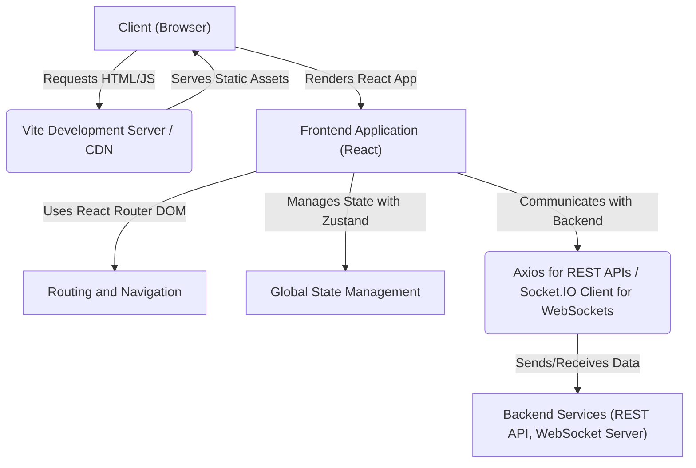
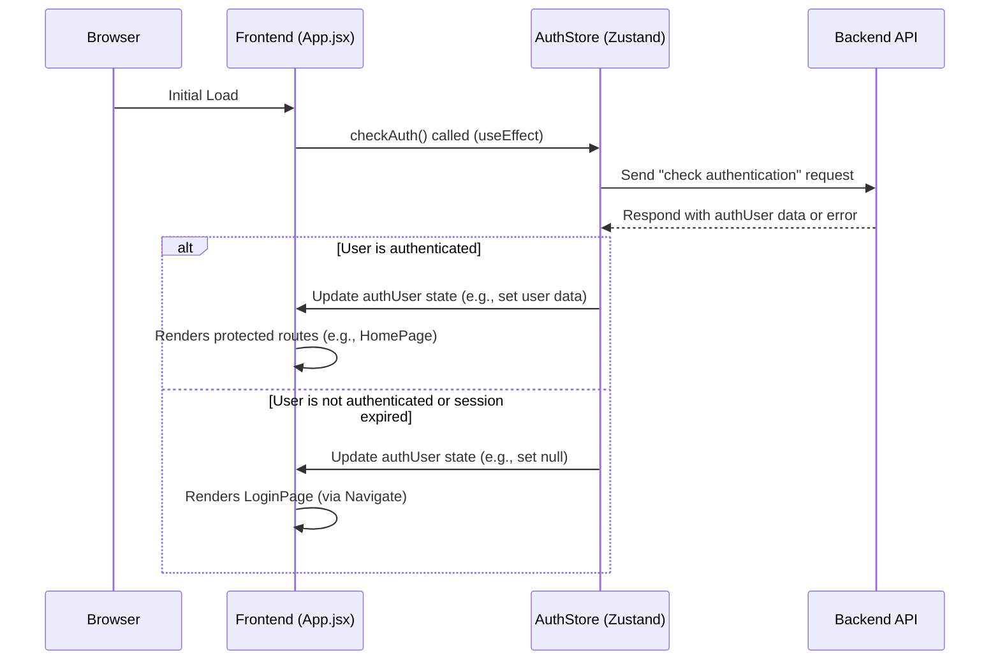

---
title: "Frontend Implementation and UI"
description: "Detailed explanation of the client-side application structure, components, and user interface."
sidebar_position: 3
---

# Frontend Implementation and UI

<TOC />

This document provides a comprehensive overview of the client-side application, detailing its structure, core technologies, component interactions, and overall user interface architecture. The frontend is built as a Single Page Application (SPA) using React, leveraging modern web development tools and practices to deliver a responsive and interactive user experience for the `Chatty` application.

## System Purpose and Core Functionalities

The frontend's primary purpose is to provide an intuitive and dynamic user interface for interacting with the `Chatty` backend services. It manages user authentication, displays real-time chat messages, handles user profiles, and allows for application settings customization.

Key functionalities include:

*   **User Authentication and Authorization**: Secure sign-up, login, and session management, redirecting users based on their authentication status.
*   **Real-time Communication**: Integration with WebSocket clients to facilitate instant message exchange.
*   **Dynamic Routing**: Navigates between different views (Home, Profile, Settings, Auth) without full page reloads.
*   **Global State Management**: Manages application-wide states such as user authentication status, theme preferences, and online users.
*   **Theming**: Allows users to switch between different UI themes to personalize their experience.
*   **Toast Notifications**: Provides ephemeral feedback to users for actions like successful login or error messages.
*   **Component-Based UI**: Structures the user interface into reusable, modular React components.
*   **API Integration**: Communicates with the backend API for data fetching and submission.

## Architecture

The frontend follows a client-side rendering (CSR) architecture, where the browser downloads a minimal HTML file and then JavaScript bundles to render the application dynamically. It operates as a thin client, primarily responsible for presentation and user interaction, while delegating business logic and data persistence to the backend.

The architecture can be visualized as follows:





This diagram illustrates how the client interacts with the server to fetch application assets, renders the React application, manages its internal state, and communicates with the backend services for data operations and real-time updates.

## Technology Stack

The `Chatty` frontend is built upon a robust and modern JavaScript ecosystem.

| Category         | Technology / Library | Purpose                                                                 |
| :--------------- | :------------------- | :---------------------------------------------------------------------- |
| **Core Framework** | React                | Declarative UI library for building user interfaces.                    |
| **Build Tool**   | Vite                 | Fast development server and bundler for modern web projects.            |
| **Routing**      | React Router DOM     | Declarative routing for React applications.                             |
| **State Mgmt.**  | Zustand              | Small, fast, and scalable bear-bones state management solution.         |
| **HTTP Client**  | Axios                | Promise-based HTTP client for making API requests.                      |
| **Real-time**    | Socket.IO Client     | Enables real-time, bidirectional, event-based communication.            |
| **UI Components**| DaisyUI, Tailwind CSS| Component library and utility-first CSS framework for styling.          |
| **Icons**        | Lucide React, React Icons | Extensive icon libraries for consistent UI elements.                    |
| **Notifications**| React Hot Toast      | Lightweight and responsive toast notifications.                         |
| **Linting**      | ESLint               | Identifies and reports on patterns found in JavaScript code.            |

### `package.json` Dependencies and Scripts

The [frontend/package.json](https://github.com/shinymack/Chat-App-MERN/blob/main/frontend/package.json) file defines all project dependencies and useful scripts for development, building, and linting.

```json
{
  "name": "frontend",
  "private": true,
  "version": "0.0.0",
  "type": "module",
  "scripts": {
    "dev": "vite",
    "build": "vite build",
    "lint": "eslint .",
    "preview": "vite preview",
    "mobile": "vite --host"
  },
  "dependencies": {
    "axios": "^1.7.9",
    "cors": "^2.8.5",
    "lucide-react": "^0.471.1",
    "react": "^18.3.1",
    "react-dom": "^18.3.1",
    "react-hot-toast": "^2.5.1",
    "react-icons": "^5.5.0",
    "react-router-dom": "^7.1.1",
    "socket.io-client": "^4.8.1",
    "zustand": "^5.0.3"
  },
  "devDependencies": {
    "@eslint/js": "^9.17.0",
    "@types/react": "^18.3.18",
    "@types/react-dom": "^18.3.5",
    "@vitejs/plugin-react": "^4.3.4",
    "autoprefixer": "^10.4.20",
    "daisyui": "^4.12.23",
    "eslint": "^9.17.0",
    "eslint-plugin-react": "^7.37.2",
    "eslint-plugin-react-hooks": "^5.0.0",
    "eslint-plugin-react-refresh": "^0.4.16",
    "globals": "^15.14.0",
    "postcss": "^8.5.0",
    "tailwindcss": "^3.4.17",
    "vite": "^6.3.5"
  }
}
```
[View on GitHub](https://github.com/shinymack/Chat-App-MERN/blob/main/frontend/package.json)

The `scripts` section defines various commands for project lifecycle management. `npm run dev` starts the Vite development server, `npm run build` compiles the project for production, and `npm run mobile` allows testing on other devices on the same network. The `dependencies` list highlights critical libraries for data fetching (`axios`), UI (`react`, `react-dom`, `daisyui`, `tailwindcss`), routing (`react-router-dom`), state management (`zustand`), and real-time capabilities (`socket.io-client`). `devDependencies` include build tools like `vite` and linters like `eslint`.

## Project Structure and Entry Points

The frontend application structure is designed for modularity and maintainability.

### `index.html` - The Root Document

The [frontend/index.html](https://github.com/shinymack/Chat-App-MERN/blob/main/frontend/index.html) serves as the single entry point for the SPA. It is a minimal HTML file that includes a `<div id="root">` element where the React application will be mounted and a `<script type="module" src="/src/main.jsx"></script>` tag to load the main JavaScript bundle.

```html
<!doctype html>
<html lang="en">
  <head>
    <meta charset="UTF-8" />
    <link rel="icon" type="image/svg+xml+png" href="/icon.png" />
    <meta name="viewport" content="width=device-width, initial-scale=1.0" />
    <title>Chatty</title>
  </head>
  <body>
    <div id="root"></div>
    <script type="module" src="/src/main.jsx"></script>
  </body>
</html>
```
[View on GitHub](https://github.com/shinymack/Chat-App-MERN/blob/main/frontend/index.html)

This simple HTML structure underscores the nature of a client-side rendered application, where content is injected dynamically by JavaScript. The `title` tag ensures the browser tab displays "Chatty", and the `link rel="icon"` sets the favicon.

### `main.jsx` - React Application Bootstrap

The [frontend/src/main.jsx](https://github.com/shinymack/Chat-App-MERN/blob/main/frontend/src/main.jsx) file is the initial JavaScript entry point. It sets up the React application by rendering the root `App` component into the `div` element defined in `index.html`. It also wraps the `App` component with `BrowserRouter` for client-side routing and `StrictMode` for development-time checks.

```jsx
import { StrictMode } from 'react'
import { createRoot } from 'react-dom/client'
import './index.css' // Global CSS imports
import App from './App.jsx'
import { BrowserRouter } from 'react-router-dom'

createRoot(document.getElementById('root')).render(
  <StrictMode>
    <BrowserRouter>
      <App />
    </BrowserRouter>
  </StrictMode>,
)
```
[View on GitHub](https://github.com/shinymack/Chat-App-MERN/blob/main/frontend/src/main.jsx#L1-L10)

`createRoot` from `react-dom/client` is used for concurrent React features. The `BrowserRouter` from `react-router-dom` enables declarative routing, ensuring the application can handle different URL paths.

## `App.jsx` - The Root Component and Router Configuration

The [frontend/src/App.jsx](https://github.com/shinymack/Chat-App-MERN/blob/main/frontend/src/App.jsx) component acts as the root of the React application's component tree. It orchestrates global elements like the `Navbar`, sets up routing, handles authentication checks, and applies global theming.

```jsx
// frontend/src/App.jsx
import Navbar from './components/Navbar'
import { Routes, Route, Navigate } from 'react-router-dom'
import { useEffect } from 'react'
import HomePage from './pages/HomePage'
import SignUpPage from './pages/SignUpPage' 
import LoginPage from './pages/LoginPage' 
import SettingsPage from './pages/SettingsPage' 
import ProfilePage from './pages/ProfilePage'

import { useThemeStore } from './store/useThemeStore'
import { useAuthStore } from './store/useAuthStore'; 
import { Loader } from 'lucide-react'
import { Toaster } from 'react-hot-toast'

const App = () => {
  const { authUser, checkAuth, isCheckingAuth, onlineUsers } = useAuthStore();
  const { theme } = useThemeStore();

  useEffect(() => {
    checkAuth(); // Check authentication status on component mount
  }, [checkAuth]);

  if(isCheckingAuth && !authUser) return (
      <div className='flex items-center justify-center h-screen'>
        <Loader className='size-10 animate-spin' />
      </div>
  )

  return (
    <div className='' data-theme={theme}>
      <Navbar />
      <Toaster /> {/* Global toast notification system */}
      <Routes>
        <Route path='/' element={authUser ? <HomePage />: <Navigate to='/login' />} />
        <Route path='/signup' element={ !authUser ? <SignUpPage />: <Navigate to='/' />} />
        <Route path='/login' element={!authUser ? <LoginPage />: <Navigate to='/' />} />
        <Route path='/settings' element={<SettingsPage />} />
        <Route path='/profile' element={authUser ? <ProfilePage />: <Navigate to='/login' />} />
      </Routes>
    </div> 
  )
}

export default App
```
[View on GitHub](https://github.com/shinymack/Chat-App-MERN/blob/main/frontend/src/App.jsx#L1-L47)

### Key Features and Insights in `App.jsx`:

*   **Global State Management with Zustand**: The `useAuthStore` and `useThemeStore` hooks, powered by Zustand, are used to manage global authentication state and UI theme respectively. This allows consistent access to `authUser` and `theme` across the application without prop drilling.
*   **Authentication Check on Load**: The `useEffect` hook calls `checkAuth()` from `useAuthStore` when the component mounts. This function is responsible for validating the user's session with the backend, ensuring that authentication status is determined before rendering core application content. This is crucial for security and user experience.
*   **Loading State**: During the `isCheckingAuth` phase (when `authUser` is not yet determined), a `Loader` component is displayed, providing a smooth loading experience and preventing UI flickering. This ensures that users don't see unauthenticated content briefly before being redirected.
*   **Conditional Routing**: `react-router-dom`'s `Routes` and `Route` components are used to define the application's navigation paths. The `Navigate` component is dynamically used to redirect users based on their authentication status (`authUser`).
    *   Authenticated users are redirected from `/login` or `/signup` to `/`.
    *   Unauthenticated users attempting to access protected routes like `/` (Home) or `/profile` are redirected to `/login`.
    *   Routes like `/settings` are accessible to all, implying some settings might not require authentication or are public.
*   **Global Components**: The `Navbar` and `Toaster` components are rendered outside the `Routes`. This ensures they are persistent across all pages, providing a consistent navigation experience and global notification system.
*   **Theming**: The `data-theme={theme}` attribute on the root `div` is a powerful pattern, likely used by a CSS framework like DaisyUI (which integrates with Tailwind CSS) to dynamically apply themes based on the `theme` state from `useThemeStore`. This allows for easy theme switching across the entire application.

### Authentication Flow Diagram

The `App.jsx` component plays a central role in managing the initial authentication flow, which can be visualized as a sequence:





This sequence diagram clarifies the interactions between the browser, the `App.jsx` component, the authentication store, and the backend API during the initial load and authentication check.

## Key Integration Points

### State Management (Zustand)

Zustand is critical for managing global application state, primarily authentication (`useAuthStore`) and UI themes (`useThemeStore`). It provides a simple, yet powerful API for creating stores that can be consumed by any component. This avoids prop drilling and ensures consistent state across the application. The `App.jsx` component directly leverages these stores to control routing and global UI elements.

### API Interaction

While `App.jsx` itself doesn't directly make API calls (apart from delegating `checkAuth` to the store), it's the gateway for all other pages and components that interact with the backend. `axios` is the chosen HTTP client for RESTful API communication, handling user data, messages, and settings. `socket.io-client` facilitates real-time features, allowing the chat application to function effectively.

### Authentication and Authorization

Authentication is deeply integrated into `App.jsx`'s routing logic. The `authUser` state determines which routes a user can access. This ensures that sensitive information or functionalities are only available to authenticated users, and conversely, prevents authenticated users from accessing login/signup pages. The `checkAuth` mechanism is a best practice for maintaining user sessions securely.

### Theming with DaisyUI and Tailwind CSS

The `data-theme={theme}` attribute demonstrates a declarative approach to theming. By setting this attribute on the root `div`, DaisyUI and Tailwind CSS automatically apply the corresponding theme styles throughout the application. This makes theme switching straightforward and highly maintainable, enhancing user customization options.

Next: [Core UI Components and Pages](./3.1_core-ui-components-and-pages.mdx)
```