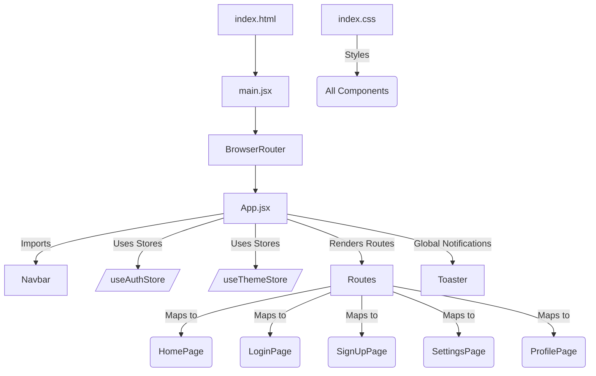

# Frontend Implementation and UI
<TOC />

This section details the client-side architecture and core components of the application, focusing on how React facilitates a dynamic user interface, robust state management, and efficient routing. We'll explore the application's entry point, global styling, main application component, and build configuration, providing a foundational understanding for further development.

## Application Entry Point and Global Configuration

The frontend application is a Single Page Application (SPA) built with React and Vite. The `main.jsx` file serves as the primary entry point, responsible for rendering the root React component into the DOM. It establishes the foundational setup, including strict mode and client-side routing.

### Root Rendering and Strict Mode

The `createRoot` API from `react-dom/client` is used for concurrent React rendering, enhancing performance and user experience. The application is wrapped in `<StrictMode>`, which activates additional checks and warnings for its descendants during development, helping identify potential issues and enforce best practices. The `<BrowserRouter>` component from `react-router-dom` is crucial for enabling declarative client-side routing throughout the application.

```jsx title="frontend/src/main.jsx"
import { StrictMode } from 'react'
import { createRoot } from 'react-dom/client'
import './index.css'
import App from './App.jsx'
import { BrowserRouter } from 'react-router-dom'

createRoot(document.getElementById('root')).render(
  <StrictMode>
    <BrowserRouter>
      <App />
    </BrowserRouter>
  </StrictMode>,
)
```
[[View on GitHub](https://github.com/shinymack/Chat-App-MERN/blob/main/frontend/src/main.jsx)]

### Global Styling and Typography

The `index.css` file defines global styles and imports necessary assets. It leverages [Tailwind CSS](https://tailwindcss.com/) for utility-first styling, enabling rapid UI development. Additionally, it imports a custom font, 'Chivo', ensuring a consistent and professional typographic theme across the application. The `@apply` directive within a `@layer base` block integrates the custom font into the base `body` styles, making it the default font for the entire application.

```css title="frontend/src/index.css"
@import url('https://fonts.googleapis.com/css2?family=Chivo:ital,wght@0,100..900;1,100..900&display=swap');
@tailwind base;
@tailwind components;
@tailwind utilities;


@layer base {
    body {
        @apply font-chivo;
    }
}
```
[[View on GitHub](https://github.com/shinymack/Chat-App-MERN/blob/main/frontend/src/index.css)]

### Frontend Build Configuration

`vite.config.js` is the configuration file for Vite, the build tool used for the frontend. Vite offers a fast development server and an optimized build process. The configuration specifies the `react()` plugin, which provides React Fast Refresh and optimizes React applications for production builds.

```js title="frontend/vite.config.js"
import { defineConfig } from 'vite'
import react from '@vitejs/plugin-react'

// https://vitejs.dev/config/
export default defineConfig({
  plugins: [react()],
})
```
[[View on GitHub](https://github.com/shinymack/Chat-App-MERN/blob/main/frontend/vite.config.js)]

This minimal configuration ensures that Vite correctly processes React components and their dependencies, providing a smooth development experience and an efficient production build.

## Core Application Component (`App.jsx`)

The `App.jsx` component is the central orchestrator of the frontend. It manages application-wide concerns such as routing, authentication state, theme management, and global notifications.

### Routing and Authentication Flow

The application uses `react-router-dom` for declarative routing. Routes are defined within a `<Routes>` component, mapping specific URL paths to corresponding React pages. A critical aspect of the application is its authentication logic, which dynamically renders routes based on the user's authentication status.

```jsx title="frontend/src/App.jsx"
import Navbar from './components/Navbar'
import { Routes, Route, Navigate } from 'react-router-dom'
import { useEffect } from 'react'
import HomePage from './pages/HomePage'
import SignUpPage from './pages/SignUpPage'
import LoginPage from './pages/LoginPage'
import SettingsPage from './pages/SettingsPage'
import ProfilePage from './pages/ProfilePage'

import { useThemeStore } from './store/useThemeStore'
import { useAuthStore } from './store/useAuthStore';
import { Loader } from 'lucide-react'
import { Toaster } from 'react-hot-toast'

const App = () => {
  const { authUser, checkAuth, isCheckingAuth, onlineUsers } = useAuthStore();
  const { theme } = useThemeStore();
  useEffect(() => {
    checkAuth();
  }, [checkAuth]);

  // ... (console logs)

  if(isCheckingAuth && !authUser) return (
      <div className='flex items-center justify-center h-screen'>
        <Loader className='size-10 animate-spin' />
      </div>
  )

  return (
    <div className='' data-theme={theme}>

      <Navbar />

      <Toaster />
      <Routes>
        <Route path='/' element={authUser ? <HomePage />: <Navigate to='/login' />} />
        <Route path='/signup' element={ !authUser ? <SignUpPage />: <Navigate to='/' />} />
        <Route path='/login' element={!authUser ? <LoginPage />: <Navigate to='/' />} />
        <Route path='/settings' element={<SettingsPage />} />
        <Route path='/profile' element={authUser ? <ProfilePage />: <Navigate to='/login' />} />

      </Routes>

    </div>
  )
}

export default App
```
[[View on GitHub](https://github.com/shinymack/Chat-App-MERN/blob/main/frontend/src/App.jsx#L1-L47)]

Upon component mount, a `useEffect` hook triggers `checkAuth()` from `useAuthStore` to verify the user's authentication status. This ensures that the application always knows whether a user is logged in. During this check, if `isCheckingAuth` is true and `authUser` is not yet available, a loading spinner (using `lucide-react`'s `Loader` component) is displayed to provide visual feedback to the user.

```jsx title="frontend/src/App.jsx"
  const { authUser, checkAuth, isCheckingAuth, onlineUsers } = useAuthStore();
  const { theme } = useThemeStore();
  useEffect(() => {
    checkAuth();
  }, [checkAuth]);

  // ... (console logs)

  if(isCheckingAuth && !authUser) return (
      <div className='flex items-center justify-center h-screen'>
        <Loader className='size-10 animate-spin' />
      </div>
  )
```
[[View on GitHub](https://github.com/shinymack/Chat-App-MERN/blob/main/frontend/src/App.jsx#L18-L29)]

The routing logic dynamically renders pages:
*   **Protected Routes**: Paths like `/` (homepage) and `/profile` are accessible only if `authUser` exists, redirecting to `/login` otherwise.
*   **Public Routes**: Paths like `/signup` and `/login` are accessible only if `authUser` does *not* exist, redirecting to `/` if the user is already authenticated.
*   **Always Accessible**: The `/settings` page appears to be always accessible, irrespective of authentication status.

This design ensures that users are directed to appropriate pages based on their login state, enhancing security and user experience.

#### Authentication Flow Diagram

The following Mermaid diagram illustrates the authentication check and routing logic within `App.jsx`:


```mermaid
flowchart LR
    A[App.jsx Mounts] --> B{Call checkAuth()}
    B --> C{isCheckingAuth? (Loading State)}
    C -- Yes --> D[Display Loader]
    C -- No --> E{authUser Exists?}
    E -- Yes --> F[Render Navbar, Toaster]
    F --> G[Access Protected Routes (e.g., / HomePage, /profile)]
    E -- No --> H[Render Navbar, Toaster]
    H --> I[Access Public Routes (e.g., /login, /signup)]
    G --& redirectIfUnauthenticated[Navigate to /login if not auth]
    I --& redirectIfAuthenticated[Navigate to / if auth]
```


### State Management and Theming

The application utilizes global state management solutions, likely built with a library like Zustand or Jotai (based on `useAuthStore` and `useThemeStore` hooks).
*   `useAuthStore()` provides the current `authUser` details, `isCheckingAuth` status, `onlineUsers`, and the `checkAuth` function. This centralized store is crucial for managing user sessions and authentication logic across the application.
*   `useThemeStore()` provides the current `theme`. The `data-theme={theme}` attribute on the root `div` is a common pattern for applying theme-specific styles, often used with CSS frameworks like DaisyUI or custom CSS variables, allowing for dynamic theme switching.

### Global Notifications

The `<Toaster />` component from `react-hot-toast` is included globally. This enables easy, consistent, and declarative toast notifications throughout the application, providing users with feedback on operations (e.g., success messages, error alerts).

## Technology Stack

The frontend is built upon a modern React ecosystem, combining robust libraries for efficient development.

| Layer           | Technology        | Purpose                                            |
| :-------------- | :---------------- | :------------------------------------------------- |
| **Framework**   | React             | UI library for building interactive user interfaces |
| **Build Tool**  | Vite              | Fast development server and optimized bundler      |
| **Routing**     | React Router DOM  | Declarative client-side routing                    |
| **State Mgmt.** | Custom Stores (e.g., Zustand/Jotai-like) | Centralized state for authentication and theming   |
| **Styling**     | Tailwind CSS      | Utility-first CSS framework for rapid UI styling   |
| **Icons**       | Lucide React      | Customizable open-source icon library              |
| **Notifications** | React Hot Toast | Lightweight and customizable toast notifications   |
| **Fonts**       | Google Fonts      | Custom typography (`Chivo`)                        |

## Frontend Component Architecture

The overall architecture of the frontend application is modular, separating concerns into logical components and pages.





This diagram illustrates how `main.jsx` initializes the React application, which then uses `BrowserRouter` to enable routing within `App.jsx`. `App.jsx` acts as the root layout, incorporating the `Navbar`, managing global state (`useAuthStore`, `useThemeStore`), and dynamically rendering page components (`HomePage`, `LoginPage`, etc.) based on the defined routes and user authentication status. Global styles from `index.css` are applied across all components.

## Key Integration Points

The `App.jsx` component serves as a critical integration point, bringing together several core functionalities:

1.  **Authentication and Routing**: The most significant integration is between `useAuthStore` and `react-router-dom`. The `useEffect` hook ensures authentication status is checked on load, and the conditional rendering of `<Route>` elements (using `authUser ? <Page /> : <Navigate />`) creates protected routes. This pattern is robust for SPAs, ensuring that unauthorized users cannot access sensitive parts of the application and are instead redirected to login/signup pages. Best practice suggests that API calls to protected endpoints should also be secured server-side, even if the frontend attempts to protect routes.

2.  **State Management**: `useAuthStore` and `useThemeStore` provide a centralized, reactive way to manage global application state. Changes to `authUser` or `theme` automatically trigger re-renders in `App.jsx` and any other components consuming these stores, ensuring the UI is always synchronized with the latest state. This approach promotes maintainability and scalability by abstracting state logic from UI components.

3.  **Theming**: The dynamic `data-theme={theme}` attribute allows for easy integration with CSS frameworks or custom CSS variables that utilize this attribute for theme switching. This provides a flexible and maintainable way to support multiple themes or dark/light modes.

4.  **User Experience (UX)**: The inclusion of a loading spinner during authentication checks (`isCheckingAuth`) is a crucial UX detail. It prevents a "blank page" scenario and informs the user that an operation is in progress, reducing perceived latency. Similarly, `react-hot-toast` provides immediate and non-intrusive feedback for user actions, improving usability.

The architecture observed in `App.jsx` exemplifies a well-structured React application, separating concerns (routing, state, UI components) and integrating them cohesively to deliver a dynamic and secure user experience.

Next: [User Interface Components](./3.1_user-interface-components.mdx)