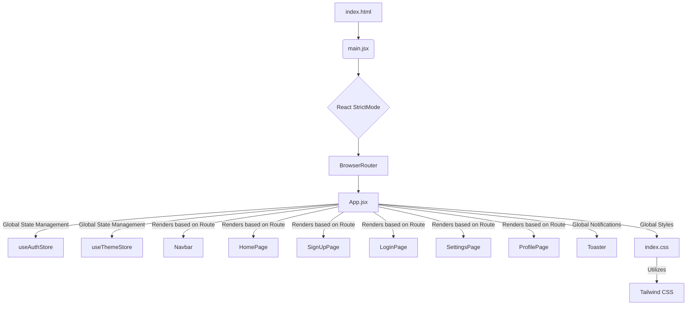
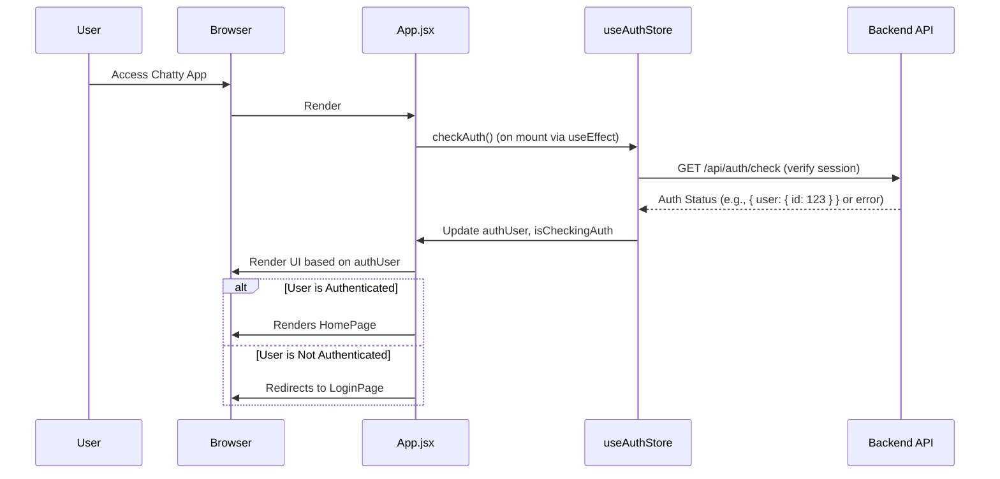

# Frontend Implementation and UI
<TOC />

This section provides a deep dive into the client-side architecture of the Chatty application. It covers the core structure, routing mechanisms, state management, and the overall user interface setup, offering insights into how the application delivers a responsive and interactive user experience.

## System Purpose

The frontend serves as the primary interface for users to interact with the Chatty application. It is designed to be a single-page application (SPA), providing a fluid user experience without full page reloads.

Key functionalities provided by the frontend include:

*   **User Authentication & Authorization**: Handling user sign-up, login, and ensuring authenticated access to protected routes.
*   **Real-time Communication**: Displaying chat interfaces and potentially managing real-time message exchange (though actual message handling might be within specific components not detailed in these files).
*   **User Profile & Settings Management**: Allowing users to view and modify their profile information and application settings.
*   **Responsive UI**: Adapting the layout and components for various screen sizes, ensuring accessibility across devices.
*   **Theming**: Enabling users to switch between different visual themes for personalization.

## Architecture

The frontend follows a component-based architecture, characteristic of modern React applications. The application's entry point is `main.jsx`, which renders the root `App` component within a `BrowserRouter` for client-side routing. Global styles are applied through `index.css`, leveraging Tailwind CSS for utility-first styling.

The core `App.jsx` component manages global state, authentication checks, and defines the primary routing structure. Navigation is handled by `react-router-dom`, redirecting users based on their authentication status. State management for authentication and theming is centralized using custom Zustand stores (`useAuthStore` and `useThemeStore`), promoting a clear separation of concerns and predictable state updates.





## Technology Stack

The Chatty frontend is built upon a modern and efficient technology stack, designed for performance, scalability, and maintainability.

| Layer/Category       | Technology      | Purpose                                                                                                 |
| :------------------- | :-------------- | :------------------------------------------------------------------------------------------------------ |
| **Core Framework**   | React           | Declarative, component-based UI library for building interactive user interfaces.                       |
| **Build Tool**       | Vite            | Fast development server and bundler, offering hot module replacement (HMR) and optimized builds.       |
| **Routing**          | React Router    | Declarative routing for React applications, managing navigation and URL synchronization.                |
| **State Management** | Zustand         | A small, fast, and scalable state-management solution for React, providing flexible global state.       |
| **Styling**          | Tailwind CSS    | Utility-first CSS framework for rapidly building custom designs without leaving your HTML.              |
| **Notifications**    | React Hot Toast | Lightweight and customizable toast notifications for user feedback.                                     |
| **Icons**            | Lucide React    | A beautiful open-source icon library, providing simple and consistent iconography.                      |
| **Fonts**            | Google Fonts    | Provides the "Chivo" font for a consistent and aesthetically pleasing typography throughout the application. |

## Core Frontend Functionality

### Application Entry Point

The `frontend/index.html` file serves as the single entry point for the entire application. It defines the basic HTML structure, metadata, and the root `div` where the React application will be mounted.

```html
<!doctype html>
<html lang="en">
  <head>
    <meta charset="UTF-8" />
    <link rel="icon" type="image/svg+xml+png" href="/icon.png" />
    <meta name="viewport" content="width=device-width, initial-scale=1.0" />
    <title>Chatty</title>
  </head>
  <body>
    <div id="root"></div>
    <script type="module" src="/src/main.jsx"></script>
  </body>
</html>
```
[View on GitHub](https://github.com/shinymack/Chat-App-MERN/blob/main/frontend/index.html)

This simple `index.html` demonstrates a common pattern in SPAs: a minimal HTML file that loads a JavaScript bundle (`/src/main.jsx`), which then takes control of the entire `div id="root"` element to render the React application. The favicon and meta viewport tags are configured for basic branding and responsive design.

### React Application Initialization

The `frontend/src/main.jsx` file is responsible for rendering the root React component (`App.jsx`) into the DOM. It wraps the application with `StrictMode` for development-time checks and `BrowserRouter` for client-side routing.

```jsx
import { StrictMode } from 'react'
import { createRoot } from 'react-dom/client'
import './index.css'
import App from './App.jsx'
import { BrowserRouter } from 'react-router-dom'

createRoot(document.getElementById('root')).render(
  <StrictMode>
    <BrowserRouter>
      <App />
    </BrowserRouter>
  </StrictMode>,
)
```
[View on GitHub](https://github.com/shinymack/Chat-App-MERN/blob/main/frontend/src/main.jsx)

The `createRoot` API from `react-dom/client` is used for modern React 18+ concurrent rendering. Wrapping `App` with `BrowserRouter` enables the use of `react-router-dom` hooks and components throughout the application, allowing for declarative navigation.

### Global Styling

The `frontend/src/index.css` file imports necessary stylesheets, including Google Fonts and Tailwind CSS. It also defines global base styles.

```css
@import url('https://fonts.googleapis.com/css2?family=Chivo:ital,wght@0,100..900;1,100..900&display=swap');
@tailwind base;
@tailwind components;
@tailwind utilities;


@layer base {
    body {
        @apply font-chivo;
    }
}
```
[View on GitHub](https://github.com/shinymack/Chat-App-MERN/blob/main/frontend/src/index.css)

This setup leverages Tailwind CSS for utility-first styling, making it easier to build responsive and customized UIs directly within component JSX. The `@layer base` directive is used to inject custom CSS into Tailwind's base layer, ensuring that the `font-chivo` applies globally to the `body` element. Importing Google Fonts ensures a consistent and branded typographic experience.

### Main Application Component and Routing

The `frontend/src/App.jsx` component is the central hub of the application. It handles global state management for authentication and theming, performs initial authentication checks, and sets up the primary routing logic.

```jsx
import Navbar from './components/Navbar'
import { Routes, Route, Navigate } from 'react-router-dom'
import { useEffect } from 'react'
import HomePage from './pages/HomePage'
import SignUpPage from './pages/SignUpPage'
import LoginPage from './pages/LoginPage'
import SettingsPage from './pages/SettingsPage'
import ProfilePage from './pages/ProfilePage'

import { useThemeStore } from './store/useThemeStore'
import { useAuthStore } from './store/useAuthStore';
import { Loader } from 'lucide-react'
import { Toaster } from 'react-hot-toast'

const App = () => {
  const { authUser, checkAuth, isCheckingAuth, onlineUsers } = useAuthStore();
  const { theme } = useThemeStore();

  useEffect(() => {
    checkAuth();
  }, [checkAuth]);

  if(isCheckingAuth && !authUser) return (
      <div className='flex items-center justify-center h-screen'>
        <Loader className='size-10 animate-spin' />
      </div>
  )

  return (
    <div className='' data-theme={theme}>
      <Navbar />
      <Toaster />
      <Routes>
        <Route path='/' element={authUser ? <HomePage />: <Navigate to='/login' />} />
        <Route path='/signup' element={ !authUser ? <SignUpPage />: <Navigate to='/' />} />
        <Route path='/login' element={!authUser ? <LoginPage />: <Navigate to='/' />} />
        <Route path='/settings' element={<SettingsPage />} />
        <Route path='/profile' element={authUser ? <ProfilePage />: <Navigate to='/login' />} />
      </Routes>
    </div>
  )
}

export default App
```
[View on GitHub](https://github.com/shinymack/Chat-App-MERN/blob/main/frontend/src/App.jsx#L1-L47)

This component demonstrates several key patterns:

*   **Global State Consumption**: `useAuthStore` and `useThemeStore` are consumed to retrieve the current authentication status (`authUser`, `isCheckingAuth`) and the active theme. This ensures that the application's UI reacts dynamically to these global states.
*   **Authentication Check on Load**: The `useEffect` hook calls `checkAuth()` on component mount, which is crucial for verifying the user's session status immediately when the application loads. A loading spinner (`Loader`) is displayed during this check, providing a better user experience.
*   **Conditional Routing**: `react-router-dom`'s `Routes` and `Route` components define the application's navigation paths. Crucially, routes like `/` (home) and `/profile` are protected, redirecting unauthenticated users to `/login` using `Navigate`. Conversely, `/signup` and `/login` are restricted to unauthenticated users, redirecting logged-in users to `/`. This ensures that users always land on the appropriate page based on their authentication status.
*   **Theming Integration**: The `data-theme={theme}` attribute on the root `div` allows for dynamic theme switching, which can be picked up by CSS frameworks or custom styles to apply different visual themes.
*   **Global Notifications**: The `Toaster` component from `react-hot-toast` is included globally to provide easy-to-use, accessible toast notifications throughout the application.

## Key Integration Points

### State Management with Zustand

Zustand stores (`useAuthStore`, `useThemeStore`) are central to managing global state efficiently. `useAuthStore` specifically integrates with backend APIs to manage user authentication state, including login, logout, and persistent session checking. This approach centralizes authentication logic, making it reusable across components and easier to maintain.





The sequence diagram illustrates the flow for initial authentication. `checkAuth` is invoked to determine if a user session is active, preventing unnecessary re-logins and ensuring a smooth user experience upon application load.

### Frontend Routing and Authentication Flow

The `App.jsx` component implements robust client-side routing using `react-router-dom`. The conditional rendering based on `authUser` ensures that:

*   Authenticated users are directed to the `HomePage` or `ProfilePage`.
*   Unauthenticated users are directed to `LoginPage` or `SignUpPage`.

This design pattern is crucial for securing client-side routes and guiding users through the correct authentication journey. The use of `Navigate` component is a declarative way to achieve programmatic redirection within the JSX.

### User Interface Theming

The `useThemeStore` provides a mechanism for global theme management. By applying `data-theme={theme}` to the root `div`, the application can easily switch between different themes. This is a best practice for building customizable UIs, allowing CSS frameworks or custom CSS to apply styles based on the `data-theme` attribute, promoting modularity and maintainability of styles.

Next: [User Interface Components](./3.1_user-interface-components.mdx)