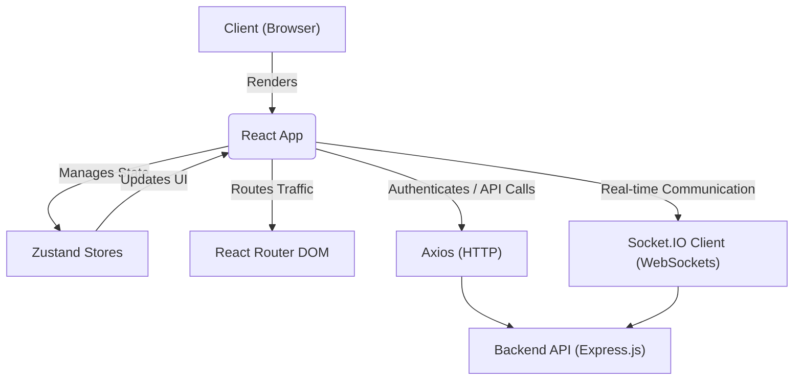
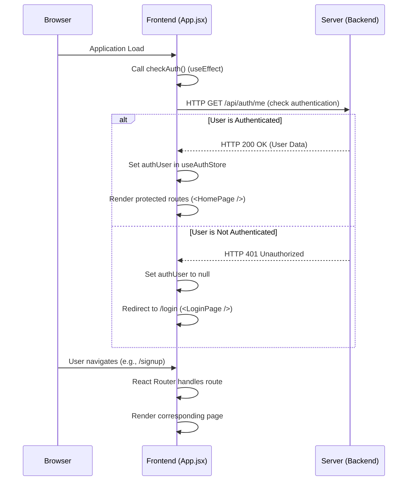

---
title: "Frontend Implementation"
description: "Covers the client-side application structure, main components, and overall user interface."
sidebar_position: 3
---

import { Tabs, Tab } from '@site/src/components/Tabs';
import { FontAwesomeIcon } from '@fortawesome/react-fontawesome';
import { faGithub } from '@fortawesome/free-brands-svg-icons';

<TOC />

The frontend of the Chatty application provides the user interface and client-side logic for interacting with the backend services. It is built as a single-page application (SPA) using React, leveraging modern web development tools and best practices to deliver a responsive and intuitive user experience. This section details the core structure, main components, and key technologies driving the client-side implementation.

## System Purpose

The primary purpose of the frontend system is to offer users a seamless and interactive experience for real-time communication.

*   **User Authentication & Authorization**: Handles user registration, login, and session management, ensuring secure access to application features.
*   **Real-time Messaging**: Displays active conversations, allows users to send and receive messages instantly, and manages chat room states.
*   **User Profile Management**: Enables users to view and update their profiles and settings.
*   **Theming**: Supports dynamic theme switching to personalize the user experience.
*   **Navigation**: Provides intuitive routing between different sections of the application such as home, login, signup, and settings.
*   **State Management**: Manages global application state, including authentication status, theme preferences, and online user presence.

## Architecture

The frontend follows a component-based architecture, characteristic of React applications. It is structured around a root `App` component that orchestrates routing and global state, rendering various page components based on the URL. UI components are modular and reusable, promoting maintainability and scalability.

Interaction with the backend is primarily stateless, with authentication tokens handled client-side for securing API requests. Real-time communication is established via WebSockets, managed by `socket.io-client`.





*   **Client (Browser)**: The end-user's web browser where the application runs.
*   **React App**: The core JavaScript application, composed of various React components.
*   **Zustand Stores**: Lightweight state management for global application data (e.g., `useAuthStore`, `useThemeStore`).
*   **React Router DOM**: Handles client-side routing, mapping URLs to specific components (`<HomePage />`, `<LoginPage />`, etc.).
*   **Axios (HTTP)**: Used for making HTTP requests to the backend for data fetching and mutation (e.g., login, signup).
*   **Socket.IO Client (WebSockets)**: Manages persistent real-time connections with the backend for instant messaging and presence updates.
*   **Backend API (Express.js)**: The server-side application providing RESTful APIs and WebSocket services.

## Technology Stack

The frontend is built using a modern JavaScript ecosystem, prioritizing developer experience and performance.

| Layer               | Technology           | Purpose                                                                                |
| :------------------ | :------------------- | :------------------------------------------------------------------------------------- |
| **Core Framework**  | React                | Declarative UI library for building interactive user interfaces.                       |
| **Build Tool**      | Vite                 | Fast build tool and development server, optimized for modern web projects.             |
| **Routing**         | React Router DOM     | Client-side routing for navigating between different pages/components.                 |
| **State Management**| Zustand              | Lightweight and performant state management solution for global application state.     |
| **HTTP Client**     | Axios                | Promise-based HTTP client for making API requests to the backend.                      |
| **Real-time Comms** | Socket.IO Client     | Client-side library for establishing and managing WebSocket connections.               |
| **UI Components**   | DaisyUI, Tailwind CSS| Component library and utility-first CSS framework for styling and theming.            |
| **Icons**           | Lucide React, React Icons | Extensive icon sets for enhancing user interface visuals.                              |
| **Notifications**   | React Hot Toast      | Lightweight and customizable toast notifications for user feedback.                    |
| **Linting**         | ESLint               | Code linter to enforce coding standards and identify potential issues.                 |

### Core Dependencies ([frontend/package.json](https://github.com/shinymack/Chat-App-MERN/blob/main/frontend/package.json))

The `package.json` file outlines the project's dependencies and scripts.

<Tabs>
<Tab value="dependencies" label="Dependencies">

```json
{
  "dependencies": {
    "axios": "^1.7.9",
    "cors": "^2.8.5",
    "lucide-react": "^0.471.1",
    "react": "^18.3.1",
    "react-dom": "^18.3.1",
    "react-hot-toast": "^2.5.1",
    "react-icons": "^5.5.0",
    "react-router-dom": "^7.1.1",
    "socket.io-client": "^4.8.1",
    "zustand": "^5.0.3"
  }
}
```
*   **axios**: Essential for making HTTP requests to the backend API.
*   **lucide-react**, **react-icons**: Provide a rich set of SVG icons for the UI.
*   **react**, **react-dom**: Core React libraries for building the UI.
*   **react-hot-toast**: Used for displaying ephemeral notifications to the user.
*   **react-router-dom**: Manages client-side routing.
*   **socket.io-client**: Enables real-time, bidirectional event-based communication.
*   **zustand**: A lean state-management solution used for global state (e.g., authentication, theme).

</Tab>
<Tab value="devDependencies" label="Dev Dependencies">

```json
{
  "devDependencies": {
    "@eslint/js": "^9.17.0",
    "@types/react": "^18.3.18",
    "@types/react-dom": "^18.3.5",
    "@vitejs/plugin-react": "^4.3.4",
    "autoprefixer": "^10.4.20",
    "daisyui": "^4.12.23",
    "eslint": "^9.17.0",
    "eslint-plugin-react": "^7.37.2",
    "eslint-plugin-react-hooks": "^5.0.0",
    "eslint-plugin-react-refresh": "^0.4.16",
    "globals": "^15.14.0",
    "postcss": "^8.5.0",
    "tailwindcss": "^3.4.17",
    "vite": "^6.3.5"
  }
}
```
*   **vite**: The build tool and development server.
*   **@vitejs/plugin-react**: Vite plugin for React applications.
*   **daisyui**, **tailwindcss**, **autoprefixer**, **postcss**: Tools for styling the application, providing a robust CSS framework and component library.
*   **eslint** and related plugins: For enforcing code quality and consistency.

</Tab>
</Tabs>

## Features

### Application Entry Point ([frontend/src/main.jsx](https://github.com/shinymack/Chat-App-MERN/blob/main/frontend/src/main.jsx))

The `main.jsx` file serves as the entry point for the React application. It initializes the React DOM and wraps the main `App` component within `BrowserRouter` for client-side routing and `StrictMode` for identifying potential problems in an application.

```jsx title="frontend/src/main.jsx" {2-3,7-10}
import { StrictMode } from 'react'
import { createRoot } from 'react-dom/client'
import './index.css'
import App from './App.jsx'
import { BrowserRouter } from 'react-router-dom'

createRoot(document.getElementById('root')).render(
  <StrictMode>
    <BrowserRouter>
      <App />
    </BrowserRouter>
  </StrictMode>,
)
```
This setup ensures that all components within `App` have access to routing functionalities and benefit from React's strict development checks. The `index.css` file imports global styles, including those from Tailwind CSS and DaisyUI.

### Root HTML Structure ([frontend/index.html](https://github.com/shinymack/Chat-App-MERN/blob/main/frontend/index.html))

The `index.html` file is the foundational document loaded by the browser. It defines the basic page structure, metadata, and the root element where the React application mounts.

```html title="frontend/index.html" {6-13}
<!doctype html>
<html lang="en">
  <head>
    <meta charset="UTF-8" />
    <link rel="icon" type="image/svg+xml+png" href="/icon.png" />
    <meta name="viewport" content="width=device-width, initial-scale=1.0" />
    <title>Chatty</title>
  </head>
  <body>
    <div id="root"></div>
    <script type="module" src="/src/main.jsx"></script>
  </body>
</html>
```
*   The `<div id="root"></div>` element is where the entire React application is injected.
*   `<script type="module" src="/src/main.jsx"></script>` imports the main JavaScript bundle, leveraging ES modules for efficient loading.
*   The `<link rel="icon" ...>` tag sets the favicon for the application.

### Main Application Component ([frontend/src/App.jsx](https://github.com/shinymack/Chat-App-MERN/blob/main/frontend/src/App.jsx))

The `App.jsx` component is the central hub of the frontend application. It handles global state management, routing, and conditional rendering based on authentication status.

```jsx title="frontend/src/App.jsx" {7-15,22-29}
import Navbar from './components/Navbar'
import { Routes, Route, Navigate } from 'react-router-dom'
import { useEffect } from 'react'
import HomePage from './pages/HomePage'
import SignUpPage from './pages/SignUpPage' 
import LoginPage from './pages/LoginPage' 
import SettingsPage from './pages/SettingsPage' 
import ProfilePage from './pages/ProfilePage'

import { useThemeStore } from './store/useThemeStore'
import { useAuthStore } from './store/useAuthStore'; 
import { Loader } from 'lucide-react'
import { Toaster } from 'react-hot-toast'

const App = () => {
  const { authUser, checkAuth, isCheckingAuth, onlineUsers } = useAuthStore();
  const { theme } = useThemeStore();
  useEffect(() => {
    checkAuth();
  }, [checkAuth]);

  console.log("authUser: ", {authUser});
  console.log({onlineUsers})

  if(isCheckingAuth && !authUser) return (
      <div className='flex items-center justify-center h-screen'>
        <Loader className='size-10 animate-spin' />
      </div>
  )

  return (
    <div className='' data-theme={theme}>
      <Navbar />
      <Toaster />
      <Routes>
        <Route path='/' element={authUser ? <HomePage />: <Navigate to='/login' />} />
        <Route path='/signup' element={ !authUser ? <SignUpPage />: <Navigate to='/' />} />
        <Route path='/login' element={!authUser ? <LoginPage />: <Navigate to='/' />} />
        <Route path='/settings' element={<SettingsPage />} />
        <Route path='/profile' element={authUser ? <ProfilePage />: <Navigate to='/login' />} />
      </Routes>
    </div> 
  )
}

export default App
```
*   **Authentication Check**: On initial load, `useEffect` calls `checkAuth()` from `useAuthStore` to verify the user's authentication status. This is crucial for maintaining persistent user sessions.
*   **Loading State**: While `isCheckingAuth` is true and `authUser` is not yet determined, a loading spinner (`<Loader />`) is displayed, providing a smooth user experience.
*   **Theming**: The `data-theme={theme}` attribute on the root `div` dynamically applies the selected theme, managed by `useThemeStore`, using DaisyUI's theme system.
*   **Routing**: `react-router-dom`'s `Routes` and `Route` components define the application's navigation paths.
    *   Protected routes (e.g., `/`, `/profile`) redirect unauthenticated users to `/login`.
    *   Public routes (e.g., `/signup`, `/login`) redirect authenticated users to `/` (home).
*   **Global Components**: `<Navbar />` is rendered across all pages, and `<Toaster />` provides global toast notifications.

## Key Integration Points

### State Management with Zustand

Zustand is employed for efficient global state management. `useAuthStore` manages user authentication status (`authUser`, `isCheckingAuth`, `onlineUsers`), while `useThemeStore` handles the application's theme. This centralized approach simplifies state updates and ensures data consistency across components. For example, `App.jsx` listens to `authUser` to conditionally render routes.

### API and Real-time Interactions

The frontend extensively interacts with the backend through `axios` for standard HTTP requests (e.g., user login, fetching data) and `socket.io-client` for real-time features. This dual approach allows for both traditional request-response patterns and low-latency, persistent connections vital for a chat application.

### Authentication Flow

The `App.jsx` component orchestrates the initial authentication check.
Upon application load, `checkAuth` is called. If a valid session (e.g., JWT in cookies) exists, `authUser` is populated, granting access to protected routes. Otherwise, users are redirected to the login page. This ensures that sensitive content is only accessible to authenticated users, providing a robust security layer.





This flow illustrates how the application verifies authentication status and dynamically adjusts the user interface based on the server's response, ensuring a secure and controlled user experience.

### Scalability Insights

The modular design with React components and a lightweight state management library like Zustand makes the frontend highly scalable. Adding new features involves creating new components and integrating them into the existing routing and state system without significantly impacting performance. The use of Vite for bundling ensures fast build times and optimized production assets, contributing to quick load times even as the application grows. The clear separation of concerns between UI, routing, and state logic fosters maintainability and allows larger teams to work concurrently.

Next: [User Interface Components](./3.1_user-interface-components.mdx)
```