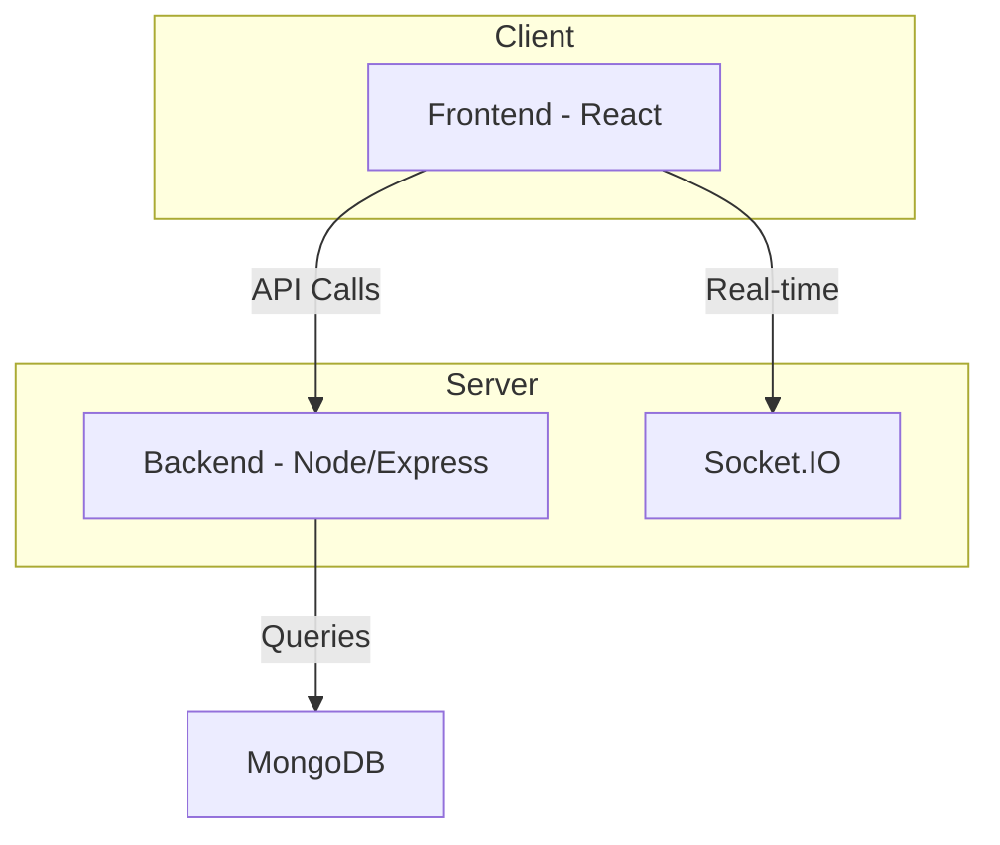
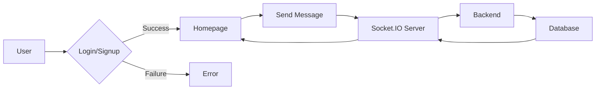

# Frontend Development

<TOC />

## System Purpose

The frontend application provides a user interface for interacting with a chat application.  Core functionalities include:

*   **User Registration and Authentication:** Allows users to create accounts and securely log in. [View on GitHub](https://github.com/YOUR_GITHUB_USERNAME/YOUR_REPO_NAME/blob/main/frontend/src/pages/SignUpPage.jsx) and [View on GitHub](https://github.com/YOUR_GITHUB_USERNAME/YOUR_REPO_NAME/blob/main/frontend/src/pages/LoginPage.jsx).
*   **Real-time Messaging:** Enables users to send and receive messages instantly. [View on GitHub](https://github.com/YOUR_GITHUB_USERNAME/YOUR_REPO_NAME/blob/main/frontend/src/pages/HomePage.jsx)
*   **User Profiles:** Displays user information and allows for profile management. [View on GitHub](https://github.com/YOUR_GITHUB_USERNAME/YOUR_REPO_NAME/blob/main/frontend/src/pages/ProfilePage.jsx)
*   **Settings Management:** Allows users to customize their application settings. [View on GitHub](https://github.com/YOUR_GITHUB_USERNAME/YOUR_REPO_NAME/blob/main/frontend/src/pages/SettingsPage.jsx)

## System Architecture Overview

The frontend follows a client-server architecture.  The client (React application) communicates with a backend server via API calls for data persistence and retrieval, and leverages Socket.IO for real-time communication.  The frontend interacts with various components, including navigation, authentication, messaging, and profile management.  These components are responsible for rendering and interacting with the user interface.





## Technology Stack

The frontend utilizes a modern JavaScript stack built with React, Vite, and Tailwind CSS.  Below is a summary of the technologies used:

| Layer          | Technology       | Version      | Purpose                                      |
| --------------- | ---------------- | ------------- | -------------------------------------------- |
| Framework      | React            | ^18.3.1       | User interface development                    |
| Build Tool     | Vite             | ^6.3.5        | Fast build process and development server    |
| CSS Framework  | Tailwind CSS     | ^3.4.17       | Utility-first CSS framework                  |
| Styling        | DaisyUI          | ^4.12.23      | UI Components built on top of Tailwind CSS    |
| State Management | Zustand          | ^5.0.3        | State management library                     |
| Routing         | React Router DOM | ^7.1.1        | Client-side routing                         |
| Icons           | Lucide-React     | ^0.471.1      | Customizable icon library                    |
| Toasts          | react-hot-toast | ^2.5.1        | Displaying user notifications                  |
| HTTP Client     | Axios            | ^1.7.9        | Making API requests                        |
| Realtime        | Socket.IO Client | ^4.8.1        | Real-time bidirectional communication    |


Here's a snippet from the `package.json` showing the core dependencies:

```json
{
  "dependencies": {
    "axios": "^1.7.9",
    "react": "^18.3.1",
    "react-dom": "^18.3.1",
    "react-router-dom": "^7.1.1",
    "socket.io-client": "^4.8.1",
    "zustand": "^5.0.3"
  },
  // ...rest of package.json
}
```

[View on GitHub](https://github.com/YOUR_GITHUB_USERNAME/YOUR_REPO_NAME/blob/main/frontend/package.json)


And another snippet showcasing development dependencies:

```json
{
  "devDependencies": {
    "@vitejs/plugin-react": "^4.3.4",
    "tailwindcss": "^3.4.17",
    "vite": "^6.3.5"
  }
  // ...rest of package.json
}
```

[View on GitHub](https://github.com/YOUR_GITHUB_USERNAME/YOUR_REPO_NAME/blob/main/frontend/package.json)


## Core Application Features

*   **Authentication:** Secure user authentication using JWT (JSON Web Tokens) or similar.  The frontend handles login, signup, and token storage.


```jsx
// frontend/src/App.jsx
useEffect(() => {
    checkAuth();
  }, [checkAuth]);

  if(isCheckingAuth && !authUser) return (
      <div className='flex items-center justify-center h-screen'>
        <Loader className='size-10 animate-spin' />
      </div>
  )
```

[View on GitHub](https://github.com/YOUR_GITHUB_USERNAME/YOUR_REPO_NAME/blob/main/frontend/src/App.jsx#L31-L41)

*   **Real-time Chat:**  Uses Socket.IO for real-time communication, allowing for instant message delivery.  The frontend handles connecting to the Socket.IO server, sending and receiving messages, and updating the UI accordingly.

```jsx
//Example of Socket.IO connection and message handling (Illustrative - Actual implementation will be more complex)
const socket = io(); //connect to socket.io server
socket.on('message', (message) => {
  //Update UI with new message
});
socket.emit('message', message); //send a message
```


*   **Routing:**  React Router is used to manage client-side navigation between different pages.  Protected routes ensure that only authenticated users can access certain pages.

```jsx
// frontend/src/App.jsx
<Routes>
        <Route path='/' element={authUser ? <HomePage />: <Navigate to='/login' />} />
        <Route path='/signup' element={ !authUser ? <SignUpPage />: <Navigate to='/' />} />
        {/* ...other routes */}
      </Routes>

```

[View on GitHub](https://github.com/YOUR_GITHUB_USERNAME/YOUR_REPO_NAME/blob/main/frontend/src/App.jsx#L51-L58)





## Project Structure

```
frontend/
├── public/
│   └── index.html
├── src/
│   ├── App.jsx
│   ├── components/
│   │   └── Navbar.jsx
│   ├── pages/
│   │   ├── HomePage.jsx
│   │   ├── SignUpPage.jsx
│   │   ├── LoginPage.jsx
│   │   ├── SettingsPage.jsx
│   │   └── ProfilePage.jsx
│   ├── store/
│   │   ├── useAuthStore.js
│   │   └── useThemeStore.js
│   └── index.css
├── vite.config.js
└── package.json
```

[View on GitHub](https://github.com/YOUR_GITHUB_USERNAME/YOUR_REPO_NAME/tree/main/frontend)


## Key Integration Points

*   **State Management:** Zustand manages the application's state, including user authentication status and theme settings.  This allows for efficient data flow and updates within the React components.

*   **API Interactions:**  Axios handles all HTTP requests to the backend API. This ensures a clean separation of concerns between the frontend and backend.

*   **Authentication Flow:** The frontend interacts with the backend to handle authentication. The backend provides tokens that are stored securely in the frontend to maintain session state.

*   **Real-time Communication (Socket.IO):** Socket.IO facilitates real-time updates for chat messages.  The frontend establishes a persistent connection with the Socket.IO server to receive and send messages asynchronously.


Next: [Frontend UI Components](./3.1_frontend_ui_components.mdx)