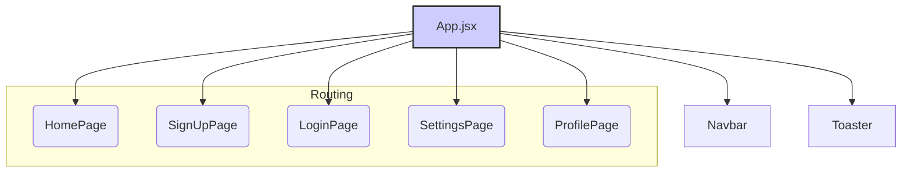
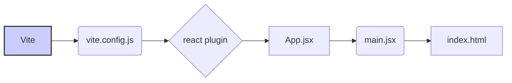

# Frontend Development

<TOC />

## System Purpose

The frontend of this application is built using React, Vite, and Tailwind CSS to provide a user-friendly interface for user authentication, profile management, and core application functionality.  The system is designed for scalability and maintainability, leveraging modern JavaScript frameworks and tools.

### Key Features

*   **User Authentication:** Secure user signup and login functionality.
*   **Responsive Design:** Adapts seamlessly to various screen sizes.
*   **Real-time Updates (Implied):**  While not explicitly detailed in the provided code, the inclusion of `socket.io-client` suggests real-time capabilities (e.g., chat, live updates).
*   **Theming:** Allows users to switch between different themes.
*   **Routing:**  Uses React Router for navigation between different pages.
*   **Error Handling:** Uses `react-hot-toast` for displaying notifications to the user (e.g., success/error messages).

### Technology Stack

| Technology       | Version        | Purpose                                           |
|-----------------|-----------------|---------------------------------------------------|
| React            | ^18.3.1        | UI Library                                       |
| React Router DOM | ^7.1.1        | Client-side routing                               |
| Vite             | ^6.3.5         | Build tool                                        |
| Tailwind CSS     | ^3.4.17        | Utility-first CSS framework                         |
| Zustand          | ^5.0.3         | State management solution                           |
| Lucide React     | ^0.471.1       | React Icons Library                               |
| React Hot Toast  | ^2.5.1         |  User feedback library                            |
| Axios            | ^1.7.9         | HTTP client                                       |
| Socket.IO Client | ^4.8.1         | Real-time bidirectional communication              |





## Code Structure and Interactions

### `package.json` [frontend/package.json](https://github.com/your-repo/frontend/blob/main/package.json)

This file lists the project's dependencies and scripts.  Key aspects include:

*   **Dependencies:** Lists the necessary libraries like React, React Router, and Tailwind CSS.  The inclusion of `axios` indicates usage for making HTTP requests to a backend API.  `socket.io-client` suggests real-time communication capabilities. `zustand` is used for efficient state management.
*   **DevDependencies:**  Lists the tools for development, like Vite, ESLint, and PostCSS.  `@vitejs/plugin-react` is a plugin to enable React support in Vite.


```json
{
  "dependencies": {
    "axios": "^1.7.9",
    "react": "^18.3.1",
    "react-dom": "^18.3.1",
    "react-router-dom": "^7.1.1",
    "zustand": "^5.0.3"
    // ... other dependencies
  },
  "devDependencies": {
    "@vitejs/plugin-react": "^4.3.4",
    "vite": "^6.3.5",
    "tailwindcss": "^3.4.17"
    // ... other devDependencies
  }
}
```

### `App.jsx` [frontend/src/App.jsx](https://github.com/your-repo/frontend/blob/main/src/App.jsx)

This is the main application component. It handles routing, authentication checks, and rendering the appropriate page based on the user's authentication status and the current URL.

```jsx
const App = () => {
  const { authUser, checkAuth, isCheckingAuth } = useAuthStore();
  const { theme } = useThemeStore();
  useEffect(() => {
    checkAuth();
  }, [checkAuth]);

  if(isCheckingAuth && !authUser) return (
      <div className='flex items-center justify-center h-screen'>
        <Loader className='size-10 animate-spin' />
      </div>
  )

  return (
    <div className='' data-theme={theme}>
      <Navbar />
      <Toaster />
      <Routes>
        <Route path='/' element={authUser ? <HomePage />: <Navigate to='/login' />} />
        {/* ... other routes */}
      </Routes>
    </div> 
  )
}
```

### `main.jsx` [frontend/src/main.jsx](https://github.com/your-repo/frontend/blob/main/src/main.jsx)


This file renders the main application component, `App`, within a React StrictMode and BrowserRouter for routing.

```jsx
import { StrictMode } from 'react'
import { createRoot } from 'react-dom/client'
import App from './App.jsx'
import { BrowserRouter } from 'react-router-dom'

createRoot(document.getElementById('root')).render(
  <StrictMode>
    <BrowserRouter>
      <App />
    </BrowserRouter>
  </StrictMode>,
)
```

### `vite.config.js` [frontend/vite.config.js](https://github.com/your-repo/frontend/blob/main/vite.config.js)

This file configures the Vite build process.  The `@vitejs/plugin-react` enables React support for faster development and building.


```javascript
import { defineConfig } from 'vite'
import react from '@vitejs/plugin-react'

export default defineConfig({
  plugins: [react()],
})
```





## Key Integration Points and Insights

*   The frontend interacts with a backend API (implied by the use of `axios`).  The details of this interaction are not present in the provided files.
*   The application uses `zustand` for state management, which provides a simple and efficient way to manage application state.  This is particularly beneficial for handling authentication status and other shared data.
*   The use of React Router allows for easy navigation between different pages in the application, improving the user experience.
*   The implementation of authentication likely involves server-side sessions or token-based authentication, the specifics of which aren't contained within these files.

Next: [Frontend Components](./3.1_frontend_components.mdx)