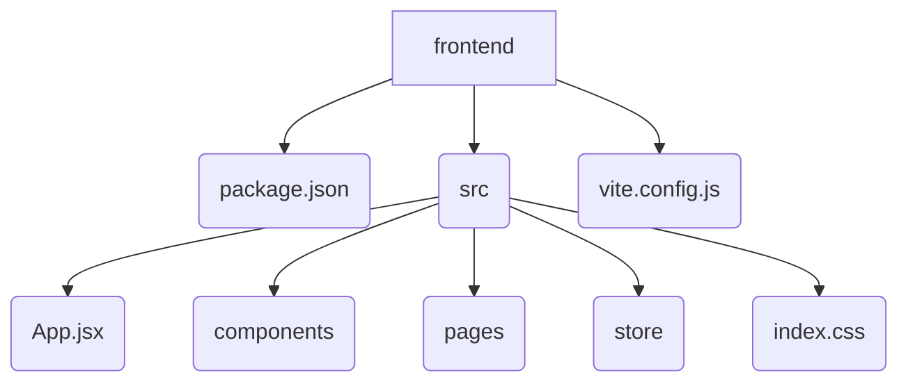
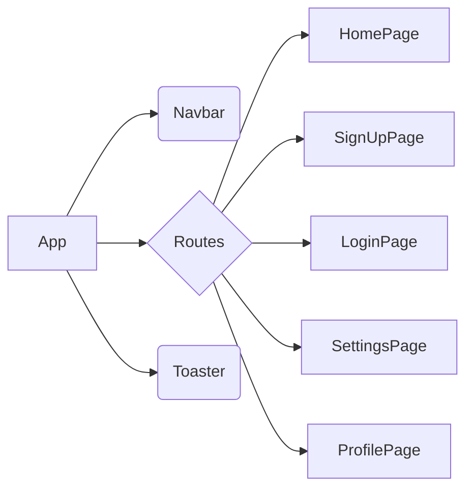

# Frontend Development

<TOC />

## Project Setup and Dependencies

This section details the project's structure and the dependencies used in the frontend development.

The `package.json` file [Source](https://github.com/shinymack/Chat-App-MERN/blob/main/frontend/package.json) defines the project metadata, scripts, dependencies, and devDependencies.

### Dependencies

*   **`react` and `react-dom`:** Core React libraries for building user interfaces.
*   **`react-router-dom`:**  Routing library for navigating between different pages within the application.
*   **`axios`:**  Promise based HTTP client for making requests to the backend.
*   **`zustand`:**  Small, fast, and scalable bearbones state management solution.
*   **`lucide-react`:** React components for Lucide icons, providing visual elements.
*   **`react-hot-toast`:**  Provides a simple way to display notifications and toasts to the user.
*   **`react-icons`:** Library for using various icons in the React app.
*   **`socket.io-client`:** Client-side library for real-time communication using Socket.IO.
*   **`cors`:**  Handles Cross-Origin Resource Sharing (CORS) issues, allowing the frontend to communicate with the backend server.


### Dev Dependencies

*   **`vite`:**  A fast build tool for frontend development.
*   **`@vitejs/plugin-react`:**  Vite plugin for using React with Vite.
*   **`tailwindcss`, `autoprefixer`, `postcss`:** Tools for styling the application with Tailwind CSS.
*   **`daisyui`:**  A Tailwind CSS component library.
*   **`eslint`, `@eslint/js`, `eslint-plugin-react`, `eslint-plugin-react-hooks`, `eslint-plugin-react-refresh`:** Tools for linting and enforcing code style.
*   **`@types/react`, `@types/react-dom`:**  Type definitions for React and React DOM, improving code development.


### Build Scripts

The `scripts` section in `package.json` defines several commands:

*   `"dev": "vite"`: Starts the development server.
*   `"build": "vite build"`: Builds the application for production.
*   `"lint": "eslint ."`: Runs the linter to check code style.
*   `"preview": "vite preview"`: Starts a preview server for the built application.
*   `"mobile": "vite --host"`: Starts the development server with a specified host for mobile development.

```json
{
  "scripts": {
    "dev": "vite",
    "build": "vite build",
    "lint": "eslint .",
    "preview": "vite preview",
    "mobile": "vite --host"
  }
}
```

### Project Structure (Mermaid Diagram)

`




## Application Structure and Routing

The main application logic resides in `src/App.jsx` [Source](https://github.com/shinymack/Chat-App-MERN/blob/main/frontend/src/App.jsx).  It uses `react-router-dom` for routing and `zustand` for state management.

```jsx
import { Routes, Route, Navigate } from 'react-router-dom'
// ... other imports

const App = () => {
  // ... state management logic

  if(isCheckingAuth && !authUser) return ( /* ... loading screen */ )

  return (
    <div className='' data-theme={theme}>
      <Navbar />
      <Toaster />
      <Routes>
        <Route path='/' element={authUser ? <HomePage />: <Navigate to='/login' />} />
        {/* Other routes */}
      </Routes>
    </div> 
  )
}
```

This code snippet shows the core routing logic. Based on the authentication status (`authUser`), the application redirects to either the homepage (`HomePage`) or the login page (`LoginPage`).  Conditional rendering ensures appropriate page display based on authentication.  `react-router-dom` handles the navigation seamlessly.  The `Toaster` component from `react-hot-toast` allows for displaying notifications.


### Authentication and State Management

The application uses `useAuthStore` and `useThemeStore` (from `zustand`) to manage authentication and theme states.   `checkAuth` likely fetches authentication status from the backend.

```jsx
const { authUser, checkAuth, isCheckingAuth, onlineUsers } = useAuthStore();
const { theme } = useThemeStore();
useEffect(() => {
    checkAuth();
  }, [checkAuth]);
```

This `useEffect` hook ensures that the `checkAuth` function is called when the component mounts, verifying the user's authentication status.  The application then renders based on the result.

### Styling

The application leverages Tailwind CSS and DaisyUI for styling, as evidenced by the `index.css` file [Source](https://github.com/shinymack/Chat-App-MERN/blob/main/frontend/src/index.css) which imports Tailwind's base, components, and utilities.  It also sets the `font-chivo` for the body.

```css
@import url('https://fonts.googleapis.com/css2?family=Chivo:ital,wght@0,100..900;1,100..900&display=swap');
@tailwind base;
@tailwind components;
@tailwind utilities;

@layer base {
    body {
        @apply font-chivo;
    }
}
```

This ensures that the application inherits all the pre-defined Tailwind CSS styles. The `@layer base` directive adds custom styles to the base layer which applies the Chivo font globally.


## Build Process

The `vite.config.js` file [Source](https://github.com/shinymack/Chat-App-MERN/blob/main/frontend/vite.config.js) configures the Vite build process. This specific configuration is minimal, simply importing the React plugin.

```javascript
import { defineConfig } from 'vite'
import react from '@vitejs/plugin-react'

export default defineConfig({
  plugins: [react()],
})
```

Vite uses this configuration to efficiently bundle the application's code during development and production builds, speeding up the development workflow and resulting in optimized output.


## Component Hierarchy (Mermaid Diagram)

`




This diagram illustrates the component hierarchy and the flow of rendering within the application.  The `App` component is the root, containing the `Navbar`, `Routes`, and the `Toaster`.  The `Routes` component further encapsulates the different page components.


Next: [Frontend Components](./3.1_frontend_components.mdx)