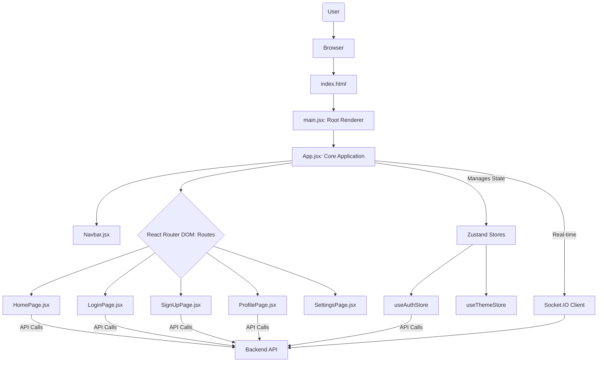

# Frontend Application

<TOC />

## Introduction

The Frontend Application serves as the client-side user interface (UI) for the entire system, providing an interactive and responsive experience for users. Built with React, it leverages modern web technologies to deliver dynamic content, handle user input, and display real-time updates. This documentation provides a deep dive into its architecture, core technologies, and fundamental operations, explaining the **WHAT**, **WHY**, and **HOW** behind its design and implementation.

## System Purpose

The primary purpose of the frontend application is to present a rich, interactive user interface that allows users to seamlessly interact with the backend services. It translates complex data into intuitive visual elements, manages user sessions, handles navigation, and facilitates real-time communication. This ensures a fluid user experience (UX) across various functionalities, from authentication to core application features.

### Key Features & Design Goals

*   **Interactive User Interface**: Powered by React, enabling component-based development and efficient UI updates.
*   **Client-Side Routing**: Utilizes `react-router-dom` for seamless navigation between different application views without full page reloads.
*   **Global State Management**: Implements `Zustand` for lightweight and efficient management of application-wide state, such as user authentication status and theme preferences.
*   **Responsive Design**: Employs `Tailwind CSS` and `DaisyUI` to ensure the application is aesthetically pleasing and functional across various device sizes.
*   **Real-time Capabilities**: Integrates `socket.io-client` for instant updates and real-time interaction with the backend.
*   **User Feedback**: Uses `react-hot-toast` for non-intrusive notifications and `lucide-react` for simple iconography.

## Architectural Overview

The frontend application follows a Single Page Application (SPA) architecture. The `App.jsx` component acts as the root orchestrator, defining the main layout, routing logic, and global state providers. Pages are loaded dynamically based on the URL, and shared components like the `Navbar` persist across views.





*Figure 1: Frontend Application Component Flow*

This diagram illustrates how user interactions trigger the rendering process, starting from `main.jsx`, which mounts the `App.jsx` component. `App.jsx` then manages global elements like the `Navbar` and dynamically renders different pages based on the current route. Global state is managed by Zustand stores, which also interact with the backend API.

## Core Technologies and Dependencies

The `package.json` file outlines the critical dependencies and development tools that power the frontend application.

[frontend/package.json](https://github.com/shinymack/Chat-App-MERN/blob/main/frontend/package.json)

### Runtime Dependencies

These packages are essential for the application to run in a production environment.

| Dependency        | Version   | Purpose & Rationale                                                                                                                                                                                                                                  |
| :---------------- | :-------- | :--------------------------------------------------------------------------------------------------------------------------------------------------------------------------------------------------------------------------------------------------- |
| `react`           | `^18.3.1` | **WHAT**: A declarative, component-based JavaScript library for building user interfaces. **WHY**: Chosen for its efficiency in rendering, virtual DOM, and robust ecosystem, enabling modular and maintainable UI development.                          |
| `react-dom`       | `^18.3.1` | **WHAT**: Provides DOM-specific methods to `react`, acting as the entry point to the DOM. **WHY**: Essential for rendering React components into the browser's DOM.                                                                                       |
| `react-router-dom`| `^7.1.1`  | **WHAT**: Provides declarative routing for React applications. **WHY**: Enables Single Page Application (SPA) navigation, managing URLs and rendering different components based on the route, enhancing UX by avoiding full page reloads.                 |
| `zustand`         | `^5.0.3`  | **WHAT**: A small, fast, and scalable bear-bones state-management solution. **WHY**: Chosen for its simplicity, lack of boilerplate, and efficient re-rendering, making it ideal for managing global state like authentication and theme without complexity. |
| `axios`           | `^1.7.9`  | **WHAT**: A promise-based HTTP client for the browser and Node.js. **WHY**: Used for making HTTP requests to the backend API, offering an easy-to-use API, automatic JSON transformation, and interceptors for request/response handling.                     |
| `socket.io-client`| `^4.8.1`  | **WHAT**: The client-side library for Socket.IO, enabling real-time, bidirectional, event-based communication. **WHY**: Crucial for real-time features like chat messages, online user status, and notifications, providing a persistent connection to the server. |
| `lucide-react`    | `^0.471.1`| **WHAT**: A collection of beautiful, community-driven icons for React. **WHY**: Provides a lightweight and highly customizable icon set, improving UI aesthetics and conveying information effectively.                                                     |
| `react-hot-toast` | `^2.5.1`  | **WHAT**: A lightweight, customizable notification system for React. **WHY**: Used for displaying unobtrusive, professional-looking toast messages to provide immediate feedback to users (e.g., success, error, info messages).                           |
| `react-icons`     | `^5.5.0`  | **WHAT**: Popular icon sets available as React components. **WHY**: Offers a wide variety of icons from different libraries, complementing `lucide-react` for more extensive icon needs.                                                                     |
| `cors`            | `^2.8.5`  | **WHAT**: (Note: This is typically a backend dependency for `Access-Control-Allow-Origin` headers). Its presence here might be a configuration or build artifact, but it's not directly used client-side for making requests *from* the browser.  **WHY**: If intended for use within a client-side environment that acts as a server (e.g., for local testing proxy), it would manage cross-origin resource sharing. However, in a typical React SPA, `axios` handles requests, and the backend handles CORS responses. |

### Development Dependencies

These packages are used during development and build processes, not shipped to production.

| Dependency                 | Version    | Purpose & Rationale                                                                                                                                                                                               |
| :------------------------- | :--------- | :---------------------------------------------------------------------------------------------------------------------------------------------------------------------------------------------------------------- |
| `vite`                     | `^6.3.5`   | **WHAT**: A next-generation frontend tooling that provides an extremely fast development experience. **WHY**: Offers lightning-fast hot module replacement (HMR), optimized builds, and a lightweight development server.   |
| `@vitejs/plugin-react`     | `^4.3.4`   | **WHAT**: A Vite plugin that provides React Fast Refresh. **WHY**: Enables instantaneous feedback during development by updating only changed components without losing state.                                            |
| `tailwindcss`              | `^3.4.17`  | **WHAT**: A utility-first CSS framework. **WHY**: Allows for rapid UI development by composing designs directly in JSX with utility classes, promoting consistency and reducing CSS boilerplate.                           |
| `autoprefixer`             | `^10.4.20` | **WHAT**: A PostCSS plugin to parse CSS and add vendor prefixes to CSS rules. **WHY**: Ensures CSS styles are compatible across different browsers by automatically adding necessary prefixes.                           |
| `postcss`                  | `^8.5.0`   | **WHAT**: A tool for transforming CSS with JavaScript. **WHY**: Acts as the engine for `tailwindcss` and `autoprefixer`, enabling powerful CSS transformations during the build process.                                 |
| `daisyui`                  | `^4.12.23` | **WHAT**: A Tailwind CSS component library. **WHY**: Provides pre-built, customizable UI components (e.g., buttons, navbars, modals) that are styled with Tailwind CSS, accelerating UI development while maintaining flexibility. |
| `eslint`, `eslint-plugin-react`, etc. | Various | **WHAT**: Linting tools for identifying and reporting on patterns in JavaScript code. **WHY**: Enforces coding standards, catches potential errors, and promotes consistent code quality across the team.                   |

## Application Entry Point: `main.jsx`

The `main.jsx` file is the absolute first script executed in the browser for the frontend application. It sets up the foundational environment before the main `App` component is rendered.

[frontend/src/main.jsx](https://github.com/shinymack/Chat-App-MERN/blob/main/frontend/src/main.jsx#L1-L9)

```jsx
import { StrictMode } from 'react'
import { createRoot } from 'react-dom/client'
import './index.css'
import App from './App.jsx'
import { BrowserRouter } from 'react-router-dom'

createRoot(document.getElementById('root')).render(
  <StrictMode>
    <BrowserRouter>
      <App />
    </BrowserRouter>
  </StrictMode>,
)
```
*Code Snippet 1: `main.jsx` - Application Root*

### WHAT it does:
*   **Initializes React Root**: `createRoot(document.getElementById('root'))` identifies the DOM element (`<div id="root"></div>` usually in `index.html`) where the React application will be mounted.
*   **Renders `App`**: It renders the main `App` component within the `StrictMode` and `BrowserRouter` wrappers.
*   **Global Styles**: Imports `index.css`, which contains global styles, Tailwind CSS directives, and potentially custom CSS.

### WHY it's designed this way:
*   **`StrictMode`**: Enables development-only checks and warnings for potential problems in a React application. It helps catch issues like deprecated lifecycles or unexpected side effects, improving code reliability.
*   **`BrowserRouter`**: Essential for client-side routing. It uses the HTML5 history API to keep the UI in sync with the URL. Wrapping `App` with it ensures that all components within the application can utilize `react-router-dom` hooks and components (like `Route`, `Link`, `useNavigate`).
*   **Separation of Concerns**: Keeps the core application logic in `App.jsx` and concerns about environment setup (DOM mounting, routing context) in `main.jsx`.

## Core Application Logic: `App.jsx`

`App.jsx` is the central hub of the frontend application. It orchestrates global concerns like authentication, theming, and routing, ensuring that all pages and components operate within a consistent and managed context.

[frontend/src/App.jsx](https://github.com/shinymack/Chat-App-MERN/blob/main/frontend/src/App.jsx#L1-L40)

### WHAT it does:
*   **Global Component Imports**: Imports the `Navbar`, page components (`HomePage`, `SignUpPage`, `LoginPage`, `SettingsPage`, `ProfilePage`), and utility components (`Loader`, `Toaster`).
*   **State Management Integration**: Leverages `useThemeStore` and `useAuthStore` (Zustand) to access and manage application-wide state (e.g., `authUser` for authentication, `theme` for UI styling, `isCheckingAuth` for loading states).
*   **Initial Authentication Check**: Uses an `useEffect` hook to call `checkAuth()` from `useAuthStore` on component mount. This verifies the user's login status immediately when the application loads.
    ```jsx
    import { useEffect } from 'react'
    // ... other imports

    const App = () => {
      const { authUser, checkAuth, isCheckingAuth, onlineUsers } = useAuthStore();
      const { theme } = useThemeStore();
      useEffect(() => {
        checkAuth();
      }, [checkAuth]);
    // ... rest of component
    ```
    *Code Snippet 2: `App.jsx` - Initial Authentication Check*
*   **Loading State Handling**: Displays a `Loader` icon if `isCheckingAuth` is true and `authUser` is not yet determined, providing visual feedback during the authentication process.
*   **Theme Provider**: Applies the current `theme` from `useThemeStore` to the root `div` using `data-theme`, enabling dynamic theme switching via DaisyUI.
*   **Global Navbar and Toaster**: Renders the `Navbar` (present on all pages) and `Toaster` (for global notifications) outside the `Routes` component, ensuring they are always visible.
*   **Routing Definition**: Defines all application routes using `react-router-dom`'s `Routes` and `Route` components. Crucially, it implements conditional routing based on the `authUser` status.
    ```jsx
    // ... inside App component return
    <Routes>
      <Route path='/' element={authUser ? <HomePage />: <Navigate to='/login' />} />
      <Route path='/signup' element={ !authUser ? <SignUpPage />: <Navigate to='/' />} />
      <Route path='/login' element={!authUser ? <LoginPage />: <Navigate to='/' />} />
      <Route path='/settings' element={<SettingsPage />} />
      <Route path='/profile' element={authUser ? <ProfilePage />: <Navigate to='/login' />} />
    </Routes>
    ```
    *Code Snippet 3: `App.jsx` - Routing with Conditional Access*

### WHY it's designed this way:
*   **Centralized Control**: `App.jsx` acts as the single source of truth for global concerns, ensuring consistency across the application.
*   **Efficient Auth Flow**: Performing `checkAuth` at the root ensures that the user's authentication status is determined early, enabling appropriate redirection and preventing access to protected routes before the user is verified.
*   **Improved User Experience**: The loading spinner provides clear feedback during the initial auth check, preventing blank screens. Conditional routing ensures users are always directed to the most relevant page (e.g., login if not authenticated, homepage if already logged in).
*   **Modular Design**: By handling global elements and routing at this level, individual page components can focus purely on their specific content and logic, promoting a clean separation of concerns.

## Routing Strategy

The application employs `react-router-dom` for declarative routing, defined within `App.jsx`. This strategy is crucial for a Single Page Application (SPA), allowing smooth navigation without full page reloads.

### WHAT it does:
*   **Route Mapping**: Each `<Route>` component maps a specific `path` (URL) to a corresponding React `element` (page component).
*   **Conditional Navigation**: The `element` prop for several routes includes a ternary operator that checks the `authUser` state. If the condition is not met, the `Navigate` component from `react-router-dom` automatically redirects the user to another specified path. For instance, an authenticated user trying to access `/login` will be redirected to `/`, and an unauthenticated user trying to access `/` will be sent to `/login`.

### WHY it's designed this way:
*   **Seamless UX**: Eliminates jarring page reloads, making the application feel faster and more responsive.
*   **Access Control**: The conditional rendering with `Navigate` provides a client-side layer of protection, preventing authenticated users from seeing login/signup pages and redirecting unauthenticated users away from protected content. This enhances security and user experience.
*   **Maintainability**: Centralizing all route definitions in `App.jsx` makes it easy to understand the application's navigation structure and manage access policies.

## Global State Management

The application utilizes `Zustand` for managing global state, primarily through `useAuthStore` and `useThemeStore`.

### WHAT it does:
*   **`useAuthStore`**: Manages the authentication status of the user, including the `authUser` object (containing user data if logged in), `isCheckingAuth` (loading status during auth verification), and `onlineUsers`. It also provides methods like `checkAuth` to interact with the backend for authentication.
*   **`useThemeStore`**: Manages the application's UI theme, allowing users to switch between different themes provided by DaisyUI.

### WHY it's designed this way:
*   **Simplicity and Efficiency**: Zustand is chosen for its minimal boilerplate and direct API, making state management straightforward and efficient. It avoids complex setups often associated with other state management libraries.
*   **Decoupling Components**: By externalizing global state into stores, components can subscribe to and update state without prop-drilling, leading to cleaner and more reusable components.
*   **Single Source of Truth**: Ensures that `authUser` and `theme` states are consistent across the entire application, preventing discrepancies and simplifying debugging.

## Integration Points & Insights

The frontend application is designed to be highly interactive and relies heavily on integration with the backend:

1.  **Authentication and User Data**: `useAuthStore` dispatches actions that typically make `axios` HTTP requests to a backend API for user login, signup, logout, and checking authentication status.
2.  **Real-time Communication**: `socket.io-client` establishes a persistent WebSocket connection to the backend, enabling features like live chat messages, updating online user lists, and notifications.
3.  **Theming**: The dynamic `data-theme` attribute on the root `div` (managed by `useThemeStore`) integrates directly with `DaisyUI` for theme switching.

**Best Practices & Insights:**

*   **Modular Design**: The use of separate `components/`, `pages/`, and `store/` directories promotes modularity and makes the codebase easier to navigate and maintain.
*   **Performance Optimization**: `Vite` significantly speeds up development, and the efficient state management with `Zustand` helps minimize unnecessary re-renders in production.
*   **Scalability**: The component-based architecture of React, combined with a clear routing strategy and global state management, lays a solid foundation for scaling the application with more features and pages.
*   **User Feedback**: Integrating `react-hot-toast` provides immediate, non-intrusive feedback to users, which is crucial for a good UX, especially during asynchronous operations like API calls.

## Conclusion

The frontend application, built with React and a modern toolchain, provides a robust, interactive, and user-friendly interface. Its architectural design prioritizes efficiency, scalability, and an optimal user experience through careful selection of technologies like `Zustand` for state management, `react-router-dom` for navigation, and `Vite` for development. The clear separation of concerns and strategic use of global state ensures a maintainable and high-performing client-side application that integrates seamlessly with its backend.

Next: [UI Components & Pages](./3.1_ui_components_pages.mdx)