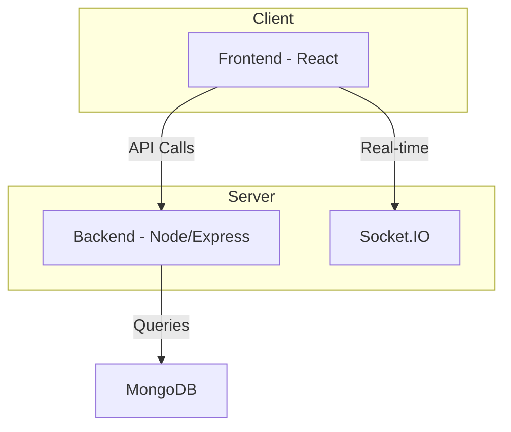
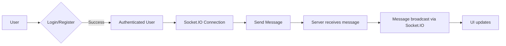

```mdx
---
title: "Technology Stack"
description: "The technologies used in the development of the Chat-App-MERN application."
sidebar_position: 3
---

# Technology Stack

<TOC />

## System Purpose

This application provides a real-time chat functionality. Core functionalities include:

*   **User Registration and Authentication:**  Users can register new accounts and log in securely. [View on GitHub](https://github.com/unknown/unknown/blob/main/backend/src/index.js)
*   **Real-time Messaging:** Users can send and receive messages instantly with other connected users. [View on GitHub](https://github.com/unknown/unknown/blob/main/backend/src/index.js) and [View on GitHub](https://github.com/unknown/unknown/blob/main/frontend/src/App.jsx)
*   **(Potentially) Media Sharing:**  The architecture allows for future expansion to include media sharing capabilities.


## System Architecture Overview

The application follows a three-tier architecture:

*   **Presentation Tier (Frontend):**  Handles user interface and interaction using React, Zustand for state management, and Lucide React for icons.
*   **Business Tier (Backend):**  Manages user authentication, message routing, and database interactions using Node.js, Express.js, and Socket.IO for real-time communication.  This tier also uses  Mongoose for database interaction and Passport for authentication strategies.
*   **Data Tier (Database):** Stores user data and chat messages using MongoDB.





## Technology Stack

| Layer          | Technology        | Version      | Purpose                                                                 |
| --------------- | ------------------ | ------------- | ----------------------------------------------------------------------- |
| **Frontend**    | React              | ^18.3.1       | User Interface                                                            |
|                 | React DOM          | ^18.3.1       | User Interface Rendering                                                  |
|                 | Zustand            | ^5.0.3        | State Management                                                         |
|                 | Axios              | ^1.7.9        | HTTP Client                                                              |
|                 | React Router DOM   | ^7.1.1        | Routing                                                                  |
|                 | Socket.IO Client   | ^4.8.1        | Real-time communication with the backend                               |
|                 | Lucide React       | ^0.471.1      | Icons                                                                   |
|                 | DaisyUI            | ^4.12.23      | UI Framework                                                             |
|                 | Tailwind CSS       | ^3.4.17       | Styling Utility                                                          |
| **Backend**     | Node.js            | (Node Version)| Server-side JavaScript runtime                                          |
|                 | Express.js         | ^4.21.2       | Web Framework                                                            |
|                 | Mongoose           | ^8.9.5        | MongoDB Object Modeling                                                   |
|                 | Socket.IO          | ^4.8.1        | Real-time communication with the frontend                              |
|                 | Bcryptjs           | ^2.4.3        | Password Hashing                                                        |
|                 | Jsonwebtoken        | ^9.0.2        | JSON Web Token (JWT) handling                                           |
|                 | Passport           | ^0.7.0        | Authentication Middleware                                                |
|                 | Passport-Google-OAuth20 | ^2.0.0       | Google OAuth2.0 Strategy for Authentication                           |
|                 | Cookie-parser      | ^1.4.7        | Parsing cookies                                                          |
|                 | Dotenv             | ^16.4.7       | Environment Variable Loading                                             |
|                 | Cloudinary         | ^2.5.1        | (Potentially) Image/Media Hosting and Management                          |
| **Database**    | MongoDB            | (MongoDB Version) | NoSQL Database                                                           |


```javascript
// backend/package.json - Dependencies
{
  "dependencies": {
    "express": "^4.21.2",
    "mongoose": "^8.9.5",
    "socket.io": "^4.8.1",
    "passport": "^0.7.0",
    "passport-google-oauth20": "^2.0.0"
  }
}
```
[View on GitHub](https://github.com/unknown/unknown/blob/main/backend/package.json)

```javascript
// frontend/package.json - Dependencies
{
  "dependencies": {
    "react": "^18.3.1",
    "react-dom": "^18.3.1",
    "socket.io-client": "^4.8.1",
    "zustand": "^5.0.3"
  }
}
```
[View on GitHub](https://github.com/unknown/unknown/blob/main/frontend/package.json)


## Core Application Features

*   **Secure Authentication:** Uses Passport.js with a Google OAuth2.0 strategy for secure user authentication and authorization.  The backend handles JWT generation and verification for subsequent requests. [View on GitHub](https://github.com/unknown/unknown/blob/main/backend/src/index.js)
*   **Real-time Chat:** Leverages Socket.IO for bidirectional, real-time communication between the client and server. This allows for immediate message delivery and updates without constant polling.  [View on GitHub](https://github.com/unknown/unknown/blob/main/backend/src/index.js)


```javascript
// Example of Socket.IO Server-Side setup (Backend)
// ... other imports ...
const io = require('socket.io')(server);

io.on('connection', (socket) => {
  console.log('a user connected');
  socket.on('disconnect', () => {
    console.log('user disconnected');
  });
  socket.on('chat message', (msg) => {
    io.emit('chat message', msg); // Broadcast to all connected clients
  });
});
// ...rest of the code...

```
[View on GitHub](https://github.com/unknown/unknown/blob/main/backend/src/index.js)


```javascript
// Example of Socket.IO Client-Side message handling (Frontend)
import io from 'socket.io-client';
const socket = io();

socket.on('chat message', (msg) => {
  // Update UI with the received message
});

const sendMessage = (message) => {
  socket.emit('chat message', message); // Send a message to the server
};
```
[View on GitHub](https://github.com/unknown/unknown/blob/main/frontend/src/App.jsx)





## Key Integration Points

*   **State Management (Frontend):** Zustand is used for efficient and predictable state management within the React application, making it easier to manage the chat messages and user interactions.
*   **API Calls (Frontend to Backend):** Axios handles HTTP requests from the frontend to the backend for tasks such as user authentication and potentially fetching data.
*   **Authentication Flow:**  The frontend uses JWTs received during the OAuth2.0 flow to authorize subsequent requests to the backend. The backend validates JWTs to ensure secure access.
*   **Database Interaction (Backend):** Mongoose provides an abstraction layer over MongoDB, making it easier to interact with the database and manage data persistence.


Best Practices:

*   **Separation of Concerns:** The clear separation between the frontend and backend promotes maintainability, scalability, and allows for independent development and deployment.
*   **Scalability:**  The use of Socket.IO for real-time communication allows for handling a large number of concurrent users efficiently.  The database choice (MongoDB) is also well-suited for handling large volumes of data.
*   **Security:** JWT-based authentication and bcryptjs for password hashing enhance security.


Next: [Core Application Features](./4_core-application-features.mdx)
```