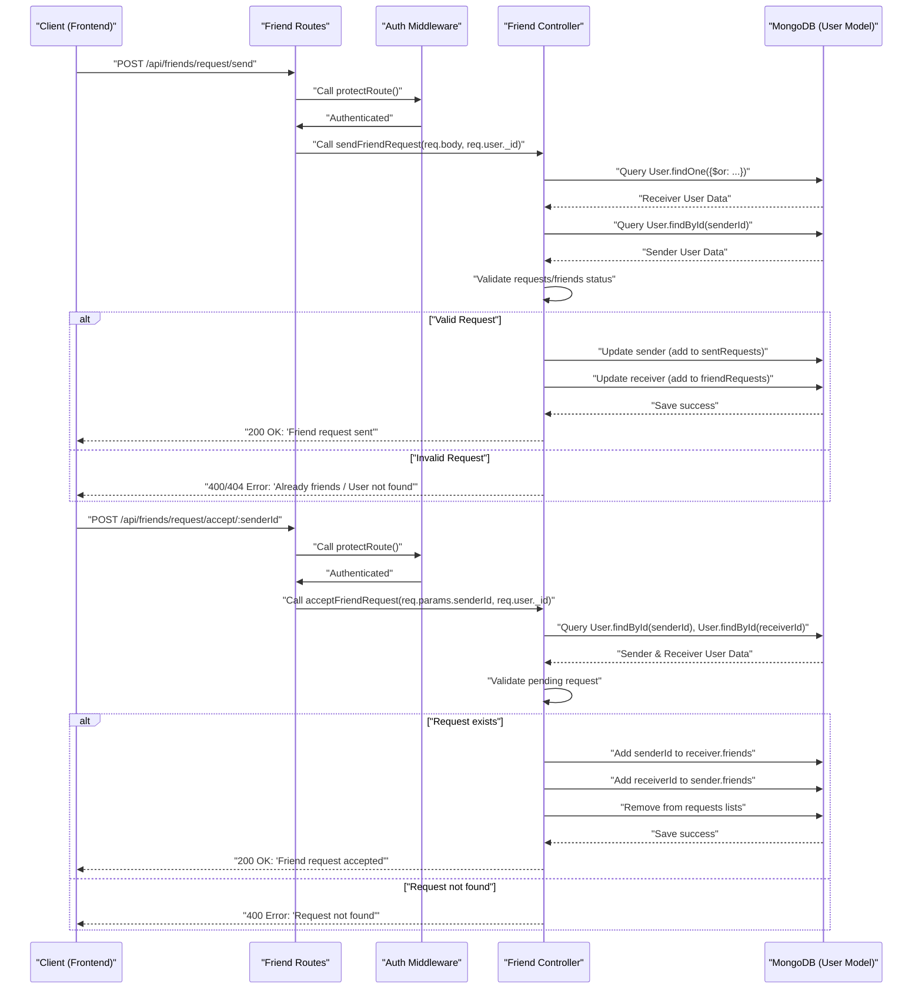
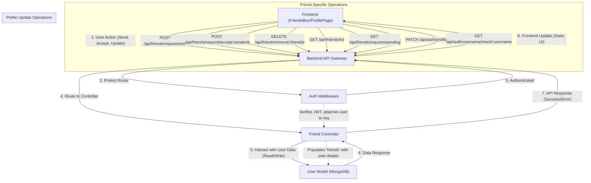

# User and Friend Management

<TOC />

This section covers the core functionalities related to managing user profiles, handling authentication processes, and establishing social connections through friend requests and friend lists. It highlights how the backend API facilitates these operations and how the frontend components interact with these APIs to provide a seamless user experience.

## Backend Implementation: Friend Management API

The backend for user and friend management is primarily handled by the `friend.controller.js` and `friend.route.js` files. These files define the API endpoints and the business logic for sending, accepting, rejecting, and removing friend requests, as well as retrieving friend lists and pending requests.

### Friend Controller (`backend/src/controllers/friend.controller.js`)

This controller contains all the asynchronous functions that perform database operations and respond to client requests related to friend management. It interacts directly with the `User` model to update user's `friends`, `sentRequests`, and `friendRequests` arrays.

#### `sendFriendRequest`

This function allows a user to send a friend request to another user by their username or email. It includes checks to prevent sending requests to oneself, existing friends, or if a request is already pending.

```javascript filename="backend/src/controllers/friend.controller.js"
export const sendFriendRequest = async (req, res) => {
    try {
        const { identifier } = req.body;
        const senderId = req.user._id;

        if (!identifier) {
            return res.status(400).json({ message: "Username or email is required." });
        }

        const receiver = await User.findOne({
            $or: [{ username: identifier }, { email: identifier }]
        });

        if (!receiver) { /* ... handle not found ... */ }
        if (senderId.toString() === receiver._id.toString()) { /* ... handle self-request ... */ }

        const sender = await User.findById(senderId);

        // Extensive checks for existing friendships or pending requests
        if (sender.friends.includes(receiver._id)) { /* ... */ }
        if (sender.sentRequests.includes(receiver._id)) { /* ... */ }
        if (sender.friendRequests.includes(receiver._id)) { /* ... */ }

        sender.sentRequests.push(receiver._id);
        receiver.friendRequests.push(senderId);

        await sender.save();
        await receiver.save();

        res.status(200).json({ message: "Friend request sent successfully." });

    } catch (error) {
        console.error("Error in sendFriendRequest: ", error.message);
        res.status(500).json({ message: "Internal server error", error: error.message });
    }
};
```
[View on GitHub](https://github.com/shinymack/Chat-App-MERN/blob/main/backend/src/controllers/friend.controller.js#L11-L67)

#### `acceptFriendRequest`

This endpoint enables a user to accept a pending friend request. Upon acceptance, both users are added to each other's `friends` list, and the corresponding entries are removed from `friendRequests` and `sentRequests`.

```javascript filename="backend/src/controllers/friend.controller.js"
export const acceptFriendRequest = async (req, res) => {
    try {
        const { senderId } = req.params;
        const receiverId = req.user._id;

        const sender = await User.findById(senderId);
        const receiver = await User.findById(receiverId);

        if (!sender || !receiver) { /* ... handle not found ... */ }
        if (!receiver.friendRequests.includes(senderId)) { /* ... handle request not found ... */ }

        // Add to friends list for both users
        receiver.friends.push(senderId);
        sender.friends.push(receiverId);

        // Remove from requests lists
        receiver.friendRequests = receiver.friendRequests.filter(id => id.toString() !== senderId.toString());
        sender.sentRequests = sender.sentRequests.filter(id => id.toString() !== receiverId.toString());

        await receiver.save();
        await sender.save();

        res.status(200).json({ message: "Friend request accepted." });

    } catch (error) {
        console.error("Error in acceptFriendRequest: ", error.message);
        res.status(500).json({ message: "Internal server error", error: error.message });
    }
};
```
[View on GitHub](https://github.com/shinymack/Chat-App-MERN/blob/main/backend/src/controllers/friend.controller.js#L70-L107)

#### `rejectFriendRequest` and `removeFriend`

These functions handle the rejection of pending requests and the removal of existing friends, respectively. They ensure that both users' records are updated correctly to reflect the change in their relationship status.

#### Retrieval Functions (`getFriends`, `getPendingRequests`, `getSentRequests`)

These functions allow authenticated users to retrieve their list of friends, incoming (pending) friend requests, and outgoing (sent) friend requests. The `populate` method is used with Mongoose to fetch detailed user information (username, email, profile picture) for each related user ID, providing a rich dataset to the frontend.

```javascript filename="backend/src/controllers/friend.controller.js"
export const getFriends = async (req, res) => {
    try {
        const userId = req.user._id;
        const user = await User.findById(userId).populate({
            path: "friends",
            select: "username email profilePic _id"
        });

        if (!user) { return res.status(404).json({ message: "User not found." }); }
        res.status(200).json(user.friends);

    } catch (error) {
        console.error("Error in getFriends: ", error.message);
        res.status(500).json({ message: "Internal server error", error: error.message });
    }
};
```
[View on GitHub](https://github.com/shinymack/Chat-App-MERN/blob/main/backend/src/controllers/friend.controller.js#L182-L200)

### Friend Routes (`backend/src/routes/friend.route.js`)

This file defines the API endpoints for friend management and links them to their respective controller functions. All routes are protected using the `protectRoute` middleware, ensuring that only authenticated users can access them.

```javascript filename="backend/src/routes/friend.route.js"
import express from "express";
import {
    sendFriendRequest,
    acceptFriendRequest,
    rejectFriendRequest,
    removeFriend,
    getFriends,
    getPendingRequests,
    getSentRequests
} from "../controllers/friend.controller.js";
import { protectRoute } from "../middleware/auth.middleware.js";

const router = express.Router();

// All routes here should be protected
router.use(protectRoute);

// Send a friend request to a user
router.post("/request/send/", sendFriendRequest);

// Accept a friend request from a user
router.post("/request/accept/:senderId", acceptFriendRequest);

// Reject a friend request from a user
router.post("/request/reject/:senderId", rejectFriendRequest);

// Remove a friend
router.delete("/remove/:friendId", removeFriend);

// Get the current user's friends list
router.get("/list", getFriends);

// Get pending friend requests for the current user
router.get("/requests/pending", getPendingRequests);

// Get sent friend requests by the current user
router.get("/requests/sent", getSentRequests);

export default router;
```
[View on GitHub](https://github.com/shinymack/Chat-App-MERN/blob/main/backend/src/routes/friend.route.js#L1-L34)

### Friend Management Backend Flow

The following diagram illustrates the lifecycle of a friend request on the backend.





## Frontend Implementation: User and Friend Management

The frontend user and friend management features are primarily implemented in `FriendsBox.jsx` and integrated via `useChatStore`. User profile updates, like changing the profile picture or username, are handled by `ProfilePage.jsx` using `useAuthStore`.

### FriendsBox Component (`frontend/src/components/FriendsBox.jsx`)

The `FriendsBox` component provides a central interface for users to manage their social connections. It features a tabbed navigation for viewing friends, pending requests, and sent requests, along with a form to send new friend requests.

#### State Management with `useChatStore`

The component utilizes a Zustand store (`useChatStore`) to manage the state related to friends and requests. This includes fetching data, sending requests, and handling updates.

```javascript filename="frontend/src/components/FriendsBox.jsx"
import { useEffect, useState } from 'react';
import { useChatStore } from '../store/useChatStore'; // Zustand store
import { X, UserPlus, Check, Trash2 } from 'lucide-react';

const FriendsBox = () => {
    const {
        toggleFriendsBox,
        getFriends, users, // 'users' here represents friends list
        getPendingRequests, pendingRequests,
        getSentRequests, sentRequests,
        sendFriendRequest, acceptFriendRequest, rejectFriendRequest, removeFriend
    } = useChatStore();

    const [activeTab, setActiveTab] = useState('friends');
    const [identifier, setIdentifier] = useState('');

    useEffect(() => {
        // Fetch all necessary data when the component mounts
        getFriends();
        getPendingRequests();
        getSentRequests();
    }, [getFriends, getPendingRequests, getSentRequests]);

    // ... rest of the component
};
```
[View on GitHub](https://github.com/shinymack/Chat-App-MERN/blob/main/frontend/src/components/FriendsBox.jsx#L1-L26)

#### Adding Friends

Users can send friend requests by entering a username or email in the input field. The `handleAddFriend` function dispatches the `sendFriendRequest` action from the `useChatStore`.

```javascript filename="frontend/src/components/FriendsBox.jsx"
    const handleAddFriend = (e) => {
        e.preventDefault();
        if (identifier.trim()) {
            sendFriendRequest(identifier);
            setIdentifier('');
        }
    };
```
[View on GitHub](https://github.com/shinymack/Chat-App-MERN/blob/main/frontend/src/components/FriendsBox.jsx#L28-L34)

#### Dynamic Content Rendering

The `renderContent` function dynamically displays lists based on the `activeTab` state, showing friends, pending requests (with accept/reject buttons), or sent requests.

```javascript filename="frontend/src/components/FriendsBox.jsx"
    const renderContent = () => {
        switch (activeTab) {
            case 'pending':
                return (
                    <div className="space-y-2">
                        {pendingRequests.length > 0 ? pendingRequests.map(req => (
                            <div key={req._id} className="flex items-center justify-between p-2 rounded-lg bg-base-200">
                                <div className="flex items-center gap-3">
                                    
                                    <span>{req.username}</span>
                                </div>
                                <div className="flex gap-2">
                                    <button onClick={() => acceptFriendRequest(req._id)} className="btn btn-xs btn-success btn-circle"><Check size={16}/></button>
                                    <button onClick={() => rejectFriendRequest(req._id)} className="btn btn-xs btn-error btn-circle"><X size={16}/></button>
                                </div>
                            </div>
                        )) : <p className="text-center text-base-content/60 py-4">No pending requests.</p>}
                    </div>
                );
            case 'sent': /* ... */
            case 'friends': /* ... */
            default: /* ... */
        }
    };
```
[View on GitHub](https://github.com/shinymack/Chat-App-MERN/blob/main/frontend/src/components/FriendsBox.jsx#L36-L84)

### ProfilePage Component (`frontend/src/pages/ProfilePage.jsx`)

The `ProfilePage` allows users to view and update their profile information. Key functionalities include:

*   **Profile Picture Upload**: Users can upload a new profile picture, which is converted to a Base64 string and sent to the backend via the `updateProfile` action from `useAuthStore`.
*   **Username Editing**: Users can edit their username with a debounced availability check. This ensures real-time feedback on username uniqueness before saving.

```javascript filename="frontend/src/pages/ProfilePage.jsx"
import { useState, useEffect, useRef } from "react";
import { useAuthStore } from "../store/useAuthStore";
import { Camera, Mail, User, Edit, Save, X, Loader2 } from "lucide-react";
import toast from "react-hot-toast";
import { axiosInstance } from "../lib/axios";

const ProfilePage = () => {
	const { authUser, isUpdatingProfile, updateProfile } = useAuthStore();
	const [selectedImg, setSelectedImg] = useState(null);

	const [isEditingUsername, setIsEditingUsername] = useState(false);
	const [newUsername, setNewUsername] = useState(authUser?.username || "");
	const [usernameStatus, setUsernameStatus] = useState({
		checking: false,
		available: true,
		message: "",
	});
	const debounceTimeout = useRef(null);

	const handleImageUpload = async (e) => { /* ... */ };

	// --- Debounced Username Check ---
	useEffect(() => { /* ... */ }, [newUsername, authUser.username]);
	// ---------------------------------

	const handleSaveUsername = async () => { /* ... */ };
	const handleCancelEdit = () => { /* ... */ };

	return (
		<div className="h-screen pt-20">
            {/* ... JSX for profile display and editing ... */}
		</div>
	);
};

export default ProfilePage;
```
[View on GitHub](https://github.com/shinymack/Chat-App-MERN/blob/main/frontend/src/pages/ProfilePage.jsx#L61-L188)

## Key Integration Points

*   **Authentication Middleware**: The `protectRoute` middleware is crucial for securing all friend-related API endpoints. It ensures that only authenticated users can perform friend management actions, extracting the `userId` from the JWT token attached to the request.
*   **Zustand for Global State**: `useChatStore` and `useAuthStore` are central to managing user and friend-related data across the frontend. This includes the current user's profile, friend lists, and pending requests, enabling real-time updates without complex prop drilling.
*   **API Interaction**: Frontend components (like `FriendsBox` and `ProfilePage`) interact with the backend API endpoints through asynchronous actions defined in their respective Zustand stores. These actions handle API calls (using `axiosInstance`), update the store's state, and provide user feedback (e.g., toasts).
*   **Database Schema**: The `User` model in MongoDB is designed to store references to other users for `friends`, `sentRequests`, and `friendRequests`. Mongoose's `populate` method is then used to efficiently fetch full user details when needed by the frontend, avoiding multiple database queries.
*   **Error Handling**: Both frontend and backend implementations include robust error handling. Backend controllers catch and log errors, sending appropriate HTTP status codes and messages. Frontend actions catch API errors and display user-friendly toast notifications.

### Backend-Frontend Communication for Friend Features

The diagram below illustrates the communication flow between the frontend and backend for various friend management operations.





Next: [Messaging System](./4.2_messaging-system.mdx)