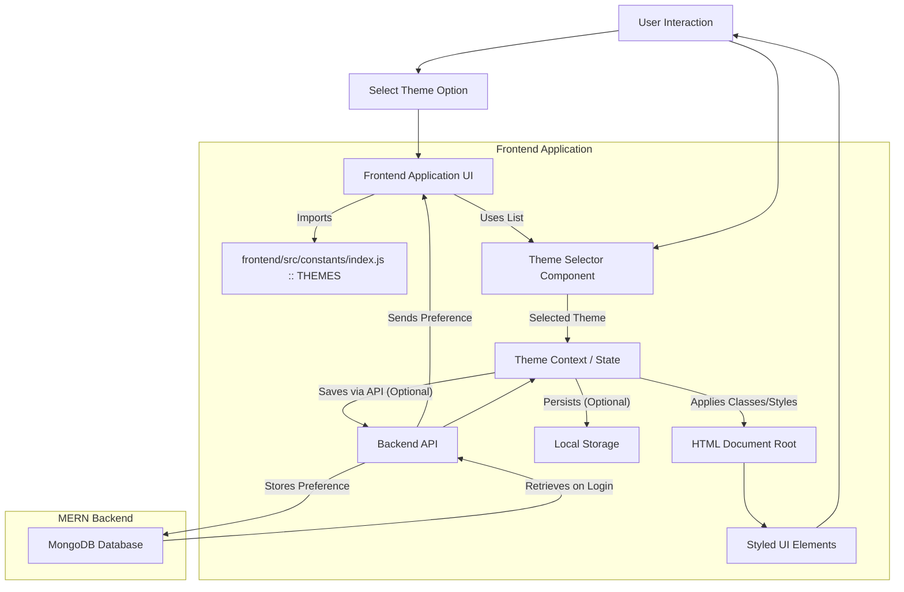
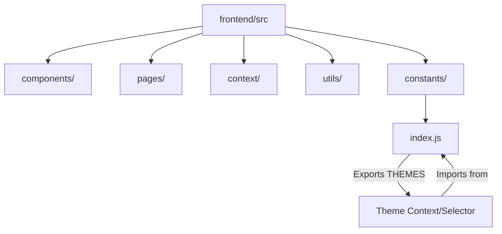

# Constants

<TOC />

## Introduction to Frontend Constants

In modern web applications, especially those built with frameworks like React in a MERN (MongoDB, Express, React, Node.js) stack, maintaining a consistent and manageable codebase is crucial. The `constants` directory serves as a dedicated repository for application-wide static data, configuration settings, and shared values. This centralized approach ensures a single source of truth for critical parameters, enhancing maintainability, readability, and consistency across the frontend.

The `frontend/src/constants/index.js` file, in particular, acts as an entry point for exporting various constants used throughout the application. It encapsulates values that are unlikely to change during runtime but are essential for the application's functionality or user experience.

### Purpose of Centralized Constants

The primary reasons for centralizing constants are:
*   **Consistency**: Ensures that the same value is used everywhere, preventing discrepancies and bugs caused by typos or inconsistent definitions.
*   **Maintainability**: Simplifies updates. If a constant needs to change, it's modified in one place, and the change propagates across the entire application.
*   **Readability**: Using descriptive constant names (e.g., `THEMES`) instead of "magic strings" or numbers makes the code easier to understand and reason about.
*   **Reusability**: Promotes the reuse of common values across different components or modules.
*   **Reduced Errors**: Minimizes the chance of errors related to hardcoded values.

## The `THEMES` Constant: UI Customization

The `frontend/src/constants/index.js` file currently defines a crucial constant related to the application's user interface: `THEMES`. This array holds a comprehensive list of available design themes that users can apply to customize their application experience.

### What is `THEMES`?

The `THEMES` constant is an array of strings, where each string is a unique identifier for a particular UI theme. These theme names likely correspond to predefined stylesheets or configuration objects within a UI library (such as DaisyUI, judging by the theme names provided). By centralizing these theme names, the application establishes a definitive list of supported visual styles.

### Why Centralize Theme Definitions?

The decision to define `THEMES` in a constants file is rooted in several best practices for frontend development:

1.  **Single Source of Truth**: All components that need to reference available themes (e.g., a settings page, a theme switcher component) will import `THEMES` from this single location. This eliminates the risk of conflicting theme lists or outdated options being presented to the user.
2.  **Ease of Management**: Should the application decide to add new themes, remove deprecated ones, or rename existing themes, the change only needs to occur in one file. This significantly reduces the overhead and potential for errors compared to scattered definitions.
3.  **Dynamic UI Adaptation**: The array format allows for dynamic rendering of theme options. A theme selector component can simply map over the `THEMES` array to generate a list of selectable options, ensuring that the UI always reflects the currently supported themes.
4.  **Integration with Styling Systems**: Many modern UI libraries or CSS-in-JS solutions can dynamically apply styles based on a theme identifier. This constant provides the necessary identifiers for such systems to function correctly.

### How `THEMES` is Defined

The `THEMES` constant is declared as an exported array using JavaScript's `export const` syntax. This makes it readily importable into any other module within the frontend application.

```javascript
// frontend/src/constants/index.js
export const THEMES = [
    "light",
    "dark",
    "cupcake",
    "bumblebee",
    "emerald",
    "corporate",
    "synthwave",
    "retro",
    "cyberpunk",
    "valentine",
    "halloween",
    "garden",
    "forest",
    "aqua",
    "lofi",
    "pastel",
    "fantasy",
    "wireframe",
    "black",
    "luxury",
    "dracula",
    "cmyk",
    "autumn",
    "business",
    "acid",
    "lemonade",
    "night",
    "coffee",
    "winter",
    "dim",
    "nord",
    "sunset",
  ];
```
[[Source: frontend/src/constants/index.js#L1-L32](https://github.com/shinymack/Chat-App-MERN/blob/main/frontend/src/constants/index.js#L1-L32)]

This snippet shows the complete definition of the `THEMES` array. Each string element within the array, such as `"light"`, `"dark"`, or `"synthwave"`, represents a distinct visual theme. These names are typically concise and descriptive, reflecting the aesthetic they represent.

### Typical Usage Scenarios

While the provided file only defines the constant, its presence implies several common usage patterns within a MERN frontend application:

1.  **Theme Selector Component**: A React component (e.g., `<ThemeSwitcher />`) would import `THEMES` and render a dropdown or a list of buttons, allowing users to select their preferred theme.
    ```javascript
    // Hypothetical ThemeSwitcher.jsx snippet (illustrative, not from provided files)
    import { THEMES } from '../../constants'; // Example import path

    function ThemeSwitcher() {
      // ... component logic to get/set current theme ...
      return (
        <select onChange={handleThemeChange}>
          {THEMES.map(theme => (
            <option key={theme} value={theme}>
              {theme.charAt(0).toUpperCase() + theme.slice(1)} {/* Capitalize for display */}
            </option>
          ))}
        </select>
      );
    }
    ```
    This hypothetical example illustrates how the `THEMES` array would be iterated over to generate UI elements, ensuring all available themes are presented.

2.  **Context API or Redux Store**: The currently selected theme might be stored in a React Context or a Redux store, making it globally accessible to all components that need to adjust their styling. When a user selects a new theme, this central state is updated.
3.  **Local Storage / Database Integration**: For persistent theme preferences, the user's chosen theme (e.g., `"dark"`) would be saved to `localStorage` in the browser or persisted in the user's profile settings within the MongoDB database via the backend API. Upon application load or user login, this preference would be retrieved and applied.

### Data Flow for Theme Selection

The following diagram illustrates a conceptual data flow for how a user's theme selection might be handled within a MERN application, leveraging the `THEMES` constant.





This diagram highlights how `THEMES` provides the options, and the application's frontend orchestrates the selection, application, and optional persistence of the user's theme preference.

## Architectural Significance and Best Practices

The existence of a `constants` directory, and specifically a file like `index.js` exporting shared values, is a foundational architectural decision that supports a robust and scalable frontend.

### Centralized Configuration Pattern

This approach exemplifies the "Centralized Configuration Pattern." By pulling all configurable and static values into dedicated files, developers ensure that the application's behavior and appearance can be adjusted without delving into the intricate logic of individual components. This separation of concerns is vital for large-scale applications where different teams might work on various parts of the codebase.

### Scalability and Extensibility

As the application grows, the list of themes might expand, or other application-wide configurations (e.g., API endpoints, pagination limits, feature flags) may be introduced. The `constants` directory provides an organized place for these additions, preventing feature creep from cluttering component logic. Adding a new theme is as simple as appending a string to the `THEMES` array.

### Maintainability and Onboarding

For new developers joining the project, browsing the `constants` directory offers a quick overview of the application's fundamental parameters and configurable options. This transparency reduces the learning curve and helps maintain a shared understanding of the project's foundational values.

### File Structure Visualization

A simplified view of the frontend `src` directory and how `constants/index.js` fits within it:





This diagram emphasizes the role of `index.js` within the `constants` directory as a central export point for shared values, like `THEMES`, which are then consumed by various parts of the application, such as theme context providers or selector components.

## Key Insights and Integration Points

The `THEMES` constant is a prime example of how static data can drive dynamic features in a MERN application's frontend.

*   **Frontend UI Integration**: The primary integration point for `THEMES` is the UI layer. Components responsible for theme selection and application would directly import and utilize this constant.
*   **User Experience (UX)**: Offering a variety of themes significantly enhances the user experience by allowing personalization. The structured definition of `THEMES` ensures that this personalization feature is robust and easily extensible.
*   **Backend (Optional) Integration**: While `THEMES` itself is purely a frontend constant, the *user's chosen theme* could be a piece of user-specific data stored in the MongoDB database. When a user logs in, the backend could send their preferred theme, which the frontend then uses to initialize the UI. This establishes a seamless, consistent experience across sessions and devices.
*   **Decoupling Concerns**: By defining themes separately from the components that use them, the application achieves a better separation of concerns. The theme definition is about *what* themes are available, not *how* they are applied or *where* they are selected.

In conclusion, the `constants/index.js` file, containing the `THEMES` array, is a small yet powerful part of the frontend architecture. It embodies principles of maintainability, consistency, and extensibility, laying the groundwork for a flexible and user-friendly application interface within the MERN stack.