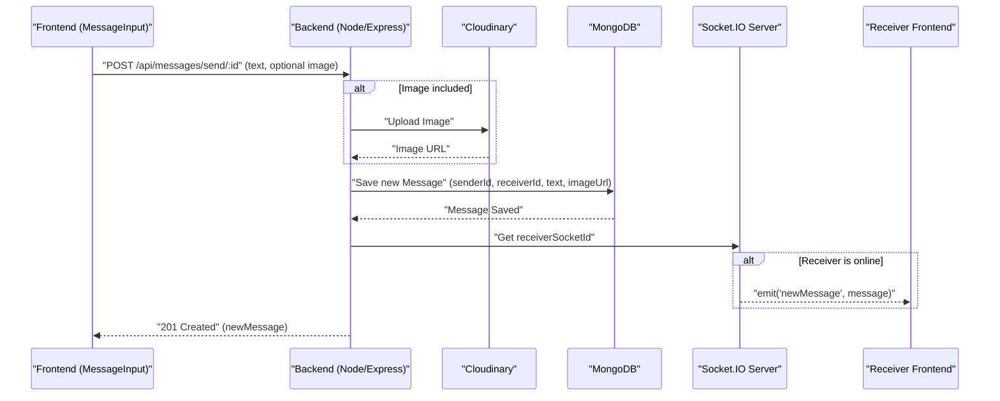
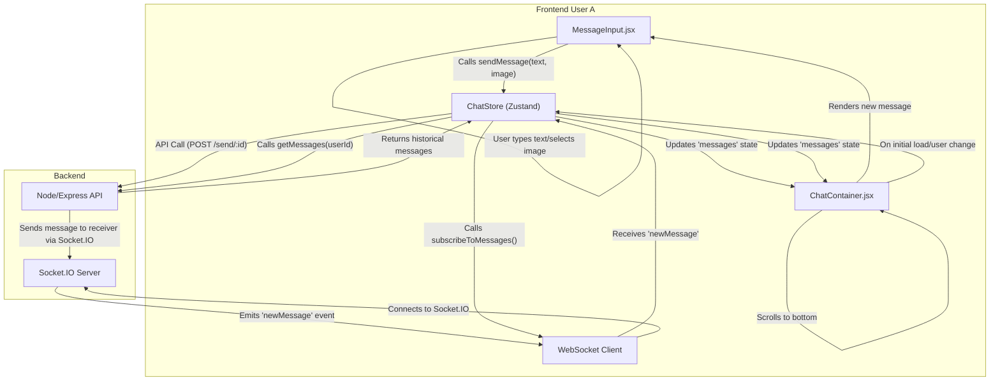

# Messaging System
<TOC />

This section details the core components and interactions involved in our real-time messaging system. It covers how messages are sent, received, stored, and displayed, incorporating both text and image capabilities, along with real-time updates via WebSockets.

## Backend Implementation

The backend is responsible for handling message storage, retrieval, and real-time distribution. It leverages MongoDB for persistent storage, Cloudinary for image hosting, and Socket.IO for real-time communication.

### API Endpoints (`message.route.js`)

The `backend/src/routes/message.route.js` file defines the API routes for message-related operations. All routes are protected by the `protectRoute` middleware to ensure only authenticated users can access them.

```javascript
// backend/src/routes/message.route.js
import express from "express";
import { protectRoute } from "../middleware/auth.middleware.js";
import { getUsersForSidebar, getMessages, sendMessage } from "../controllers/message.controller.js";

const router = express.Router();

router.get("/users", protectRoute, getUsersForSidebar);
router.get("/:id", protectRoute, getMessages);
router.post("/send/:id", protectRoute, sendMessage);

export default router;
```
[View on GitHub](https://github.com/shinymack/Chat-App-MERN/blob/main/backend/src/routes/message.route.js)

-   **GET `/api/messages/users`**: Fetches a list of users for the chat sidebar, excluding the currently logged-in user.
-   **GET `/api/messages/:id`**: Retrieves all messages between the logged-in user and a specific user identified by `id`.
-   **POST `/api/messages/send/:id`**: Sends a new message to the user identified by `id`. This endpoint also handles image uploads.

### Message Controller (`message.controller.js`)

The `backend/src/controllers/message.controller.js` file contains the logic for processing message requests.

#### Sending Messages (`sendMessage`)

The `sendMessage` function handles the creation of new messages. It supports both text and image messages. If an image is provided, it's uploaded to Cloudinary, and the secure URL is stored. After saving the message, it uses Socket.IO to emit the new message in real-time to the receiver if they are online.

```javascript
// backend/src/controllers/message.controller.js
// ... (imports) ...
import cloudinary from "../lib/cloudinary.js";
import { getReceiverSocketId, io } from "../lib/socket.js";

export const sendMessage = async (req, res) => {
    try {
        const { text, image } = req.body;
        const { id: receiverId } = req.params;
        const senderId = req.user._id;

        let imageUrl;
        if (image) {
            const uploadResponse = await cloudinary.uploader.upload(image);
            imageUrl = uploadResponse.secure_url;
        }
        const newMessage = new Message({
            senderId,
            receiverId,
            text,
            image: imageUrl,
        });

        await newMessage.save();

        const receiverSocketId = getReceiverSocketId(receiverId);
        if(receiverSocketId) {
            io.to(receiverSocketId).emit("newMessage", newMessage);
        }

        res.status(201).json(newMessage);   
        
    } catch (error) {
        console.log("Error in sendMessage controller:  ", error);
        res.status(500).json({ error: "Internal Server Error" });
    }
};
```
[View on GitHub](https://github.com/shinymack/Chat-App-MERN/blob/main/backend/src/controllers/message.controller.js#L42-L78)

#### Retrieving Conversation History (`getMessages`)

This function fetches all messages exchanged between two specific users (sender and receiver). It uses a MongoDB `$or` query to find messages where the logged-in user is either the sender or the receiver, and the other user is the respective opposite.

```javascript
// backend/src/controllers/message.controller.js
// ... (imports) ...

export const getMessages = async (req, res) => {
    try {
        const {id : userToChatId } = req.params;
        const myId = req.user._id;

        const messages = await Message.find({
            $or: [
                {senderId: myId, receiverId:userToChatId},
                {senderId: userToChatId, receiverId: myId}
            ]
        });
        res.status(200).json(messages);
    } catch (error) {
        console.log("Error in getMessages controller:  ", error);
        res.status(500).json({ error: "Internal Server Error" });
    }
};
```
[View on GitHub](https://github.com/shinymack/Chat-App-MERN/blob/main/backend/src/controllers/message.controller.js#L26-L40)

### Message Sending Flow
Here's a diagram illustrating the flow when a user sends a message, including image upload and real-time notification.





## Frontend Implementation

The frontend components, `MessageInput.jsx` and `ChatContainer.jsx`, work together to allow users to compose and view messages in real-time.

### Composing Messages (`MessageInput.jsx`)

The `frontend/src/components/MessageInput.jsx` component provides the interface for typing text messages and selecting images to send. It manages local state for the message text and image preview. When an image is selected, it's displayed as a preview. The `sendMessage` action from the `useChatStore` Zustand store is dispatched to send the message.

```javascript
// frontend/src/components/MessageInput.jsx
import { useRef, useState } from "react";
import { useChatStore } from "../store/useChatStore";
import { Image, Send, X } from "lucide-react";
import toast from "react-hot-toast";

const MessageInput = () => {
    const [text, setText] = useState("");
    const [imagePreview, setImagePreview] = useState(null);
    const fileInputRef = useRef(null);
    const { sendMessage } = useChatStore();

    const handleImageChange = (e) => {
        const file = e.target.files[0];
        if (!file.type.startsWith("image/")) {
            toast.error("Please select an image file");
            return;
        }

        const reader = new FileReader();
        reader.onloadend = () => {
            setImagePreview(reader.result);
        };
        reader.readAsDataURL(file);
    };

    const removeImage = () => {
        setImagePreview(null);
        if (fileInputRef.current) fileInputRef.current.value = "";
    };

    const handleSendMessage = async (e) => {
        e.preventDefault();
        if (!text.trim() && !imagePreview) return;

        try {
            await sendMessage({
                text: text.trim(),
                image: imagePreview, // Base64 encoded image
            });

            setText("");
            setImagePreview(null);
            if (fileInputRef.current) fileInputRef.current = "";
        } catch (error) {
            console.error("Failed to send message", error);
        }
    };

    // ... (JSX for input, image preview, send button) ...
};

export default MessageInput;
```
[View on GitHub](https://github.com/shinymack/Chat-App-MERN/blob/main/frontend/src/components/MessageInput.jsx)

### Displaying Messages (`ChatContainer.jsx`)

The `frontend/src/components/ChatContainer.jsx` component is responsible for displaying the chat history and real-time updates. It utilizes the `useChatStore` to access and update messages.

```javascript
// frontend/src/components/ChatContainer.jsx
import { useEffect } from "react";
import { useChatStore } from "../store/useChatStore";
import ChatHeader from "./ChatHeader";
import MessageInput from "./MessageInput";
import MessageSkeleton from "./skeletons/MessageSkeleton";
import { useAuthStore } from "../store/useAuthStore";
import { formatMessageTime } from "../lib/utils";
import { useRef } from "react";

const ChatContainer = () => {
    const { messages, getMessages, isMessagesLoading, selectedUser, subscribeToMessages, unsubscribeFromMessages } =
        useChatStore();
    const { authUser } = useAuthStore();
    const messageEndRef = useRef(null);

    useEffect(() => {
        // Fetch historical messages for the selected user
        getMessages(selectedUser._id);
        // Subscribe to real-time message updates via WebSockets
        subscribeToMessages();

        // Cleanup: unsubscribe when component unmounts or selected user changes
        return () => unsubscribeFromMessages();
    }, [selectedUser._id, getMessages, subscribeToMessages, unsubscribeFromMessages]);
    
    useEffect(() => {
        // Scroll to the latest message whenever messages array updates
        if(messageEndRef.current && messages){
            messageEndRef.current.scrollIntoView({behaviour : "smooth"})
        }
    }, [messages])

    if (isMessagesLoading)
        return (
            <div className="flex-1 flex flex-col overflow-auto">
                <ChatHeader />
                <MessageSkeleton />
                <MessageInput />
            </div>
        );
    return (
        <div className="flex-1 flex flex-col overflow-auto">
            <ChatHeader />
            <div className="flex-1 overflow-y-auto p-4 space-y-4">
                {messages.map((message) => (
                    <div
                        key={message._id}
                        className={`chat ${message.senderId == authUser._id ? "chat-end": "chat-start"} `}
                        ref={messageEndRef}
                    >
                        <div className="chat-image avatar">
                            <div className="size-9 rounded-full border">
                                
                            </div>
                        </div>
                        <div className="chat-header mb-1">
                            <time className="text-xs opacity-50 ml-1">{formatMessageTime(message.createdAt)}</time>
                        </div>
                        <div className="chat-bubble flex flex-col">
                            {message.image && (
                                
                            )}
                            {message.text && <p>{message.text}</p>}
                        </div>
                    </div>
                ))}
            </div>
            <MessageInput />
        </div>
    );
};

export default ChatContainer;
```
[View on GitHub](https://github.com/shinymack/Chat-App-MERN/blob/main/frontend/src/components/ChatContainer.jsx)

Key functionalities:
-   **Fetching Messages**: On component mount or `selectedUser` change, it calls `getMessages(selectedUser._id)` to load the conversation history.
-   **Real-time Subscription**: `subscribeToMessages()` is called to set up a WebSocket listener for new messages, ensuring the UI updates instantly. `unsubscribeFromMessages()` is called on cleanup.
-   **Auto-scrolling**: The `messageEndRef` is used to automatically scroll to the bottom of the chat container when new messages arrive.
-   **Conditional Rendering**: Messages are rendered with different styles based on whether the `authUser` is the sender or receiver, including displaying images if present.

### Frontend Message Handling Flow
This diagram illustrates the frontend's process of sending a message and how it subscribes to real-time updates.





## Key Integration Points

-   **Real-time Communication**: The system leverages Socket.IO on both the backend and frontend to enable instant message delivery. The `getReceiverSocketId` utility on the backend ensures messages are sent directly to the intended recipient's active socket.
-   **Authentication**: All message-related API endpoints are protected using `protectRoute` middleware, verifying the authenticity of the user making the request before processing.
-   **Image Handling**: Cloudinary is integrated for efficient and scalable image storage. Frontend uploads base64 encoded images, which the backend then processes and uploads to Cloudinary, storing the secure URL in the database.
-   **State Management**: Zustand is used on the frontend (`useChatStore`, `useAuthStore`) for managing global chat state, including selected user, messages, and loading states, ensuring a responsive UI.
-   **Database Interactions**: MongoDB stores message data, including `senderId`, `receiverId`, `text`, and `image` URL. Efficient queries fetch conversation history.

Next: [Shared Utilities and Helpers](./5.1_shared-utilities-and-helpers.mdx)