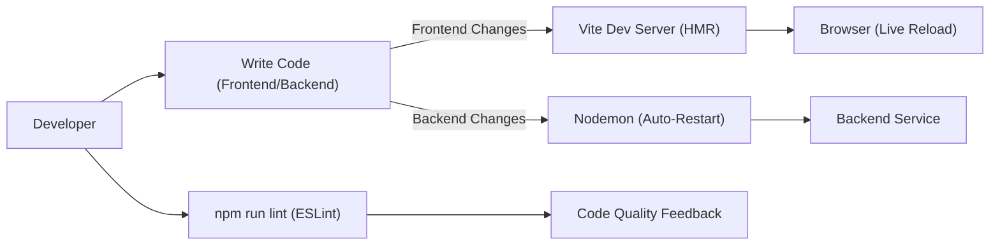

# Configuration and Development Setup
<TOC />

This section provides a comprehensive overview of the project's configuration and development setup. It details the essential files that govern dependency management, build processes, and styling for both the frontend and backend components. Understanding these configurations is crucial for setting up a development environment, deploying the application, and ensuring consistent code quality.

We'll explore `package.json` files for dependency and script management, `vite.config.js` for frontend build orchestration, and `tailwind.config.js` for styling and theme customization.

## Backend Configuration

The backend, powered by Node.js and Express, manages API requests, database interactions, authentication, and real-time communication. Its configuration is primarily defined in `backend/package.json`.

### `backend/package.json` Overview
This file lists all the core dependencies required for the server-side operations and defines scripts for running and developing the backend.

```json
// backend/package.json
{
  "name": "backend",
  "version": "1.0.0",
  "main": "src/index.js",
  "scripts": {
    "dev": "nodemon src/index.js",
    "start": "node src/index.js"
  },
  "type": "module",
  "dependencies": {
    "bcryptjs": "^2.4.3",
    "cloudinary": "^2.5.1",
    "cookie-parser": "^1.4.7",
    "dotenv": "^16.4.7",
    "express": "^4.21.2",
    "express-session": "^1.18.1",
    "jsonwebtoken": "^9.0.2",
    "mongoose": "^8.9.5",
    "passport": "^0.7.0",
    "passport-google-oauth20": "^2.0.0",
    "socket.io": "^4.8.1"
  },
  "devDependencies": {
    "nodemon": "^3.1.9"
  }
}
```
[View on GitHub](https://github.com/shinymack/Chat-App-MERN/blob/main/backend/package.json)

**Key Dependencies:**

*   **`express`**: The core web framework for building RESTful APIs.
*   **`mongoose`**: An ODM (Object Data Modeling) library for MongoDB, simplifying database interactions.
*   **`socket.io`**: Enables real-time, bidirectional, event-based communication between the server and clients, crucial for chat functionality.
*   **`bcryptjs`**: Used for hashing passwords to securely store user credentials.
*   **`jsonwebtoken`**: For implementing JWT-based authentication, handling user sessions securely.
*   **`passport` & `passport-google-oauth20`**: Authentication middleware for Node.js, specifically configured for Google OAuth 2.0.
*   **`cloudinary`**: Integrates with Cloudinary for cloud-based image and video management, used for user profile pictures or media sharing.
*   **`dotenv`**: Loads environment variables from a `.env` file, keeping sensitive configuration separate from the codebase.
*   **`cookie-parser`**: Parses Cookie header and populates `req.cookies` with an object keyed by cookie names.
*   **`express-session`**: Middleware for handling sessions, often used with Passport.

**Development Scripts:**

The `scripts` section defines commands for development and production.

```json
// backend/package.json (scripts snippet)
"scripts": {
  "dev": "nodemon src/index.js",
  "start": "node src/index.js"
},
```
[View on GitHub](https://github.com/shinymack/Chat-App-MERN/blob/main/backend/package.json#L6-L9)

*   `npm run dev`: Starts the backend server using `nodemon`. `nodemon` automatically restarts the server when file changes are detected, accelerating the development cycle.
*   `npm start`: Runs the backend server in production mode using Node.js directly.

## Frontend Configuration

The frontend is built with React and Vite, offering a fast development experience and optimized builds. Its configuration is spread across `frontend/package.json`, `frontend/vite.config.js`, and `frontend/tailwind.config.js`.

### `frontend/package.json` Overview
This file manages all frontend dependencies, development tools, and scripts.

```json
// frontend/package.json
{
  "name": "frontend",
  "private": true,
  "version": "0.0.0",
  "type": "module",
  "scripts": {
    "dev": "vite",
    "build": "vite build",
    "lint": "eslint .",
    "preview": "vite preview",
    "mobile": "vite --host"
  },
  "dependencies": {
    "axios": "^1.7.9",
    "cors": "^2.8.5",
    "lucide-react": "^0.471.1",
    "react": "^18.3.1",
    "react-dom": "^18.3.1",
    "react-hot-toast": "^2.5.1",
    "react-icons": "^5.5.0",
    "react-router-dom": "^7.1.1",
    "socket.io-client": "^4.8.1",
    "zustand": "^5.0.3"
  },
  "devDependencies": {
    "@eslint/js": "^9.17.0",
    "@types/react": "^18.3.18",
    "@types/react-dom": "^18.3.5",
    "@vitejs/plugin-react": "^4.3.4",
    "autoprefixer": "^10.4.20",
    "daisyui": "^4.12.23",
    "eslint": "^9.17.0",
    "eslint-plugin-react": "^7.37.2",
    "eslint-plugin-react-hooks": "^5.0.0",
    "eslint-plugin-react-refresh": "^0.4.16",
    "globals": "^15.14.0",
    "postcss": "^8.5.0",
    "tailwindcss": "^3.4.17",
    "vite": "^6.3.5"
  }
}
```
[View on GitHub](https://github.com/shinymack/Chat-App-MERN/blob/main/frontend/package.json)

**Key Dependencies:**

*   **`react` & `react-dom`**: The core libraries for building user interfaces.
*   **`axios`**: A promise-based HTTP client for making API requests to the backend.
*   **`react-router-dom`**: For declarative routing in a React application.
*   **`socket.io-client`**: The client-side library to establish real-time connections with the backend.
*   **`zustand`**: A small, fast, and scalable state-management solution for React.
*   **`react-hot-toast`**: A lightweight and customizable toast notification library.
*   **`lucide-react` & `react-icons`**: Collections of popular, customizable icon libraries.
*   **`cors`**: Although typically a backend dependency, it's listed here which might be for specific development setup, perhaps for local proxying.

**Development Dependencies (`devDependencies`):**

*   **`vite`**: The next-generation frontend tooling, providing an extremely fast development server and optimized build processes.
*   **`@vitejs/plugin-react`**: The official Vite plugin for React, enabling Fast Refresh.
*   **`eslint`**: A popular linter for identifying and reporting on patterns in JavaScript code, ensuring code quality and consistency.
*   **`tailwindcss`**: A utility-first CSS framework for rapidly building custom designs.
*   **`autoprefixer`**: A PostCSS plugin to parse CSS and add vendor prefixes to CSS rules.
*   **`daisyui`**: A Tailwind CSS component library that makes it easy to build UIs with pre-built components and themes.
*   **`postcss`**: A tool for transforming CSS with JavaScript plugins.

**Frontend Scripts:**

The `scripts` section provides commands for frontend development, building, and quality checks.

```json
// frontend/package.json (scripts snippet)
"scripts": {
  "dev": "vite",
  "build": "vite build",
  "lint": "eslint .",
  "preview": "vite preview",
  "mobile": "vite --host"
},
```
[View on GitHub](https://github.com/shinymack/Chat-App-MERN/blob/main/frontend/package.json#L7-L13)

*   `npm run dev`: Starts the Vite development server with Hot Module Replacement (HMR).
*   `npm run build`: Compiles the React application for production, generating optimized static assets.
*   `npm run lint`: Runs ESLint across the codebase to check for code style issues and potential errors.
*   `npm run preview`: Locally serves the production build for testing.
*   `npm run mobile`: Starts the Vite development server accessible on the local network (`--host`), useful for testing on mobile devices.

### Vite Configuration (`frontend/vite.config.js`)
Vite's configuration is minimal due to its sensible defaults. This file primarily ensures React Fast Refresh is enabled.

```javascript
// frontend/vite.config.js
import { defineConfig } from 'vite'
import react from '@vitejs/plugin-react'

// https://vitejs.dev/config/
export default defineConfig({
  plugins: [react()],
})
```
[View on GitHub](https://github.com/shinymack/Chat-App-MERN/blob/main/frontend/vite.config.js)

The `plugins: [react()]` line integrates `@vitejs/plugin-react`, which provides:
*   **React Fast Refresh**: Preserves component state on code changes for a smooth development experience.
*   **JSX support**: Transpiles JSX syntax.
*   **Other optimizations**: Ensures React works efficiently within the Vite ecosystem.

### Tailwind CSS Configuration (`frontend/tailwind.config.js`)
This file customizes Tailwind CSS and integrates DaisyUI, defining content paths, custom themes, and plugins.

```javascript
// frontend/tailwind.config.js
import daisyui from "daisyui"

/** @type {import('tailwindcss').Config} */
export default {
  content: [
    "./index.html",
    "./src/**/*.{js,ts,jsx,tsx}",
  ],
  theme: {
    extend: {
      fontFamily : {
        chivo : ['Chivo', 'sans-serif'],
      }
    },
  },
  plugins: [daisyui],
  daisyui : {
 themes: [
      "light", "dark", "cupcake", "bumblebee", "emerald", "corporate",
      "synthwave", "retro", "cyberpunk", "valentine", "halloween",
      "garden", "forest", "aqua", "lofi", "pastel", "fantasy",
      "wireframe", "black", "luxury", "dracula", "cmyk", "autumn",
      "business", "acid", "lemonade", "night", "coffee", "winter",
      "dim", "nord", "sunset",
    ],
  }
}
```
[View on GitHub](https://github.com/shinymack/Chat-App-MERN/blob/main/frontend/tailwind.config.js)

*   **`content`**: Specifies the files where Tailwind CSS should scan for class names. This is crucial for Tailwind's JIT (Just-In-Time) compiler to only include the CSS utilities actually used in the project, resulting in a minimal production build size.
*   **`theme.extend`**: Allows extending Tailwind's default theme. Here, a custom font family `chivo` is added, enabling its use across the application.
*   **`plugins: [daisyui]`**: Integrates the DaisyUI component library as a Tailwind plugin. DaisyUI provides a vast collection of pre-designed, customizable UI components that adhere to Tailwind's utility-first principles.
*   **`daisyui.themes`**: An extensive list of themes provided by DaisyUI, allowing for quick theme switching and a highly customizable aesthetic. This enables the application to support various visual styles, including light, dark, and specialized themes like "synthwave" or "dracula".

## Development Environment Setup

To get the application running, both the frontend and backend need to be started.

1.  **Backend Setup**:
    *   Navigate to the `backend/` directory.
    *   Install dependencies: `npm install`
    *   Start the development server: `npm run dev`
    The backend will typically run on `http://localhost:5000` (or as configured in `.env`).

2.  **Frontend Setup**:
    *   Navigate to the `frontend/` directory.
    *   Install dependencies: `npm install`
    *   Start the development server: `npm run dev`
    The frontend will typically run on `http://localhost:5173` (or the default Vite port). For mobile testing, use `npm run mobile` to expose it on your local network.

## Key Integration Points

The configuration files described above work in concert to establish a robust and efficient development and deployment workflow for the MERN stack chat application.

*   **Real-time Communication**: The `socket.io` dependency in the backend and `socket.io-client` in the frontend are fundamental for the chat application's real-time features. These configurations enable instant message delivery and status updates without requiring page refreshes.
*   **API Interaction**: `axios` on the frontend facilitates smooth communication with the `express` backend. This includes user authentication (via `jsonwebtoken` and `passport`), sending and receiving messages, and fetching user data.
*   **Styling and Theming**: The `tailwind.config.js` with `daisyui` provides a powerful and flexible styling system. This allows developers to rapidly build UIs with utility classes while also having access to a rich set of pre-built, themeable components, ensuring a consistent and customizable user experience.
*   **Developer Experience**: `nodemon` for the backend and `vite` with Fast Refresh for the frontend significantly enhance developer productivity by providing instant feedback on code changes. ESLint ensures code quality and adherence to best practices, catching potential issues early in the development cycle.

This integrated approach ensures that the application is not only functional but also maintainable, scalable, and provides a smooth development experience.


```mermaid
graph TD
    A["User Interface (React)"] -->|HTTP API (Axios)| B["Backend API (Express)"]
    A -- WebSocket (Socket.IO-Client) --> B
    B -->|ORM/ODM (Mongoose)| C["Database (MongoDB)"]
    B -->|Auth (Passport/JWT)| D["Authentication Service"]
    B -->|Cloud Storage| E["Cloudinary (Images)"]
```




