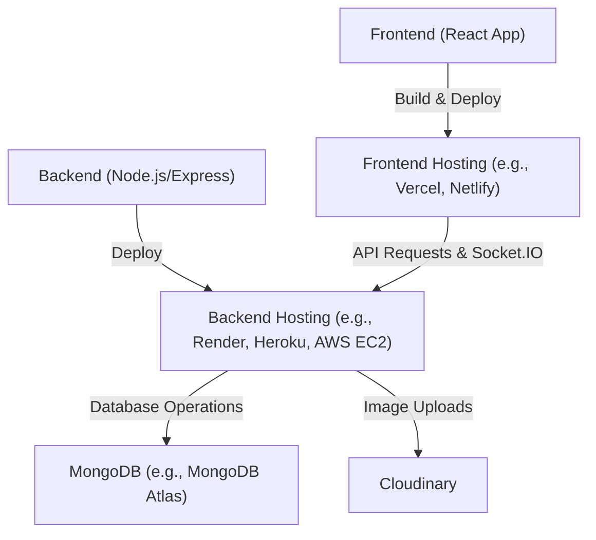
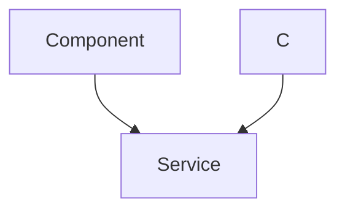

---
title: "Deployment and Operations"
description: "Instructions for deploying and maintaining the chat application."
sidebar_position: 4
---

# Deployment and Operations

<TOC />

This section provides comprehensive instructions for deploying and maintaining the MERN (MongoDB, Express.js, React, Node.js) chat application. It covers environment configuration, key integration points, and operational best practices.

The MERN Chatapp project, as noted in the `README.md`, is inspired by a tutorial series, providing a solid foundation for a real-time communication platform.

## Environmental Configuration

### Cloudinary Integration

The application uses Cloudinary for media management, specifically for handling user profile pictures or other image uploads. Proper configuration of Cloudinary is essential for image-related features to function.

To configure Cloudinary, you need to set up environment variables for your Cloudinary credentials. These are typically stored in a `.env` file in the `backend` directory.

```javascript showLineNumbers
// backend/src/lib/cloudinary.js
import {v2 as cloudinary} from "cloudinary"
import { config } from 'dotenv'

config(); // Loads environment variables from .env file

cloudinary.config(
    {cloud_name: process.env.CLOUDINARY_CLOUD_NAME,
    api_key: process.env.CLOUDINARY_API_KEY,
    api_secret: process.env.CLOUDINARY_API_SECRET,}
);

export default cloudinary;
```
<p align="center">
  <a href="https://github.com/shinymack/Chat-App-MERN/blob/main/backend/src/lib/cloudinary.js" target="_blank">View on GitHub</a>
</p>

**Required Environment Variables:**

*   `CLOUDINARY_CLOUD_NAME`: Your Cloudinary cloud name.
*   `CLOUDINARY_API_KEY`: Your Cloudinary API key.
*   `CLOUDINARY_API_SECRET`: Your Cloudinary API secret.

Ensure these variables are correctly set in your deployment environment (e.g., Netlify, Vercel, Render, Heroku) to avoid issues with image uploads.

### Real-time Communication with Socket.IO

The chat application leverages Socket.IO for real-time bidirectional communication, enabling instant message delivery and online user presence.

The `socket.js` file initializes the Socket.IO server and manages user connections.

```javascript showLineNumbers
// backend/src/lib/socket.js
import { Server } from "socket.io";
import http from "http";
import express from "express";

const app = express();
const server = http.createServer(app);

const io = new Server(server, {
    cors: {
        origin: ["http://localhost:5173"] // Configure allowed origins for production
    }
})

// ... other socket logic ...

export { io, app, server };
```
<p align="center">
  <a href="https://github.com/shinymack/Chat-App-MERN/blob/main/backend/src/lib/socket.js" target="_blank">View on GitHub</a>
</p>

For production deployments, the `cors.origin` array in the `socket.js` file **must** be updated to include the URL(s) of your deployed frontend application. Failure to do so will result in connection errors.

**Example for Production:**

```javascript
// ...
const io = new Server(server, {
    cors: {
        origin: ["https://your-frontend-app.com", "http://localhost:5173"]
    }
})
// ...
```

### Frontend Dependencies

The `frontend/package.json` file outlines all the dependencies required for the client-side application. These dependencies are crucial for building and running the React application.

```json showLineNumbers
// frontend/package.json
{
  "name": "frontend",
  "private": true,
  "version": "0.0.0",
  "type": "module",
  "scripts": {
    "dev": "vite",
    "build": "vite build",
    "lint": "eslint .",
    "preview": "vite preview",
    "mobile": "vite --host"
  },
  "dependencies": {
    "axios": "^1.7.9",
    "cors": "^2.8.5",
    "lucide-react": "^0.471.1",
    "react": "^18.3.1",
    "react-dom": "^18.3.1",
    "react-hot-toast": "^2.5.1",
    "react-icons": "^5.5.0",
    "react-router-dom": "^7.1.1",
    "socket.io-client": "^4.8.1",
    "zustand": "^5.0.3"
  },
  "devDependencies": {
    // ... development dependencies ...
  }
}
```
<p align="center">
  <a href="https://github.com/shinymack/Chat-App-MERN/blob/main/frontend/package.json" target="_blank">View on GitHub</a>
</p>

**Key Dependencies for Operations:**

*   `axios`: For making HTTP requests to the backend API.
*   `socket.io-client`: The client-side library for establishing and managing Socket.IO connections with the backend.
*   `react-router-dom`: For client-side routing.
*   `zustand`: A lightweight state management solution used in the frontend.

During deployment, ensure that all dependencies are installed using `npm install` or `yarn install` before running the build process (`npm run build`).

## Deployment Process Overview

The deployment of the MERN Chatapp typically involves deploying the frontend and backend separately, often to different hosting providers or as distinct services on the same platform.





## Key Integration Points

### Socket.IO Connection Flow

The Socket.IO connection is critical for the real-time functionality of the chat application. Understanding its flow helps in debugging and ensuring proper setup.





**Best Practices:**

*   **Secure API Keys:** Never expose sensitive API keys directly in client-side code. Use environment variables and proxy requests through your backend if necessary.
*   **CORS Configuration:** Always explicitly define your `CORS` origins for both the main Express app and the Socket.IO server to prevent cross-origin issues.
*   **Error Logging:** Implement robust logging on both frontend and backend to quickly identify and diagnose issues during deployment and operation.
*   **Scalability:** For high-traffic applications, consider load balancing the backend servers and using a distributed Pub/Sub system (e.g., Redis Pub/Sub) with Socket.IO for managing connections across multiple instances.
*   **Frontend Build Optimization:** Before deploying the frontend, ensure you run `npm run build` to create an optimized production build, which includes minification, code splitting, and other performance enhancements.
*   **Backend Process Management:** Use process managers like PM2 for Node.js applications in production to keep your server running, automatically restart it on crashes, and manage clusters.

By carefully following these deployment instructions and best practices, you can ensure a smooth and reliable operation of your MERN chat application.
```