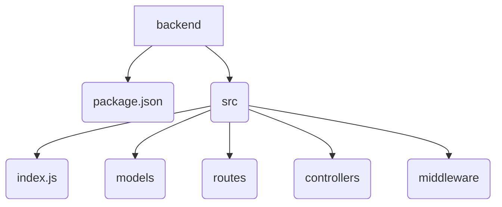
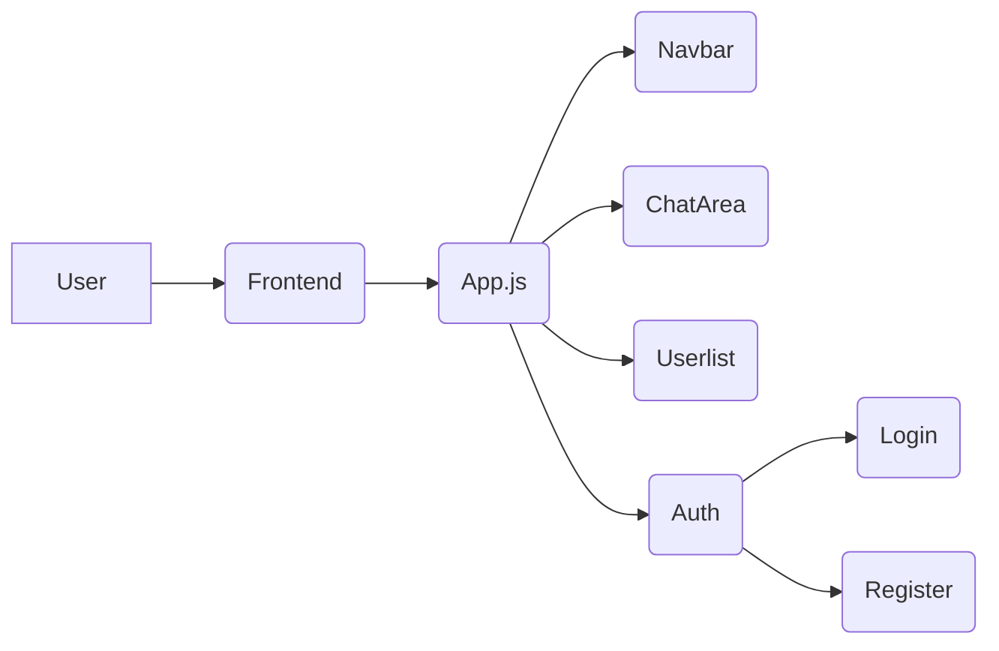

# Deployment and Setup

<TOC />

## Project Overview

This document outlines the deployment and setup instructions for a MERN (MongoDB, Express.js, React, Node.js) chat application.  The application consists of two main parts: a backend server and a frontend client. The backend handles user authentication, database interactions, and real-time communication via Socket.IO, while the frontend provides the user interface for chatting.  The project's source code can be found on GitHub: [Source](https://github.com/shinymack/Chat-App-MERN/blob/main/).  Credits for the original tutorial are given in the `README.md` file: [Source](https://github.com/shinymack/Chat-App-MERN/blob/main/README.md).

## Backend Setup

The backend, located in the `backend` directory, is built using Node.js and Express.js.  It utilizes several libraries for various functionalities:

* **`mongoose`**: For interacting with a MongoDB database.
* **`express`**:  The web framework for building the backend API.
* **`bcryptjs`**: For password hashing and security.
* **`cookie-parser`**: For managing cookies in sessions.
* **`dotenv`**: To load environment variables.
* **`express-session`**: For managing user sessions.
* **`jsonwebtoken`**: For creating and verifying JSON Web Tokens (JWTs) for authentication.
* **`passport`**: An authentication middleware for handling various authentication strategies (Google OAuth2 in this case).
* **`passport-google-oauth20`**: Specifically for Google OAuth 2.0 authentication.
* **`socket.io`**: For handling real-time communication between clients.
* **`cloudinary`**: (Likely) for image/media uploads and management.

### Backend Dependencies

The `backend/package.json` file lists all the required packages and their versions.


```json
{
  "name": "backend",
  "version": "1.0.0",
  "main": "src/index.js",
  "scripts": {
    "dev": "nodemon src/index.js",
    "start": "node src/index.js"
  },
  "author": "",
  "type": "module",
  "license": "ISC",
  "description": "",
  "dependencies": {
    "bcryptjs": "^2.4.3",
    "cloudinary": "^2.5.1",
    "cookie-parser": "^1.4.7",
    "dotenv": "^16.4.7",
    "express": "^4.21.2",
    "express-session": "^1.18.1",
    "jsonwebtoken": "^9.0.2",
    "mongoose": "^8.9.5",
    "passport": "^0.7.0",
    "passport-google-oauth20": "^2.0.0",
    "socket.io": "^4.8.1"
  },
  "devDependencies": {
    "nodemon": "^3.1.9"
  }
}
```

[Source](https://github.com/shinymack/Chat-App-MERN/blob/main/backend/package.json)

To install these dependencies, navigate to the `backend` directory and run: `npm install`

The `scripts` section defines commands for development (`npm run dev` starts the server with `nodemon` for automatic restarts on code changes) and production (`npm start` starts the server).

### Backend File Structure (Illustrative)

`




## Frontend Setup

The frontend, located in the `frontend` directory, is a React application built using Vite.  It utilizes several libraries:

* **`react`**, **`react-dom`**: Core React libraries.
* **`react-router-dom`**: For routing within the application.
* **`axios`**: For making HTTP requests to the backend API.
* **`socket.io-client`**: The client-side library for Socket.IO communication.
* **`zustand`**: A small, fast, scalable state management solution.
* **`lucide-react`**, **`react-icons`**: Icon libraries.
* **`react-hot-toast`**: For displaying notifications.
* **`tailwindcss`**, **`daisyui`**: Styling libraries.


### Frontend Dependencies

The `frontend/package.json` specifies the frontend's dependencies.

```json
{
  "name": "frontend",
  "private": true,
  "version": "0.0.0",
  "type": "module",
  "scripts": {
    "dev": "vite",
    "build": "vite build",
    "lint": "eslint .",
    "preview": "vite preview",
    "mobile": "vite --host"
  },
  "dependencies": {
    "axios": "^1.7.9",
    "cors": "^2.8.5",
    "lucide-react": "^0.471.1",
    "react": "^18.3.1",
    "react-dom": "^18.3.1",
    "react-hot-toast": "^2.5.1",
    "react-icons": "^5.5.0",
    "react-router-dom": "^7.1.1",
    "socket.io-client": "^4.8.1",
    "zustand": "^5.0.3"
  },
  "devDependencies": {
    "@eslint/js": "^9.17.0",
    "@types/react": "^18.3.18",
    "@types/react-dom": "^18.3.5",
    "@vitejs/plugin-react": "^4.3.4",
    "autoprefixer": "^10.4.20",
    "daisyui": "^4.12.23",
    "eslint": "^9.17.0",
    "eslint-plugin-react": "^7.37.2",
    "eslint-plugin-react-hooks": "^5.0.0",
    "eslint-plugin-react-refresh": "^0.4.16",
    "globals": "^15.14.0",
    "postcss": "^8.5.0",
    "tailwindcss": "^3.4.17",
    "vite": "^6.3.5"
  }
}
```

[Source](https://github.com/shinymack/Chat-App-MERN/blob/main/frontend/package.json)

Install dependencies with: `npm install` in the `frontend` directory.  The `scripts` section provides commands for development (`npm run dev`), building (`npm run build`), linting (`npm run lint`), previewing (`npm run preview`), and mobile development (`npm run mobile`).

### Frontend Component Hierarchy (Illustrative)

`




## Deployment Process

1. **Backend:** Ensure MongoDB is running. Set environment variables (e.g., database connection string, Google OAuth credentials). Start the backend server using `npm start`.
2. **Frontend:** Build the frontend application using `npm run build`. Deploy the resulting build output to a web server.
3. **Configuration:** Configure the frontend to point to the correct backend API endpoints.


This setup allows for a clear separation of concerns between the frontend and backend, facilitating independent development and scaling.  The use of Socket.IO enables real-time updates for a seamless chat experience.  The specific implementation details of authentication, database interactions, and chat logic would require examining the code within the `backend` and `frontend` directories.