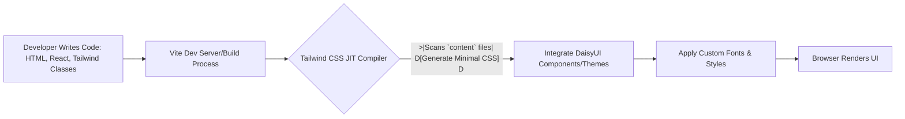

# Deployment & Configuration
<TOC />

This section provides comprehensive guidelines for deploying the application and configuring its environment-specific settings. It covers how the backend connects to external services like MongoDB and Cloudinary, as well as how the frontend is configured using Vite and styled with Tailwind CSS and DaisyUI. Understanding these configurations is crucial for successful deployment and maintenance across different environments.

## Backend Environment Configuration

The backend component of this application relies on environment variables for sensitive credentials and external service connections. This approach ensures that confidential information is not hardcoded into the codebase, promoting security and flexibility across development, staging, and production environments.

### Database Connection (MongoDB)

The application connects to a MongoDB instance, managed through Mongoose, an ODM (Object Data Modeling) library for Node.js. The connection string for MongoDB is sourced from environment variables, allowing for easy switching between different database instances.

#### `backend/src/lib/db.js` Overview

The `connectDB` function in `db.js` is responsible for establishing the connection to MongoDB. It leverages the `mongoose.connect` method, retrieving the connection URI from `process.env.MONGODB_URI`.

```javascript
// backend/src/lib/db.js
import mongoose from "mongoose"

export const connectDB = async () => {
  try {
    const conn = await mongoose.connect(process.env.MONGODB_URI);
    console.log(`MongoDB connected:  ${conn.connection.host}`);
  }
  catch(error){
    console.log("MongoDB connection error: ", error);
  }
}
```
[Link to `db.js` source](https://github.com/shinymack/Chat-App-MERN/blob/main/backend/src/lib/db.js)

**Key Insights:**

*   **Environment Variables:** The use of `process.env.MONGODB_URI` is a best practice for managing sensitive database credentials. This ensures that the URI can be changed without modifying code and is not exposed in version control.
*   **Robust Connection Handling:** The `try...catch` block around the `mongoose.connect` call provides basic error handling, logging connection issues, which is vital for debugging deployment problems.
*   **Scalability & Flexibility:** By externalizing the database URI, the application can easily connect to different MongoDB instances (e.g., local development, cloud-hosted test, production clusters) without code changes, facilitating multi-environment deployments.

### Cloudinary Integration

For media storage and management, the backend integrates with Cloudinary. This service is used for storing and delivering images or other media files, offloading static file serving from the application server.

#### `backend/src/lib/cloudinary.js` Overview

The `cloudinary.js` file configures the Cloudinary SDK using API credentials retrieved from environment variables.

```javascript
// backend/src/lib/cloudinary.js
import {v2 as cloudinary} from "cloudinary"
import { config } from 'dotenv'

config(); // Load environment variables from .env file

cloudinary.config(
    {cloud_name: process.env.CLOUDINARY_CLOUD_NAME,
    api_key: process.env.CLOUDINARY_API_KEY,
    api_secret: process.env.CLOUDINARY_API_SECRET,}
);

export default cloudinary;
```
[Link to `cloudinary.js` source](https://github.com/shinymack/Chat-App-MERN/blob/main/backend/src/lib/cloudinary.js)

**Key Insights:**

*   **Secure Credential Management:** Similar to MongoDB, Cloudinary API credentials (`CLOUDINARY_CLOUD_NAME`, `CLOUDINARY_API_KEY`, `CLOUDINARY_API_SECRET`) are loaded from `process.env`. This prevents sensitive information from being committed to version control.
*   **Decoupled Media Storage:** Using a third-party service like Cloudinary for media management decouples storage from the application server, improving scalability, performance, and reducing server load.
*   **`dotenv` Integration:** The `config()` call from `dotenv` ensures that environment variables defined in a `.env` file (if present) are loaded into `process.env`, which is crucial for local development. For production, these variables are typically set directly in the hosting environment.

#### Backend Configuration Flow


```mermaid
graph TD
    A[Application Startup] --> B{Load .env variables}
    B --> C[Configure Mongoose]
    B --> D[Configure Cloudinary]
    C --> E[Connect to MongoDB: MONGODB_URI]
    D --> F[Initialize Cloudinary SDK: CLOUDINARY_CLOUD_NAME, API_KEY, API_SECRET]
    E --> G{MongoDB Connection Status}
    F --> H{Cloudinary Ready}
    G --&gt; I[Backend Operational]
    H --&gt; I
```


## Frontend Build & Styling Configuration

The frontend of the application is built using Vite, a fast build tool, and styled with Tailwind CSS, augmented by DaisyUI for pre-built components and themes.

### Vite Configuration

Vite is used for its speed and developer experience, especially with React applications.

#### `frontend/vite.config.js` Overview

The `vite.config.js` file specifies the configuration for Vite. In this application, it's a straightforward setup primarily enabling React support.

```javascript
// frontend/vite.config.js
import { defineConfig } from 'vite'
import react from '@vitejs/plugin-react'

// https://vitejs.dev/config/
export default defineConfig({
  plugins: [react()],
})
```
[Link to `vite.config.js` source](https://github.com/shinymack/Chat-App-MERN/blob/main/frontend/vite.config.js)

**Key Insights:**

*   **Fast Development Server:** Vite offers a highly optimized development server with Hot Module Replacement (HMR), speeding up frontend development significantly.
*   **Production Build Optimization:** When building for production, Vite automatically optimizes the output (e.g., code splitting, minification) for performance.
*   **Plugin-Based Architecture:** The `plugins: [react()]` line demonstrates Vite's plugin-based architecture, allowing for easy integration with various frameworks and tools.

### Tailwind CSS & DaisyUI Configuration

Tailwind CSS is a utility-first CSS framework, providing low-level utility classes to build custom designs directly in markup. DaisyUI extends Tailwind CSS with pre-built component classes, making it easier to develop UIs quickly and consistently.

#### `frontend/tailwind.config.js` Overview

The `tailwind.config.js` file is central to the frontend's styling. It configures Tailwind CSS, specifies files to scan for classes, defines custom themes, and integrates DaisyUI.

```javascript
// frontend/tailwind.config.js
import daisyui from "daisyui"

/** @type {import('tailwindcss').Config} */
export default {
  content: [
    "./index.html",
    "./src/**/*.{js,ts,jsx,tsx}",
  ],
  theme: {
    extend: {
      fontFamily : {
        chivo : ['Chivo', 'sans-serif'],
      }
    },
  },
  plugins: [daisyui],
  daisyui : {
 themes: [
      "light", "dark", "cupcake", "bumblebee", "emerald", "corporate", "synthwave",
      "retro", "cyberpunk", "valentine", "halloween", "garden", "forest", "aqua",
      "lofi", "pastel", "fantasy", "wireframe", "black", "luxury", "dracula",
      "cmyk", "autumn", "business", "acid", "lemonade", "night", "coffee",
      "winter", "dim", "nord", "sunset",
    ],
  }
}
```
[Link to `tailwind.config.js` source](https://github.com/shinymack/Chat-App-MERN/blob/main/frontend/tailwind.config.js)

**Key Insights:**

*   **`content` Configuration:** The `content` array (`./index.html`, `./src/**/*.{js,ts,jsx,tsx}`) is crucial for Tailwind's JIT (Just-In-Time) compiler. It tells Tailwind which files to scan for CSS classes, ensuring only used classes are included in the final CSS bundle, leading to smaller file sizes.
*   **Custom Fonts:** The `extend.fontFamily` section allows defining custom font stacks (e.g., `chivo`), making it easy to integrate specific typography into the application.
*   **DaisyUI Integration:** The `plugins: [daisyui]` line integrates DaisyUI, providing a rich set of component classes on top of Tailwind.
*   **Theme Management:** The `daisyui.themes` array lists a comprehensive selection of themes provided by DaisyUI. This enables easy theming switching (e.g., light/dark mode) and offers a diverse range of visual styles, enhancing user experience and design flexibility.

#### Frontend Build and Styling Workflow





## Best Practices and Deployment Considerations

### Environment Variables

*   **DO NOT commit `.env` files:** Always add `.env` to your `.gitignore` to prevent sensitive credentials from being exposed in version control.
*   **Use a `.env.example` file:** Provide an example file without actual secrets to guide other developers on required environment variables.
*   **Production Configuration:** In production environments, set environment variables directly via your hosting platform's configuration (e.g., Heroku Config Vars, Vercel Environment Variables, Docker secrets, Kubernetes ConfigMaps/Secrets).

### Scalability

*   **Backend Statelessness:** The current backend design with external database (MongoDB) and media storage (Cloudinary) inherently supports horizontal scaling. Each backend instance can be identical and serve requests independently.
*   **Frontend Caching:** Vite-built frontends benefit from browser caching for static assets, improving load times for repeat visitors.

### Security

*   **API Key Protection:** Ensure all API keys and secrets (e.g., `CLOUDINARY_API_KEY`, `CLOUDINARY_API_SECRET`, `MONGODB_URI`) are securely managed as environment variables and never hardcoded or committed.
*   **CORS Configuration:** For MERN stack applications, ensure appropriate Cross-Origin Resource Sharing (CORS) policies are configured on the backend to allow requests only from trusted frontend origins.

## Key Integration Points and Insights

The configuration files highlight a clear separation of concerns:

*   **Backend Focus:** `db.js` and `cloudinary.js` manage external service integrations and sensitive configurations, crucial for the server-side operations and data persistence.
*   **Frontend Focus:** `vite.config.js` and `tailwind.config.js` handle the build process and styling, optimizing the user interface and development workflow.

This modularity is a core strength of the application's architecture, enabling independent development and deployment of frontend and backend components. The consistent use of environment variables across the backend ensures a secure and flexible deployment strategy, adapting easily to various hosting environments and credential management systems. The frontend's use of modern tooling like Vite, Tailwind CSS, and DaisyUI provides a robust and efficient path for UI development and theming.