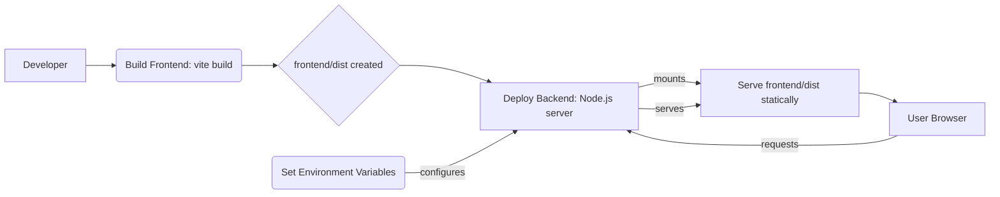

# Deployment & Operations
<TOC />

## System Purpose
The MERN Chat App is a full-stack, real-time messaging application designed to facilitate instant communication between users. Built upon the MERN (MongoDB, Express, React, Node.js) stack, it provides core functionalities for user authentication, messaging, and friend management. The application leverages WebSockets for real-time interactivity, ensuring messages are delivered and displayed without delay.

Key functionalities include:
*   **User Authentication**: Secure registration and login mechanisms, including local and Google OAuth 2.0 authentication, managed by Passport.js.
*   **Real-time Messaging**: Instant message exchange between users using Socket.IO, enabling a dynamic chat experience.
*   **Friend Management**: Functionality to manage user friendships (though specific routes are not detailed in the provided snippets, `friendRoutes` is present).
*   **Backend API Services**: Dedicated API endpoints for authentication, message handling, and user/friend-related operations.
*   **Frontend Interface**: A responsive and interactive user interface built with React, consuming backend APIs and real-time events.

The backend application's entry point is defined in [backend/src/index.js](https://github.com/shinymack/Chat-App-MERN/blob/main/backend/src/index.js), while backend dependencies are listed in [backend/package.json](https://github.com/shinymack/Chat-App-MERN/blob/main/backend/package.json). The frontend, detailed in [frontend/package.json](https://github.com/shinymack/Chat-App-MERN/blob/main/frontend/package.json), is a Vite-powered React application.

## System Architecture Overview
The application follows a typical three-tier architecture, separating presentation, business logic, and data storage.

*   **Presentation Layer (Frontend)**: Developed using React, responsible for rendering the user interface, handling user interactions, and making API requests to the backend. It uses `axios` for HTTP requests and `socket.io-client` for real-time communication.
*   **Business Logic Layer (Backend)**: Built with Node.js and Express.js, this layer handles API routing, authentication (Passport.js), database interactions via Mongoose, and real-time communication using Socket.IO. It serves as the bridge between the frontend and the database.
*   **Data Layer (Database)**: MongoDB is used as the NoSQL database for storing user profiles, messages, and other application data. `Mongoose` provides an ODM (Object Data Modeling) layer for Node.js to interact with MongoDB.

Real-time communication, crucial for a chat application, is facilitated by `Socket.IO`. The backend integrates a Socket.IO server, allowing for persistent, bidirectional communication channels between the frontend and the server, bypassing traditional HTTP request/response cycles for instant updates.


```mermaid
graph TD
  A[Frontend - React/Vite] -->|HTTP/REST API| B[Backend - Node/Express]
  A -->|WebSocket (Socket.IO)| C[Socket.IO Server]
  B -->|ODM (Mongoose)| D[MongoDB Atlas/Local]
  C -->|Real-time Data| A
  B -.->|File Storage| E[Cloudinary]
  subgraph Client
    A
  end
  subgraph Server
    B
    C
    D
    E
  end
```


## Technology Stack
The MERN Chat App leverages a robust set of technologies for both its backend and frontend components.

| Layer    | Technology           | Version         | Purpose                                                                                                                                                                                                                                                                  |
| :------- | :------------------- | :-------------- | :----------------------------------------------------------------------------------------------------------------------------------------------------------------------------------------------------------------------------------------------------------------------- |
| **Backend** | Node.js              | (Runtime)       | JavaScript runtime environment for server-side logic.                                                                                                                                                                                                                        |
|          | Express.js           | `^4.21.2`       | Web framework for building RESTful APIs.                                                                                                                                                                                                                                 |
|          | MongoDB              | (Database)      | NoSQL database for data storage.                                                                                                                                                                                                                                         |
|          | Mongoose             | `^8.9.5`        | Object Data Modeling (ODM) library for MongoDB and Node.js.                                                                                                                                                                                                              |
|          | Socket.IO            | `^4.8.1`        | Enables real-time, bidirectional, event-based communication.                                                                                                                                                                                                             |
|          | Passport.js          | `^0.7.0`        | Authentication middleware for Node.js.                                                                                                                                                                                                                                   |
|          | Passport-Google-OAuth20 | `^2.0.0`        | Passport strategy for authenticating with Google using the OAuth 2.0 API.                                                                                                                                                                                                |
|          | bcryptjs             | `^2.4.3`        | Library for hashing passwords.                                                                                                                                                                                                                                           |
|          | jsonwebtoken         | `^9.0.2`        | Used for generating and verifying JSON Web Tokens for authentication.                                                                                                                                                                                                    |
|          | dotenv               | `^16.4.7`       | Loads environment variables from a `.env` file.                                                                                                                                                                                                                          |
|          | cloudinary           | `^2.5.1`        | Cloud-based image and video management service for media handling.                                                                                                                                                                                                       |
|          | cookie-parser        | `^1.4.7`        | Middleware to parse cookies.                                                                                                                                                                                                                                             |
|          | express-session      | `^1.18.1`       | Middleware for managing user sessions.                                                                                                                                                                                                                                   |
|          | cors                 | `^2.8.5`        | Middleware to enable Cross-Origin Resource Sharing.                                                                                                                                                                                                                      |
| **Frontend** | React                | `^18.3.1`       | JavaScript library for building user interfaces.                                                                                                                                                                                                                         |
|          | Vite                 | `^6.3.5`        | Next-generation frontend tooling, used as a build tool and development server.                                                                                                                                                                                           |
|          | axios                | `^1.7.9`        | Promise-based HTTP client for making API requests.                                                                                                                                                                                                                       |
|          | react-router-dom     | `^7.1.1`        | Declarative routing for React applications.                                                                                                                                                                                                                              |
|          | socket.io-client     | `^4.8.1`        | Client-side library for real-time communication with the Socket.IO server.                                                                                                                                                                                               |
|          | zustand              | `^5.0.3`        | Small, fast, and scalable state-management solution for React.                                                                                                                                                                                                           |
|          | react-hot-toast      | `^2.5.1`        | Customizable toast notifications for user feedback.                                                                                                                                                                                                                      |
|          | Tailwind CSS         | `^3.4.17`       | Utility-first CSS framework for rapid UI development.                                                                                                                                                                                                                    |
|          | DaisyUI              | `^4.12.23`      | Tailwind CSS component library for pre-designed UI elements.                                                                                                                                                                                                             |

**Backend Dependencies from `backend/package.json`**
This snippet highlights key production dependencies for the server-side application.
```json
// backend/package.json
{
  "name": "backend",
  "version": "1.0.0",
  // ...
  "dependencies": {
    "bcryptjs": "^2.4.3",
    "cloudinary": "^2.5.1",
    "cookie-parser": "^1.4.7",
    "dotenv": "^16.4.7",
    "express": "^4.21.2",
    "express-session": "^1.18.1",
    "jsonwebtoken": "^9.0.2",
    "mongoose": "^8.9.5",
    "passport": "^0.7.0",
    "passport-google-oauth20": "^2.0.0",
    "socket.io": "^4.8.1"
  },
  "devDependencies": {
    "nodemon": "^3.1.9"
  }
}
```
[View on GitHub](https://github.com/shinymack/Chat-App-MERN/blob/main/backend/package.json#L13-L30)

**Frontend Dependencies from `frontend/package.json`**
This snippet shows the primary libraries used on the client-side for UI, routing, and real-time interactions.
```json
// frontend/package.json
{
  "name": "frontend",
  "private": true,
  "version": "0.0.0",
  // ...
  "scripts": { /* ... */ },
  "dependencies": {
    "axios": "^1.7.9",
    "cors": "^2.8.5",
    "lucide-react": "^0.471.1",
    "react": "^18.3.1",
    "react-dom": "^18.3.1",
    "react-hot-toast": "^2.5.1",
    "react-icons": "^5.5.0",
    "react-router-dom": "^7.1.1",
    "socket.io-client": "^4.8.1",
    "zustand": "^5.0.3"
  },
  "devDependencies": {
    "@eslint/js": "^9.17.0",
    // ...
    "tailwindcss": "^3.4.17",
    "vite": "^6.3.5"
  }
}
```
[View on GitHub](https://github.com/shinymack/Chat-App-MERN/blob/main/frontend/package.json#L11-L24)

## Core Deployment Considerations
Deploying the MERN Chat App involves configuring the backend to serve the compiled frontend assets and ensuring all environment variables are correctly set for a production environment.

**1. Production Build & Static File Serving**:
The backend `index.js` is configured to serve the static frontend assets when `NODE_ENV` is set to `"production"`. This means the frontend must be built first (e.g., `npm run build` or `vite build`) into a `dist` directory, and then the backend can serve these files.

```javascript
// backend/src/index.js
// ...
if(process.env.NODE_ENV === "production"){
    app.use(express.static(path.join(__dirname, "../frontend/dist")));
    
    app.get("*" , (req, res) => {
        res.sendFile(path.join(__dirname,"../frontend", "dist","index.html"));
    })
}
// ...
```
[View on GitHub](https://github.com/shinymack/Chat-App-MERN/blob/main/backend/src/index.js#L54-L60)

This code block ensures that:
*   The `frontend/dist` directory, containing the optimized build of the React application, is served as static files.
*   All other routes not matching API endpoints (`/api/*`) are handled by serving the `index.html` from the `dist` folder, allowing client-side routing to take over.

**2. Environment Variables**:
Crucial for secure and flexible deployment, environment variables should be set in the production environment (e.g., on a hosting platform like Render, Vercel, Cyclic, AWS, Heroku) rather than hardcoding them.
*   `PORT`: The port on which the server will listen (e.g., `5000`).
*   `MONGO_URI`: Connection string for your MongoDB database (e.g., from MongoDB Atlas).
*   `JWT_SECRET`: Secret key for signing and verifying JSON Web Tokens.
*   `SESSION_SECRET`: Secret used to sign the session ID cookie. **Must be a strong, randomly generated string in production.**
*   `CLOUDINARY_CLOUD_NAME`, `CLOUDINARY_API_KEY`, `CLOUDINARY_API_SECRET`: Credentials for Cloudinary media upload service.
*   `GOOGLE_CLIENT_ID`, `GOOGLE_CLIENT_SECRET`: Credentials for Google OAuth 2.0.

**3. CORS Configuration**:
In `backend/src/index.js`, the `cors` middleware is configured. For development, `http://localhost:5173` is used as the `origin`. In production, this **must be updated** to the actual domain of your frontend application to prevent security vulnerabilities. For example, `origin: "https://your-app-domain.com"`.

**4. Cookie Security**:
The `express-session` middleware is configured with a `cookie` object.
*   `secure: process.env.NODE_ENV === "production"`: This sets the `Secure` flag on the cookie to `true` in production, meaning the cookie will only be sent over HTTPS connections. **Ensuring HTTPS in production is vital.**
*   `httpOnly: true`: Prevents client-side JavaScript from accessing the cookie, mitigating XSS attacks.
*   `maxAge`: Sets the cookie's expiration.
*   `sameSite`: Should be carefully configured. `lax` is a common default, but for cross-domain deployments where the frontend and backend are on different origins, `sameSite: 'none'` might be required, alongside `secure: true`.





## Key Integration Points

The MERN Chat App's functionality relies heavily on several key integration points:

**1. Authentication Flow (Passport.js and Express-Session)**:
The backend utilizes `passport.js` for robust authentication, including Google OAuth 2.0. `express-session` is used to maintain user sessions, with `cookie-parser` handling cookie management. This setup ensures that once a user logs in, their session is securely maintained across requests.

```javascript
// backend/src/index.js
// ...
app.use(cookieParser());
// ...
app.use(session({
    secret: process.env.SESSION_SECRET, 
    resave: false,
    saveUninitialized: false, 
    cookie: {
        secure: process.env.NODE_ENV === "production", // true in production (HTTPS)
        httpOnly: true,
        maxAge: 7 * 24 * 60 * 60 * 1000 
        // sameSite: 'lax' // or 'none' if backend and frontend are on different domains in prod
    }
}));

app.use(passport.initialize());
app.use(passport.session());  

app.use("/api/auth", authRoutes );
// ...
```
[View on GitHub](https://github.com/shinymack/Chat-App-MERN/blob/main/backend/src/index.js#L26-L49)

**Insights**: The use of `secure: process.env.NODE_ENV === "production"` is a best practice for handling cookies. It automatically enables the `Secure` flag for cookies in production, ensuring they are only sent over encrypted HTTPS connections, which is vital for preventing Man-in-the-Middle (MITM) attacks. The `httpOnly` flag further secures cookies against Cross-Site Scripting (XSS) attacks by preventing client-side JavaScript access.

**2. Real-time Communication (Socket.IO)**:
Socket.IO is seamlessly integrated to handle real-time messaging. The `app` and `server` are exported from `./lib/socket.js`, ensuring that the HTTP server and Socket.IO server run on the same port. The frontend client (`socket.io-client`) connects to this server to send and receive messages instantly.

**3. Database Connection (Mongoose)**:
The `connectDB()` function from `./lib/db.js` is called when the server starts. This function establishes a connection to MongoDB using Mongoose, allowing the backend to interact with the database for data persistence.

```javascript
// backend/src/index.js
// ...
const PORT = process.env.PORT;
if(process.env.NODE_ENV === "production"){
    // ... static file serving ...
}

server.listen(PORT, () => {
    console.log("server is running on PORT: " + String(PORT));
    connectDB();
});
```
[View on GitHub](https://github.com/shinymack/Chat-App-MERN/blob/main/backend/src/index.js#L62-L66)

**Best Practices**: Separating database connection logic (`connectDB()`) into its own file (`./lib/db.js`) promotes modularity and makes the codebase cleaner and easier to maintain. Similarly, `socket.js` encapsulates Socket.IO setup.

**4. API Routing and Separation of Concerns**:
The backend defines distinct route files (`auth.route.js`, `message.route.js`, `friend.route.js`) for different application features. This modular approach (`app.use("/api/auth", authRoutes);`) enhances code organization, readability, and scalability, making it easier to manage and extend the API endpoints.

**5. Frontend-Backend Interaction**:
The frontend application built with React uses `axios` to make HTTP requests to the backend's API endpoints for actions like login, registration, and fetching message history. For real-time functionality, `socket.io-client` establishes a WebSocket connection, enabling instant message delivery and updates without requiring page reloads or polling. State management is handled by `Zustand` for efficient data flow across React components.