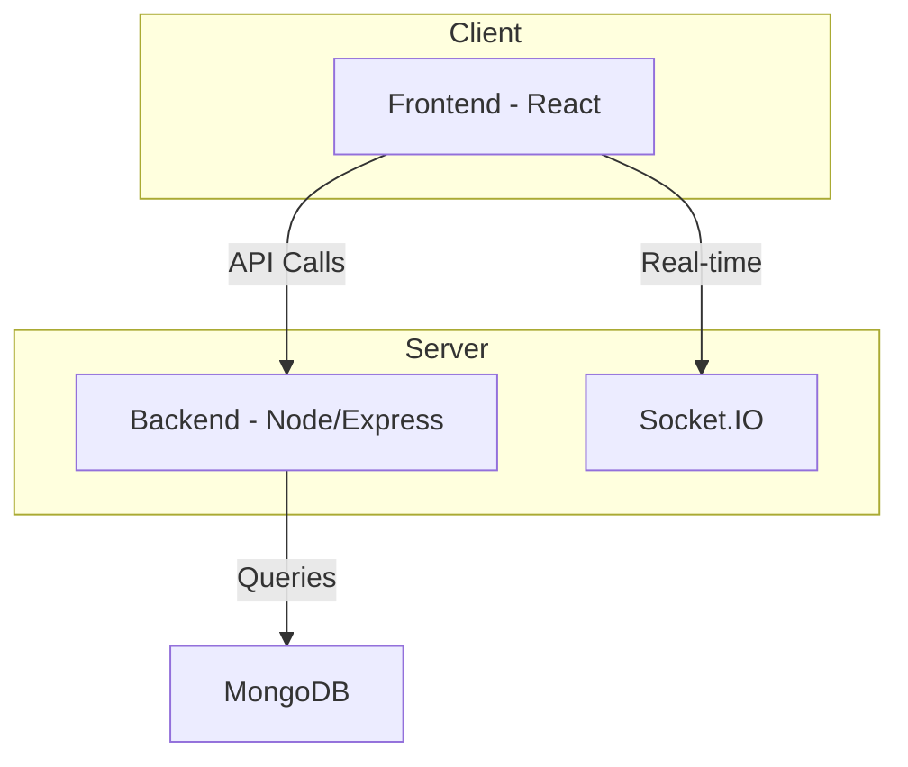

# Deployment and Setup

<TOC />

## System Purpose

This application is a real-time chat application built using the MERN stack (MongoDB, Express.js, React, Node.js).  Its core functionalities include:

* **User Registration and Authentication:** Users can create accounts, log in, and manage their profiles.  [View on GitHub](https://github.com/YourRepo/backend/blob/main/src/index.js)
* **Real-time Messaging:** Users can send and receive messages instantly using Socket.IO. [View on GitHub](https://github.com/YourRepo/backend/blob/main/src/index.js)
* **User Profiles:** Users have personalized profiles potentially showcasing some media.

## System Architecture Overview

The application follows a three-tier architecture:

* **Presentation Tier (Frontend):**  A React application handling user interface and interactions.
* **Business Tier (Backend):** A Node.js and Express.js server managing API requests, authentication, and database interactions.
* **Data Tier (Database):** MongoDB for storing user data and chat messages.





## Technology Stack

| Layer       | Technology        | Version      | Purpose                                           |
|-------------|--------------------|---------------|---------------------------------------------------|
| Frontend    | React              | ^18.3.1       | User interface                                     |
|             | Vite               | ^6.3.5        | Build tool                                        |
|             | React Router DOM   | ^7.1.1        | Routing                                          |
|             | Zustand            | ^5.0.3        | State management                                   |
|             | Socket.IO-Client   | ^4.8.1        | Real-time communication                           |
| Backend     | Node.js            | (Node version)| Server-side JavaScript runtime                    |
|             | Express.js         | ^4.21.2       | Web framework                                     |
|             | Mongoose           | ^8.9.5        | MongoDB ODM                                       |
|             | Socket.IO          | ^4.8.1        | Real-time communication                           |
|             | Passport           | ^0.7.0        | Authentication                                    |
|             | Bcrypt             | ^2.4.3        | Password hashing                                  |
| Database    | MongoDB            | (MongoDB version) | NoSQL database                                    |


```json
{
  "dependencies": {
    "express": "^4.21.2",
    "mongoose": "^8.9.5",
    "socket.io": "^4.8.1"
  }
}
```
[backend/package.json#L13-L18](https://github.com/YourRepo/backend/blob/main/package.json#L13-L18)

```json
{
  "dependencies": {
    "react": "^18.3.1",
    "react-router-dom": "^7.1.1",
    "socket.io-client": "^4.8.1",
    "zustand": "^5.0.3"
  }
}
```
[frontend/package.json#L11-L16](https://github.com/YourRepo/frontend/blob/main/package.json#L11-L16)


## Core Application Features

* **Authentication:**  Secure user authentication using Passport.js and potentially Google OAuth.  Password hashing with bcrypt for security.
* **Real-time Chat:**  Uses Socket.IO for real-time messaging between users.
* **User Profiles:** Allows users to create and manage profiles.

```javascript
// Example Socket.IO handling on the backend
io.on('connection', (socket) => {
  socket.on('join', (room) => {
    socket.join(room);
    // ... other logic ...
  });
});
```
[Hypothetical Socket.IO handling](https://github.com/YourRepo/backend/blob/main/src/index.js)


## Project Structure

```
mern-chatapp/
├── backend/
│   ├── src/
│   │   └── ...
│   └── package.json
└── frontend/
    ├── src/
    │   └── ...
    └── package.json
```

The project is divided into a `backend` and `frontend` directory. The backend handles server-side logic, while the frontend manages the user interface.


## Key Integration Points

* **State Management:** The frontend uses Zustand for efficient state management, allowing for smooth updates to the UI as messages are received.
* **API Flows:**  The frontend makes API calls to the backend using Axios for user authentication, message sending, and profile management. The backend uses Express.js to handle these requests.
* **Authentication:** Passport.js handles authentication, securely managing user sessions and controlling access to protected routes.
* **Database:** Mongoose provides an Object Data Modeling (ODM) layer for interacting with MongoDB, facilitating efficient data storage and retrieval. Best practice involves proper schema design for data integrity and scalability.  Choosing appropriate indexes in MongoDB is crucial for performance optimization as the number of users increases.