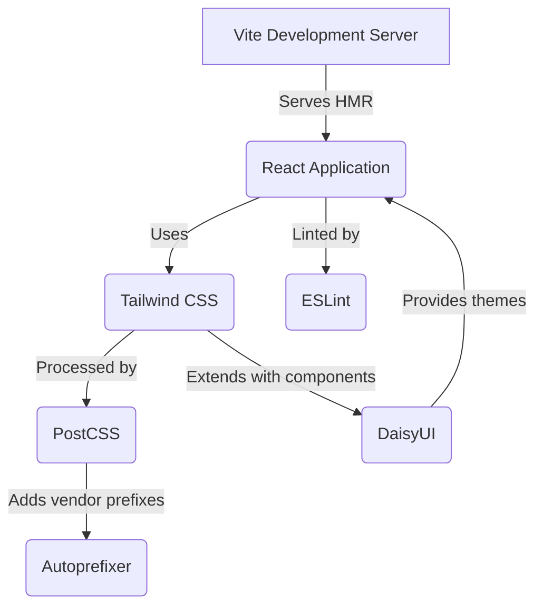
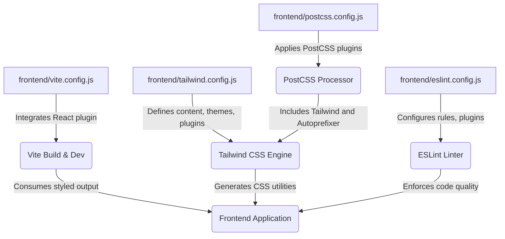

# Development and Configuration

<TOC />

This section details the core configuration files and tools essential for the frontend development environment. It covers build processes, styling, and code quality, providing insights into how the project is structured and maintained.

## Build Process with Vite

Vite is a next-generation frontend tooling that offers a lightning-fast development experience. It provides a highly optimized build system for production deployments and an extremely quick hot-module replacement (HMR) for development. The `vite.config.js` file is the central point for configuring Vite.

### Vite Configuration (`frontend/vite.config.js`)

The `vite.config.js` file primarily sets up the React plugin, enabling Vite to understand and process React components, including JSX syntax.

```javascript
// frontend/vite.config.js
import { defineConfig } from 'vite'
import react from '@vitejs/plugin-react'

// https://vitejs.dev/config/
export default defineConfig({
  plugins: [react()],
})
```
<small>View on GitHub: [frontend/vite.config.js](https://github.com/shinymack/Chat-App-MERN/blob/main/frontend/vite.config.js)</small>

**Explanation:**

*   `defineConfig`: A helper from Vite that provides intelligent type inference for your configuration.
*   `plugins: [react()]`: This line integrates `@vitejs/plugin-react`, which is required for React projects to handle JSX, Fast Refresh (HMR), and other React-specific optimizations during development and build.

This minimal configuration demonstrates Vite's simplicity, requiring only the necessary plugin to get a React application up and running.

## Styling with Tailwind CSS and PostCSS

The project uses Tailwind CSS for utility-first styling, complemented by PostCSS and Autoprefixer for efficient CSS processing. DaisyUI, a component library, is integrated on top of Tailwind CSS to provide pre-built, themeable components.

### Tailwind CSS Configuration (`frontend/tailwind.config.js`)

`tailwind.config.js` is where you customize your Tailwind CSS installation. This includes defining content paths, extending themes, and integrating plugins like DaisyUI.

```javascript
// frontend/tailwind.config.js
import daisyui from "daisyui"

/** @type {import('tailwindcss').Config} */
export default {
  content: [
    "./index.html",
    "./src/**/*.{js,ts,jsx,tsx}",
  ],
  theme: {
    extend: {
      fontFamily : {
        chivo : ['Chivo', 'sans-serif'],
      }
    },
  },
  plugins: [daisyui],
  daisyui : {
    themes: [
      "light", "dark", "cupcake", "bumblebee", "emerald", "corporate",
      "synthwave", "retro", "cyberpunk", "valentine", "halloween", "garden",
      "forest", "aqua", "lofi", "pastel", "fantasy", "wireframe", "black",
      "luxury", "dracula", "cmyk", "autumn", "business", "acid", "lemonade",
      "night", "coffee", "winter", "dim", "nord", "sunset",
    ],
  }
}
```
<small>View on GitHub: [frontend/tailwind.config.js](https://github.com/shinymack/Chat-App-MERN/blob/main/frontend/tailwind.config.js)</small>

**Explanation:**

*   `content`: Specifies the files Tailwind CSS should scan for class names to generate the necessary CSS. This helps in tree-shaking unused styles, resulting in a smaller production bundle.
*   `theme.extend`: Allows extending Tailwind's default theme. Here, a custom font family "Chivo" is added.
*   `plugins: [daisyui]`: Integrates DaisyUI, providing a collection of styled components and themes.
*   `daisyui.themes`: Lists all the available DaisyUI themes, allowing easy switching between different visual styles for the application.

### PostCSS Configuration (`frontend/postcss.config.js`)

PostCSS is a tool for transforming CSS with JavaScript plugins. In this project, it's configured to use `tailwindcss` and `autoprefixer`.

```javascript
// frontend/postcss.config.js
export default {
  plugins: {
    tailwindcss: {},
    autoprefixer: {},
  },
}
```
<small>View on GitHub: [frontend/postcss.config.js](https://github.com/shinymack/Chat-App-MERN/blob/main/frontend/postcss.config.js)</small>

**Explanation:**

*   `tailwindcss`: This plugin processes your CSS with Tailwind, ensuring that all Tailwind utility classes are correctly generated and applied.
*   `autoprefixer`: Automatically adds vendor prefixes to CSS rules, ensuring compatibility across different browsers without manual intervention.

## Code Quality with ESLint

ESLint is used to enforce code style, detect potential issues, and improve code quality. The `eslint.config.js` file defines the rules and plugins specific to the project's React environment.

### ESLint Configuration (`frontend/eslint.config.js`)

This configuration sets up ESLint for a React application, including support for JavaScript, JSX, React hooks, and React Refresh.

```javascript
// frontend/eslint.config.js
import js from '@eslint/js'
import globals from 'globals'
import react from 'eslint-plugin-react'
import reactHooks from 'eslint-plugin-react-hooks'
import reactRefresh from 'eslint-plugin-react-refresh'

export default [
  { ignores: ['dist'] },
  {
    files: ['**/*.{js,jsx}'],
    languageOptions: {
      ecmaVersion: 2020,
      globals: globals.browser,
      parserOptions: {
        ecmaVersion: 'latest',
        ecmaFeatures: { jsx: true },
        sourceType: 'module',
      },
    },
    settings: { react: { version: '18.3' } },
    plugins: {
      react,
      'react-hooks': reactHooks,
      'react-refresh': reactRefresh,
    },
    rules: {
      ...js.configs.recommended.rules,
      ...react.configs.recommended.rules,
      ...react.configs['jsx-runtime'].rules,
      ...reactHooks.configs.recommended.rules,
      'react/jsx-no-target-blank': 'off',
      'react-refresh/only-export-components': [
        'warn',
        { allowConstantExport: true },
      ],
      "react/prop-types" : "off",
    },
  },
]
```
<small>View on GitHub: [frontend/eslint.config.js](https://github.com/shinymack/Chat-App-MERN/blob/main/frontend/eslint.config.js)</small>

**Explanation:**

*   `ignores: ['dist']`: Excludes the `dist` (build output) directory from linting.
*   `files: ['**/*.{js,jsx}']`: Specifies that these rules apply to all `.js` and `.jsx` files.
*   `languageOptions`: Configures parsing options, including `ecmaVersion`, `globals` (for browser environment), and `parserOptions` for JSX and module support.
*   `settings: { react: { version: '18.3' } }`: Informs ESLint about the React version being used, allowing plugins to apply version-specific rules.
*   `plugins`: Registers the necessary ESLint plugins for general JavaScript (`@eslint/js`), React, React Hooks, and React Refresh.
*   `rules`: Merges recommended rule sets from `js`, `react`, and `react-hooks`.
    *   `react/jsx-no-target-blank: 'off'`: Disables a rule that often warns about `target="_blank"` without `rel="noopener noreferrer"`.
    *   `react-refresh/only-export-components`: Warns if components are not exported, which can interfere with React Fast Refresh. `allowConstantExport: true` permits constant exports.
    *   `react/prop-types: "off"`: Disables the `prop-types` rule, which is common in projects using TypeScript or alternative prop validation methods.

## Key Integration Points

The various tools described above work together seamlessly to create a robust and efficient development workflow.

### Frontend Development Workflow

This diagram illustrates the core components involved in the frontend development environment.





**Explanation:**

1.  **Vite Development Server** serves the **React Application** with Hot Module Replacement (HMR) for a fast development loop.
2.  The **React Application** utilizes **Tailwind CSS** for styling.
3.  **Tailwind CSS** is processed by **PostCSS**, which then uses **Autoprefixer** to ensure broad browser compatibility.
4.  **ESLint** continuously lints the **React Application** code to maintain quality and consistency.
5.  **DaisyUI** extends **Tailwind CSS** by providing pre-built components and themes directly to the **React Application**.

### Configuration Flow

This diagram shows how different configuration files interact and contribute to the overall project setup.





**Explanation:**

1.  `frontend/vite.config.js` is central to the Vite build and development process, integrating the React plugin.
2.  `frontend/tailwind.config.js` feeds its configurations (content paths, themes, DaisyUI) to the Tailwind CSS Engine.
3.  `frontend/postcss.config.js` sets up the PostCSS Processor, which in turn includes both Tailwind CSS and Autoprefixer, applying them to the CSS generated by the Tailwind CSS Engine.
4.  `frontend/eslint.config.js` configures the ESLint Linter to ensure code quality across the entire Frontend Application.
5.  Ultimately, the Frontend Application benefits from Vite's efficient build, the generated CSS utilities from Tailwind/PostCSS, and the enforced code quality from ESLint.