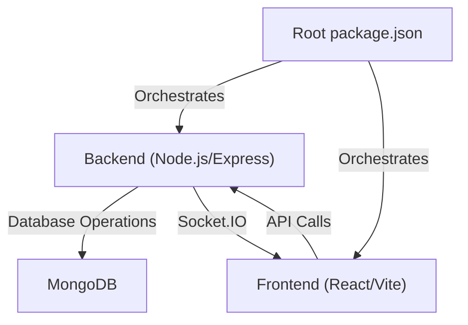
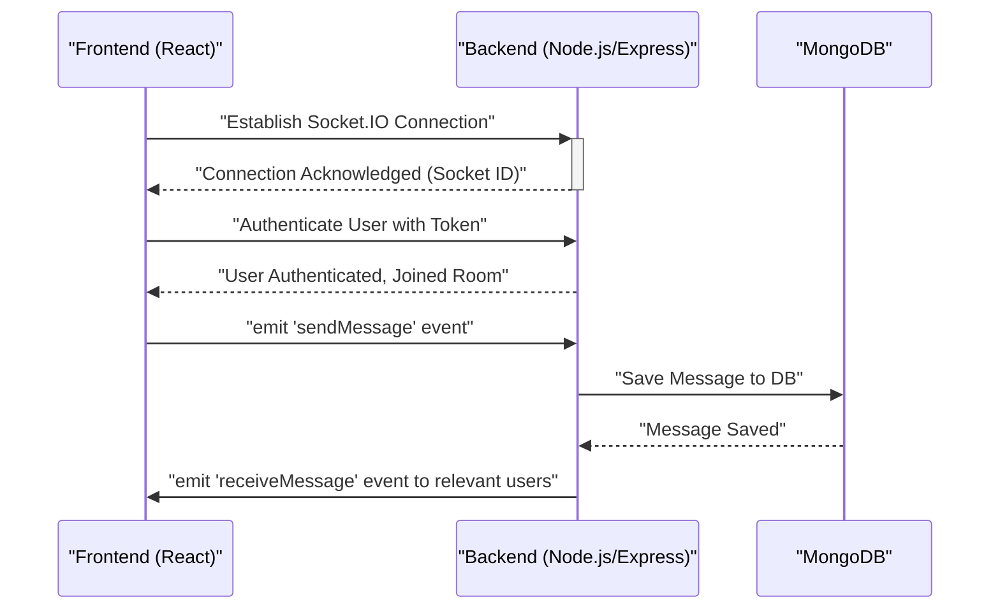

# Development and Configuration

<TOC />

This section provides comprehensive guidelines for setting up the development environment, understanding the project's configuration, and managing build processes for the Chat-App-MERN application. It covers both the frontend and backend aspects, highlighting key files and their roles.

## Project Structure Overview

The Chat-App-MERN project adopts a monorepo-like structure, organizing the frontend (React/Vite) and backend (Node.js/Express) into distinct directories, all managed from a root `package.json`. This approach simplifies deployment and allows for shared build commands.

The core structure includes:
*   **`backend/`**: Contains the Node.js/Express server, API routes, database models, and business logic.
*   **`frontend/`**: Houses the React application, user interface components, and client-side logic.
*   **Root `package.json`**: Orchestrates global build and start commands for both parts of the application.

This diagram illustrates the architectural separation and interaction:





### Root Project Configuration

The main `package.json` file at the root of the repository defines the overarching build and start processes, leveraging the scripts within the `backend` and `frontend` subdirectories. This centralizes common operations.

```json title="package.json"
{
  "name": "chatapp",
  "version": "1.0.0",
  "main": "index.js",
  "scripts": {
    "build" : "npm install --prefix backend && npm install --prefix frontend && npm run build --prefix frontend",
    "start" : "npm run start --prefix backend"
  },
  "keywords": [],
  "author": "",
  "license": "ISC",
  "description": ""
}
```
[View on GitHub](https://github.com/shinymack/Chat-App-MERN/blob/main/package.json)

-   **`build`**: This script first installs dependencies for both the `backend` and `frontend` directories using `npm install --prefix`, then executes the `build` script defined within the `frontend/package.json` to compile the React application.
-   **`start`**: This script simply calls the `start` command defined in the `backend/package.json`, initiating the Node.js server.

## Backend Setup and Configuration

The `backend` directory is a self-contained Node.js application. Its `package.json` defines its specific dependencies and development/production scripts.

### Backend Dependencies

The backend leverages a robust set of libraries to handle various aspects of a modern web application, including authentication, real-time communication, database interactions, and cloud storage.

```json title="backend/package.json"
{
  "name": "backend",
  "version": "1.0.0",
  "main": "src/index.js",
  "scripts": {
    "dev": "nodemon src/index.js",
    "start": "node src/index.js"
  },
  "author": "",
  "type": "module",
  "license": "ISC",
  "description": "",
  "dependencies": {
    "bcryptjs": "^2.4.3",
    "cloudinary": "^2.5.1",
    "cookie-parser": "^1.4.7",
    "dotenv": "^16.4.7",
    "express": "^4.21.2",
    "express-session": "^1.18.1",
    "jsonwebtoken": "^9.0.2",
    "mongoose": "^8.9.5",
    "passport": "^0.7.0",
    "passport-google-oauth20": "^2.0.0",
    "socket.io": "^4.8.1"
  },
  "devDependencies": {
    "nodemon": "^3.1.9"
  }
}
```
[View on GitHub](https://github.com/shinymack/Chat-App-MERN/blob/main/backend/package.json)

Key dependencies include:
-   **`express`**: The core web framework for building RESTful APIs.
-   **`mongoose`**: An ODM (Object Data Modeling) library for MongoDB, simplifying database interactions.
-   **`socket.io`**: Enables real-time, bidirectional event-based communication between the server and clients, crucial for chat functionality.
-   **`passport`**, `passport-google-oauth20`: Authentication middleware and a strategy for Google OAuth 2.0.
-   **`jsonwebtoken`**, `bcryptjs`: For token-based authentication (JWT) and password hashing, respectively.
-   **`cloudinary`**: Integration for cloud-based image and video management, used for user avatars and media sharing.
-   **`dotenv`**: Loads environment variables from a `.env` file, keeping sensitive configuration separate from the codebase.
-   **`nodemon` (devDependency)**: Automatically restarts the Node.js server when file changes are detected, enhancing the development workflow.

### Backend Development Scripts

-   **`dev`**: `nodemon src/index.js` — Runs the application in development mode with `nodemon`, enabling automatic restarts on code changes.
-   **`start`**: `node src/index.js` — Runs the application in production mode directly with Node.js.

## Frontend Setup and Configuration

The `frontend` directory contains the React application, configured with Vite for a fast development experience and ESLint for code quality.

### Frontend Build Tool: Vite

Vite is utilized as the build tool for the React frontend, providing features like hot module replacement (HMR) and optimized builds.

```javascript title="frontend/vite.config.js"
import { defineConfig } from 'vite'
import react from '@vitejs/plugin-react'

// https://vitejs.dev/config/
export default defineConfig({
  plugins: [react()],
})
```
[View on GitHub](https://github.com/shinymack/Chat-App-MERN/blob/main/frontend/vite.config.js)

-   **`defineConfig`**: Standard Vite configuration helper.
-   **`plugins: [react()]`**: Integrates `@vitejs/plugin-react`, which provides Fast Refresh support for React components, essential for a smooth development experience.

### Frontend Code Quality: ESLint

ESLint is configured to maintain code quality, consistency, and identify potential issues within the React codebase.

```javascript title="frontend/eslint.config.js"
import js from '@eslint/js'
import globals from 'globals'
import react from 'eslint-plugin-react'
import reactHooks from 'eslint-plugin-react-hooks'
import reactRefresh from 'eslint-plugin-react-refresh'

export default [
  { ignores: ['dist'] },
  {
    files: ['**/*.{js,jsx}'],
    languageOptions: {
      ecmaVersion: 2020,
      globals: globals.browser,
      parserOptions: {
        ecmaVersion: 'latest',
        ecmaFeatures: { jsx: true },
        sourceType: 'module',
      },
    },
    settings: { react: { version: '18.3' } },
    plugins: {
      react,
      'react-hooks': reactHooks,
      'react-refresh': reactRefresh,
    },
    rules: {
      ...js.configs.recommended.rules,
      ...react.configs.recommended.rules,
      ...react.configs['jsx-runtime'].rules,
      ...reactHooks.configs.recommended.rules,
      'react/jsx-no-target-blank': 'off',
      'react-refresh/only-export-components': [
        'warn',
        { allowConstantExport: true },
      ],
      "react/prop-types" : "off",

    },
  },
]
```
[View on GitHub](https://github.com/shinymack/Chat-App-MERN/blob/main/frontend/eslint.config.js)

This configuration enables:
-   **`ignores: ['dist']`**: Prevents ESLint from checking generated build files.
-   **`files: ['**/*.{js,jsx}']`**: Applies linting to JavaScript and JSX files.
-   **`languageOptions`**: Configures ECMAScript version (latest), browser globals, and JSX support.
-   **`settings: { react: { version: '18.3' } }`**: Specifies the React version for plugin compatibility.
-   **`plugins`**: Includes `eslint-plugin-react`, `eslint-plugin-react-hooks`, and `eslint-plugin-react-refresh` for React-specific linting.
-   **`rules`**: Extends recommended rules from ESLint, React, and React Hooks. Notable custom rules include:
    -   `'react/jsx-no-target-blank': 'off'`: Disables a rule often triggered by external links.
    -   `'react-refresh/only-export-components'`: Warns about non-exported components to ensure Fast Refresh works correctly.
    -   `"react/prop-types" : "off"`: Disables `prop-types` checking, commonly done when TypeScript or alternative type checking solutions are used.

## Key Integration Points

Understanding how the frontend and backend interact is crucial for development. The `socket.io` library plays a pivotal role in enabling real-time chat features.

### Real-time Communication with Socket.IO

The chat application heavily relies on `socket.io` for instant message delivery, online status updates, and other real-time features. The client-side (frontend) establishes a WebSocket connection with the server-side (backend) via `socket.io`.





This sequence demonstrates the typical flow:
1.  The frontend initiates a `Socket.IO` connection to the backend.
2.  Upon connection, the frontend sends an authentication token to the backend.
3.  The backend validates the token, associates the socket with the authenticated user, and potentially adds the user to specific `Socket.IO` rooms (e.g., for individual chats or group chats).
4.  When a user sends a message from the frontend, it emits a `sendMessage` event to the backend.
5.  The backend processes the message, saves it to MongoDB, and then emits a `receiveMessage` event to all relevant clients (recipients) in real-time.

### Environment Variables

Both frontend and backend configurations often depend on environment variables (e.g., API keys, database URLs, port numbers). The backend uses `dotenv` to load these from a `.env` file, while frontend frameworks like Vite handle environment variables prefixed with `VITE_`. It's critical to configure these correctly for both local development and deployment environments.

### Authentication Flow

The application integrates `passport` and `passport-google-oauth20` for user authentication, likely supporting Google Sign-In. This process involves redirects and secure token exchange between the client, backend, and Google's authentication servers. JWTs (JSON Web Tokens) are then used to maintain session state and authenticate subsequent API requests.