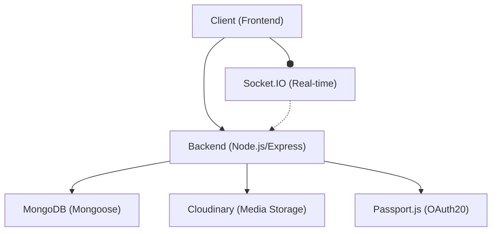
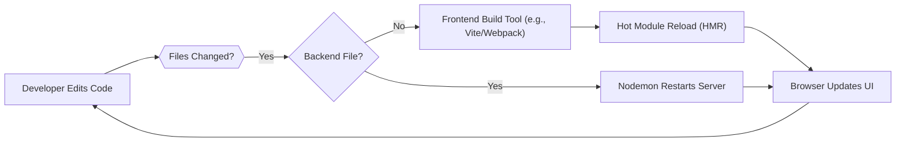

---
title: "Development and Configuration"
description: "Guides for setting up the development environment, build processes, and styling."
sidebar_position: 4
---

# Development and Configuration
<TOC />

This section provides a comprehensive guide to understanding the project's development environment, build processes, and styling methodologies. It covers key configuration files that govern code quality, UI theming, and backend dependencies, essential for both setting up a local development environment and deploying the application.

## System Purpose
This project is structured as a full-stack application, likely a MERN (MongoDB, Express, React, Node.js) stack, given the dependencies identified. The backend handles API logic, data persistence, and authentication, while the frontend provides the user interface.

### Key Functionalities

*   **Backend API Services**: Provides RESTful APIs for data interaction, user authentication (including OAuth with Google), and real-time communication.
*   **User Authentication & Authorization**: Implements secure user login, registration, session management, and role-based access control.
*   **Real-time Communication**: Utilizes WebSockets for immediate updates and interactive features, likely through Socket.IO.
*   **Database Management**: Interacts with MongoDB (via Mongoose) for persistent data storage.
*   **Cloud Storage Integration**: Leverages Cloudinary for media asset management.
*   **Frontend UI/UX**: Delivers a rich, interactive user experience using React, styled with Tailwind CSS and DaisyUI.
*   **Code Quality & Consistency**: Enforces coding standards and best practices across the frontend using ESLint.

## Architecture
The application follows a typical client-server architecture, divided into a frontend and a backend component.

*   **Client (Frontend)**: Developed with React, it communicates with the backend API to fetch and display data, and handles user interactions.
*   **Server (Backend)**: Built with Node.js and Express, it exposes APIs, interacts with the database, and manages business logic. It also supports real-time communication via Socket.IO.
*   **Database**: MongoDB serves as the primary data store.
*   **External Services**: Cloudinary for file uploads and Passport.js for OAuth.





_Figure 1: High-level architectural overview illustrating the interaction between frontend, backend, database, and external services._

## Technology Stack
The project leverages a modern JavaScript-centric technology stack, enabling efficient development and scalability.

| Layer          | Technology       | Purpose                                                                                |
| :------------- | :--------------- | :------------------------------------------------------------------------------------- |
| **Backend**    | Node.js, Express | Server-side runtime and web framework for API development.                             |
| **Database**   | MongoDB, Mongoose | NoSQL database for data storage; ODM for Node.js.                                      |
| **Auth**       | JWT, Passport.js | Secure authentication with JSON Web Tokens and Google OAuth.                           |
| **Real-time**  | Socket.IO        | Bidirectional, event-based communication for real-time features.                       |
| **File Upload**| Cloudinary       | Cloud-based media management for image and video uploads.                              |
| **Frontend**   | React            | JavaScript library for building user interfaces.                                       |
| **Styling**    | Tailwind CSS     | Utility-first CSS framework for rapid UI development.                                  |
| **UI Components**| DaisyUI         | Tailwind CSS component library for pre-built, themed UI elements.                      |
| **Linter**     | ESLint           | Static code analysis tool for identifying problematic patterns and enforcing style.      |
| **Dev Tools**  | Nodemon          | Automatically restarts the Node.js server during development.                          |

### Backend Dependencies and Scripts
The `backend/package.json` file outlines the backend's core dependencies and available scripts for development and production.

```json
{
  "name": "backend",
  "version": "1.0.0",
  "main": "src/index.js",
  "scripts": {
    "dev": "nodemon src/index.js",
    "start": "node src/index.js"
  },
  "author": "",
  "type": "module",
  "license": "ISC",
  "description": "",
  "dependencies": {
    "bcryptjs": "^2.4.3",
    "cloudinary": "^2.5.1",
    "cookie-parser": "^1.4.7",
    "dotenv": "^16.4.7",
    "express": "^4.21.2",
    "express-session": "^1.18.1",
    "jsonwebtoken": "^9.0.2",
    "mongoose": "^8.9.5",
    "passport": "^0.7.0",
    "passport-google-oauth20": "^2.0.0",
    "socket.io": "^4.8.1"
  },
  "devDependencies": {
    "nodemon": "^3.1.9"
  }
}
```
[View on GitHub](https://github.com/shinymack/Chat-App-MERN/blob/main/backend/package.json)

*   **`"dev": "nodemon src/index.js"`**: This script is used for development. `nodemon` automatically restarts the Node.js server whenever file changes are detected, significantly improving the development workflow.
*   **`"start": "node src/index.js"`**: This script is for production deployment. It runs the Node.js application directly using `node`.
*   **`"type": "module"`**: Specifies that the project uses ES Modules syntax (import/export), which is a modern standard for JavaScript modules.

**Dependency Insights:**
The `dependencies` section shows a robust set of libraries for a modern web application:
*   `express`: The foundational web framework.
*   `mongoose`: ODM for MongoDB, facilitating database interactions.
*   `bcryptjs`, `jsonwebtoken`: Essential for secure password hashing and authentication using JWTs.
*   `passport`, `passport-google-oauth20`: For implementing flexible authentication strategies, specifically Google OAuth.
*   `socket.io`: Enables real-time, bidirectional communication, crucial for features like live chat or notifications.
*   `cloudinary`: Integrates cloud-based media storage and manipulation.
*   `dotenv`: Manages environment variables, keeping sensitive information out of the codebase.
*   `cookie-parser`, `express-session`: For managing HTTP cookies and user sessions.

## Features

### Frontend Styling with Tailwind CSS and DaisyUI
The frontend styling is managed through Tailwind CSS, augmented by the DaisyUI component library. This combination allows for rapid UI development with highly customizable utility classes and pre-built, themeable components.

#### Tailwind CSS Configuration
The `frontend/tailwind.config.js` file customizes Tailwind's behavior, including content scanning, theme extensions, and plugin integration.

```javascript
import daisyui from "daisyui"

/** @type {import('tailwindcss').Config} */
export default {
  content: [
    "./index.html",
    "./src/**/*.{js,ts,jsx,tsx}",
  ],
  theme: {
    extend: {
      fontFamily : {
        chivo : ['Chivo', 'sans-serif'],
      }
    },
  },
  plugins: [daisyui],
  daisyui : {
    themes: [
      "light", "dark", "cupcake", "bumblebee", "emerald", "corporate", "synthwave",
      "retro", "cyberpunk", "valentine", "halloween", "garden", "forest", "aqua",
      "lofi", "pastel", "fantasy", "wireframe", "black", "luxury", "dracula",
      "cmyk", "autumn", "business", "acid", "lemonade", "night", "coffee",
      "winter", "dim", "nord", "sunset",
    ],
  }
}
```
[View on GitHub](https://github.com/shinymack/Chat-App-MERN/blob/main/frontend/tailwind.config.js)

*   **`content`**: Specifies the files Tailwind should scan for classes to generate optimized CSS. This ensures that only used utility classes are bundled, keeping the CSS footprint small.
*   **`theme.extend`**: Allows adding custom typography, colors, spacing, etc., without overriding Tailwind's default theme. Here, a custom `chivo` font family is defined.
*   **`plugins: [daisyui]`**: Integrates DaisyUI, providing a rich set of pre-designed components like buttons, modals, and navigation elements, all styled with Tailwind.
*   **`daisyui.themes`**: An extensive list of themes available through DaisyUI, allowing for easy switching between different visual styles (e.g., `light`, `dark`, `synthwave`). This enhances UI flexibility and user personalization.

#### PostCSS Configuration
The `frontend/postcss.config.js` file defines PostCSS plugins used to process CSS.

```javascript
export default {
  plugins: {
    tailwindcss: {},
    autoprefixer: {},
  },
}
```
[View on GitHub](https://github.com/shinymack/Chat-App-MERN/blob/main/frontend/postcss.config.js)

*   **`tailwindcss`**: This plugin integrates Tailwind CSS into the PostCSS pipeline, allowing it to process and generate the necessary utility classes.
*   **`autoprefixer`**: Automatically adds vendor prefixes to CSS rules, ensuring cross-browser compatibility. For example, it might add `-webkit-` or `-moz-` prefixes to properties like `display: flex`.

### Code Quality with ESLint
ESLint is configured to maintain code quality, consistency, and identify potential issues in the JavaScript/JSX frontend files.

#### ESLint Configuration
The `frontend/eslint.config.js` file defines the ESLint rules and plugins for the frontend.

```javascript
import js from '@eslint/js'
import globals from 'globals'
import react from 'eslint-plugin-react'
import reactHooks from 'eslint-plugin-react-hooks'
import reactRefresh from 'eslint-plugin-react-refresh'

export default [
  { ignores: ['dist'] },
  {
    files: ['**/*.{js,jsx}'],
    languageOptions: {
      ecmaVersion: 2020,
      globals: globals.browser,
      parserOptions: {
        ecmaVersion: 'latest',
        ecmaFeatures: { jsx: true },
        sourceType: 'module',
      },
    },
    settings: { react: { version: '18.3' } },
    plugins: {
      react,
      'react-hooks': reactHooks,
      'react-refresh': reactRefresh,
    },
    rules: {
      ...js.configs.recommended.rules,
      ...react.configs.recommended.rules,
      ...react.configs['jsx-runtime'].rules,
      ...reactHooks.configs.recommended.rules,
      'react/jsx-no-target-blank': 'off',
      'react-refresh/only-export-components': [
        'warn',
        { allowConstantExport: true },
      ],
      "react/prop-types" : "off",
    },
  },
]
```
[View on GitHub](https://github.com/shinymack/Chat-App-MERN/blob/main/frontend/eslint.config.js)

*   **`ignores: ['dist']`**: Prevents ESLint from linting files within the `dist` directory, which typically contains build artifacts.
*   **`files: ['**/*.{js,jsx}']`**: Specifies that these rules apply only to JavaScript and JSX files.
*   **`languageOptions`**: Configures JavaScript parsing options:
    *   `ecmaVersion: 'latest'`: Enables support for the latest ECMAScript features.
    *   `globals: globals.browser`: Defines browser-specific global variables (e.g., `window`, `document`).
    *   `ecmaFeatures: { jsx: true }`: Enables JSX parsing.
    *   `sourceType: 'module'`: Specifies that the code uses ES modules.
*   **`settings: { react: { version: '18.3' } }`**: Informs ESLint about the React version being used for plugin compatibility.
*   **`plugins`**: Integrates various ESLint plugins:
    *   `@eslint/js`: ESLint's recommended core rules.
    *   `eslint-plugin-react`: React-specific linting rules.
    *   `eslint-plugin-react-hooks`: Rules for enforcing rules of hooks.
    *   `eslint-plugin-react-refresh`: Rules related to React Fast Refresh.
*   **`rules`**: Overrides or extends recommended rules:
    *   `...js.configs.recommended.rules`: Includes standard recommended JavaScript rules.
    *   `...react.configs.recommended.rules`, `...react.configs['jsx-runtime'].rules`: Includes recommended React rules, including those for the new JSX runtime.
    *   `...reactHooks.configs.recommended.rules`: Enforces standard React Hooks rules.
    *   `'react/jsx-no-target-blank': 'off'`: Disables the rule that typically warns about `target="_blank"` without `rel="noopener noreferrer"`, potentially due to context where it's not a security concern or handled elsewhere.
    *   `'react-refresh/only-export-components': ['warn', { allowConstantExport: true }]`: Warns if components are not exported or are constant, which can break Fast Refresh functionality. The `allowConstantExport` option permits constant exports.
    *   `"react/prop-types" : "off"`: Disables the `prop-types` rule, indicating that TypeScript or a similar type-checking solution might be used, or prop validation is handled differently.

### Development Workflow
The development workflow leverages `nodemon` for the backend and likely a standard `vite` or `create-react-app` setup for the frontend, which typically includes hot module reloading (HMR).





_Figure 2: Development workflow illustrating how code changes are reflected in the application._

## Key Integration Points
Understanding how different parts of the application interact is crucial for development and maintenance.

*   **API Interactions**: The React frontend communicates with the Node.js/Express backend via HTTP requests (e.g., using `fetch` or `axios`) for data retrieval, submission, and authentication. Authentication tokens (JWTs) are typically passed in headers for secure access to protected routes.
*   **Authentication Flow**: User authentication involves the frontend sending credentials to the backend. The backend validates these, generates a JWT, and sends it back to the frontend, often stored in an HTTP-only cookie or local storage. For Google OAuth, the frontend redirects to Google, which then redirects back to the backend with an authorization code, completing the OAuth flow.
*   **Real-time Communication**: Socket.IO is the backbone for real-time features. The frontend establishes a WebSocket connection with the backend. The backend emits events (e.g., `newMessage`, `userJoined`) that the frontend listens for, triggering immediate UI updates without page reloads. This is particularly relevant for chat applications or live notifications.
*   **Styling Consistency**: Tailwind CSS and DaisyUI ensure a unified visual language across the frontend. By integrating `postcss-loader` (which uses `postcss.config.js`) into the frontend's build pipeline, Tailwind and Autoprefixer process CSS before it's delivered to the browser. DaisyUI's theming capabilities further streamline UI consistency and allow for dynamic theme switching.
*   **Code Quality Enforcement**: ESLint is integrated into the frontend's development process, providing immediate feedback on code style and potential errors during development, before commits, or as part of CI/CD pipelines. This ensures a consistent codebase and reduces the likelihood of introducing bugs.

These integration points highlight the distributed nature of the application and the clear separation of concerns between the client and server, while emphasizing the mechanisms for their seamless interaction.
```