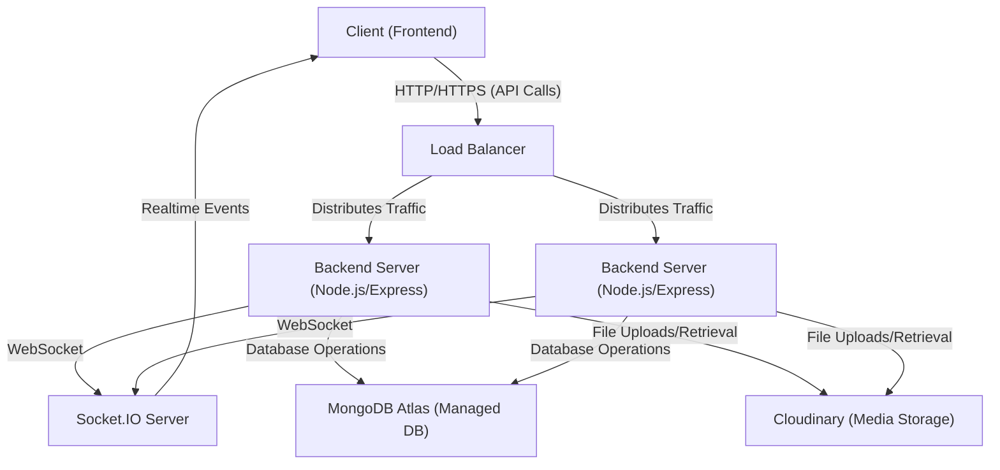

---
title: "Development and Deployment"
description: "Guidelines for setting up the development environment, running the application, and deployment considerations."
sidebar_position: 4
---

# Development and Deployment
<TOC />

This section provides comprehensive guidelines for setting up the local development environment, running the MERN ChatApp, and understanding key considerations for its deployment. The application is structured as a client-server architecture, with a React-based frontend and a Node.js/Express backend, leveraging a MongoDB database.

## Development Environment Setup

To begin development, ensure you have Node.js and npm (Node Package Manager) installed on your system. The project's root `package.json` orchestrates the setup for both the frontend and backend components.

### Prerequisites

Before cloning the repository, ensure the following are installed:
*   **Node.js**: Version 18 or higher (includes npm)
*   **MongoDB**: A running instance or access to a cloud-hosted service like MongoDB Atlas.
*   **Git**: For cloning the repository.

### Initial Setup and Installation

The `package.json` in the project root defines a `build` script that automates the installation of dependencies for both the `backend` and `frontend` directories. This script ensures all necessary packages are present before running the application.

```json title="package.json"
{
  "name": "chatapp",
  "version": "1.0.0",
  "main": "index.js",
  "scripts": {
    "build" : "npm install --prefix backend && npm install --prefix frontend && npm run build --prefix frontend",
    "start" : "npm run start --prefix backend"
  },
  "keywords": [],
  "author": "",
  "license": "ISC",
  "description": ""
}
```
[View on GitHub](https://github.com/shinymack/Chat-App-MERN/blob/main/package.json)

To set up the project:

1.  **Clone the repository**:
    ```bash
    git clone <repository-url>
    cd chatapp
    ```
2.  **Install all dependencies**:
    ```bash
    npm run build
    ```
    This command executes `npm install` in both the `backend` and `frontend` directories and then runs the `frontend`'s build script. This step might take a few minutes as it downloads all required packages.

### Backend Environment Configuration

The backend requires environment variables for sensitive data like database connection strings, API keys (e.g., Cloudinary), and JWT secrets. These are typically loaded using the `dotenv` package. Create a `.env` file in the `backend/` directory based on your specific configuration needs.

**Example `.env` file (backend/.env):**
```dotenv
MONGO_URI="mongodb://localhost:27017/chatapp"
JWT_SECRET="your_jwt_secret_key"
CLOUDINARY_CLOUD_NAME="your_cloud_name"
CLOUDINARY_API_KEY="your_api_key"
CLOUDINARY_API_SECRET="your_api_secret"
GOOGLE_CLIENT_ID="your_google_client_id"
GOOGLE_CLIENT_SECRET="your_google_client_secret"
PORT=5000
```
Ensure you replace placeholder values with your actual credentials. For production deployments, these variables should be managed securely, often through platform-specific environment variable settings.

## Running the Application

The MERN ChatApp consists of two primary services: the backend API and the frontend client. Both can be run independently or orchestrated via the root `package.json` scripts.

### Running the Backend

The backend `package.json` defines scripts for both development (`dev`) and production (`start`) modes.

```json title="backend/package.json"
{
  "name": "backend",
  "version": "1.0.0",
  "main": "src/index.js",
  "scripts": {
    "dev": "nodemon src/index.js",
    "start": "node src/index.js"
  },
  "author": "",
  "type": "module",
  "license": "ISC",
  "description": "",
  "dependencies": {
    "bcryptjs": "^2.4.3",
    "cloudinary": "^2.5.1",
    "cookie-parser": "^1.4.7",
    "dotenv": "^16.4.7",
    "express": "^4.21.2",
    "express-session": "^1.18.1",
    "jsonwebtoken": "^9.0.2",
    "mongoose": "^8.9.5",
    "passport": "^0.7.0",
    "passport-google-oauth20": "^2.0.0",
    "socket.io": "^4.8.1"
  },
  "devDependencies": {
    "nodemon": "^3.1.9"
  }
}
```
[View on GitHub](https://github.com/shinymack/Chat-App-MERN/blob/main/backend/package.json)

*   **Development Mode**: Utilizes `nodemon` for automatic server restarts on file changes, streamlining the development workflow.
    ```bash
    cd backend
    npm run dev
    ```
    The backend server will typically run on `http://localhost:5000` (or the port specified in your `.env` file).

*   **Production Mode**: Runs the server using Node.js directly. This mode is optimized for performance and stability.
    ```bash
    cd backend
    npm start
    ```

### Running the Frontend

The frontend is a React application powered by Vite, offering a fast development experience. The `frontend/vite.config.js` shows the use of the `@vitejs/plugin-react` plugin.

```javascript title="frontend/vite.config.js"
import { defineConfig } from 'vite'
import react from '@vitejs/plugin-react'

// https://vite.dev/config/
export default defineConfig({
  plugins: [react()],
})
```
[View on GitHub](https://github.com/shinymack/Chat-App-MERN/blob/main/frontend/vite.config.js)

The frontend typically has its own `package.json` with `dev` and `build` scripts.
*   **Development Mode**:
    ```bash
    cd frontend
    npm run dev
    ```
    This will start the Vite development server, usually on `http://localhost:5173`.
*   **Building for Production**:
    ```bash
    cd frontend
    npm run build
    ```
    This command compiles the React application into static assets located in the `dist` directory, ready for deployment.

### Unified Application Start

The root `package.json` provides a convenience script to start the backend directly, which is useful when deploying the entire application to a single host that serves both.

```bash
npm start
```
This command, `npm run start --prefix backend`, will only start the backend service. For a complete development setup, you would typically run `npm run dev` in the `backend` directory and `npm run dev` in the `frontend` directory concurrently.

## Technology Stack

The MERN ChatApp leverages a robust set of technologies, typical for modern full-stack web applications.

| Layer            | Technology           | Purpose                                                                                                                                                                                                                                                                                                                                                                                                                                  |
| :--------------- | :------------------- | :--------------------------------------------------------------------------------------------------------------------------------------------------------------------------------------------------------------------------------------------------------------------------------------------------------------------------------------------------------------------------------------------------------------------------------------- |
| **Frontend**     | React, Vite          | User Interface and Experience. React provides a declarative way to build interactive UIs, while Vite offers a fast and efficient development server and build tool.                                                                                                                                                                                                                                                                        |
| **Backend**      | Node.js, Express     | API Services and Business Logic. Node.js is a JavaScript runtime, and Express is a minimalist web framework for building RESTful APIs. It handles routing, middleware, and request/response cycles.                                                                                                                                                                                                                                          |
| **Database**     | MongoDB, Mongoose    | Data Storage. MongoDB is a NoSQL document database, offering flexibility and scalability. Mongoose is an ODM (Object Data Modeling) library for Node.js, providing a schema-based solution to model application data and interact with MongoDB.                                                                                                                                                                                           |
| **Realtime**     | Socket.IO            | Real-time bidirectional event-based communication. Essential for chat applications to send and receive messages instantly without requiring page refreshes or continuous polling.                                                                                                                                                                                                                                                         |
| **Authentication** | JWT, bcryptjs, Passport | User authentication and authorization. `jsonwebtoken` (JWT) for secure token-based authentication. `bcryptjs` for hashing passwords securely. `passport` and `passport-google-oauth20` for flexible authentication strategies, including Google OAuth.                                                                                                                                                                                  |
| **Cloud Storage** | Cloudinary           | Media asset management. Used for uploading, storing, and delivering images and other media files, potentially for user avatars or shared media in chat.                                                                                                                                                                                                                                                                                       |
| **Dev Tools**    | Nodemon              | Development server auto-reloading. Monitors for any changes in your source code and automatically restarts the server, significantly speeding up the development process by eliminating manual restarts.                                                                                                                                                                                                                                     |
| **Environment**  | Dotenv               | Environment variable management. Loads environment variables from a `.env` file into `process.env`, keeping sensitive configuration data separate from the codebase and adapting settings for different environments (development, production). |
| **Cookie Management** | Cookie-parser    | Middleware for parsing `Cookie` header and populating `req.cookies` with an object keyed by the cookie names. Useful for managing session cookies or authentication tokens.                                                                                                                                                                                                                                                                |

## Deployment Considerations

Deploying the MERN ChatApp involves ensuring both the frontend and backend services are accessible and configured correctly for a production environment.

### Production Build

For the frontend, always generate a production build:
```bash
cd frontend
npm run build
```
This creates an optimized `dist` folder. For deployment, these static files can be served by a web server (like Nginx, Apache, or even the backend Express server) or a static site hosting service (e.g., Netlify, Vercel).

### Backend Deployment

The backend should be run using `npm start` (or `node src/index.js`) to leverage Node.js's optimized runtime. Key considerations include:

*   **Process Management**: Use a process manager like PM2 to keep the Node.js application running continuously, handle restarts, and monitor performance.
    ```bash
    # Install PM2 globally
    npm install -g pm2
    # Start the backend with PM2
    pm2 start src/index.js --name "chat-backend"
    ```
*   **Environment Variables**: Securely configure environment variables in your hosting platform (e.g., Heroku config vars, AWS SSM, Kubernetes secrets) rather than relying on a `.env` file.
*   **Scalability**: For high traffic, consider running multiple instances of the backend application behind a load balancer. Node.js's single-threaded nature means horizontal scaling is often necessary.
*   **Database**: Connect to a robust, managed MongoDB service (e.g., MongoDB Atlas) rather than a local instance.

### Architecture Diagram for Deployment

The following diagram illustrates a typical deployment architecture for the MERN ChatApp, considering separate hosting for the frontend and backend, with a managed database and cloud storage.





### Deployment Flow

This sequence diagram outlines the steps involved in a production deployment, from code push to service availability.


```mermaid
sequenceDiagram
    participant D as "Developer"
    participant G as "Git Repository"
    participant CI as "CI/CD Pipeline"
    participant FEH as "Frontend Hosting (e.g., Vercel)"
    participant BEH as "Backend Hosting (e.g., Render)"
    participant DB as "MongoDB Atlas"

    D->>G: git push main
    G->>CI: Webhook Trigger
    CI->>CI: Checkout code
    CI->>CI: Run tests (Frontend & Backend)
    CI->>FEH: Build & Deploy Frontend (npm run build; copy dist/)
    CI->>BEH: Deploy Backend (npm install; npm start)
    BEH->>DB: Connect to Database (MONGO_URI)
    FEH->>BEH: Frontend accesses Backend API
    BEH-->>FEH: API Responses
    D->>FEH: Verify deployment
    D->>BEH: Verify backend logs
```


## Key Integration Points

The MERN ChatApp's functionality relies heavily on seamless integration between its components.

*   **API Flows (RESTful & Realtime)**: The frontend interacts with the backend through RESTful API calls for operations like user authentication, profile management, and initial data loading. Real-time communication for chat messages is handled by Socket.IO, establishing a persistent bidirectional connection between the client and the Socket.IO server (which is part of the Node.js backend). This separation allows for efficient handling of both stateless API requests and stateful, real-time events.

*   **Authentication and Authorization**: The application likely uses JWT (JSON Web Tokens) for session management post-login. Upon successful authentication (either via username/password or Google OAuth), the backend issues a JWT, often stored in an HTTP-only cookie or local storage on the client. Subsequent requests include this token for authorization, validated by the backend to ensure the user has permission to access protected resources. `passport` and `express-session` play crucial roles in managing user sessions, particularly with OAuth flows.

*   **State Management**: While specific frontend state management isn't detailed, React applications typically use hooks (`useState`, `useContext`), Redux, or Zustand to manage global application state, including user data, chat messages, and UI interactions. The state is updated based on API responses and real-time Socket.IO events. For example, new messages received via Socket.IO would trigger a state update to display the message in the chat UI.

*   **Cloudinary Integration**: The `cloudinary` dependency suggests that media files (like user avatars or shared images) are uploaded to and served from Cloudinary. The backend handles the secure upload process, potentially returning the Cloudinary URL to the frontend, which then displays the content. This offloads media serving from the main application servers, improving performance and scalability.

By understanding these integration points, developers can effectively debug, extend, and maintain the application, ensuring that changes in one part of the system propagate correctly and securely across the entire MERN stack.
```