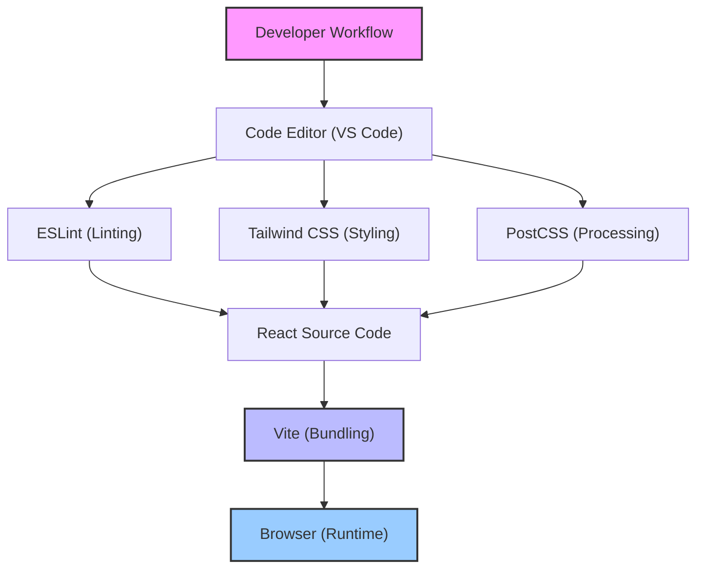
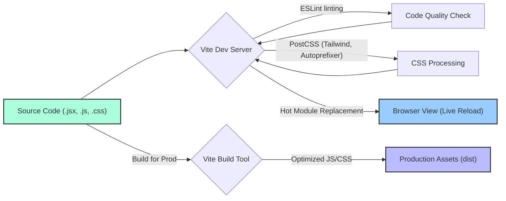

---
title: "Development Guidelines and Tools"
description: "Information on development best practices, configuration for linters, formatters, and build tools."
sidebar_position: 4
---

# Development Guidelines and Tools

<TOC />

This section outlines the essential tools and configurations that form the foundation of our frontend development workflow. It covers linting, styling, and bundling tools, providing insights into best practices and how to leverage them effectively.

## Frontend Development Ecosystem Overview

The frontend stack primarily utilizes React, bundled with Vite, and styled with Tailwind CSS, enhanced by DaisyUI components. ESLint ensures code quality and consistency across the codebase.





## Linting and Code Quality with ESLint

ESLint is configured to enforce code style, catch potential errors, and ensure consistency throughout the React application. Our setup integrates standard ESLint recommendations with React-specific rules and React Hooks best practices.

### Configuration (`frontend/eslint.config.js`)

The `eslint.config.js` file is the central point for defining linting rules. It uses the new flat config format, importing various plugins for JavaScript, React, React Hooks, and React Refresh.

```javascript
import js from '@eslint/js'
import globals from 'globals'
import react from 'eslint-plugin-react'
import reactHooks from 'eslint-plugin-react-hooks'
import reactRefresh from 'eslint-plugin-react-refresh'

export default [
  // Ignore the 'dist' directory
  { ignores: ['dist'] },
  {
    files: ['**/*.{js,jsx}'],
    languageOptions: {
      ecmaVersion: 2020,
      globals: globals.browser, // Defines browser global variables
      parserOptions: {
        ecmaVersion: 'latest',
        ecmaFeatures: { jsx: true },
        sourceType: 'module',
      },
    },
    settings: { react: { version: '18.3' } }, // Specify React version for plugin
    plugins: {
      react,
      'react-hooks': reactHooks,
      'react-refresh': reactRefresh,
    },
    rules: {
      ...js.configs.recommended.rules, // Standard JS recommended rules
      ...react.configs.recommended.rules, // React recommended rules
      ...react.configs['jsx-runtime'].rules, // Rules for new JSX transform
      ...reactHooks.configs.recommended.rules, // React Hooks recommended rules
      'react/jsx-no-target-blank': 'off', // Disable rule for target="_blank" without rel="noopener noreferrer"
      'react-refresh/only-export-components': [ // Warns if components are not exported
        'warn',
        { allowConstantExport: true },
      ],
      "react/prop-types" : "off", // Disable prop-types validation, preferring TypeScript or external validation
    },
  },
]
```
[View on GitHub](https://github.com/shinymack/Chat-App-MERN/blob/main/frontend/eslint.config.js)

**Key Aspects:**

*   **Ignored Files**: The `dist` directory is explicitly ignored to prevent linting built output.
*   **Language Options**: Configures for ECMAScript 2020 (and `latest` for parser options), enabling JSX and module parsing.
*   **React Integration**: Sets the React version to `18.3` for accurate linting.
*   **Plugins**: Incorporates `eslint-plugin-react`, `eslint-plugin-react-hooks`, and `eslint-plugin-react-refresh` for comprehensive React support.
*   **Rules**: Merges recommended rules from `js`, `react`, and `react-hooks`. Notable overrides include:
    *   `react/jsx-no-target-blank`: Disabled for flexibility, though generally recommended for security.
    *   `react-refresh/only-export-components`: Set to `warn` to ensure components are correctly exported for Vite's Fast Refresh.
    *   `react/prop-types`: Disabled, indicating a preference for alternative type-checking mechanisms (e.g., TypeScript).

## Styling with Tailwind CSS and PostCSS

The project leverages Tailwind CSS for utility-first styling, providing rapid UI development. PostCSS is used to process CSS, integrating Tailwind CSS and `autoprefixer` for cross-browser compatibility.

### PostCSS Configuration (`frontend/postcss.config.js`)

PostCSS acts as a pipeline for processing CSS. Its configuration specifies the plugins to use.

```javascript
export default {
  plugins: {
    tailwindcss: {}, // Integrates Tailwind CSS
    autoprefixer: {}, // Automatically adds vendor prefixes
  },
}
```
[View on GitHub](https://github.com/shinymack/Chat-App-MERN/blob/main/frontend/postcss.config.js)

**Key Aspects:**

*   **`tailwindcss`**: This plugin enables Tailwind CSS to parse and process your CSS files, generating the necessary utility classes based on your configuration.
*   **`autoprefixer`**: Automatically adds vendor prefixes to CSS rules, ensuring broad browser compatibility without manual intervention.

### Tailwind CSS Configuration (`frontend/tailwind.config.js`)

The `tailwind.config.js` file is where you customize Tailwind CSS to match project-specific design requirements, extending themes, and integrating third-party plugins like DaisyUI.

```javascript
import daisyui from "daisyui"

/** @type {import('tailwindcss').Config} */
export default {
  content: [
    "./index.html", // Scan HTML for Tailwind classes
    "./src/**/*.{js,ts,jsx,tsx}", // Scan all JS/TS/JSX/TSX files in src
  ],
  theme: {
    extend: {
      fontFamily : {
        chivo : ['Chivo', 'sans-serif'], // Custom font family
      }
    },
  },
  plugins: [daisyui], // Integrate DaisyUI plugin
  daisyui : {
    themes: [
      "light", "dark", "cupcake", "bumblebee", "emerald", "corporate",
      "synthwave", "retro", "cyberpunk", "valentine", "halloween",
      "garden", "forest", "aqua", "lofi", "pastel", "fantasy",
      "wireframe", "black", "luxury", "dracula", "cmyk", "autumn",
      "business", "acid", "lemonade", "night", "coffee", "winter",
      "dim", "nord", "sunset",
    ], // List of DaisyUI themes to include
  }
}
```
[View on GitHub](https://github.com/shinymack/Chat-App-MERN/blob/main/frontend/tailwind.config.js)

**Key Aspects:**

*   **`content`**: Crucially defines which files Tailwind CSS should scan for utility classes. This ensures only used classes are included in the final bundle, leading to smaller CSS file sizes.
*   **`theme.extend`**: Allows extending Tailwind's default theme. Here, a custom `chivo` font family is defined.
*   **`plugins`**: Integrates the `daisyui` plugin, which provides pre-built, semantic components on top of Tailwind CSS.
*   **`daisyui.themes`**: Specifies the exact DaisyUI themes to be included in the build. This project opts to include a wide range of themes for design flexibility.

## Bundling with Vite

Vite is a next-generation frontend tool that provides an extremely fast development experience. It's used here for bundling the React application, offering instant server start, hot module replacement (HMR), and optimized production builds.

### Configuration (`frontend/vite.config.js`)

The `vite.config.js` file is minimalistic, primarily setting up the React plugin.

```javascript
import { defineConfig } from 'vite'
import react from '@vitejs/plugin-react'

// https://vitejs.dev/config/
export default defineConfig({
  plugins: [react()], // Enable React support
})
```
[View on GitHub](https://github.com/shinymack/Chat-App-MERN/blob/main/frontend/vite.config.js)

**Key Aspects:**

*   **`defineConfig`**: A helper from Vite to ensure proper type hinting for the configuration object.
*   **`@vitejs/plugin-react`**: The official plugin for Vite that provides React Fast Refresh support and optimizes React builds.

## Key Integration Points

### Frontend Build and Development Flow

Understanding how these tools integrate is crucial for efficient development.





*   **Development Server**: Vite's development server (`vite.config.js`) orchestrates the entire process. When you modify a file:
    *   **ESLint (`eslint.config.js`)** runs to check for linting errors and warnings, providing immediate feedback in the console.
    *   **PostCSS (`postcss.config.js`)** processes your CSS, applying Tailwind classes and adding vendor prefixes.
    *   **HMR (Hot Module Replacement)**, enabled by Vite and `@vitejs/plugin-react`, updates only the changed modules in the browser without a full page reload, maintaining application state.
*   **Build Process**: For production, Vite performs an optimized build, tree-shaking unused code, minifying assets, and bundling everything into static files in the `dist` directory. Tailwind's `content` configuration ensures only necessary CSS is included.

### Best Practices

*   **Consistent Code Style**: Adhere to ESLint rules. Configure your IDE (e.g., VS Code) to integrate ESLint and auto-fix on save for an effortless experience.
*   **Utility-First Styling**: Leverage Tailwind CSS utility classes as much as possible. For complex components, create new reusable React components instead of extensive custom CSS. DaisyUI provides an excellent base for common UI elements.
*   **Semantic Commits**: Use conventional commits to clearly describe changes, aiding in release notes and project history.
*   **Regular Updates**: Keep development dependencies (Vite, ESLint, Tailwind, plugins) updated to benefit from performance improvements, bug fixes, and new features.

By following these guidelines and utilizing the configured tools, developers can maintain a high standard of code quality, improve development speed, and ensure a consistent user experience.
```