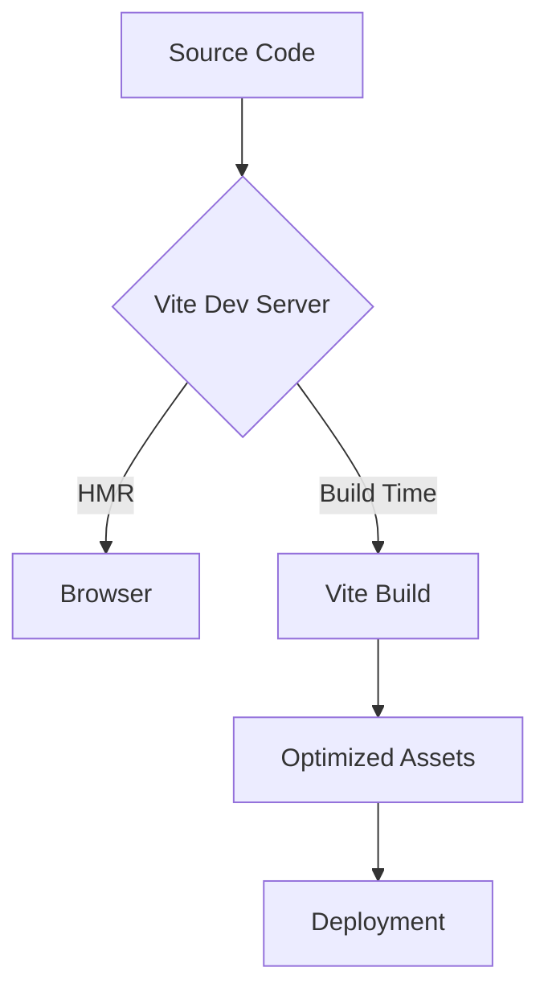
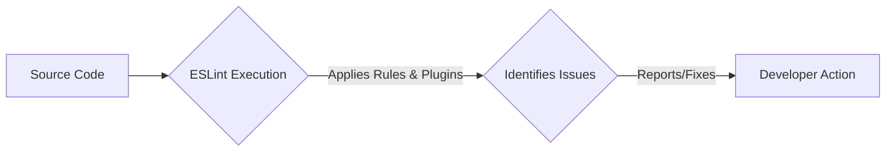

# Development and Styling

<TOC />

This section details the core tools and configurations that streamline the development process for the frontend application. It covers everything from build automation and dependency management to code quality enforcement and styling, ensuring a consistent and efficient development workflow.

## Build and Bundling with Vite

Vite is utilized as the build tool and development server for the frontend, offering an extremely fast development experience due to its native ES module imports. It provides instant hot module replacement (HMR) and optimized builds for production, making it an ideal choice for modern web applications.

### System Purpose

Vite's primary purpose is to:
*  **Rapid Development:** Provide a lightning-fast development server with instant server start and hot module replacement (HMR).
*  **Optimized Builds:** Bundle and optimize frontend assets for production, including JavaScript, CSS, and other static files, ensuring efficient loading and performance.
*  **Simplified Configuration:** Offer a developer-friendly configuration experience with sensible defaults, while remaining highly extensible through plugins.

### Configuration

The core Vite configuration is straightforward, primarily enabling React support through a dedicated plugin.

```javascript
// frontend/vite.config.js
import { defineConfig } from 'vite'
import react from '@vitejs/plugin-react'

// https://vite.dev/config/
export default defineConfig({
  plugins: [react()],
})
```
**Code Description:**
This snippet from [`vite.config.js`](https://github.com/shinymack/Chat-App-MERN/blob/main/frontend/vite.config.js#L1-L6) defines the Vite configuration. `defineConfig` provides intelligent type inference. The `plugins` array includes `@vitejs/plugin-react`, which adds React Fast Refresh support and JSX transformations, essential for a seamless React development experience.

### Build Process Flow

The following diagram illustrates the simplified build process with Vite:





**Diagram Description:** This Mermaid diagram visualizes the Vite build process. Source code is processed by the Vite Dev Server, which provides instant feedback to the browser via HMR during development. For production, the Vite Build step compiles the source code into optimized assets for deployment.

## Styling with Tailwind CSS and PostCSS

The frontend leverages Tailwind CSS for utility-first styling, enhanced by PostCSS for efficient processing. This combination provides a highly customizable and maintainable styling methodology.

### Tailwind CSS

Tailwind CSS is a highly customizable, utility-first CSS framework that allows developers to build designs directly in their HTML markup. It promotes rapid UI development and ensures consistency across the application.

#### Features and Benefits

*   **Utility-First:** Offers low-level utility classes that can be combined to build complex components.
*   **Customization:** Highly configurable, allowing for custom themes, colors, spacing, and more.
*   **Performance:** Generates only the CSS that is actually used in the project, leading to smaller bundle sizes.
*   **Rapid Development:** Speeds up UI development by eliminating the need to write custom CSS for every component.

#### Configuration

The `tailwind.config.js` file is the central place for configuring Tailwind CSS, including content paths, themes, and plugins.

```javascript
// frontend/tailwind.config.js
import daisyui from "daisyui"


/** @type {import('tailwindcss').Config} */
export default {
  content: [
    "./index.html",
    "./src/**/*.{js,ts,jsx,tsx}",
  ],
  theme: {
    extend: {
      fontFamily : {
        chivo : ['Chivo', 'sans-serif'],
      }
    },
  },
  plugins: [daisyui],
  daisyui : {
 themes: [
      "light",
      "dark",
      "cupcake",
      "bumblebee",
      "emerald",
      // ... more themes
    ],
  }
}
```
**Code Description:**
This configuration from [`tailwind.config.js`](https://github.com/shinymack/Chat-App-MERN/blob/main/frontend/tailwind.config.js#L1-L40) specifies the files to scan for Tailwind classes (`content`). It extends the default theme to include a custom font family (`chivo`). Crucially, it integrates `daisyui`, a Tailwind CSS component library, providing a rich set of pre-built UI components and a wide array of themes, enhancing development speed and design flexibility. The `daisyui.themes` array lists all available themes for quick switching.

### PostCSS

PostCSS is a tool for transforming CSS with JavaScript. Tailwind CSS uses PostCSS to process its directives and generate the final CSS output.

#### Plugins

*   **tailwindcss:** Processes Tailwind CSS directives and generates utility classes.
*   **autoprefixer:** Automatically adds vendor prefixes to CSS rules, ensuring cross-browser compatibility.

#### Configuration

The `postcss.config.js` defines the PostCSS plugins to be used.

```javascript
// frontend/postcss.config.js
export default {
  plugins: {
    tailwindcss: {},
    autoprefixer: {},
  },
}
```
**Code Description:**
This simple configuration from [`postcss.config.js`](https://github.com/shinymack/Chat-App-MERN/blob/main/frontend/postcss.config.js#L1-L6) instructs PostCSS to use `tailwindcss` for processing Tailwind directives and `autoprefixer` to automatically add vendor prefixes to CSS properties for broader browser support. This ensures that the generated CSS is highly compatible and optimized.

## Linting with ESLint

ESLint is configured to enforce code quality, identify potential issues, and maintain consistent coding styles across the project. It integrates with React and modern JavaScript features, ensuring best practices are followed.

### Purpose and Configuration

ESLint helps in:
*   **Code Quality:** Catching common errors and problematic patterns early in the development cycle.
*   **Style Consistency:** Enforcing a consistent coding style across the entire codebase, improving readability and maintainability.
*   **Best Practices:** Guiding developers towards using recommended practices for React and JavaScript.

The ESLint configuration is robust, incorporating several plugins for React-specific linting and modern JavaScript syntax.

```javascript
// frontend/eslint.config.js
import js from '@eslint/js'
import globals from 'globals'
import react from 'eslint-plugin-react'
import reactHooks from 'eslint-plugin-react-hooks'
import reactRefresh from 'eslint-plugin-react-refresh'

export default [
  { ignores: ['dist'] },
  {
    files: ['**/*.{js,jsx}'],
    languageOptions: {
      ecmaVersion: 2020,
      globals: globals.browser,
      parserOptions: {
        ecmaVersion: 'latest',
        ecmaFeatures: { jsx: true },
        sourceType: 'module',
      },
    },
    settings: { react: { version: '18.3' } },
    plugins: {
      react,
      'react-hooks': reactHooks,
      'react-refresh': reactRefresh,
    },
    rules: {
      ...js.configs.recommended.rules,
      ...react.configs.recommended.rules,
      ...react.configs['jsx-runtime'].rules,
      ...reactHooks.configs.recommended.rules,
      'react/jsx-no-target-blank': 'off',
      'react-refresh/only-export-components': [
        'warn',
        { allowConstantExport: true },
      ],
      "react/prop-types" : "off",
    },
  },
]
```
**Code Description:**
This detailed ESLint configuration from [`eslint.config.js`](https://github.com/shinymack/Chat-App-MERN/blob/main/frontend/eslint.config.js#L1-L40) sets up comprehensive linting for JavaScript and JSX files. Key aspects include:
*   **Ignored Paths:** `dist` directory is ignored to avoid linting generated build artifacts.
*   **Language Options:** Configures `ecmaVersion` for modern JavaScript, defines browser globals, and enables JSX parsing with `sourceType: 'module'`.
*   **React Version:** Sets the React version to '18.3' for accurate linting by `eslint-plugin-react`.
*   **Plugins:** Integrates `eslint-plugin-react`, `eslint-plugin-react-hooks`, and `eslint-plugin-react-refresh` for React-specific rules, hook enforcement, and Fast Refresh compatibility.
*   **Rules:**
    *   It inherits recommended rules from ESLint itself (`js.configs.recommended`), React (`react.configs.recommended`, `react.configs['jsx-runtime']`), and React Hooks (`reactHooks.configs.recommended`).
    *   `'react/jsx-no-target-blank': 'off'` disables a rule that might be overly restrictive for certain use cases, allowing `_blank` without `rel="noreferrer noopener"` if explicitly managed.
    *   `'react-refresh/only-export-components'` is set to `'warn'` with `allowConstantExport: true`, which is crucial for Vite's Fast Refresh functionality. It ensures that only components or hooks are exported as default or named exports in a file, allowing constant exports for utility functions or types. This helps maintain HMR state.
    *   `"react/prop-types": "off"` explicitly disables prop-types validation, a common practice in modern React projects that often use TypeScript or alternative validation methods.

### Linting Process





**Diagram Description:** This flowchart illustrates the ESLint linting process. Source code is fed into the ESLint execution engine, which applies configured rules and plugins. Any identified issues are then reported to the developer for action, such as fixing errors or adjusting code style.

## Key Integration Points

The development and styling tools seamlessly integrate to provide a cohesive and efficient frontend development environment:

*   **Vite & React:** Vite's `@vitejs/plugin-react` enables fast refresh and optimized bundling for React components, making development highly productive.
*   **Tailwind CSS & PostCSS:** Tailwind CSS directives are processed by PostCSS, specifically by the `tailwindcss` plugin, which then uses `autoprefixer` to ensure broad browser compatibility of the generated CSS. This ensures that the styling is efficient and reliable.
*   **ESLint & React/Vite:** ESLint is configured with React-specific plugins (`eslint-plugin-react`, `eslint-plugin-react-hooks`) to maintain code quality and adhere to React best practices. The `eslint-plugin-react-refresh` rule is specifically tuned for Vite's Fast Refresh, ensuring that component state is preserved during hot reloads.
*   **Development Workflow:** Developers write React components with Tailwind CSS classes. Vite compiles and serves these components with Fast Refresh. ESLint continuously checks code quality and style, providing immediate feedback in the IDE, ensuring high-quality, maintainable code.

This integrated setup streamlines the entire development lifecycle, from writing code and styling components to building and deploying the final application.