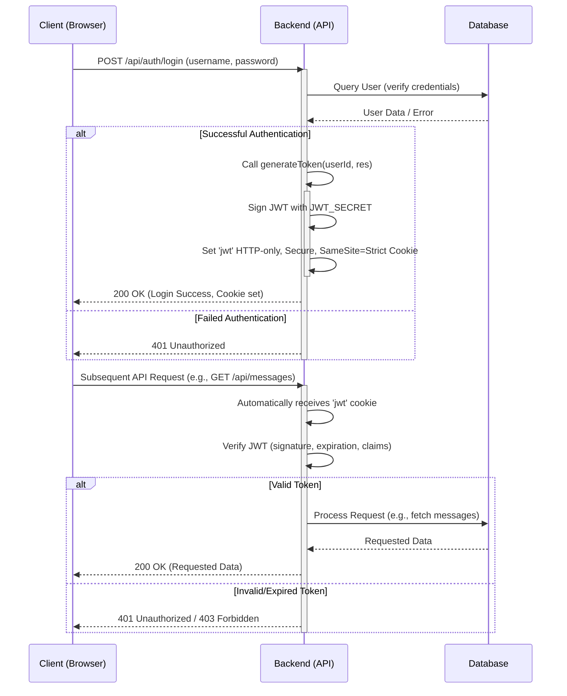

```mdx
---
title: "Development Tools & Utilities"
description: "Information about development setup, build tools, linting, and shared helper functions for both frontend and backend."
sidebar_position: 4
---

# Development Tools & Utilities

<TOC />

This section provides a comprehensive overview of the core development tools, build configurations, linting standards, and shared utility functions employed across both the frontend and backend of the application. These components are fundamental to maintaining code quality, streamlining development workflows, ensuring application performance, and safeguarding security.

---

## 1. Frontend Build & Development Environment

The frontend utilizes **Vite** as its primary build tool, chosen for its speed and developer experience.

### 1.1. Vite Configuration

Vite serves as the development server and build tool for the React frontend. Its configuration is minimal yet powerful, leveraging its plugin-based architecture.

#### WHAT it Does

The `vite.config.js` file defines how Vite should process and serve the frontend application. In this setup, it primarily integrates React support.

#### WHY it's Designed This Way

Vite was selected for its modern approach to frontend tooling:
*   **Faster Cold Start**: Leverages native ES modules for blazing-fast server start-up, significantly reducing initial development server boot times.
*   **Hot Module Replacement (HMR)**: Provides instant feedback during development without full page reloads, preserving application state and greatly enhancing developer productivity.
*   **Optimized Builds**: Uses Rollup for production builds, ensuring highly optimized, minified, and tree-shaken assets, which contributes to faster loading times for end-users.
*   **Simplicity**: Requires minimal configuration for common setups, as demonstrated by the concise `vite.config.js`, allowing developers to focus more on application logic.

#### HOW it Works

The configuration imports `defineConfig` from `vite` and `react` from `@vitejs/plugin-react`. The `plugins: [react()]` line registers the official React plugin, enabling Vite to understand and compile React JSX syntax and provide React-specific HMR capabilities.

```javascript
// frontend/vite.config.js
import { defineConfig } from 'vite'
import react from '@vitejs/plugin-react'

// https://vite.dev/config/
export default defineConfig({
  plugins: [react()],
})
```
[[frontend/vite.config.js#L1-L6](https://github.com/shinymack/Chat-App-MERN/blob/main/frontend/vite.config.js#L1-L6)]

This minimal configuration is sufficient for a standard React project, allowing developers to focus on application logic rather than intricate build setups.

### 1.2. Frontend Development Workflow Overview

The following diagram illustrates the typical frontend development workflow, showcasing how Vite, ESLint, and frontend utilities fit into the process.


```mermaid
flowchart TD
    A[Developer] --> B{Code Changes (React JS/JSX)}
    B --> C[Vite Dev Server]
    C --> D[Browser (HMR)]
    B --> E[ESLint (IDE Integration / Pre-commit Hook)]
    E -- "Provides Instant Feedback" --> A
    C -- "Serves UI Components" --> D
    C -- "Uses Frontend Utilities" --> F[UI Logic / Data Formatting]
```


---

## 2. Code Quality & Linting

**ESLint** is configured to enforce code style, identify problematic patterns, and maintain overall code quality for the frontend.

### 2.1. ESLint Configuration

The `eslint.config.js` file establishes the linting rules and environment for the frontend's JavaScript and JSX files.

#### WHAT it Does

This configuration sets up a robust linting environment using ESLint's Flat Config format, integrating recommended rules for standard JavaScript, React best practices, React Hooks, and React Refresh (for HMR compatibility). It also defines browser-specific globals, parser options for modern JavaScript and JSX, and ignores specific directories like `dist`.

#### WHY it's Designed This Way

*   **Consistency**: Ensures all frontend code adheres to a consistent style and set of best practices, improving readability and maintainability across the codebase, especially beneficial in team environments.
*   **Error Prevention**: Catches common programming errors, potential bugs, and anti-patterns early in the development cycle, reducing debugging time and improving code reliability.
*   **React Best Practices**: Enforces conventions specific to React development, such as rules for hooks usage and JSX syntax, promoting efficient and robust component design.
*   **Optimized Development**: Integrates with React Refresh to ensure compatibility with Vite's HMR, warning against issues that might break HMR, thus maintaining a smooth development experience.

#### HOW it Works

The configuration is structured as an array of configuration objects, following ESLint's new Flat Config format:

*   **`ignores: ['dist']`**: Explicitly prevents ESLint from processing files within the `dist` (build output) directory, avoiding linting generated code.
*   **`files: ['**/*.{js,jsx}']`**: Specifies that the subsequent rules and configurations apply only to JavaScript and JSX files within the project.
*   **`languageOptions`**:
    *   `ecmaVersion: 2020` and `parserOptions: { ecmaVersion: 'latest', ... }`: Configures ESLint to support modern JavaScript syntax up to the latest ECMAScript specification.
    *   `globals: globals.browser`: Defines browser-specific global variables (e.g., `window`, `document`, `console`) as known globals, preventing "no-undef" errors.
    *   `ecmaFeatures: { jsx: true }`: Explicitly enables parsing of JSX syntax.
    *   `sourceType: 'module'`: Indicates that JavaScript files are ES modules, allowing `import`/`export` syntax.
*   **`settings: { react: { version: '18.3' } }`**: Informs React plugins about the specific React version in use, ensuring rules are applied correctly based on React's API.
*   **`plugins`**: Registers several key ESLint plugins:
    *   `react`: Provides core React-specific linting rules.
    *   `react-hooks`: Offers rules to enforce the Rules of Hooks, crucial for stable and correct React Hook usage.
    *   `react-refresh`: Contains rules specifically designed to work with React Fast Refresh, preventing issues that can disrupt HMR.
*   **`rules`**: Combines recommended rule sets from `js`, `react`, `jsx-runtime`, and `react-hooks`, and then overrides specific rules:
    *   `'react/jsx-no-target-blank': 'off'`: Disables a rule that prevents `target="_blank"` without `rel="noreferrer noopener"`. This might be disabled if security concerns regarding external links are handled through other means or are not a primary concern for this specific application context.
    *   `'react-refresh/only-export-components'`: Configured as a `'warn'`, this rule ensures that only React components are exported from files that utilize HMR, preventing unexpected side effects during hot reloading. `allowConstantExport: true` permits constant exports if they don't break HMR.
    *   `"react/prop-types": "off"`: This rule is disabled, indicating that the project does not enforce prop type validation via the `PropTypes` library. This is a common practice in projects that adopt TypeScript for type checking or rely on other validation mechanisms.

```javascript
// frontend/eslint.config.js
import js from '@eslint/js'
import globals from 'globals'
import react from 'eslint-plugin-react'
import reactHooks from 'eslint-plugin-react-hooks'
import reactRefresh from 'eslint-plugin-react-refresh'

export default [
  { ignores: ['dist'] },
  {
    files: ['**/*.{js,jsx}'],
    languageOptions: {
      ecmaVersion: 2020,
      globals: globals.browser,
      parserOptions: {
        ecmaVersion: 'latest',
        ecmaFeatures: { jsx: true },
        sourceType: 'module',
      },
    },
    settings: { react: { version: '18.3' } },
    plugins: {
      react,
      'react-hooks': reactHooks,
      'react-refresh': reactRefresh,
    },
    rules: {
      ...js.configs.recommended.rules,
      ...react.configs.recommended.rules,
      ...react.configs['jsx-runtime'].rules,
      ...reactHooks.configs.recommended.rules,
      'react/jsx-no-target-blank': 'off',
      'react-refresh/only-export-components': [
        'warn',
        { allowConstantExport: true },
      ],
      "react/prop-types" : "off",
    },
  },
]
```
[[frontend/eslint.config.js#L1-L37](https://github.com/shinymack/Chat-App-MERN/blob/main/frontend/eslint.config.js#L1-L37)]

### Best Practices

*   **IDE Integration**: Integrating ESLint directly with the IDE (e.g., via VS Code extensions) provides real-time feedback, highlighting issues as code is written, which is crucial for early error detection.
*   **Pre-commit Hooks**: Utilizing tools like Husky and lint-staged can automatically run ESLint checks on staged files before commits, preventing code that doesn't meet quality standards from entering the version control system.
*   **Prop Type Alternatives**: While `prop-types` is disabled, for larger and more complex applications, considering TypeScript for static type checking or comprehensive JSDoc annotations can significantly enhance maintainability, reduce runtime errors, and improve developer understanding of component interfaces.

---

## 3. Shared Utility Functions

Both the frontend and backend utilize dedicated `utils.js` files for common, reusable functions. This promotes the DRY (Don't Repeat Yourself) principle and ensures consistency in logic and presentation.

### 3.1. Backend Utilities

The `backend/src/lib/utils.js` file is critical for authentication and session management.

#### WHAT it Does

It provides the `generateToken` function, responsible for creating JSON Web Tokens (JWTs) and securely setting them as HTTP-only cookies in the client's browser, establishing an authenticated session.

#### WHY it's Designed This Way

*   **Centralized Authentication**: Consolidates the logic for generating secure, time-limited authentication tokens for authenticated users, making the authentication mechanism easier to manage and update.
*   **Robust Security**: Employs industry-standard security practices for token handling:
    *   **JWT**: A compact, URL-safe means of representing claims (like `userId`) to be transferred between two parties, digitally signed to prevent tampering.
    *   **`httpOnly` Cookie**: Prevents client-side JavaScript from accessing the cookie, significantly mitigating XSS (Cross-Site Scripting) attacks where malicious scripts might attempt to steal session tokens.
    *   **`sameSite: "strict"`**: Prevents the cookie from being sent with cross-site requests (e.g., from an embedded iframe or a different domain), offering strong protection against CSRF (Cross-Site Request Forgery) attacks.
    *   **`secure: true` (in production)**: Ensures the cookie is only sent over HTTPS connections, protecting against eavesdropping and man-in-the-middle attacks, crucial for production environments.
    *   **`expiresIn` / `maxAge`**: Sets an explicit expiration for both the JWT and the cookie (7 days in this case), limiting the window of opportunity for stolen tokens to be exploited.
*   **Scalability**: Decouples token generation logic from specific route handlers or controllers, allowing for easier modification, replacement, or scaling of authentication mechanisms in the future without impacting other parts of the codebase.

#### HOW it Works

The `generateToken` function takes a `userId` (the identifier of the authenticated user) and a `response` object (`res` from Express) as arguments:

1.  **JWT Signing**: It uses `jsonwebtoken.sign()` to create a JWT.
    *   The payload `{ userId }` identifies the user for whom the token is generated.
    *   `process.env.JWT_SECRET` is a secret key known only to the server, used to sign the token. This secret is critical for verifying the token's integrity and authenticity and *must* be kept secure and configured via environment variables.
    *   `expiresIn: "7d"` sets the token's validity period to 7 days, after which it will no longer be considered valid by the server.
2.  **Cookie Setting**: It then sets an HTTP-only cookie named "jwt" on the `res` object with the generated token.
    *   `maxAge: 7 * 24 * 60 * 60 * 1000`: Explicitly sets the cookie's maximum age to match the JWT's expiration (7 days in milliseconds).
    *   `httpOnly: true`: Makes the cookie inaccessible to client-side scripts, a primary defense against XSS.
    *   `sameSite: "strict"`: Configures the browser to send the cookie only for same-site requests, providing robust CSRF protection.
    *   `secure: process.env.NODE_ENV !== "development"`: Conditionally sets the `secure` flag. In a production environment (`NODE_ENV` is not "development"), this ensures the cookie is only transmitted over encrypted HTTPS connections, vital for security. In development, it allows for testing over plain HTTP.

```javascript
// backend/src/lib/utils.js
import jwt from 'jsonwebtoken';

export const generateToken = (userId, res) => {
    const token = jwt.sign({userId}, process.env.JWT_SECRET,
        {expiresIn: "7d"});

    res.cookie("jwt", token, {
        maxAge: 7 * 24 * 60 * 60 * 1000,
        httpOnly: true,
        sameSite: "strict",
        secure: process.env.NODE_ENV !== "development",
    });
    return token;
};
```
[[backend/src/lib/utils.js#L1-L15](https://github.com/shinymack/Chat-App-MERN/blob/main/backend/src/lib/utils.js#L1-L15)]

### 3.2. Frontend Utilities

The `frontend/src/lib/utils.js` file provides general helper functions primarily for UI presentation.

#### WHAT it Does

It contains `formatMessageTime`, a utility function designed to format a given date or timestamp into a human-readable time string, suitable for display in the application's user interface.

#### WHY it's Designed This Way

*   **Enhanced User Experience**: Ensures consistency in how timestamps are displayed to the user throughout the application (e.g., chat messages, activity logs), improving readability and intuitiveness.
*   **Separation of Concerns**: Keeps presentation logic (like date formatting) cleanly separated from core application logic or React component rendering logic, making components cleaner, more focused, and easier to test.
*   **Reusability**: Avoids duplicating date formatting code across multiple components or views that need to display timestamps, promoting a DRY codebase.

#### HOW it Works

The `formatMessageTime` function takes a `date` argument, which can be a `Date` object, a number representing milliseconds since the Unix epoch, or a string parseable by `new Date()`. It then uses the JavaScript `toLocaleTimeString()` method with specific options:

*   `"en-US"`: Specifies the locale for formatting, ensuring a consistent English (United States) date/time format.
*   Options `{ year: "numeric", month: "short", day:"2-digit", hour: "2-digit", minute: "2-digit", hour12: true }`: Define the desired output format, including the full year, abbreviated month (e.g., "Jan"), two-digit day, two-digit hour and minute, and specifies the use of a 12-hour clock (with AM/PM).

```javascript
// frontend/src/lib/utils.js
export function formatMessageTime(date) {
    return new Date(date).toLocaleTimeString("en-US", {
        year: "numeric",
        month: "short",
        day:"2-digit",
        hour: "2-digit",
        minute: "2-digit",
        hour12: true,
    });
}
```
[[frontend/src/lib/utils.js#L1-L9](https://github.com/shinymack/Chat-App-MERN/blob/main/frontend/src/lib/utils.js#L1-L9)]

### 3.3. Authentication Token Flow

This sequence diagram illustrates the detailed flow of user authentication, token generation, and subsequent API requests utilizing the `generateToken` utility.





---

## 4. Key Insights & Best Practices

*   **Clear Separation of Concerns**: The distinct configuration files for frontend build (`vite.config.js`), linting (`eslint.config.js`), and dedicated `utils.js` files for backend and frontend functionalities exemplify robust separation of concerns. This modularity makes the codebase easier to understand, maintain, test, and scale.
*   **Security as a Core Principle in Backend Utilities**: The `generateToken` function critically demonstrates how to implement secure authentication using JWTs and HTTP-only, `SameSite=Strict`, and `Secure` cookies. Always emphasize that `process.env.JWT_SECRET` must be a strong, unique secret stored securely as an environment variable, never hardcoded in the codebase, to prevent token forgery.
*   **Prioritizing Developer Experience**: Vite significantly boosts frontend development speed through features like Hot Module Replacement (HMR) and fast rebuilds. ESLint enforces code quality and consistency, reducing cognitive load and preventing common errors early on, collectively enhancing the overall developer experience.
*   **Maintainability through Reusable Utilities**: Centralizing common, repetitive functions like `formatMessageTime` or `generateToken` into dedicated utility files significantly reduces code duplication. This approach ensures that updates or bug fixes to common logic are applied consistently across the entire application, simplifying maintenance efforts.
*   **Adaptability and Project-Specific Standards**: The flexible nature of ESLint's Flat Config and its modular plugin system allows for easy adaptation to new React features, evolving JavaScript standards, or specific project coding guidelines. The explicit disabling of `"react/prop-types"` suggests an intentional architectural choice, potentially pointing towards the use of TypeScript for type safety or another form of property validation, which is a modern best practice for large-scale applications.

Next: [Dependency Management](./4.1_dependency_management.mdx)
```