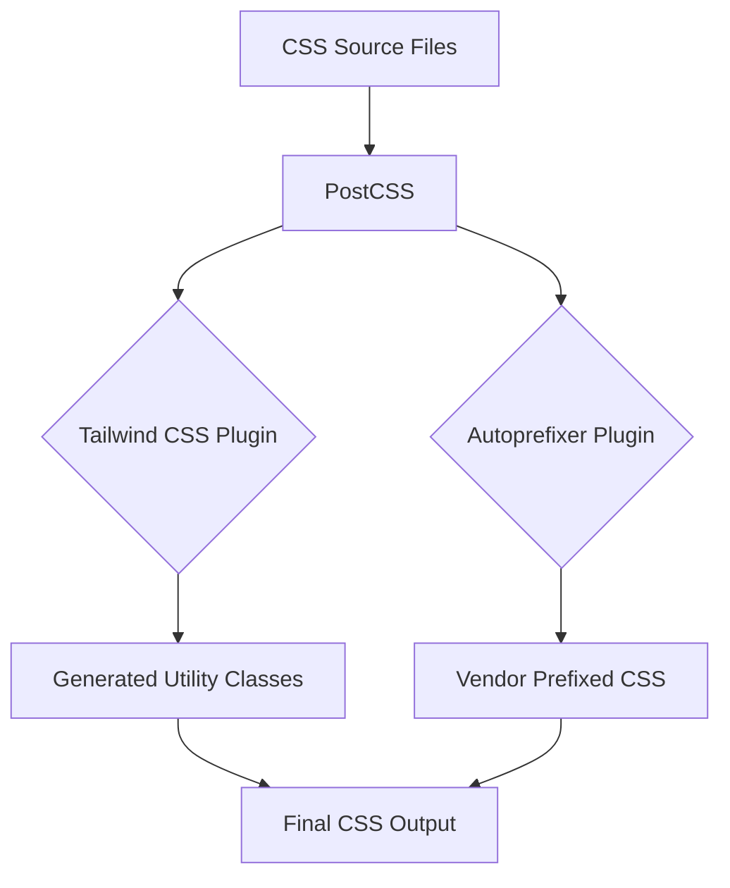

```mdx
---
title: "Styling & Configuration"
description: "Information on styling with Tailwind CSS, ESLint, PostCSS, and Vite build configuration."
sidebar_position: 4
---

import { Tabs, Tab } from '@mdx-js/react';
import { FontAwesomeIcon } from '@fortawesome/react-fontawesome';
import { faCss3Alt, faJs, faReact } from '@fortawesome/free-brands-svg-icons';

# Styling & Configuration

This section details the frontend styling, linting, and build configurations for the application. It covers the setup of Tailwind CSS for utility-first styling, PostCSS for CSS processing, ESLint for code quality and consistency, and Vite for an efficient development and build experience.

<TOC />

## Tailwind CSS & DaisyUI for Styling

The frontend leverages Tailwind CSS for its utility-first approach to styling, enabling rapid UI development directly within the JSX/TSX components. To further enhance UI development and provide pre-designed, customizable components, DaisyUI is integrated as a Tailwind CSS plugin.

### Core Configuration

The primary configuration for Tailwind CSS is defined in [`frontend/tailwind.config.js`](https://github.com/shinymack/Chat-App-MERN/blob/main/frontend/tailwind.config.js). This file specifies which files Tailwind should scan for classes, custom themes, and integrated plugins.

#### Key Aspects:

*   **`content`**: Defines the file paths that Tailwind CSS should scan to generate its CSS output. This ensures that only used utility classes are included in the final bundle, optimizing performance.
    ```javascript
    // frontend/tailwind.config.js
    export default {
      content: [
        "./index.html",
        "./src/**/*.{js,ts,jsx,tsx}",
      ],
      // ...
    }
    ```
    This configuration tells Tailwind to look for class names in `index.html` and all `.js`, `.ts`, `.jsx`, and `.tsx` files within the `src` directory.

*   **`theme.extend`**: Allows extending Tailwind's default theme with custom values. Here, a custom font family `Chivo` is added.
    ```javascript
    // frontend/tailwind.config.js
    export default {
      // ...
      theme: {
        extend: {
          fontFamily : {
            chivo : ['Chivo', 'sans-serif'],
          }
        },
      },
      // ...
    }
    ```
    This enables the use of `font-chivo` class in components.

*   **`plugins`**: Integrates additional Tailwind CSS plugins. DaisyUI is included here, providing a collection of pre-built UI components.
    ```javascript
    // frontend/tailwind.config.js
    import daisyui from "daisyui"

    /** @type {import('tailwindcss').Config} */
    export default {
      // ...
      plugins: [daisyui],
      // ...
    }
    ```
    DaisyUI simplifies the process of creating complex UI elements like buttons, modals, and navigation bars with minimal effort.

### DaisyUI Theming

DaisyUI offers a wide array of built-in themes that can be easily switched. The application is configured to support all standard DaisyUI themes, providing flexibility for different visual preferences and branding requirements.

```javascript
// frontend/tailwind.config.js
export default {
  // ...
  daisyui : {
    themes: [
      "light", "dark", "cupcake", "bumblebee", "emerald", "corporate",
      "synthwave", "retro", "cyberpunk", "valentine", "halloween", "garden",
      "forest", "aqua", "lofi", "pastel", "fantasy", "wireframe", "black",
      "luxury", "dracula", "cmyk", "autumn", "business", "acid", "lemonade",
      "night", "coffee", "winter", "dim", "nord", "sunset",
    ],
  }
}
```
This comprehensive list of themes allows for dynamic theme switching, enhancing user experience and customization options.

#### Key Insights:
*   **Rapid Development**: Tailwind CSS and DaisyUI significantly accelerate UI development by reducing the need for custom CSS.
*   **Consistency**: Utility classes enforce design consistency across the application.
*   **Customization**: The `theme.extend` property allows seamless integration of custom branding elements.

## PostCSS Configuration

PostCSS acts as a tool for transforming CSS with JavaScript plugins. In this setup, it's primarily used to integrate Tailwind CSS and Autoprefixer. The configuration is straightforward and located in [`frontend/postcss.config.js`](https://github.com/shinymack/Chat-App-MERN/blob/main/frontend/postcss.config.js).

```javascript
// frontend/postcss.config.js
export default {
  plugins: {
    tailwindcss: {},
    autoprefixer: {},
  },
}
```

#### Plugin Breakdown:

*   **`tailwindcss`**: This plugin processes your CSS with Tailwind CSS, generating all the utility classes based on your configuration and content analysis.
*   **`autoprefixer`**: Automatically adds vendor prefixes to CSS rules (e.g., `-webkit-`, `-moz-`) to ensure broad browser compatibility. This eliminates the need for manual prefixing and ensures that styles render correctly across different browsers.

#### Interaction with Tailwind CSS:
PostCSS serves as the engine that runs Tailwind CSS and Autoprefixer. When your project's CSS is processed, PostCSS first applies Tailwind CSS to generate the necessary utility classes, and then Autoprefixer adds any required vendor prefixes, resulting in a robust and cross-browser compatible stylesheet.





## ESLint for Code Quality

ESLint is configured to maintain high code quality, consistency, and identify potential issues in JavaScript and JSX files. The configuration is defined in [`frontend/eslint.config.js`](https://github.com/shinymack/Chat-App-MERN/blob/main/frontend/eslint.config.js).

### Configuration Structure

The ESLint configuration uses the new flat config format, organizing rules and settings into an array of configuration objects.

```javascript
// frontend/eslint.config.js
import js from '@eslint/js'
import globals from 'globals'
import react from 'eslint-plugin-react'
import reactHooks from 'eslint-plugin-react-hooks'
import reactRefresh from 'eslint-plugin-react-refresh'

export default [
  { ignores: ['dist'] },
  {
    files: ['**/*.{js,jsx}'],
    languageOptions: {
      ecmaVersion: 2020,
      globals: globals.browser,
      parserOptions: {
        ecmaVersion: 'latest',
        ecmaFeatures: { jsx: true },
        sourceType: 'module',
      },
    },
    settings: { react: { version: '18.3' } },
    plugins: {
      react,
      'react-hooks': reactHooks,
      'react-refresh': reactRefresh,
    },
    rules: {
      ...js.configs.recommended.rules,
      ...react.configs.recommended.rules,
      ...react.configs['jsx-runtime'].rules,
      ...reactHooks.configs.recommended.rules,
      'react/jsx-no-target-blank': 'off',
      'react-refresh/only-export-components': [
        'warn',
        { allowConstantExport: true },
      ],
      "react/prop-types" : "off",
    },
  },
]
```

### Detailed Breakdown:

*   **`ignores: ['dist']`**: Specifies files and directories that ESLint should ignore during linting, such as the build output directory.
*   **`files: ['**/*.{js,jsx}']`**: Applies this configuration specifically to JavaScript and JSX files.
*   **`languageOptions`**: Configures the JavaScript environment.
    *   **`ecmaVersion: 2020`**: Sets the ECMAScript version for parsing.
    *   **`globals: globals.browser`**: Defines global variables available in browser environments (e.g., `window`, `document`).
    *   **`parserOptions`**: Further parser settings.
        *   **`ecmaVersion: 'latest'`**: Uses the latest ECMAScript syntax features.
        *   **`ecmaFeatures: { jsx: true }`**: Enables JSX parsing.
        *   **`sourceType: 'module'`**: Indicates that files are ECMAScript modules.
*   **`settings: { react: { version: '18.3' } }`**: Informs `eslint-plugin-react` about the React version being used, allowing it to apply appropriate rules.
*   **`plugins`**: Registers ESLint plugins.
    *   **`react`**: Contains React-specific linting rules.
    *   **`react-hooks`**: Enforces rules of hooks.
    *   **`react-refresh`**: Integrates with React Fast Refresh for development.
*   **`rules`**: Defines the specific linting rules to apply.
    *   **`...js.configs.recommended.rules`**: Includes recommended JavaScript rules from ESLint itself.
    *   **`...react.configs.recommended.rules`**: Includes recommended React rules.
    *   **`...react.configs['jsx-runtime'].rules`**: Includes rules for the new JSX transform.
    *   **`...reactHooks.configs.recommended.rules`**: Includes recommended rules for React Hooks.
    *   **`'react/jsx-no-target-blank': 'off'`**: Disables the rule that suggests adding `rel="noopener noreferrer"` to `<a>` tags with `target="_blank"`. This might be turned off if the security implications are handled differently or are deemed low risk in specific contexts.
    *   **`'react-refresh/only-export-components'`**: A rule related to React Fast Refresh. It warns if components are not exported directly, which can interfere with hot module replacement. `allowConstantExport: true` permits exporting components as constants.
    *   **`"react/prop-types" : "off"`**: Disables the rule that enforces prop types. This is common in modern React applications, especially when using TypeScript or when props validation is handled via other means.

#### Best Practices:
*   **Automated Checks**: Integrating ESLint into your CI/CD pipeline ensures that all code contributions adhere to established quality standards.
*   **Pre-commit Hooks**: Using tools like Husky with lint-staged can automatically fix or flag issues before commits are made, preventing bad code from entering the repository.
*   **IDE Integration**: Modern IDEs have excellent ESLint integration, providing real-time feedback on code quality.

## Vite Build Configuration

Vite is utilized as the build tool for the frontend, offering a fast and efficient development experience. The configuration for Vite is straightforward and located in [`frontend/vite.config.js`](https://github.com/shinymack/Chat-App-MERN/blob/main/frontend/vite.config.js).

```javascript
// frontend/vite.config.js
import { defineConfig } from 'vite'
import react from '@vitejs/plugin-react'

// https://vitejs.dev/config/
export default defineConfig({
  plugins: [react()],
})
```

#### Key Aspects:
*   **`defineConfig`**: A helper function from Vite that provides intelligent autocompletion for the configuration object.
*   **`plugins: [react()]`**: Integrates the official `@vitejs/plugin-react` plugin. This plugin provides:
    *   **React Fast Refresh**: Enables hot module replacement for React components during development, preserving component state when making edits.
    *   **JSX/TSX Transformation**: Configures Vite to correctly process JSX and TSX files.
    *   **Optimized Builds**: Enhances the build process for production by applying various optimizations specific to React applications.

#### Why Vite?
Vite was chosen for its key advantages:
*   **Extremely Fast Development Server**: Leverages native ES modules in the browser, providing instant server start-up and very fast hot module replacement (HMR).
*   **Optimized Production Builds**: Uses Rollup under the hood for highly optimized and tree-shaken production bundles.
*   **Simple Configuration**: Requires minimal configuration to get started, especially for common frameworks like React.

#### Interaction with other tools:
Vite seamlessly integrates with PostCSS and ESLint. During development, Vite's dev server leverages PostCSS to process CSS and respects ESLint configurations for code quality checks. For production builds, Vite utilizes its internal build process, which includes PostCSS transformations and ensures that the optimized output reflects the linted codebase.


```mermaid
flowchart LR
    A[Source Code .js, .jsx, .css] --> B[Vite Dev Server]
    B --> C{ESLint}
    B --> D{PostCSS}
    D --> E[TailwindCSS]
    D --> F[Autoprefixer]
    C & E & F --> G[Browser / Hot Module Replacement (HMR)]

    B -- Production Build --> H[Vite Build Process]
    H --> I[Optimized Bundles]
    I --> J[Deployment]
```


## Key Integration Points and Insights

*   **Unified Styling Workflow**: Tailwind CSS, augmented by DaisyUI, is processed by PostCSS, ensuring a streamlined and efficient styling workflow. This setup prioritizes utility-first development while providing component-level abstraction.
*   **Robust Development Environment**: Vite provides an incredibly fast development loop with React Fast Refresh, which works in conjunction with ESLint to provide immediate feedback on code quality and potential issues.
*   **Code Quality Assurance**: ESLint is critical for maintaining a consistent codebase, especially in collaborative environments. The specific rules for React hooks and refresh are essential for leveraging modern React features correctly.
*   **Scalability**: The modular nature of these configurations allows for easy extension and modification. For instance, adding new Tailwind plugins or custom ESLint rules is straightforward.
*   **Performance**: Vite's architecture and Tailwind CSS's JIT mode (handled by PostCSS) ensure that the production builds are lean and performant, only including the CSS and JavaScript that are actually used.

```
```