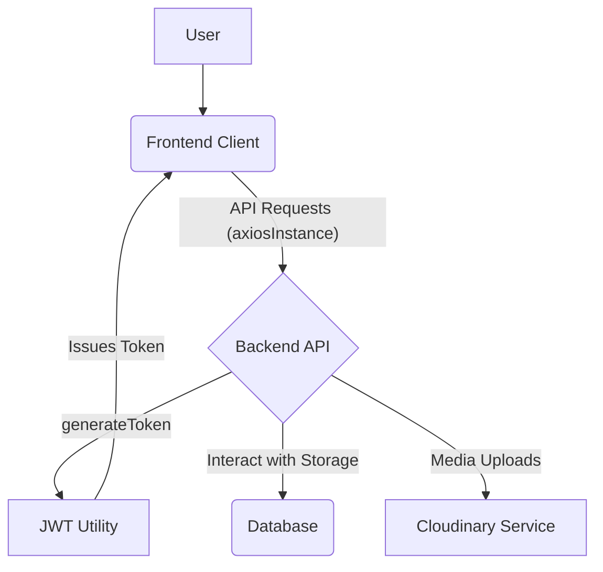
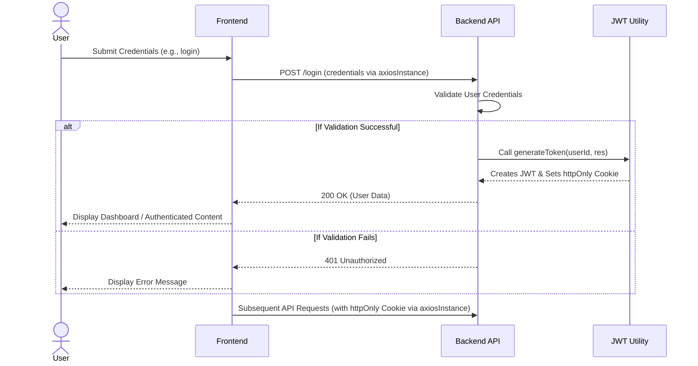

# Utilities and Integrations

<TOC />

This section details the core utility functions and external service integrations that underpin various functionalities across both the frontend and backend of the application. These libraries and functions are designed for reusability, modularity, and to abstract away complex operations, enabling developers to focus on business logic. From secure user session management to media handling and streamlined API communication, these utilities form the foundational toolkit for robust application development.

## Cloudinary Integration for Media Management

The application leverages Cloudinary, a powerful cloud-based media management service, to handle image and video uploads, storage, and delivery. This integration is crucial for any feature requiring user-generated content or dynamic media, offloading the complexities of media infrastructure from the backend server.

The configuration of Cloudinary is centralized in the `backend/src/lib/cloudinary.js` file, ensuring that the service is initialized once with the necessary credentials upon application startup. This setup allows any part of the backend requiring media services to simply import and use the pre-configured Cloudinary client.

### Features and Benefits

*   **Scalable Media Storage**: Cloudinary automatically handles storage, resizing, optimization, and delivery of media assets, significantly reducing server load and bandwidth usage.
*   **Security**: API keys and secrets are managed securely via environment variables, preventing sensitive information from being hardcoded or exposed in the codebase.
*   **Ease of Use**: Once configured, interacting with Cloudinary becomes straightforward through its SDK, simplifying tasks like uploading files, retrieving URLs, and managing assets.
*   **Global Delivery**: Cloudinary uses CDNs (Content Delivery Networks) to ensure fast media delivery to users worldwide, improving application performance and user experience.

### Configuration Details

The Cloudinary client is configured using environment variables, ensuring that credentials are kept out of source control and can be easily managed across different deployment environments (development, staging, production).

```javascript
// backend/src/lib/cloudinary.js
import {v2 as cloudinary} from "cloudinary"
import { config } from 'dotenv'

config(); // Load environment variables from .env file

cloudinary.config(
    {cloud_name: process.env.CLOUDINARY_CLOUD_NAME,
    api_key: process.env.CLOUDINARY_API_KEY,
    api_secret: process.env.CLOUDINARY_API_SECRET,}
);

export default cloudinary;
```
[View on GitHub](https://github.com/shinymack/Chat-App-MERN/blob/main/backend/src/lib/cloudinary.js)

The code snippet above demonstrates the initialization process. The `dotenv` package is used to load variables from a `.env` file, after which `cloudinary.config()` is called with `cloud_name`, `api_key`, and `api_secret` sourced from `process.env`. This pattern is a standard best practice for handling sensitive configuration data. For robust production deployments, ensure these environment variables are properly set in your hosting environment (e.g., Heroku config vars, AWS SSM Parameter Store).

## Backend Utilities: JWT Authentication

Authentication is a critical aspect of any secure application. The `backend/src/lib/utils.js` file houses the `generateToken` utility, which is responsible for creating and managing JSON Web Tokens (JWTs) for user authentication. This function is designed to establish and maintain user sessions securely, typically after successful login or registration.

### `generateToken` Functionality

The `generateToken` function performs two primary actions:

1.  **JWT Creation**: It generates a signed JWT containing the `userId`. This token is signed with a secret key (`process.env.JWT_SECRET`) to ensure its integrity and authenticity. The token is configured to expire after 7 days, providing a reasonable balance between security and user convenience.
2.  **HTTP-Only Cookie Setting**: The generated JWT is then set as an `httpOnly` cookie on the response object. `httpOnly` cookies are inaccessible via client-side JavaScript, significantly mitigating cross-site scripting (XSS) attacks. Furthermore, the `sameSite: "strict"` attribute prevents the browser from sending this cookie with cross-site requests, enhancing protection against Cross-Site Request Forgery (CSRF). The `secure` flag ensures the cookie is only sent over HTTPS connections when the application is in a production environment, preventing man-in-the-middle attacks.

### Code Snippet: JWT Generation

```javascript
// backend/src/lib/utils.js
import jwt from 'jsonwebtoken';

export const generateToken = (userId, res) => {
    // Sign the JWT with userId payload, secret, and 7-day expiration
    const token = jwt.sign({userId}, process.env.JWT_SECRET,
        {expiresIn: "7d"});

    // Set the JWT as an httpOnly cookie
    res.cookie("jwt", token, {
        maxAge: 7 * 24 * 60 * 60 * 1000, // 7 days in milliseconds
        httpOnly: true, // Prevents client-side JS access
        sameSite: "strict", // Strict same-site policy for CSRF protection
        secure: process.env.NODE_ENV !== "development", // Only sent over HTTPS in production
    });
    return token;
};
```
[View on GitHub](https://github.com/shinymack/Chat-App-MERN/blob/main/backend/src/lib/utils.js#L1-L16)

### Security Best Practices and Insights

*   **JWT Secret Management**: The `JWT_SECRET` must be a strong, randomly generated string and kept confidential. It should be stored as an environment variable and never committed to source control.
*   **Cookie Security**: The combination of `httpOnly`, `sameSite: "strict"`, and `secure` (in production) provides a robust defense against common web vulnerabilities. Developers should always ensure these settings are correctly applied for authentication tokens.
*   **Token Expiration**: A reasonable expiration time prevents tokens from being valid indefinitely if compromised. Regular re-authentication or token refresh mechanisms can further enhance security for long-lived sessions.

## Frontend API Client: Axios Instance

Efficient and consistent communication with the backend API is paramount for a responsive frontend application. The `frontend/src/lib/axios.js` file sets up a custom Axios instance, `axiosInstance`, which centralizes the configuration for all API requests made from the frontend.

### `axiosInstance` Configuration

The custom Axios instance is configured with:

*   **Dynamic `baseURL`**: This ensures that the frontend correctly points to the backend API endpoint, whether running in a local development environment (`http://localhost:5001/api`) or a production environment (`/api`, assuming a proxy setup or same-origin deployment). This prevents the need for manual URL changes during deployment.
*   **`withCredentials: true`**: This crucial setting instructs Axios to include cookies (such as the `httpOnly` JWT cookie set by the backend) in cross-origin requests. This is essential for maintaining authenticated user sessions when the frontend and backend are hosted on different domains or ports during development.

### Code Snippet: Axios Instance Configuration

```javascript
// frontend/src/lib/axios.js
import axios from "axios";

export const axiosInstance = axios.create({
    baseURL: import.meta.env.MODE == "development" ? "http://localhost:5001/api": "/api",
    withCredentials: true,
});
```
[View on GitHub](https://github.com/shinymack/Chat-App-MERN/blob/main/frontend/src/lib/axios.js)

### Integration Insights

*   **CORS (Cross-Origin Resource Sharing)**: When the frontend and backend run on different origins (common in development, e.g., frontend on `http://localhost:3000`, backend on `http://localhost:5001`), the `withCredentials: true` setting requires the backend to send appropriate CORS headers (`Access-Control-Allow-Origin`, `Access-Control-Allow-Credentials`).
*   **Production Deployment**: In production, `baseURL: "/api"` implies that the frontend and backend are often served from the same origin, or a proxy server handles routing `/api` requests to the backend. This setup naturally avoids most CORS issues and simplifies deployment.
*   **Interceptors**: This `axiosInstance` can be further enhanced with interceptors to handle common tasks like attaching authentication headers (if not using cookies), refreshing tokens, or global error handling.

## Frontend Utilities: Message Time Formatting

User experience is significantly enhanced by presenting information in a readable and intuitive manner. The `frontend/src/lib/utils.js` file provides the `formatMessageTime` utility function, designed to format timestamps into a user-friendly local time string.

### `formatMessageTime` Functionality

This function takes a `Date` object or a date string and converts it into a localized time string with specific formatting options. It leverages JavaScript's native `toLocaleTimeString` method, which is highly efficient and respects the user's locale settings.

### Formatting Options

The `formatMessageTime` function is configured to display:

*   **Year, Month, Day**: Provides full date context.
*   **Hour and Minute**: Displays the exact time.
*   **12-Hour Format**: Uses `hour12: true` for common AM/PM notation, enhancing readability for many users.

### Code Snippet: Time Formatting

```javascript
// frontend/src/lib/utils.js
export function formatMessageTime(date) {
    return new Date(date).toLocaleTimeString("en-US", {
        year: "numeric",
        month: "short",
        day:"2-digit",
        hour: "2-digit",
        minute: "2-digit",
        hour12: true,
    });
}
```
[View on GitHub](https://github.com/shinymack/Chat-App-MERN/blob/main/frontend/src/lib/utils.js)

### Internationalization and Scalability

*   **Locale-Aware**: While `en-US` is explicitly used here, `toLocaleTimeString` can adapt to different locales passed as the first argument, making the function easily adaptable for internationalization (i18n).
*   **Consistency**: Centralizing date formatting ensures a consistent display of timestamps across the application, improving UI/UX.
*   **Performance**: Native browser methods like `toLocaleTimeString` are generally highly optimized for performance, making them suitable for applications handling a large number of timestamp displays.

## Overall System Architecture

The following diagram illustrates how the different components and utilities interact within the application's broader architecture. It highlights the flow of information and the roles of each module.





**Explanation:**
The `User` interacts with the `Frontend Client`. All API requests from the frontend are routed through the `axiosInstance` to the `Backend API`. The `Backend API` is responsible for handling business logic, interacting with the `Database` for data persistence, and utilizing the `JWT Utility` (specifically `generateToken`) for authentication. Media-related operations, such as uploads, are delegated to the `Cloudinary Service`. Once authenticated, the `JWT Utility` issues a token back to the `Frontend Client` via an `httpOnly` cookie.

## User Authentication Flow

This sequence diagram details the typical user authentication process, demonstrating the interplay between the frontend, backend, and the `generateToken` utility.





**Explanation:**
The `User` initiates the authentication by submitting credentials to the `Frontend`. The `Frontend` sends a `POST /login` request to the `Backend API` using `axiosInstance`. The `Backend API` validates these credentials. If successful, it calls the `generateToken` utility which creates a JWT and sets it as an `httpOnly` cookie on the response. The `Backend API` then responds with success, and the `Frontend` updates the UI. For all `Subsequent API Requests`, `axiosInstance` automatically includes the `httpOnly` cookie, maintaining the user's authenticated session. If validation fails, an error is returned.

## Key Integration Points

The utilities and integrations discussed play a crucial role in forming a cohesive and functional application:

*   **Authentication Flow**: The `generateToken` utility is central to the backend's authentication mechanism, securing user sessions by issuing JWTs as `httpOnly`, `sameSite: strict`, and `secure` cookies. This robust setup ensures that only authenticated users can access protected resources.
*   **API Communication**: The `axiosInstance` configured on the frontend acts as the primary conduit for all client-server interactions. Its `baseURL` ensures environment-agnostic API calls, and `withCredentials: true` is vital for transparently sending authentication cookies with requests, maintaining session state.
*   **Media Handling**: Cloudinary abstracts away the complexities of media storage and delivery. By integrating `backend/src/lib/cloudinary.js`, the application can efficiently manage user-generated content, offloading server resources and enhancing content delivery performance globally.
*   **User Interface Enhancement**: `formatMessageTime` demonstrates how small, well-designed frontend utilities contribute significantly to user experience by presenting dynamic data (like timestamps) in a human-readable and consistent format, adaptable to different display needs.

These components collectively create a robust architecture, enabling secure authentication, efficient API communication, scalable media management, and an enhanced user experience across the application.