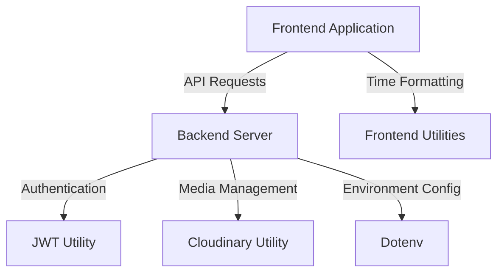
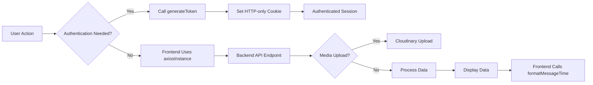

# Utilities & Helpers
<TOC />

## System Purpose
This section outlines the core purpose and functionalities provided by the utility and helper functions within the application. These modules encapsulate reusable logic, integrate with external services, and manage application-wide configurations, ensuring a clean separation of concerns and promoting code reusability.

*   **Environment Configuration**: Centralized management of environment variables for external service integration, such as Cloudinary credentials, ensuring secure and flexible deployment across different environments.
    *   Relevant file: [backend/src/lib/cloudinary.js](https://github.com/shinymack/Chat-App-MERN/blob/main/backend/src/lib/cloudinary.js)
*   **Authentication Token Generation**: Handles the secure generation and management of JSON Web Tokens (JWTs) for user authentication, including setting HTTP-only cookies for enhanced security.
    *   Relevant file: [backend/src/lib/utils.js](https://github.com/shinymack/Chat-App-MERN/blob/main/backend/src/lib/utils.js)
*   **API Instance Management**: Configures a robust Axios instance for frontend-to-backend communication, handling base URLs and credential forwarding to ensure seamless API interactions.
    *   Relevant file: [frontend/src/lib/axios.js](https://github.com/shinymack/Chat-App-MERN/blob/main/frontend/src/lib/axios.js)
*   **Frontend Utility Functions**: Provides helper functions for client-side operations, such as formatting message timestamps, improving user experience and data presentation.
    *   Relevant file: [frontend/src/lib/utils.js](https://github.com/shinymack/Chat-App-MERN/blob/main/frontend/src/lib/utils.js)

## System Architecture Overview
The utility and helper modules are designed to support a clear separation of concerns within the application's architecture. They serve as foundational layers for both frontend and backend operations, providing essential services without tightly coupling to specific business logic.

These utilities facilitate communication, security, and external integrations, acting as a bridge between various architectural components. For instance, the `cloudinary.js` module integrates the backend with a third-party media management service, while `axios.js` standardizes frontend API calls.





## Technology Stack
The utility and helper functions leverage a concise set of technologies, primarily focusing on robust external libraries and environment management tools.

| Layer       | Technology | Purpose                                        |
| :---------- | :--------- | :--------------------------------------------- |
| Backend     | `jsonwebtoken` | Securely generating and verifying JWTs.          |
| Backend     | `cloudinary`   | Cloud-based media management for image/video uploads.|
| Backend     | `dotenv`     | Loading environment variables from `.env` files. |
| Frontend    | `axios`      | Promise-based HTTP client for API requests.    |
| Frontend    | JavaScript | Core language for utility functions.           |

### JWT Token Generation
The `jsonwebtoken` library is used on the backend to create secure authentication tokens. The `generateToken` function encapsulates the logic for signing a JWT and setting it as an HTTP-only cookie, ensuring that the token is not accessible via client-side scripts.

```javascript
export const generateToken = (userId, res) => {
    const token = jwt.sign({userId}, process.env.JWT_SECRET,
        {expiresIn: "7d"});

    res.cookie("jwt", token, {
        maxAge: 7 * 24 * 60 * 60 * 1000,
        httpOnly: true,
        sameSite: "strict",
        secure: process.env.NODE_ENV !== "development",
    });
    return token;
};
```
[View on GitHub](https://github.com/shinymack/Chat-App-MERN/blob/main/backend/src/lib/utils.js#L4-L16)

### Cloudinary Configuration
The `cloudinary` library is initialized on the backend using environment variables, providing secure access to the Cloudinary API for media storage and manipulation. This setup ensures that sensitive API keys are kept out of the codebase.

```javascript
import {v2 as cloudinary} from "cloudinary"
import { config } from 'dotenv'

config();

cloudinary.config(
    {cloud_name: process.env.CLOUDINARY_CLOUD_NAME,
    api_key: process.env.CLOUDINARY_API_KEY,
    api_secret: process.env.CLOUDINARY_API_SECRET,}
);

export default cloudinary;
```
[View on GitHub](https://github.com/shinymack/Chat-App-MERN/blob/main/backend/src/lib/cloudinary.js#L1-L12)

### Axios Instance for Frontend
On the frontend, an Axios instance is created to handle all API requests. It's configured with a base URL that adapts based on the environment (development vs. production) and `withCredentials: true` to ensure that cookies, including the JWT, are sent with cross-origin requests.

```javascript
import axios from "axios";

export const axiosInstance = axios.create({
    baseURL: import.meta.env.MODE == "development" ? "http://localhost:5001/api": "/api",
    withCredentials: true,
});
```
[View on GitHub](https://github.com/shinymack/Chat-App-MERN/blob/main/frontend/src/lib/axios.js#L1-L6)

### Frontend Message Time Formatting
A simple utility function is provided on the frontend to format timestamps for messages, enhancing readability for users. This function uses `toLocaleTimeString` with specific options to present dates and times consistently.

```javascript
export function formatMessageTime(date) {
    return new Date(date).toLocaleTimeString("en-US", {
        year: "numeric",
        month: "short",
        day:"2-digit",
        hour: "2-digit",
        minute: "2-digit",
        hour12: true,
    });
}
```
[View on GitHub](https://github.com/shinymack/Chat-App-MERN/blob/main/frontend/src/lib/utils.js#L1-L10)

## Core Application Features
The utility functions underpin several core features by providing essential services:

*   **Secure Authentication**: The backend `generateToken` utility is critical for managing user sessions. It ensures that after a user logs in, a secure, time-limited JWT is issued and stored in an HTTP-only cookie, preventing client-side JavaScript access and mitigating XSS attacks.
*   **Robust API Communication**: The `axiosInstance` on the frontend centralizes API calls, simplifying interaction with the backend. Its configuration for `baseURL` and `withCredentials` is crucial for handling authentication and routing requests correctly across environments.
*   **Media Uploads**: The `cloudinary` configuration enables the application to seamlessly upload, store, and serve media content (e.g., profile pictures, chat attachments) by integrating with a powerful external cloud service, offloading significant storage and processing concerns from the backend.
*   **User Experience Enhancements**: Frontend utilities like `formatMessageTime` directly improve the user interface by presenting data in a human-readable format, contributing to a more intuitive and professional application feel.





## Key Integration Points
These utility and helper modules are strategically placed to serve as critical integration points within the application's architecture:

*   **Authentication Flow**: The `generateToken` function is a cornerstone of the authentication process. After a user successfully logs in, this function is invoked to create a JWT and set it as an HTTP-only cookie. This token is then automatically sent with subsequent requests from the `axiosInstance` on the frontend, allowing the backend to authenticate the user for protected routes. This setup follows best practices for JWT-based authentication, separating token generation from authentication middleware.
*   **API Request Handling**: The `axiosInstance` is the primary mechanism for frontend-backend communication. Its `baseURL` configuration ensures that API calls are correctly routed, whether in a local development environment or a deployed production setting. The `withCredentials: true` option is crucial for persisting user sessions by ensuring that the JWT cookie is always included in API requests. This centralized configuration simplifies API calls across the frontend and standardizes error handling.
*   **External Service Integration (Cloudinary)**: The `cloudinary.js` module provides a clean and secure way to integrate with Cloudinary for media storage. By centralizing the configuration and exposing a pre-configured `cloudinary` object, any part of the backend requiring media upload or retrieval can simply import and use this module, without needing to manage credentials directly. This promotes modularity and keeps sensitive information out of the main application logic, adhering to the principle of least privilege for environment variables.
*   **Frontend Data Presentation**: The `formatMessageTime` utility exemplifies how helper functions improve the user interface. While seemingly small, consistent and readable timestamp formatting significantly enhances user experience in a chat application. This function is typically integrated directly into components responsible for displaying messages, ensuring that dates and times are always presented in a user-friendly format, abstracting away the complexities of `Date` object manipulation.

Best practices demonstrated here include:
*   **Separation of Concerns**: Each utility focuses on a specific task (token generation, API configuration, media integration, time formatting), avoiding monolithic files.
*   **Environment Variable Management**: Sensitive data like API keys and JWT secrets are loaded via `dotenv`, preventing them from being hardcoded and enhancing security.
*   **Reusability**: Functions and instances are exported, allowing them to be imported and used across different parts of the application without duplication.
*   **Security**: HTTP-only cookies and `sameSite: "strict"` for JWTs significantly reduce the risk of XSS and CSRF attacks.