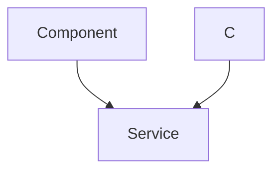

# Shared Utilities and Helpers

<TOC />

This section documents the foundational utility functions, API client configurations, and third-party service integrations that provide core functionalities across both the frontend and backend of the application. These shared components ensure consistency, reusability, and efficient interaction with external services and internal logic.

From secure token generation to streamlined API requests and external media management, these utilities are essential for the application's robust operation.

## Backend Utilities

The backend utilizes several key helper functions and integrations to manage authentication, handle external services, and process data securely.

### Cloudinary Integration

The application integrates with Cloudinary for efficient image and video management, handling uploads, transformations, and delivery. This service offloads media storage and processing, ensuring optimal performance and scalability for user-generated content.

The `cloudinary.js` file initializes the Cloudinary SDK with credentials loaded from environment variables, ensuring secure and flexible configuration.

```javascript
// backend/src/lib/cloudinary.js
import {v2 as cloudinary} from "cloudinary"

import { config } from 'dotenv'

config();

cloudinary.config(
    {cloud_name: process.env.CLOUDINARY_CLOUD_NAME,
    api_key: process.env.CLOUDINARY_API_KEY,
    api_secret: process.env.CLOUDINARY_API_SECRET,}
);

export default cloudinary;
```
[View on GitHub](https://github.com/shinymack/Chat-App-MERN/blob/main/backend/src/lib/cloudinary.js)

This snippet demonstrates the initialization of the Cloudinary SDK. It uses `dotenv` to load environment variables for `CLOUDINARY_CLOUD_NAME`, `CLOUDINARY_API_KEY`, and `CLOUDINARY_API_SECRET`. These credentials are crucial for authenticating requests to the Cloudinary API, allowing the backend to programmatically upload, manage, and retrieve media assets. By centralizing this configuration, other parts of the application can simply import the `cloudinary` instance and use it without needing to worry about credential management.

### JWT Token Generation

Authentication within the application relies on JSON Web Tokens (JWTs) for secure session management. The `generateToken` utility is responsible for creating a JWT, signing it with a secret, and securely setting it as an HTTP-only cookie in the user's browser. This approach enhances security by protecting against Cross-Site Scripting (XSS) attacks, as JavaScript cannot access the cookie.

```javascript
// backend/src/lib/utils.js
import jwt from 'jsonwebtoken';


export const generateToken = (userId, res) => {

    const token = jwt.sign({userId}, process.env.JWT_SECRET,
        {expiresIn: "7d"});

    res.cookie("jwt", token, {
        maxAge: 7 * 24 * 60 * 60 * 1000,
        httpOnly: true,
        sameSite: "strict",
        secure: process.env.NODE_ENV !== "development",
    });
    return token;
};
```
[View on GitHub](https://github.com/shinymack/Chat-App-MERN/blob/main/backend/src/lib/utils.js)

The `generateToken` function performs two primary actions:
1.  **Token Creation:** It signs a payload containing the `userId` using `process.env.JWT_SECRET` and sets an expiration time of "7d" (7 days). This creates a unique, verifiable token for the user.
2.  **Cookie Setting:** The generated JWT is then placed into a cookie named "jwt". Crucially, the cookie is configured with:
    *   `maxAge`: Set to 7 days, matching the token's expiration.
    *   `httpOnly`: Prevents client-side JavaScript from accessing the cookie, mitigating XSS risks.
    *   `sameSite: "strict"`: Provides protection against Cross-Site Request Forgery (CSRF) attacks by ensuring the cookie is only sent with requests originating from the same site.
    *   `secure`: Ensures the cookie is only sent over HTTPS connections when in a production environment, further protecting against interception.

## Frontend Utilities

The frontend also leverages a set of utilities for streamlined API communication and user-friendly data presentation.

### Axios Instance for API Communication

To simplify and standardize HTTP requests from the frontend, a pre-configured Axios instance is used. This `axiosInstance` centralizes common settings like the base URL and credential handling, making API calls consistent and easier to manage across the application.

```javascript
// frontend/src/lib/axios.js
import axios from "axios";

export const axiosInstance = axios.create({
    baseURL: import.meta.env.MODE == "development" ? "http://localhost:5001/api": "/api",
    withCredentials: true,
});
```
[View on GitHub](https://github.bob.pages.github.io/shinymack/Chat-App-MERN/blob/main/frontend/src/lib/axios.js)

The `axiosInstance` is configured with:
*   **`baseURL`**: Dynamically set based on the `import.meta.env.MODE`. In development, it points to the local backend server (`http://localhost:5001/api`), while in production, it uses a relative path (`/api`), assuming the frontend and backend are served from the same domain or a proxy is configured.
*   **`withCredentials: true`**: This is vital for sending cookies (specifically the `jwt` cookie set by the backend) with cross-origin requests. Without this, the backend would not receive the authentication token, leading to unauthorized responses.

### Message Time Formatting

Displaying timestamps in a user-friendly and localized format is crucial for a good user experience, especially in a chat application. The `formatMessageTime` function provides a consistent way to present dates and times to the user.

```javascript
// frontend/src/lib/utils.js
export function formatMessageTime(date) {
    return new Date(date).toLocaleTimeString("en-US", {
        year: "numeric",
        month: "short",
        day:"2-digit",
        hour: "2-digit",
        minute: "2-digit",
        hour12: true,
    });
}
```
[View on GitHub](https://github.com/shinymack/Chat-App-MERN/blob/main/frontend/src/lib/utils.js)

This function takes a `date` (which can be a Date object or a string parseable by `Date`) and returns a formatted string. The `toLocaleTimeString("en-US", ...)` method is used to ensure a consistent US English format, including year, abbreviated month, two-digit day, two-digit hour, two-digit minute, and AM/PM indicator (`hour12: true`). This ensures that message timestamps are always clear and easy to read.

## System Interaction Flow

The following diagram illustrates how these utilities integrate into the overall application flow, especially concerning user authentication and API interactions.


```mermaid
graph TD
    A["User"] -->|1. "Login/Register"| B["Frontend (React)"]
    B -->|2. "API Call (axiosInstance)"| C["Backend (Node/Express)"]
    C -->|3. "Generate JWT (generateToken)"| D{"Authentication Service"}
    D -->|4. "Set HTTP-only Cookie"| B
    B -->|5. "Subsequent API Calls"| C
    C -->|6. "Validate JWT from Cookie"| D
    C -->|7. "Access MongoDB"| E["Database (MongoDB)"]
    C -->|8. "Upload Media"| F["Cloudinary Service"]
    F -->|9. "Store Media"| G["Cloudinary Storage"]
```


This graph outlines the typical flow for user authentication and subsequent interactions. A user (A) interacts with the frontend (B), which makes API calls to the backend (C) via the `axiosInstance`. The backend uses the `generateToken` utility (D) to handle authentication, setting secure HTTP-only cookies on the frontend. For data persistence, the backend interacts with MongoDB (E), and for media management, it uploads files to the Cloudinary Service (F), which then stores them in its dedicated storage (G).

## Cloudinary Upload Sequence

To provide a more granular view, the sequence diagram below details the steps involved in uploading a media file, utilizing the `cloudinary.js` integration.





This sequence diagram details the process when a user uploads media. The "Frontend Application" (F) sends the media to the "Backend API" (B). The backend then uses the `cloudinary.js` instance to call the "Cloudinary Service" (C) for the actual upload. Cloudinary stores the file in its "Cloudinary Storage" (CS) and returns the asset's details (like its URL) to the backend. Finally, the backend relays this information back to the frontend, allowing the application to display the newly uploaded media.

## Key Integration Points

*   **Secure Authentication Flow**: The `generateToken` utility is central to establishing and maintaining authenticated sessions. Its strict cookie settings (`httpOnly`, `sameSite`, `secure`) are critical for application security, protecting against common web vulnerabilities.
*   **Centralized API Configuration**: The `axiosInstance` provides a single point of configuration for all frontend API calls. This ensures consistency in `baseURL`, `withCredentials` (for cookie handling), and allows for easy addition of interceptors (e.g., for error handling, token refresh) if needed in the future.
*   **External Service Management**: The `cloudinary.js` integration isolates third-party media service logic. This abstraction makes it easier to manage media uploads and transformations without cluttering core application logic, and ensures secure credential handling via environment variables.
*   **Environment Variable Dependency**: Both backend utilities (`cloudinary.js`, `utils.js` for JWT secret) heavily rely on environment variables. This is a best practice for managing sensitive information and ensuring configurable behavior across different deployment environments (development, staging, production).
*   **User Experience (UX) Enhancements**: `formatMessageTime` is a small but impactful utility that directly improves the user experience by presenting data in a human-readable format. This prevents raw, unformatted timestamps from being displayed, which can be confusing.

These shared utilities and helpers form the backbone of the application's functionality, ensuring secure, efficient, and user-friendly operations across the stack.

Next: [Build Process and Styling](./5.2_build-process-and-styling.mdx)