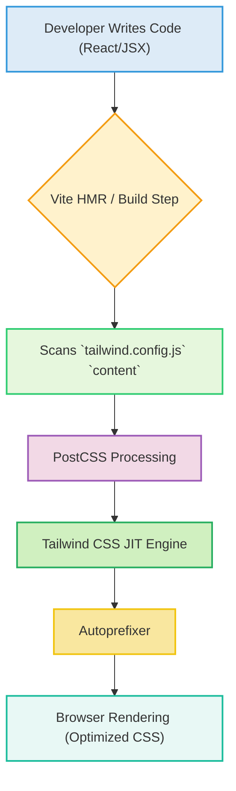

# Build Process and Styling

<TOC />

This section delves into the foundational configurations that orchestrate the frontend's build process, manage styling, and enforce code quality standards. We explore the roles of Vite as the build tool, Tailwind CSS for utility-first styling, PostCSS for CSS transformations, and ESLint for code linting.

## Frontend Build with Vite

The frontend application leverages [Vite](https://vitejs.dev/) as its primary build tool. Vite is chosen for its lightning-fast development server and optimized build output, providing a superior developer experience, especially for modern web projects. Its configuration is minimal yet powerful, focusing on delivering a highly performant application.

### Vite Configuration (`frontend/vite.config.js`)

The `vite.config.js` file is the entry point for configuring Vite. For this project, it primarily integrates the React plugin, enabling support for React components and JSX syntax.

```javascript
// frontend/vite.config.js
import { defineConfig } from 'vite'
import react from '@vitejs/plugin-react'

// https://vitejs.dev/config/
export default defineConfig({
  plugins: [react()],
})
```

- **`defineConfig`**: A helper from Vite that provides intelligent autocompletion for Vite's configuration options.
- **`@vitejs/plugin-react`**: The official plugin to enable React HMR (Hot Module Replacement) and other React-specific optimizations during development and build.

This simple configuration ensures that Vite correctly processes React components and sets up the development environment efficiently.

## Styling with Tailwind CSS and PostCSS

The project utilizes a modern styling approach centered around [Tailwind CSS](https://tailwindcss.com/) and [PostCSS](https://postcss.org/). This combination provides a utility-first styling methodology, enabling rapid UI development and ensuring consistent design. [DaisyUI](https://daisyui.com/), a Tailwind CSS component library, further enhances this by offering pre-built, customizable UI components.

### Tailwind CSS Configuration (`frontend/tailwind.config.js`)

The `tailwind.config.js` file customizes Tailwind's behavior, defining where it should scan for CSS classes, extending the default theme, and integrating plugins like DaisyUI.

```javascript
// frontend/tailwind.config.js
import daisyui from "daisyui"

/** @type {import('tailwindcss').Config} */
export default {
  content: [
    "./index.html",
    "./src/**/*.{js,ts,jsx,tsx}",
  ],
  theme: {
    extend: {
      fontFamily : {
        chivo : ['Chivo', 'sans-serif'],
      }
    },
  },
  plugins: [daisyui],
  daisyui : {
    themes: [
      "light", "dark", "cupcake", "bumblebee", "emerald", "corporate",
      "synthwave", "retro", "cyberpunk", "valentine", "halloween", "garden",
      "forest", "aqua", "lofi", "pastel", "fantasy", "wireframe", "black",
      "luxury", "dracula", "cmyk", "autumn", "business", "acid", "lemonade",
      "night", "coffee", "winter", "dim", "nord", "sunset",
    ],
  }
}
```

-   **`content`**: Specifies the files Tailwind should scan to identify classes used in your project. This is crucial for Tailwind's Just-In-Time (JIT) mode to only include necessary CSS, resulting in minimal bundle size.
-   **`theme.extend`**: Allows adding custom styles (e.g., `fontFamily`) to Tailwind's default theme without overwriting it. Here, a custom `chivo` font is defined.
-   **`plugins`**: An array where additional Tailwind plugins are registered. `daisyui` is included to provide a collection of pre-designed components.
-   **`daisyui.themes`**: Configures the available themes for DaisyUI. This project includes a comprehensive list of themes, allowing for easy switching and customization of the UI's aesthetic.

[View `frontend/tailwind.config.js` on GitHub](https://github.com/shinymack/Chat-App-MERN/blob/main/frontend/tailwind.config.js)

### PostCSS Configuration (`frontend/postcss.config.js`)

[PostCSS](https://postcss.org/) is a tool for transforming CSS with JavaScript plugins. It's an essential part of the styling pipeline, especially when working with Tailwind CSS, which is itself a PostCSS plugin.

```javascript
// frontend/postcss.config.js
export default {
  plugins: {
    tailwindcss: {},
    autoprefixer: {},
  },
}
```

-   **`tailwindcss`**: This plugin processes your CSS, converting Tailwind's utility classes into actual styles based on your `tailwind.config.js`.
-   **`autoprefixer`**: Automatically adds vendor prefixes to CSS rules, ensuring cross-browser compatibility.

[View `frontend/postcss.config.js` on GitHub](https://github.com/shinymack/Chat-App-MERN/blob/main/frontend/postcss.config.js)

### Styling Pipeline Diagram

The following diagram illustrates how the styling process flows during development and build, leveraging Vite, PostCSS, and Tailwind CSS.





## Code Quality with ESLint

Maintaining high code quality and consistency is crucial for collaborative projects. [ESLint](https://eslint.org/) is configured to enforce coding standards, detect potential errors, and ensure best practices are followed across the codebase.

### ESLint Configuration (`frontend/eslint.config.js`)

The `eslint.config.js` file defines the rules and plugins ESLint uses to analyze the JavaScript and JSX files in the frontend.

```javascript
// frontend/eslint.config.js
import js from '@eslint/js'
import globals from 'globals'
import react from 'eslint-plugin-react'
import reactHooks from 'eslint-plugin-react-hooks'
import reactRefresh from 'eslint-plugin-react-refresh'

export default [
  { ignores: ['dist'] },
  {
    files: ['**/*.{js,jsx}'],
    languageOptions: {
      ecmaVersion: 2020,
      globals: globals.browser,
      parserOptions: {
        ecmaVersion: 'latest',
        ecmaFeatures: { jsx: true },
        sourceType: 'module',
      },
    },
    settings: { react: { version: '18.3' } },
    plugins: {
      react,
      'react-hooks': reactHooks,
      'react-refresh': reactRefresh,
    },
    rules: {
      ...js.configs.recommended.rules,
      ...react.configs.recommended.rules,
      ...react.configs['jsx-runtime'].rules,
      ...reactHooks.configs.recommended.rules,
      'react/jsx-no-target-blank': 'off',
      'react-refresh/only-export-components': [
        'warn',
        { allowConstantExport: true },
      ],
      "react/prop-types" : "off",

    },
  },
]
```

-   **`ignores: ['dist']`**: Prevents ESLint from linting the `dist` (build output) directory.
-   **`files: ['**/*.{js,jsx}']`**: Specifies that these rules apply to all `.js` and `.jsx` files.
-   **`languageOptions`**: Configures JavaScript language options:
    -   `ecmaVersion`: Sets the ECMAScript version.
    -   `globals.browser`: Provides browser-specific global variables.
    -   `parserOptions`: Further refines parsing, enabling JSX and module syntax.
-   **`settings: { react: { version: '18.3' } }`**: Informs `eslint-plugin-react` about the React version being used.
-   **`plugins`**: Registers several ESLint plugins:
    -   `eslint-plugin-react`: Rules specific to React.
    -   `eslint-plugin-react-hooks`: Rules for enforcing React Hooks best practices.
    -   `eslint-plugin-react-refresh`: Essential for Vite's Fast Refresh mechanism.
-   **`rules`**: Defines the specific linting rules.
    -   `...js.configs.recommended.rules`, `...react.configs.recommended.rules`, etc.: Inherits recommended rule sets from the imported plugins.
    -   `'react/jsx-no-target-blank': 'off'`: Disables a specific rule that might be too restrictive for this project.
    -   `'react-refresh/only-export-components'`: Configured to warn about components that aren't exclusively exported, which can interfere with React Fast Refresh. `allowConstantExport: true` permits constant exports.
    -   `"react/prop-types" : "off"`: Disables the `prop-types` validation, common in projects using TypeScript or relying on other forms of prop validation.

[View `frontend/eslint.config.js` on GitHub](https://github.com/shinymack/Chat-App-MERN/blob/main/frontend/eslint.config.js)

### ESLint Workflow Diagram

This diagram illustrates the typical workflow of how ESLint integrates into the development process.


```mermaid
flowchart LR
    A["Developer"] --> B["Writes/Modifies Frontend Code"]
    B --> C["ESLint Configuration (frontend/eslint.config.js)"]
    C --> D{"ESLint Run (IDE / CLI)"}
    D -- "Passes Linting?" -->|Yes| E["Code Deemed Valid"]
    D -- "Fails Linting?" -->|No, Errors/Warnings| F["Feedback to Developer (Errors/Warnings)"]
    F --> A
    E --> G["Continue Development / Commit"]
```


## Key Integration Points

The build process and styling setup are tightly integrated to provide a cohesive development and deployment experience:

1.  **Vite as the Orchestrator**: Vite acts as the central build tool, leveraging PostCSS and Tailwind CSS during the compilation phase. It ensures that the CSS is processed correctly and optimized for production.
2.  **Tailwind CSS with DaisyUI for Rapid UI**: The combination of Tailwind's utility-first approach and DaisyUI's component library allows developers to quickly build and style UI elements with consistent branding, while also providing extensive theming options.
3.  **PostCSS for Advanced CSS Transformations**: By integrating PostCSS, the project benefits from plugins like Autoprefixer, which handles vendor prefixes automatically, reducing manual effort and improving cross-browser compatibility.
4.  **ESLint for Proactive Code Quality**: ESLint is configured to run continuously in development environments (e.g., via IDE extensions) and typically as a pre-commit hook or part of CI/CD pipelines. This ensures that code quality issues are identified and addressed early, minimizing technical debt and promoting maintainable code.
5.  **Optimized Production Builds**: Vite, in conjunction with Tailwind's JIT mode and PostCSS, produces highly optimized, minimal CSS and JavaScript bundles for production, leading to faster load times and improved performance for end-users.