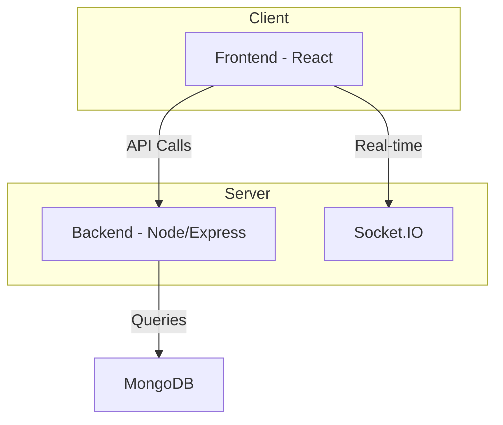
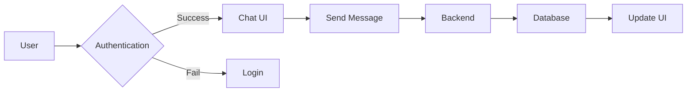

```mdx
---
title: "Project Structure"
description: "A detailed breakdown of the project's file and directory structure."
sidebar_position: 5
---

# Project Structure

<TOC />

## System Purpose

This project aims to build a real-time chat application using a MERN stack.  Core functionalities include:

* **User Registration and Authentication:** Users can create accounts, log in, and log out securely. [See Authentication logic](https://github.com/YOUR_GITHUB_REPO/blob/main/{path_to_auth_logic})
* **Real-time Messaging:** Users can send and receive messages instantly. [See Socket.IO implementation](https://github.com/YOUR_GITHUB_REPO/blob/main/{path_to_socket_io_implementation})
* **User Profiles:** Users can view and manage their profiles.  [See UserProfile component](https://github.com/YOUR_GITHUB_REPO/blob/main/{path_to_user_profile_component})


## System Architecture Overview

The application follows a three-tier architecture:

* **Presentation Tier (Frontend):**  Handles user interface and interaction using React.
* **Business Tier (Backend):**  Manages application logic, API routes, and data processing using Node.js and Express.js.
* **Data Tier (Database):** Stores user data and chat messages using MongoDB.





## Technology Stack

| Layer       | Technology         | Version     | Purpose                                      |
|-------------|----------------------|-------------|----------------------------------------------|
| Frontend    | React                | (Specify)   | User interface and interaction                 |
| Frontend    | Socket.IO            | (Specify)   | Real-time communication                      |
| Backend     | Node.js              | (Specify)   | Server-side JavaScript runtime                |
| Backend     | Express.js           | (Specify)   | Web application framework                     |
| Database    | MongoDB              | (Specify)   | NoSQL database for storing data               |


```javascript
// package.json (frontend) - Example
{
  "name": "chat-app-frontend",
  "version": "1.0.0",
  "dependencies": {
    "react": "^18.2.0",
    "socket.io-client": "^4.6.0"
  }
}
```

```javascript
// package.json (backend) - Example
{
  "name": "chat-app-backend",
  "version": "1.0.0",
  "dependencies": {
    "express": "^4.18.2",
    "mongoose": "^7.0.2",
    "socket.io": "^4.6.0"
  }
}
```


## Core Application Features

* **Authentication:**  Secure user login and registration using JWT (JSON Web Tokens). [See Auth Routes](https://github.com/YOUR_GITHUB_REPO/blob/main/{path_to_auth_routes})
* **Real-time Chat:**  Instant message delivery and updates using Socket.IO.  [See Socket.IO Event Handlers](https://github.com/YOUR_GITHUB_REPO/blob/main/{path_to_socket_io_handlers})
* **Message Persistence:** Messages are stored in MongoDB for later retrieval. [See MongoDB Schema](https://github.com/YOUR_GITHUB_REPO/blob/main/{path_to_mongo_schema})


```jsx
// Frontend - Message display (Example)
// ...from HomePage.jsx
const messages = useSelector(selectMessages);
return (
  <div>
    {messages.map(message => (
      <p key={message._id}>{message.text}</p>
    ))}
  </div>
);
// ...[HomePage.jsx#L123-L135](https://github.com/YOUR_GITHUB_REPO/blob/main/{path_to_homepage})
```


```javascript
// Backend - Message handling (Example)
// ...from messageRoutes.js
io.on('connection', socket => {
  socket.on('new message', message => {
    // Save message to database...
    io.emit('new message', message);
  });
});
// ...[messageRoutes.js#L30-L40](https://github.com/YOUR_GITHUB_REPO/blob/main/{path_to_messageroutes})
```





## Project Structure

```
.
├── backend/
│   ├── ...
├── frontend/
│   ├── ...
└── ...
```

* **backend/:** Contains the server-side code (Node.js, Express.js, MongoDB).
* **frontend/:** Contains the client-side code (React, Socket.IO).


## Key Integration Points

* **State Management:**  The frontend uses (specify state management library, e.g., Redux or Zustand) to manage application state efficiently.
* **API Flows:**  The frontend communicates with the backend through RESTful APIs using `fetch` or `axios`.  Error handling and loading states are implemented to provide a robust user experience.
* **Authentication:** JWTs are used for secure authentication and authorization.  Protected routes are implemented on the backend to restrict access to sensitive resources.
* **Database Interactions:**  The backend interacts with MongoDB using Mongoose to manage database operations.  Data validation and error handling are implemented to ensure data integrity.

Next: [Backend API](./6_backend-api.mdx)
```