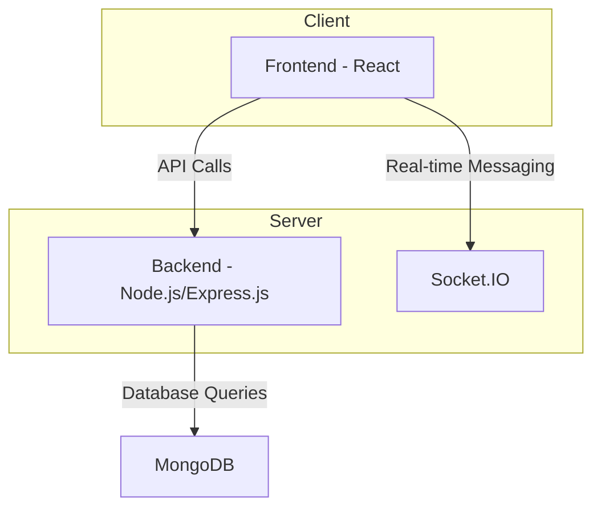
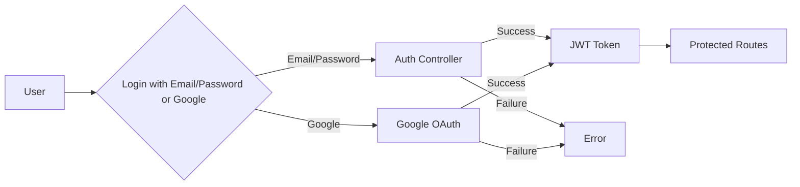

# Backend API

<TOC />

## System Purpose

This backend API provides the core functionality for a chat application, handling user authentication, friend management, and real-time messaging.  Key functionalities include:

* **User Authentication:** Secure user registration, login, and logout using email and password, as well as Google OAuth 2.0.  [View on GitHub](https://github.com/your-repo/backend/blob/main/src/controllers/auth.controller.js)
* **Friend Management:** Sending, accepting, rejecting, and removing friend requests. [View on GitHub](https://github.com/your-repo/backend/blob/main/src/routes/friend.route.js)
* **Real-time Messaging:** Sending and receiving messages between users in real-time. [View on GitHub](https://github.com/your-repo/backend/blob/main/src/routes/message.route.js)
* **Profile Management:** Updating user profiles including username and profile picture. [View on GitHub](https://github.com/your-repo/backend/blob/main/src/controllers/auth.controller.js)
* **Username Availability Check:** Verifying if a username is already taken before registration or update. [View on GitHub](https://github.com/your-repo/backend/blob/main/src/controllers/auth.controller.js)


## System Architecture Overview

The application follows a three-tier architecture:

* **Presentation Tier:** The frontend (not covered in this document) handles user interaction and displays information.
* **Business Tier:** The backend API (Node.js with Express.js) handles business logic, API requests, and data validation.
* **Data Tier:** MongoDB stores user data, friend relationships, and messages.





## Technology Stack

| Layer       | Technology          | Version (Example) | Purpose                                      |
|-------------|----------------------|--------------------|-------------------------------------------------|
| Frontend    | React                | 18.2.0             | User interface                                  |
| Backend     | Node.js              | 16.17.0            | Server-side logic and API                      |
| Framework   | Express.js           | 4.18.2             | Web application framework                      |
| Database    | MongoDB              | 6.0.2              | Data persistence                               |
| Authentication | Passport.js         | 0.6.0              | Authentication middleware                     |
| Cloudinary  | Cloudinary           | (latest)            | Image and video hosting                         |
| Bcrypt      | bcryptjs             | 5.1.0              | Password hashing                               |


```json
{
  "dependencies": {
    "bcryptjs": "^2.4.3",
    "cloudinary": "^1.36.0",
    "cookie-parser": "^1.4.6",
    "cors": "^2.8.5",
    "dotenv": "^16.3.1",
    "express": "^4.18.2",
    "jsonwebtoken": "^9.0.1",
    "mongoose": "^7.3.1",
    "passport": "^0.6.0",
    "passport-google-oauth20": "^2.0.1",
    "socket.io": "^4.7.2"
  }
}
```

## Core Application Features

* **User Authentication:**  The `auth.controller.js` handles user signup and login, validating input data and hashing passwords using bcrypt. A JWT (JSON Web Token) is generated upon successful login for authentication on subsequent requests.

```javascript
// backend/src/controllers/auth.controller.js - signup function excerpt
export const signup = async (req, res) => {
    const {username, email, password} = req.body;
    try {
        // ... validation ...
        const salt = await bcrypt.genSalt(10);
        const hashedPassword = await bcrypt.hash(password, salt);
        // ... create user ...
    } catch (error) {
        // ... error handling ...
    }
};
[View on GitHub](https://github.com/your-repo/backend/blob/main/src/controllers/auth.controller.js#L1-L80)
```

* **Profile Update:** Users can update their profile picture and username.  Cloudinary is used for image uploading and storage.  Username updates include validation and checks for uniqueness.

```javascript
// backend/src/controllers/auth.controller.js - updateProfile function excerpt
export const updateProfile = async (req, res) => {
    try {
        const { profilePic, username } = req.body;
        // ... validation and uniqueness checks ...
        if (profilePic) {
            const uploadResponse = await cloudinary.uploader.upload(profilePic);
            fieldsToUpdate.profilePic = uploadResponse.secure_url;
        }
        // ... update user ...
    } catch (error) {
       // ... error handling ...
    }
};
[View on GitHub](https://github.com/your-repo/backend/blob/main/src/controllers/auth.controller.js#L155-L230)
```


* **Google OAuth 2.0:**  Passport.js is used to handle Google authentication, allowing users to log in with their Google accounts.

```javascript
// backend/src/routes/auth.route.js - Google OAuth routes
router.get(
    '/google',
    passport.authenticate('google', { scope: ['profile', 'email'] })
);
router.get(
    '/google/callback',
    passport.authenticate('google', {
        failureRedirect: 'http://localhost:5173/login',
        failureMessage: true
    }),
    googleAuthCallback
);
[View on GitHub](https://github.com/your-repo/backend/blob/main/src/routes/auth.route.js#L26-L40)
```





## Project Structure

```
backend/
├── src/
│   ├── controllers/
│   │   └── auth.controller.js
│   │   └── friend.controller.js
│   │   └── message.controller.js
│   ├── lib/
│   │   └── cloudinary.js
│   │   └── utils.js
│   ├── middleware/
│   │   └── auth.middleware.js
│   ├── models/
│   │   └── user.model.js
│   ├── routes/
│   │   └── auth.route.js
│   │   └── friend.route.js
│   │   └── message.route.js
│   └── ...
└── ...
```


## Key Integration Points

* **State Management:**  The backend uses Express.js for routing and handling requests.  Mongoose provides an Object Data Modeling (ODM) layer for interacting with MongoDB.
* **API Flows:**  API requests are routed through Express.js routes, handled by controllers, and data is fetched/updated using Mongoose models.
* **Authentication:** JWTs are used for session management and authorization.  The `protectRoute` middleware verifies JWTs for protected routes.  [View on GitHub](https://github.com/your-repo/backend/blob/main/src/middleware/auth.middleware.js)
* **Database:** MongoDB is used to store user data, friend relationships, and messages.  Data validation occurs at both the controller and model levels to maintain data integrity.

Best Practices:

* **Separation of Concerns:** The code is well-structured with separate controllers, models, and middleware, promoting modularity and maintainability.
* **Error Handling:** Comprehensive error handling is implemented throughout the codebase.
* **Security:** Password hashing (bcrypt), input validation, and secure authentication practices are employed to protect user data.

Next: [Frontend User Interface](./7_frontend-user-interface.mdx)