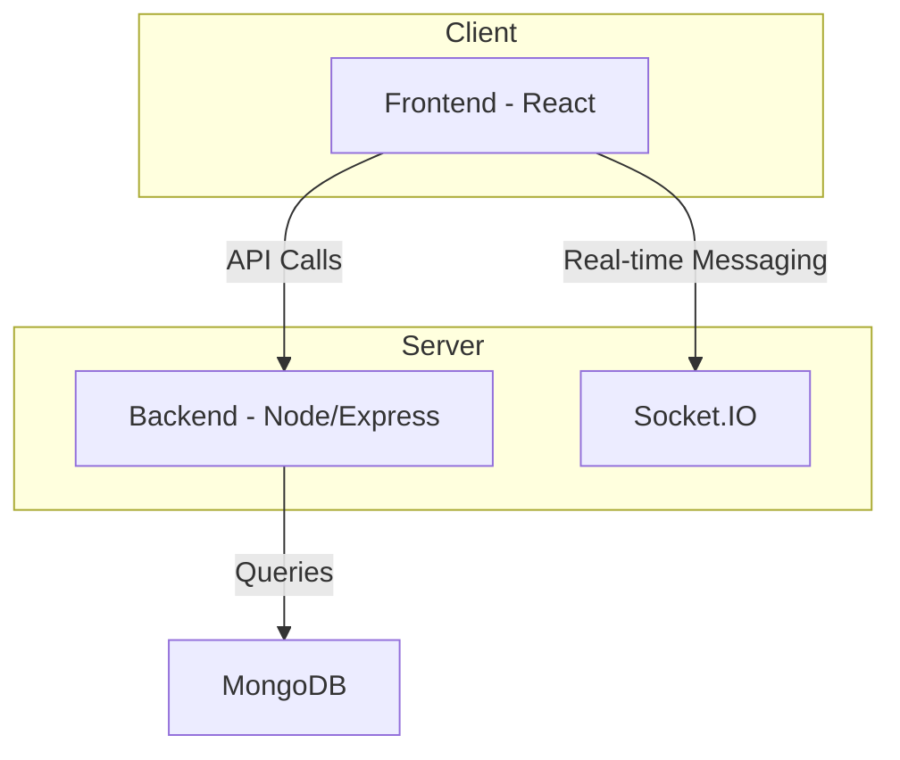
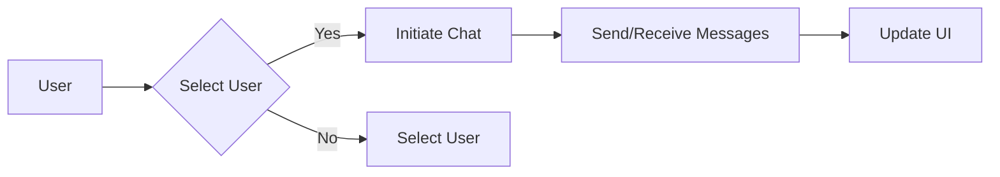

# Frontend User Interface

<TOC />

## System Purpose

The frontend user interface (UI) provides a real-time chat application experience.  Core functionalities include:

*   **User Authentication:**  Users can log in to access the chat application. [View on GitHub](https://github.com/shinymack/Chat-App-MERN/blob/main/frontend/src/pages/HomePage.jsx)
*   **User Selection:** Users can select a friend from their friend list to initiate a chat. [View on GitHub](https://github.com/shinymack/Chat-App-MERN/blob/main/frontend/src/components/Sidebar.jsx)
*   **Real-time Messaging:**  Messages are sent and received in real-time between users. [View on GitHub](https://github.com/shinymack/Chat-App-MERN/blob/main/frontend/src/components/ChatContainer.jsx)
*   **Message Display:** The UI displays messages chronologically, indicating the sender and timestamp. [View on GitHub](https://github.com/shinymack/Chat-App-MERN/blob/main/frontend/src/components/ChatContainer.jsx)
*   **Friend List Management:**  Displays a list of online and offline friends.  [View on GitHub](https://github.com/shinymack/Chat-App-MERN/blob/main/frontend/src/components/Sidebar.jsx)
*   **Media Sharing (Implied):** The UI supports sending images. [View on GitHub](https://github.com/shinymack/Chat-App-MERN/blob/main/frontend/src/components/ChatContainer.jsx)

## System Architecture Overview

The frontend follows a client-server architecture, where the UI interacts with a backend API to handle user authentication, data retrieval and persistence.  Real-time communication is facilitated using Socket.IO.





The frontend utilizes React components for modularity and maintainability.  The `HomePage` component acts as the main container, rendering the `Sidebar`, `ChatContainer`, and optionally a `FriendsBox`. The `ChatContainer` manages the display and handling of messages, while the `Sidebar` handles user selection.

## Technology Stack

| Layer       | Technology           | Version (Example) | Purpose                                      |
| :---------- | :-------------------- | :--------------- | :------------------------------------------- |
| Frontend    | React                 | 18.2.0           | UI rendering and state management              |
| Frontend    | Tailwind CSS          | 3.3.3            | Styling                                       |
| Frontend    | Lucide-React          |                  | Icons                                          |
| Backend     | Node.js              | 16+              | Server-side logic                              |
| Database    | MongoDB              |                  | Data persistence                               |
| Real-time   | Socket.IO             |                  | Real-time communication                       |
| State Mgmt | Zustand               |                  | Local state management                          |


```jsx
// package.json (excerpt)
{
  "dependencies": {
    "react": "^18.2.0",
    "tailwindcss": "^3.3.3",
    "lucide-react": "^0.250.0",
    "zustand": "^4.3.8"
  }
}
```

## Core Application Features

*   **Real-time Chat:** The application leverages Socket.IO for real-time updates, enabling immediate message delivery and display.  [View on GitHub](https://github.com/shinymack/Chat-App-MERN/blob/main/frontend/src/components/ChatContainer.jsx)
*   **User Authentication:**  Secure authentication is handled by the backend, with the frontend displaying login/logout status and handling tokens.
*   **Media Sharing:** Users can share images through the chat interface.

```jsx
// ChatContainer.jsx (Message display excerpt)
{messages.map((message) => (
    <div key={message._id} className={`chat ${message.senderId == authUser._id ? "chat-end": "chat-start"} `}>
        {/* ... */}
        {message.image && (
            
        )}
        {message.text && <p>{message.text}</p>}
    </div>
))}
```





## Project Structure

```
frontend/
├── src/
│   ├── components/
│   │   ├── ChatContainer.jsx
│   │   ├── ChatHeader.jsx
│   │   ├── MessageInput.jsx
│   │   ├── MessageSkeleton.jsx
│   │   ├── Sidebar.jsx
│   │   └── ...
│   ├── pages/
│   │   └── HomePage.jsx
│   ├── store/
│   │   ├── useAuthStore.jsx
│   │   └── useChatStore.jsx
│   ├── lib/
│   │   └── utils.js
│   └── index.css
└── ...
```


## Key Integration Points

*   **State Management:** Zustand is used for efficient local state management within the React components, keeping track of selected users, messages, and loading states. [View on GitHub](https://github.com/shinymack/Chat-App-MERN/blob/main/frontend/src/store/useChatStore.jsx)

```jsx
// useChatStore.jsx (excerpt)
const useChatStore = create<ChatStore>((...a) => ({
    messages: [],
    selectedUser: null,
    isMessagesLoading: false,
    ...
}))
```

*   **API Flows:** The frontend communicates with the backend via API calls to fetch user data, messages, and to send new messages.  Error handling and loading states are integrated into the UI.

*   **Authentication:**  Authentication is handled implicitly, likely through JWT tokens passed in HTTP headers, which are managed by the `useAuthStore`.  The UI reflects the authentication state.

*   **Database Interaction (Indirect):** The frontend does not directly interact with the database; all data interactions are mediated through the backend API. This ensures separation of concerns and simplifies frontend development.  The real-time aspect uses Socket.IO for direct communication between client and server, bypassing traditional API calls for updates.

*   **Best Practices:** The application follows separation of concerns, using components for specific tasks, improving maintainability and code reusability.  Error handling is integrated to gracefully manage issues during API calls and real-time messaging.  The use of skeletons during loading states improves the user experience.