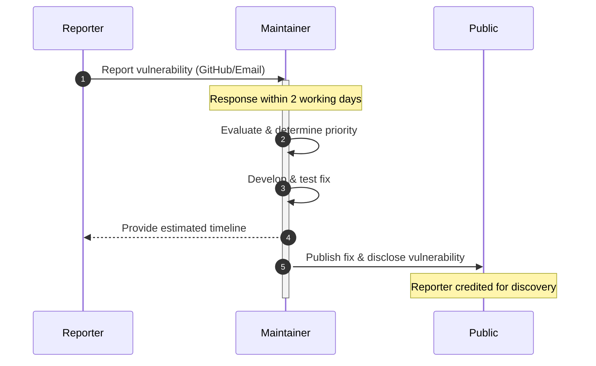
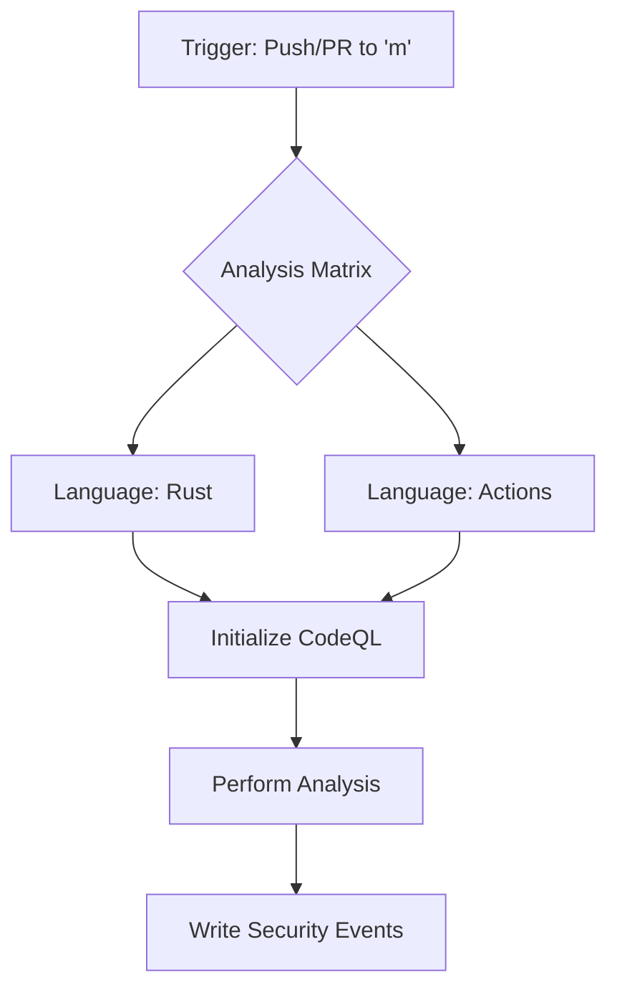

# Maintenance and Security

This section provides the operational guidelines for the maintenance of the `generic-ec` project, the protocol for reporting security vulnerabilities, and a detailed breakdown of the automated CI/CD pipelines.

## Maintenance

The project is maintained by a dedicated team responsible for code review, architectural decisions, and release management.

### Maintainers

| Name | GitHub Handle |
| :--- | :--- |
| Denis Varlakov | [@survived](https://github.com/survived) |
| Nikita Sorokovikov | [@maurges](https://github.com/maurges) |

## Security Policy

The project adheres to a strict security policy to ensure the integrity of the cryptographic primitives.

### Supported Versions
Only the **latest version** of the library is officially supported.

### Reporting a Vulnerability
If you discover a security flaw or vulnerability, please report it through one of the following channels:
1. **GitHub**: Use the "Report a vulnerability" button located in the "Security" tab of the repository.
2. **Email**: Send a detailed report to `security@dfns.co`.

### Vulnerability Handling Process
The maintainers follow a structured lifecycle for addressing reported issues to ensure a coordinated and safe disclosure.



## CI/CD Pipeline

The project utilizes GitHub Actions to enforce code quality, stability, and compatibility across different targets.

### Rust Workflow (`rust.yml`)
The primary Rust pipeline is triggered on all pull requests. It enforces a strict "warnings as errors" policy (`-D warnings`) and utilizes `Swatinem/rust-cache` for optimized build times.

#### Verification Matrix
The pipeline executes several specialized check jobs to ensure the library remains compatible with various environments:

| Job | Target/Feature | Command | Purpose |
| :--- | :--- | :--- | :--- |
| `check-nostd` | `no-default-features` | `cargo check -p generic-ec` | Validates `no-std` compatibility. |
| `check-alloc` | `no-default-features` + `alloc` | `cargo check -p generic-ec` | Validates `alloc`-only environments. |
| `check` | `all-features` | `cargo check -p generic-ec` | Full feature set validation. |
| `test` | Workspace-wide | `cargo test --all-features` | Executes all integration and unit tests. |
| `test-nostd` | `no-default-features` | `cargo test --workspace` | Executes tests in `no-std` mode. |
| `build-wasm` | `wasm32-unknown-unknown` | `wasm-pack build` | Validates WebAssembly compilation. |

#### Code Quality & Static Analysis
To maintain high cryptographic standards, the project employs strict linting:

*   **Clippy**: The pipeline runs `cargo clippy` with forbidden patterns to prevent runtime panics.
    ```bash
    # Example strict Clippy flags used in CI
    -D clippy::all -D clippy::unwrap_used -D clippy::expect_used
    ```
*   **Formatting**: `cargo fmt --all -- --check` ensures consistent style.
*   **Documentation**: Nightly toolchains are used to check documentation warnings (`-D warnings`).
*   **SemVer**: The `cargo-semver-checks-action` validates that changes to `generic-ec`, `generic-ec-core`, `generic-ec-curves`, and `generic-ec-zkp` do not introduce breaking changes.

### Automated Security Scanning (`codeql.yml`)
GitHub CodeQL is integrated to perform static analysis of the codebase on every push or pull request to the `m` branch.



### Pipeline Summary Flow

```mermaid
graph LR
    PR["Pull Request"] --> Check["Cargo Check"]
    PR --> Lint["Clippy/Fmt"]
    PR --> Test["Cargo Test"]
    PR --> WASM["WASM Build"]
    Check --> SemVer["SemVer Check"]
    Lint --> SemVer
    Test --> SemVer
    WASM --> SemVer
    SemVer --> Merge["Ready to Merge"]