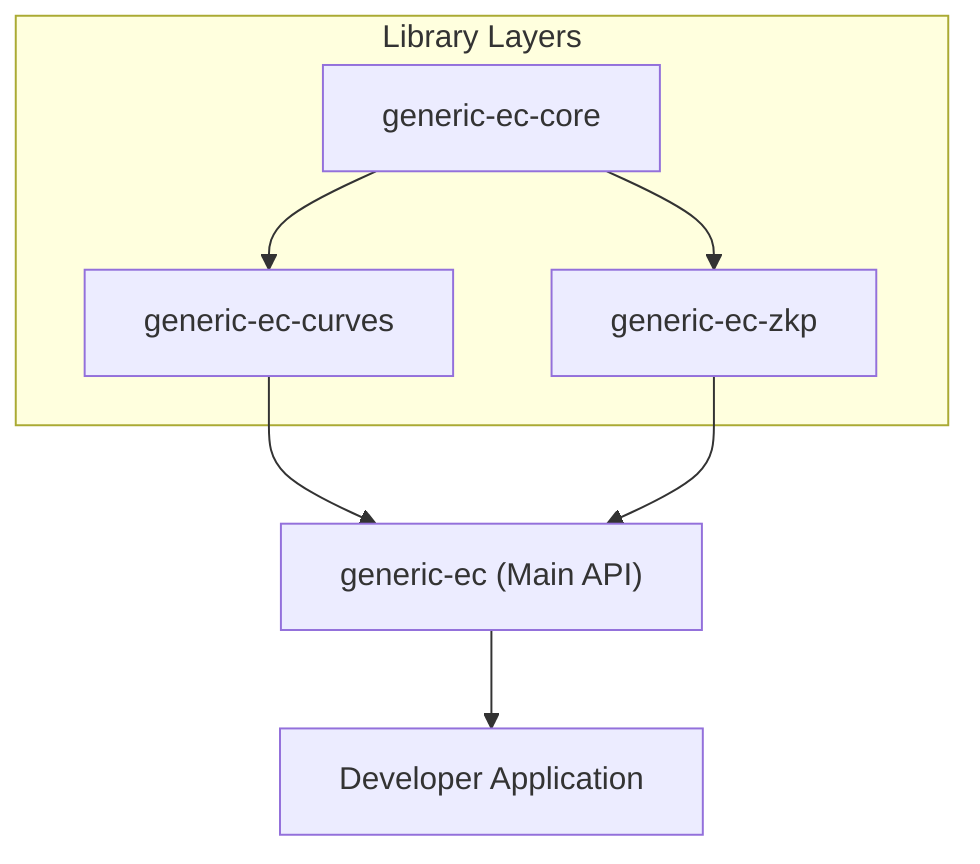
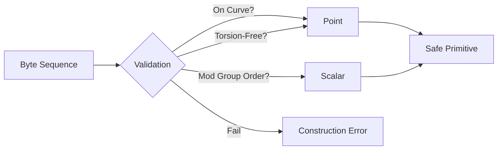

# Introduction

`generic-ec` is a specialized Rust library designed to provide simple, generic, and secure abstractions for elliptic curve arithmetic. The library is engineered to streamline the development of complex cryptographic protocols, such as Multi-Party Computation (MPC) and Zero-Knowledge Proofs (ZKP), by abstracting the underlying curve mathematics into a consistent API.

To ensure maximum portability and versatility, `generic-ec` is `no_std` compatible and WebAssembly (WASM) friendly.

## Goals and Design Philosophy

The primary objective of the library is to balance ease of use with rigorous security guarantees. The design focuses on three core pillars:

*   **Simplicity**: Providing a limited, intuitive API for point and scalar arithmetic.
*   **Genericity**: Allowing developers to write code that is agnostic of the specific elliptic curve being used.
*   **Security**: Mitigating common cryptographic attacks (such as small-group attacks) by enforcing strict invariants at the type level.

## Primary Use Cases

`generic-ec` is specifically tailored for developers building:
*   **Zero-Knowledge Protocols**: Utilizing the `generic-ec-zkp` crate for primitives like discrete logarithm equality proofs.
*   **MPC (Multi-Party Computation)**: Leveraging generic point and scalar arithmetic across different curve backends.
*   **Custom EC Algorithms**: Implementing specialized cryptographic schemes that require a standardized interface for various elliptic curves.

## Core Architecture

The project is structured as a monorepo to separate trait definitions, specific curve implementations, and high-level cryptographic primitives.



### Component Breakdown
| Component | Purpose | Target User |
| :--- | :--- | :--- |
| `generic-ec-core` | Contains core traits (e.g., the `Curve` trait). | Developers implementing new curves. |
| `generic-ec-curves` | Provides out-of-the-box implementations of supported curves. | General users of the library. |
| `generic-ec-zkp` | High-level ZK-proofs and primitives built atop `generic-ec`. | ZKP protocol implementers. |

## Fundamental Primitives

The library revolves around three primary types, parameterized by a curve `E`:

1.  **`Point<E>`**: Represents a point on the elliptic curve. This includes the point at infinity (identity point), accessible via `Point::<E>::zero()`.
2.  **`Scalar<E>`**: Represents an integer modulus the curve's prime group order.
3.  **`SecretScalar<E>` / `SecretPoint<E>`**: Specialized versions of scalars and points used for sensitive values (e.g., secret keys). These are stored on the heap and erased from memory upon being dropped to prevent leakage in memory dumps.

### Security Invariants

`generic-ec` enforces critical security checks in safe Rust to prevent common vulnerabilities. Any point or scalar that fails these checks cannot be constructed:



*   **Curve Equation**: Every `Point<E>` is guaranteed to satisfy the equation of curve `E`.
*   **Group Order**: Every `Scalar<E>` must be an integer modulo the curve's prime order.
*   **Torsion-Free**: Every `Point<E>` must be free of small-group components to eliminate small-group attacks.

## Supported Curves

The library provides integrated support for several widely used curves via feature flags.

| Curve | Feature Flag | Backend Implementation |
| :--- | :--- | :--- |
| secp256k1 | `curve-secp256k1` | RustCrypto/k256 |
| secp256r1 | `curve-secp256r1` | RustCrypto/p256 |
| secp384r1 | `curve-secp384r1` | RustCrypto/p384 |
| stark-curve | `curve-stark` | Dfns/stark |
| Ed25519 | `curve-ed25519` | curve25519-dalek |

## Quick Start Example

To use a supported curve, enable the corresponding feature in your `Cargo.toml`:

```toml
[dependencies]
generic-ec = { version = "...", features = ["curve-secp256k1"] }
```

Basic usage for generating a point:

```rust
use generic_ec::{Point, Scalar, curves::Secp256k1};

// Generate a point by multiplying the generator by a random scalar
let random_point: Point<Secp256k1> = Point::generator() * Scalar::random(&mut rng);