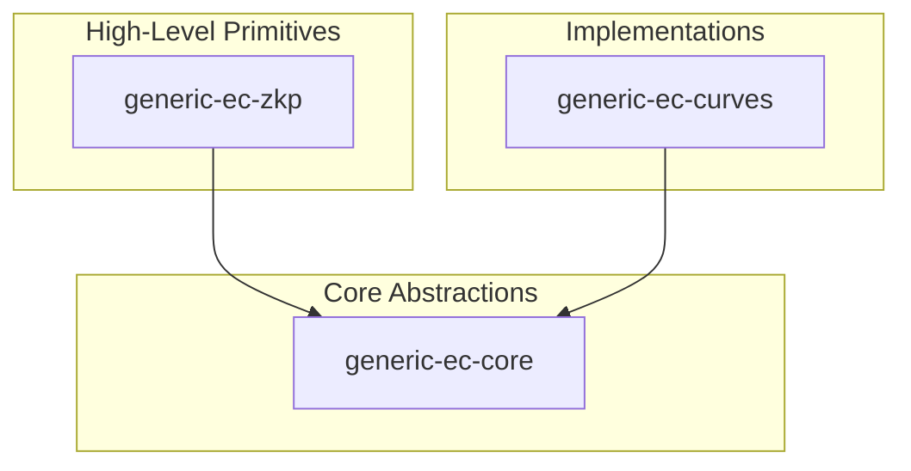

# System Architecture

The `generic-ec` project is organized as a monorepo designed to decouple elliptic curve mathematical abstractions from specific curve implementations and high-level cryptographic protocols. This architecture ensures that Zero-Knowledge Proof (ZKP) primitives can be implemented once and used across any curve that satisfies the core trait requirements.

## Component Relationship Map

The project is divided into three primary crates: `generic-ec-core`, `generic-ec-curves`, and `generic-ec-zkp`. The relationship is hierarchical, with the core crate serving as the foundational layer of abstractions.



## Crate Responsibilities

| Crate | Role | Key Responsibilities |
| :--- | :--- | :--- |
| `generic-ec-core` | Foundation | Defines traits for curve arithmetic, encoding, and point properties. |
| `generic-ec-curves` | Implementation | Provides concrete elliptic curve implementations and performance benchmarks. |
| `generic-ec-zkp` | Protocol | Implements ZKP schemes like Schnorr PoK and Discrete Log Equality. |

## Detailed Component Analysis

### 1. Generic EC Core (`generic-ec-core`)
The core crate defines the "contract" that any elliptic curve implementation must follow. It uses a trait-based architecture to enable generic programming across different fields and curves.

#### Arithmetic Traits
The foundation of the library consists of algebraic traits that define how elements behave:
- `Additive`, `Multiplicative<Rhs>`, `Invertible`, `Zero`, and `One`: These provide the basic field and group operations.
- `Curve`: The central trait that aggregates curve properties, including the `CURVE_NAME`.

#### Point and Group Management
To handle points on the curve and their representations, the core defines:
- `OnCurve`: Validates and manages points belonging to the curve.
- `coords`: A module dedicated to coordinate system implementations.
- `CurveGenerator`: Handles the base point generation.

#### Encoding and Data Handling
The crate provides a robust system for converting between mathematical points and byte arrays:
- `CompressedEncoding` and `UncompressedEncoding`: Standardize how points are serialized.
- `IntegerEncoding` and `Decode`: General traits for data transformation.
- `ByteArray`: A wrapper for byte slices (`[u8; N]` or `GenericArray`) to ensure consistent memory handling.

```rust
pub trait Curve: Debug + Copy + Eq + Ord + Hash + Default + Sync + Send + 'static {
    const CURVE_NAME: &'static str;
}
```

### 2. Generic EC Curves (`generic-ec-curves`)
This crate implements the traits defined in `generic-ec-core` for specific cryptographic curves. While the core defines *how* a curve should behave, this crate provides the actual mathematical constants and optimized logic for specific curves.

- **Performance Tracking**: The crate includes a `curves_perf` module and associated documentation (`table.md`) to track and compare the efficiency of different curve implementations.
- **Specialization**: By implementing traits like `Reduce<const N: usize>`, the curves crate handles the conversion of raw bytes into field elements modulo the curve order.

### 3. Generic EC ZKP (`generic-ec-zkp`)
The ZKP crate implements high-level cryptographic protocols. Because it depends on `generic-ec-core` rather than specific curves, the proofs are curve-agnostic.

The following modules provide the primary ZKP functionality:
- `schnorr_pok`: Implements Schnorr Proofs of Knowledge.
- `dlog_eq`: Implements Discrete Logarithm Equality proofs.
- `polynomial`: Provides the polynomial math required for complex ZKP constructions.

## Data Flow: Proof Generation

The following sequence illustrates how a ZKP operation interacts across the architecture layers.

```mermaid
sequenceDiagram
    autonumber
    participant User["Client/User"]
    participant ZKP["generic-ec-zkp"]
    participant CORE["generic-ec-core"]
    participant CURVES["generic-ec-curves"]

    User ->> ZKP: Request Proof (e.g., Schnorr)
    ZKP ->> CORE: Call trait methods (Additive/Multiplicative)
    CORE ->> CURVES: Execute concrete curve arithmetic
    CURVES -->> CORE: Return result
    CORE -->> ZKP: Return field element/point
    ZKP -->> User: Return finalized Proof